# Lesson 1: Introduction to Distributed Systems

Source: [Lesson 1 — Video](https://www.youtube.com/watch?v=SuZQNazU48w)

## 1. Introduction

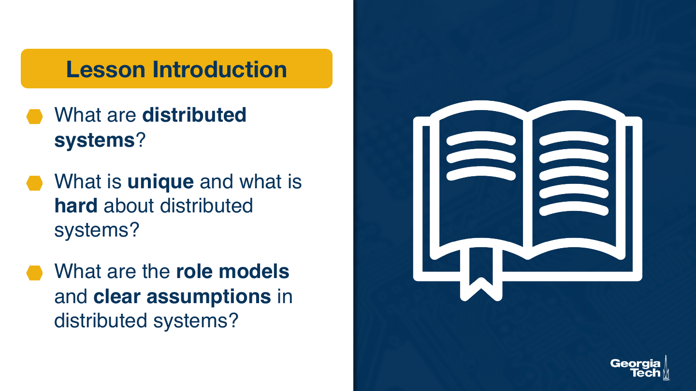

Welcome to the first lesson of the distributed computing class: introduction to distributed systems. In this introductory lesson, we will learn what is a distributed system. We will learn what are some of the unique properties of distributed systems that make distributed computing hard and how, as a community, we have made tremendous progress with the development of fundamental concepts and practical implementations of distributed systems by relying on good models and clear assumptions.

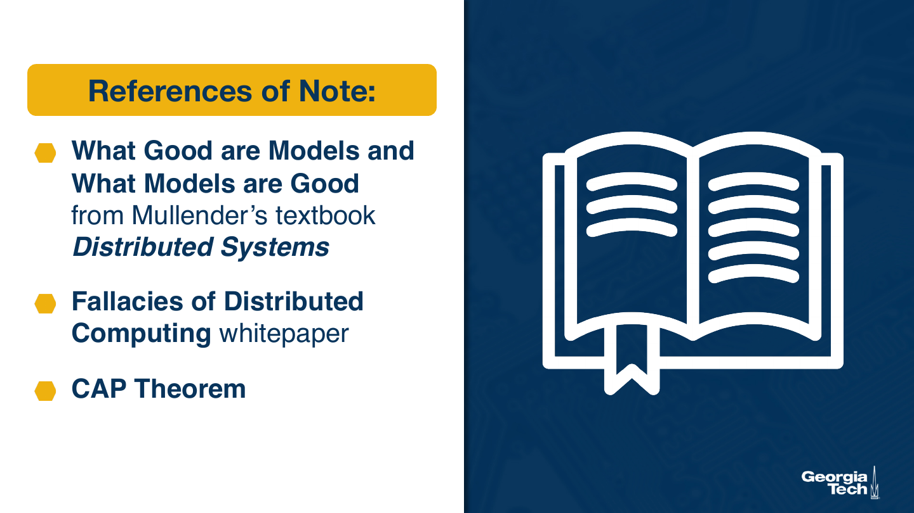

There are several papers that provide good source of reference for this lesson. Most of what we will discuss is summarized in the book chapter “What Good Are Models and What Models Are Good” from Mullender's textbook distributed systems. Also, there is the white paper describing the fallacies of distributed computing, and finally, we will also make our first reference to the famous so-called CAP theorem. We will go back to the CAP theorem in later lessons again.

## 2. Examples of Distributed Systems

### 2.1. Everyday Applications

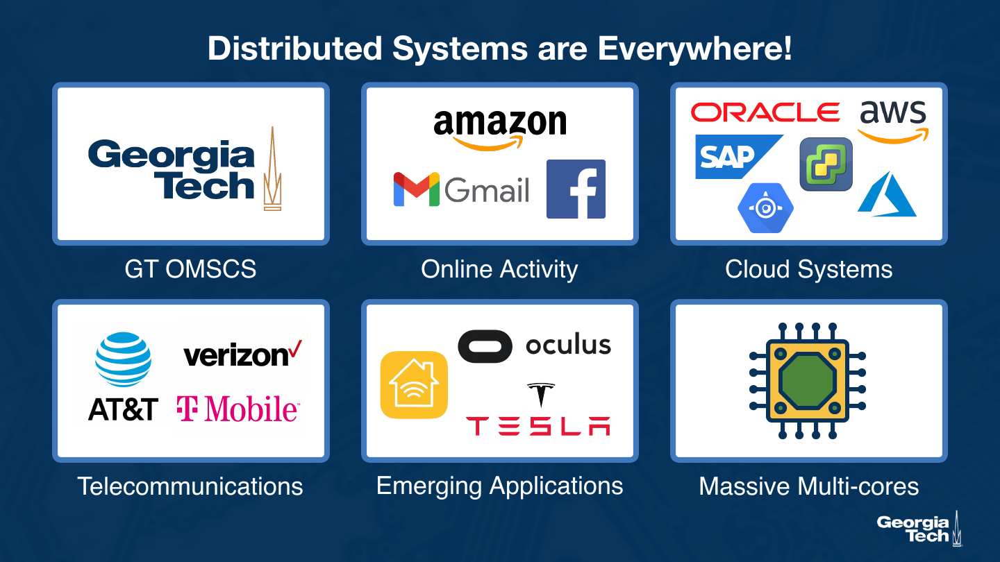

So let us see why is it important to study distributed systems? Well, distributed systems are everywhere. Our online MS program would not have been possible without distributed systems. Shopping on Amazon, checking your Gmail, interacting with friends on Facebook and Instagram, all of these are distributed systems.

But more than just the different types of internet services, we rely on distributed systems. They form the backbone of the enterprise systems that we also rely on. They're distributed across many servers and racks in data centers and in big server machines in private, in public, in hybrid clouds.

The telecommunication industry, all of that also is a distributed system and relies heavily on distributed system principles.

### 2.2. Emerging Applications and Individual Servers

Emerging application domains such as AR and VR, connected an autonomous vehicle and driving, the internet of things, these are also distributed systems.

And also if we take a look at individual server platforms, with the many number of cores interconnected with multiple memory components, these also form a form of distributed system. And many of the distributed systems principles that we will talk about in this class will be relevant in the context of single server systems.

## 3. What is a Distributed System?

### 3.1. Leslie Lamport and His Work

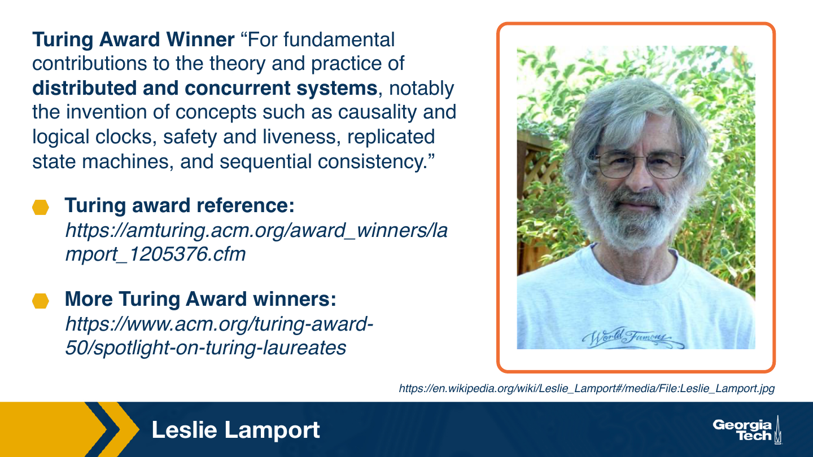

Now let's more formally define: what is a distributed system? We will start with a quote by Les Little Import. We will mention Leslie Lamport quite a bit in this class, so before getting to the quote, let me tell you a little bit about him.

Leslie Lamport is a world-renowned computer scientist with a decades-long career spanning some of the most influential organizations in the computing field, most recently at Microsoft Research. Among his many awards and distinctions is the 2013 Turing Award. This is also referred to as the Nobel Prize in computing. The citation used by the award committee credits Leslie Lamport with making fundamental contributions to the theory and practice of distributed and concurrent systems, notably the invention of concepts such as causality and logical clocks, safety and liveness, replicated state machines, and sequential consistency.

If you're interested in seeing the list of prior touring award winners, you can take a look at this link.

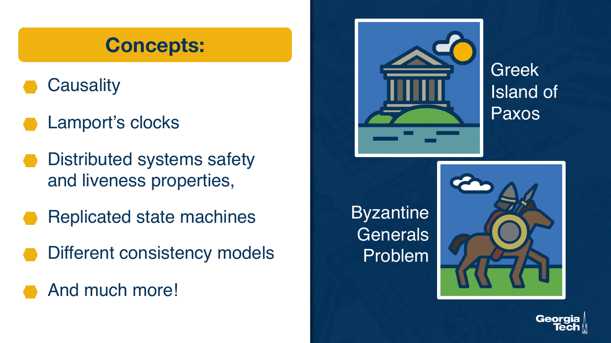

If you have scanned the course syllabus, then you already know that in this class we will talk about all of the concepts mentioned in lan parts during a word announcement: causality language clocks, distributed system safety and liveness properties, replicated state machines, different consistency models, and much more.

In many cases, we will explicitly use these papers, some of which teach distributed computing concepts in humorous and story-like manner. For instance, they talk about Byzantine generals, or about the votes of the ancient Greek parliament and the make-believe island of Paxos.

Leslie Lamport's most recent contributions include his work on TLA plus, a formal specification language and framework that can be used for modeling and formally verifying distributed systems.

### 3.2. Interpreting the Definition

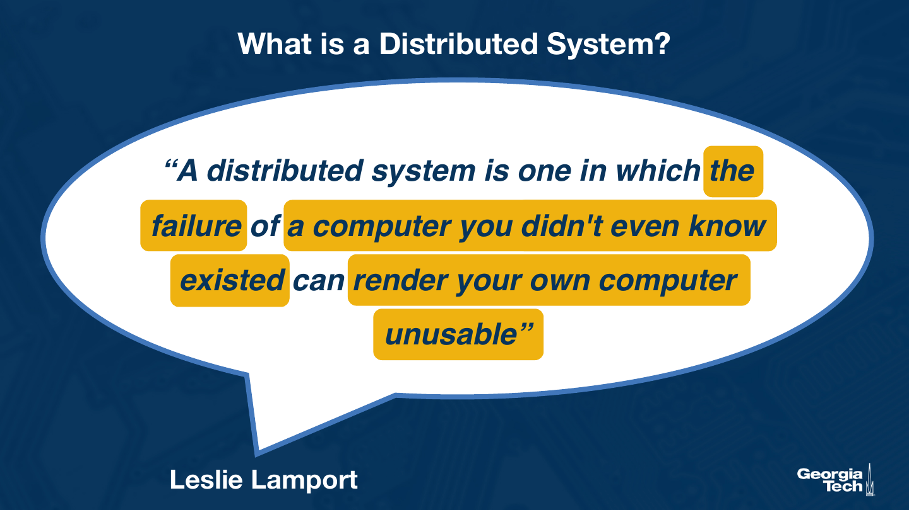

So let's finally look at Leslie Lamport's definition of distributed systems. His quote: “A distributed system is one in which the failure of a computer you didn't even know existed can render your own computer unusable.” What does this quote mean? A computer you didn't even know existed: that's telling us something, that there are multiple independent components in a distributed system.

The failure: that tells us that these components can fail in some way. Perhaps they crash and stop working, or fail transiently, temporarily only and then they get back up to speed. Or maybe they intentionally start misbehaving.

Render your own computer unusable: this means that despite the fact that these are independent components, they somehow must collaborate, interact, share some information about each other's actions so as to advance the distributed system toward completing some common task or goal.

They don't even know existed: this tells us that these independent components don't share all information about each other, but instead interact via some types of explicit messages. If the messages are delivered from one component, or one computer in this quote, to another, then the other component learns something, and as a result, perhaps takes an appropriate action. If such a message does not arrive because the other component failed before sending in, or maybe because the message was lost or delayed for a very long time, then the first component may decide to do something else, which in turn can make the whole system unstable.

### 3.3. A Formal Definition

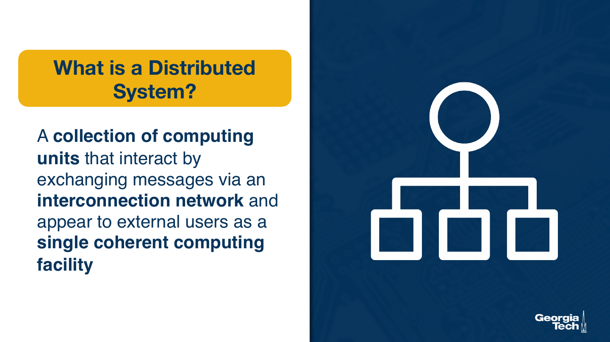

Stated then more formally, a distributed system is a collection of independent, autonomous computing units that interact by exchanging messages via a interconnection network and appear to external users as a single coherent computing facility. In this definition, by saying that the independent interacted components must behave as a single coherent computing facility, we highlight that there is a common goal that the system must accomplish, and all system components contribute to it. The definition does not explicitly mention the issue of failures, neither of nodes nor of the message exchanges among them. They may, and in fact they likely will exist, these failures, but nonetheless the system must ensure the correct behavior despite any potential such failure events.

## 4. A Simple Model of a Distributed System

### 4.1. Nodes and Communication Channels

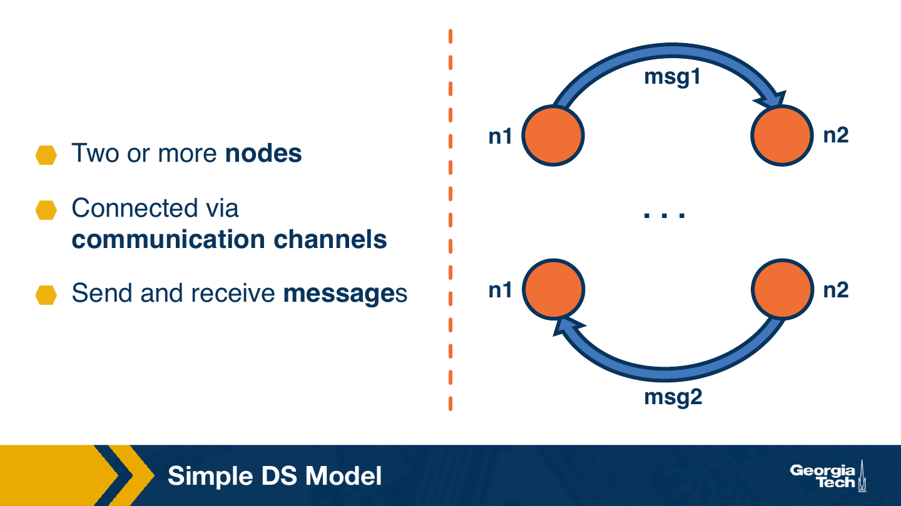

The easiest way to reason about a distributed system is to represent it via some model. The simplest way to represent a distributed system is via a model which illustrates the nodes in the system and the messages among them. So here we have a system. It has two nodes, and one and N2, and there is a message that's exchanged among them. Imagine that this is a time axis, and over some time this distributed system is in some different state when there is a message, another message, message to being sent from N2 to N1.

With this model, each node is characterized with the communication channels that it uses to send messages to other nodes, or to receive messages from other nodes. We do not care about the underlying network, whether these messages need to traverse one or many hops. At the level of this model, if there is a message sent from node N1 to node N2, then there is a channel from node N1 to N2. And for simplicity, in the simple model, the channels are unidirectional. So messages from N2 to N1, they may follow exactly the same communication lengths as the messages from N1 to N2, but in this simple model they're represented as two separate channels each pointing in a different direction.

### 4.2. Processing and Observable Messages

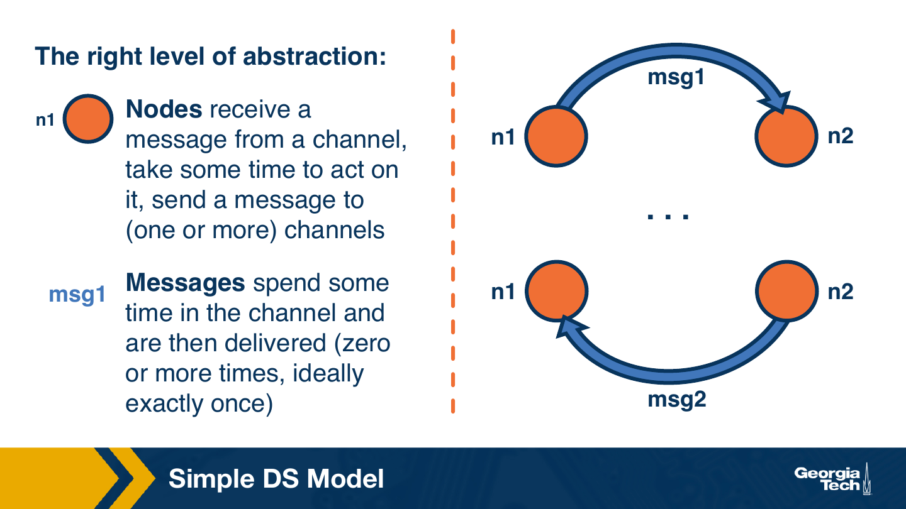

This representation is very powerful. We can use it to build a more detailed model in which we capture all nodes and the communication links among them, all messages exchanged among them, and we could also include the processing steps performed at each node. However, the actions performed at independent nodes are not really crucial to be represented in order to characterize them not. They manifest themselves in some form of a processing delay that's required to perform the action, and the action is, the visible action to the rest of the system is the message or the messages that are generated as a result of whatever processing was going on at the moment. So in this simple model, essentially the presence of a message, if a message was generated in a particular channel, that's an indication that some set of processing operations were completed by that node.

### 4.3. Failures and Communication Patterns

This model is also very general in terms of the types of system behaviors that it can represent. For instance, if you think about the statement take some time to act, well, we can just make that time infinite and then that would allow us to represent a node failure.

Or if we take a look at this statement that a message is being sent or delivered zero or more times, that can let us describe a system in which the communication is unreliable. Messages are getting close, so it's zero times. Or messages keep getting retransmitted and we have duplicates, so this would be more time.

The fact that a message can be sent to one or more channels, it lets us describe systems in which nodes interact in a point-to-point way, or when they use some sort of multicast mechanism so that one note sends the same message to multiple other nodes.

## 5. A Slightly More Complex Model of a Distributed System

### 5.1. Representing State

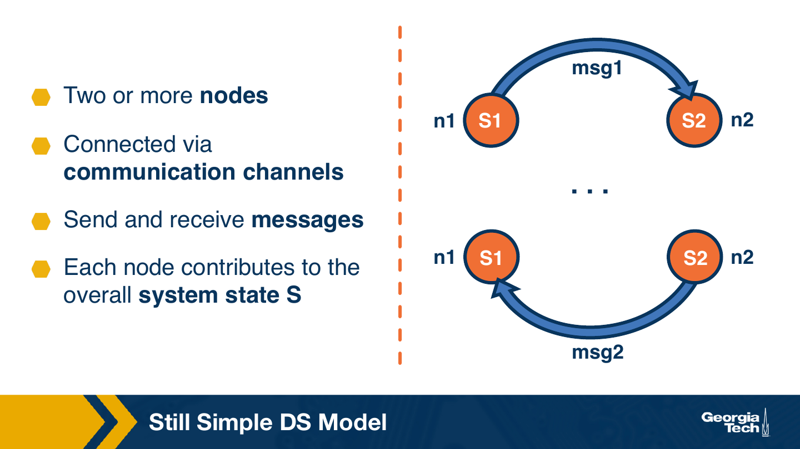

Now let's talk about a slightly more complex model of a distributed system. So when we think about distributed systems, we typically think about the actions, the processing operations performed at one or more nodes, and we think about also some states that may be changed as a result of those actions. Yes, the fact that a message may be sent, that's true, but there's also some other state. For instance, a new database entry is created, or a purchase transaction is executed and somehow the bank account is updated or debited or something like that. Some system configuration has been modified.

In order to capture this, we can extend the simple model for representing a distributed system by also recording some notion of state at each individual node in the system.

### 5.2. State Changes in Response to Messages

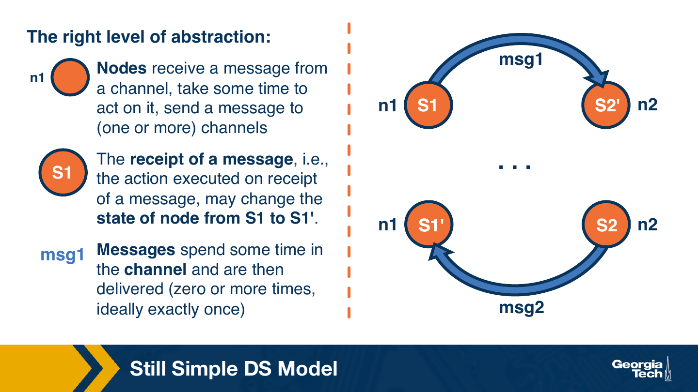

Even with this a little bit more complex model, we still don't need to represent anything more about the individual actions taking place at each of the nodes. The actions are triggered in response to messages. The outcome of the action is that the state at an individual node may change from state S1 to S1 prime in response to message 2, or at node 2 from state S2 to S2 prime in response to message 1. We will talk more about the state of distributed systems in another lesson.

## 6. Importance of a Model

### 6.1. Models and Experimental Evaluation

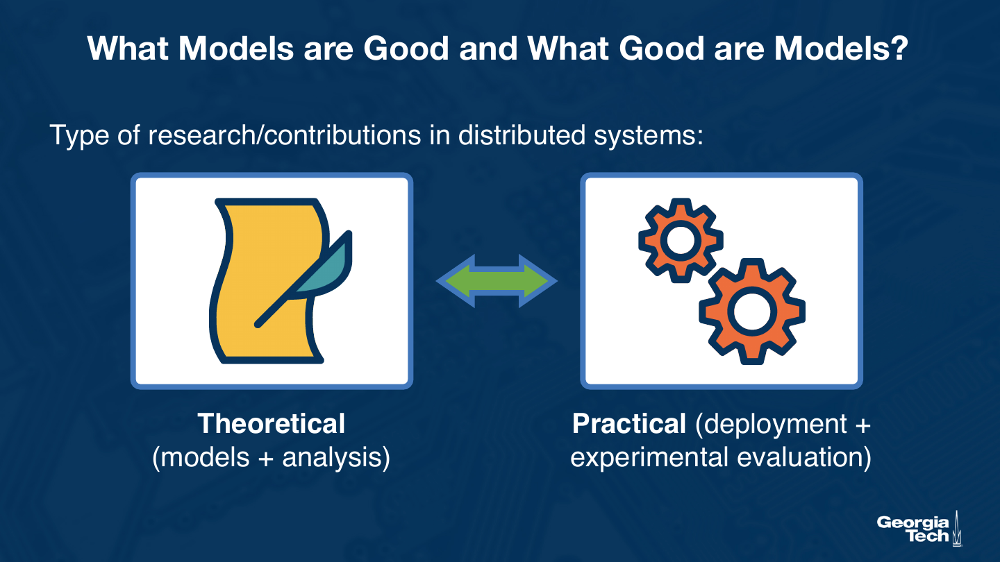

The reason we talk about models is because using system models and analyzing the system behavior using models is a very powerful method in general, but in particular with respect to distributed systems. The alternative would require actually building a prototype of the system and performing experimental evaluations under all possible scenarios. It probably doesn't take a lot to see that for distributed systems, it would be a challenge to provide access to the right number and the right distribution of nodes that one might want to put together in order to actually investigate what the system would really behave like. So that's why we need models. Without models, if we just only can rely on practical prototype evaluations, it would be really hard to make strong statements about how a system will behave, and it will make it hard to make advances in this field.

So for these reasons, we will see in this class that a lot of the work that has been done actually is a combination of both theoretical advances that really leverage both models and analysis of those models about what the behavior of the system could be like as well as practical implementations, experimental evaluations of real systems. Both of these are equally valuable.

### 6.2. Elements, Rules, and Assumptions

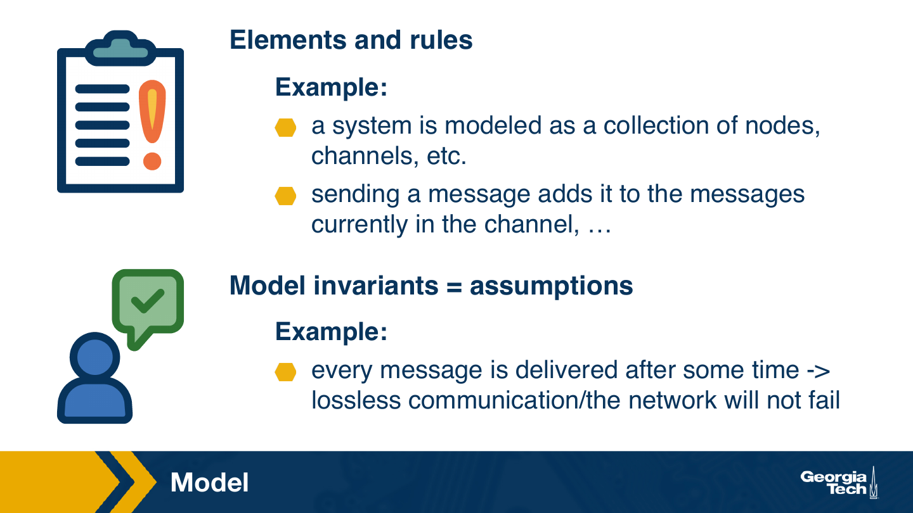

We've seen a couple of simple models so far. Both of these, and any model in general, will be characterized by several things. They'll include some system elements and some rules. For instance in the context of the models that we described, the elements are collection of notes, the collection of channels. The rules: that sending a message somehow means that a message is added to the channel. Receiving a message means that a message is consumed from the channel, removed from the channel, perhaps, unless we want to characterize some other properties of this channel.

A model can also be designed with some assumptions, and what these assumptions translate to is some invariants which are always supposed to be true for the model. For instance, a model which says that every message is delivered after some time implies that there is an assumption that messages will not be lost or infinitely delayed. Every message delivered after some time: such models make an assumption about lossless communication and that the network will not fail.

### 6.3. Accuracy and Tractability

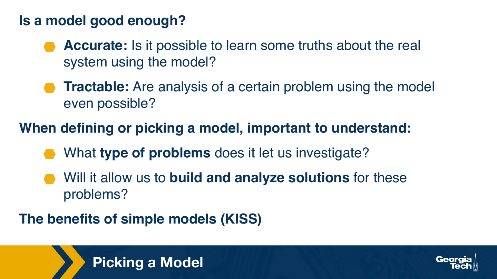

When picking a model, it's important to ensure a few things. The most important thing is to make sure that the model is accurate and that it's tractable. What does it mean? Well for accurate, that means that we want to make sure that the model can be used to accurately represent the problems that we want to analyze. If we can do that, then that will allow us to build and evaluate solutions for those problems. So in that sense, it is important when picking a model to determine that the model allows us to both demonstrate the problem, but also to be able to prototype and evaluate the solution in the context of that model.

### 6.4. Representing Different System Behaviors

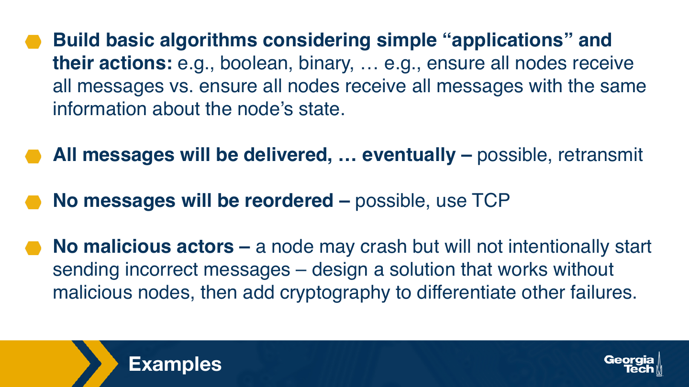

It turns out that the simple models we mentioned earlier, they're sufficiently powerful to allow for a number of investigations in distributed systems. For example, these models, they can let us represent systems in which we can evaluate some basic algorithms. We can consider some simple applications and directions. We can represent some simple scenarios where we want to say, well, all notes in the system have received all messages. Or we want to represent the system in which we want to ensure that all nodes receive all messages, but only provided they can be guaranteed that these messages have the same information about the note state.

Or maybe we want to describe a system in which the behavior is such that all messages will be delivered eventually. And it's possible to have such a system indeed in practice. You just keep re-transmitting messages.

Or we want to represent a system in which we also want to say that there is a guarantee that messages will not be reordered. And also it is possible to have such a system. You can just build it on top of something like TCP, where you have a reliable and ordered protocol that will guarantee you the ordered delivery of messages. So you do want to be able to have a model that lets you represent such a system.

Or they can let you represent a system that has no malicious actors. So a node may crash, but it will not intentionally start sending incorrect messages. If you can represent such a system using the model, and you can think about all of the transitions that may occur in the system, then this lets you design a solution that will work for that system. So if you use one of these models and specify a system that says that it has no malicious actors, then you will be able to explore solutions that work for such scenarios.

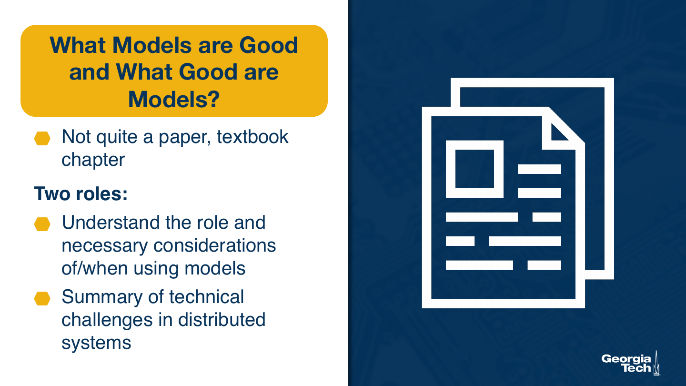

To read more about this, look at the chapter “What Models Are Good and What Good Are Models.” This chapter serves two roles: one, it provides more insights with respect to the discussion around models I just presented, and second it presents a summary of the technical challenges in distributed systems which we will discuss more next.

## 7. What is Hard about Distributed Systems?

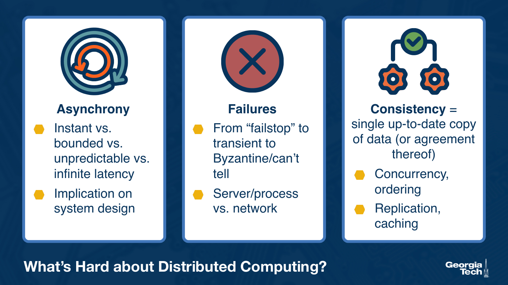

As we have already seen, there are a number of possible complications in distributed systems that introduce some sort of uncertainty and non-determinism, and this makes it hard to know exactly what a system will do, how it will behave, or to analyze how it should behave. It then becomes hard to say whether a system is or isn't correct. These are precisely the things that make distributed computing hard. Let's summarize these more formally.

### 7.1. Asynchrony

One thing is asynchrony. There is a difference between a system that guarantees instant message delivery, versus a system that gives us fixed bound on how long does it take for a message to be delivered, versus one in which message delivery is unpredictable, may have even infinite latency. Most real systems fall in this last category of having unpredictable and potentially infinite latency, meaning that potentially messages can be lost. In these kinds of systems we call asynchronous. Clearly, this property will have significant implications in system design. How you will design the system if you think that messages are going to be instantaneously delivered, or if you think that the messages are guaranteed to be delivered within a fixed amount of time, it's going to be very different than if you have to build a system that will have to work with potential message laws, message reordering, or potentially messages that are delayed some unknown amount of time.

### 7.2. Failures

Another thing that makes distributed computing really hard is the fact that there are failures. And there are many different types of failures to. Maybe a simple fail stop type of failure, so something just just stops working. Maybe transient failures, where something temporarily fails but then comes back. It's like something just delayed for a period of time. Or there are so called Byzantine failures in which the system may start essentially misbehaving. So it still hasn't failed. It's still performing some actions, but those are incorrect actions whether it's malicious, or whether there's some just cosmic rays that have caused some corruptions, regardless, the system somehow behaving incorrectly.

And then these failures may concern an individual server or process, or they may concern the network links. The things that are hard is to understand whether there is a failure, what type of failure, which component has failed. All of these factors need to come into play when thinking about distributed computing.

### 7.3. Consistency

Another thing that's hard about distributed computing is thinking about consistency. What we mean by consistency in this context, is that we want to have a single and up-to-date copy of any data or any state that's part of the distributed system, and that all notes will be in agreement of what that single up-to-date value is. In order for a distributed system to be able to come to that kind of agreement, there are a lot of factors that need to be considered. What is the concurrency or the ordering of the different operations that happen in the system? Is the data in some way replicated? Is it possible to cache the data somewhere? The fact that we have to consider all of these things, and the fact that many of these things introduce different kinds of trade-offs with respect to the performance of the system, the types of failures that it can deal with, these are again some things that make distributed computing hard.

### 7.4. The Fallacies of Distributed Computing

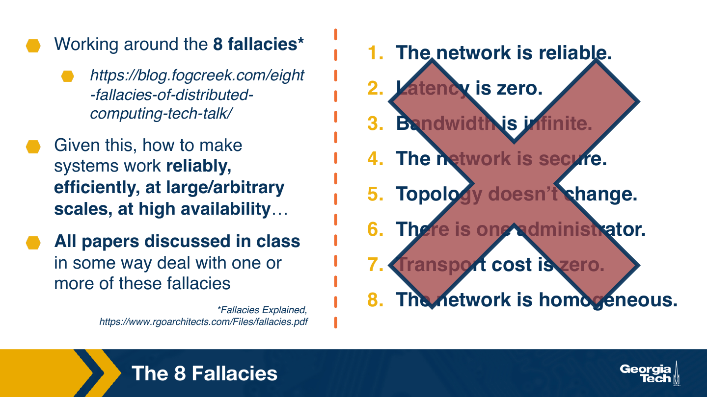

For those of you interested in more examples, there is an interesting creed that further attributes the things that are hard about distributed computing to the fact that there is an inherent existence of several fallacies. These fallacies, these are statements that cannot be taken as realistic assumptions in any practical distributed system. Here is a list of these analysis, and they're further explained in the white paper that's provided at this reference.

For instance, let's take as an example: the network is reliable. I'm sure that every one of you has personal experience in which you know that there are real network failures that exist out there. This is the case with data center networks. This is the case with wireless networks. This is the case with wide area networks. So we have to accept that the network is reliable is not going to be an assumption that's always going to be true. Therefore, if we build a system that is only going to work correctly in scenarios where the network is reliable, that system will have limited applicability.

Let's take a look at another one of these analysis: transport cost is zero. What does that mean? That it means that sending messages, sending data transport here refers to the transport of messages. It means that transport cost is zero. It means that sending messages is free. We know that that's not the case. And this is not just a question of whether or not you have a data plan and therefore you have to pay depending on the number of bytes that have been transmitted.

Transport is not zero because for you to be able to send any messages, first there needs to be communication infrastructure. So you have to make sure that there are connections, that those network interfaces are present, that they can operate at sufficient bandwidth at which you want to set. The more data you will need to send, the more messages you will need to transport, you have to make sure that you have capabilities in the network to support that kind of bandwidth. It's not going to be zero.

There is also inherent energy cost that's associated with sending a bit, with transmitting a bit over a certain distance, and that differs depending on the distance, depending on the communication medium, and it's certainly not zero.

So these statements, they simply cannot be made as general true statements in distributed systems. And the fact that these statements cannot be assumed to be always true, this is really the root cause of all the problems, all the challenges that we have to address when building distributed systems and designing distributed systems techniques such that they'll be able to deal with asynchrony, they'll be able to deal with failures, and to be able to do all of that while at the same time ensuring consistency.

## 8. Properties of a Distributed System

### 8.1. Consistency, Availability, and Partitions

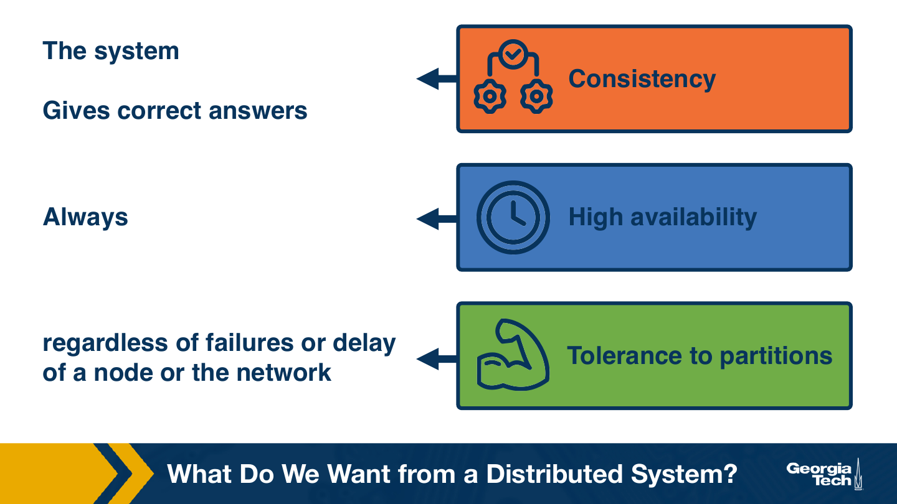

What do we want then from a distributed system? The number one thing is we want the system to give correct answers always. A system that gives correct answers, it's a consistent system. We call this property consistency. A system that always provides responses regardless of the presence of failures or delays, that's a system that's highly available. These delays here may be due to intermittent failures, or maybe due to extra load. Furthermore, we want the system to provide responses regardless of whether the failure or the delay is related to a single node or to the network overall. What that means is that we want the system to tolerate partitions.

### 8.2. Fault Tolerance and Availability

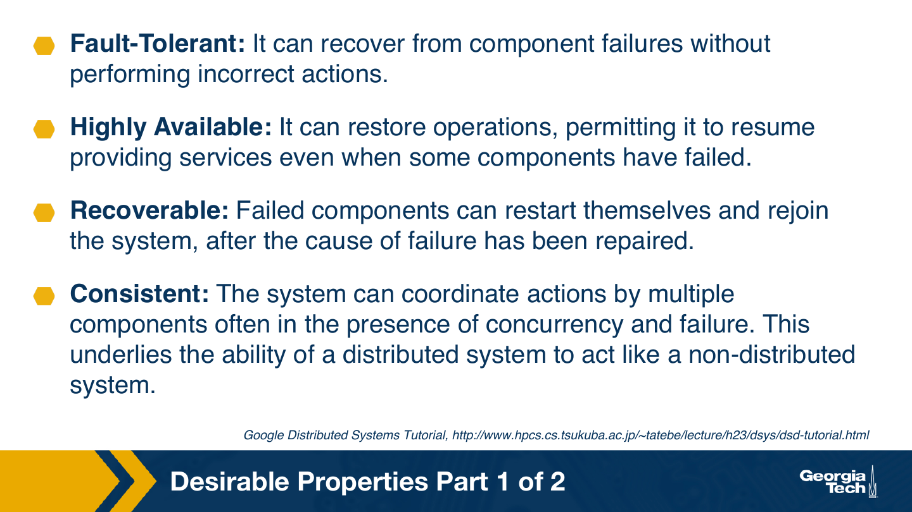

There are other important properties. We provide as a reference this distributed systems tutorial that's available through Google, and that lists a number of properties. The system should be fault tolerant: means that it can recover from component failures without performing incorrect actions. Systems should be highly available. We said it can restore operations and resume even when components have failed or are overloaded.

### 8.3. Recoverability

It can be recoverable. Failed components can restart themselves and rejoin the system, and once they do so, the system can continue behaving as it did before the failure occurred. So the failure had been repaired completely.

### 8.4. Consistency Across Components

Systems should be consistent. It should take certain actions to coordinate across multiple components even in the presence of failures, even in the presence of different concurrency related, ordering related issues. What we want to achieve with this is to make sure that the distributed system acts in a consistent way as if it were a single monolithic system.

### 8.5. Scalability

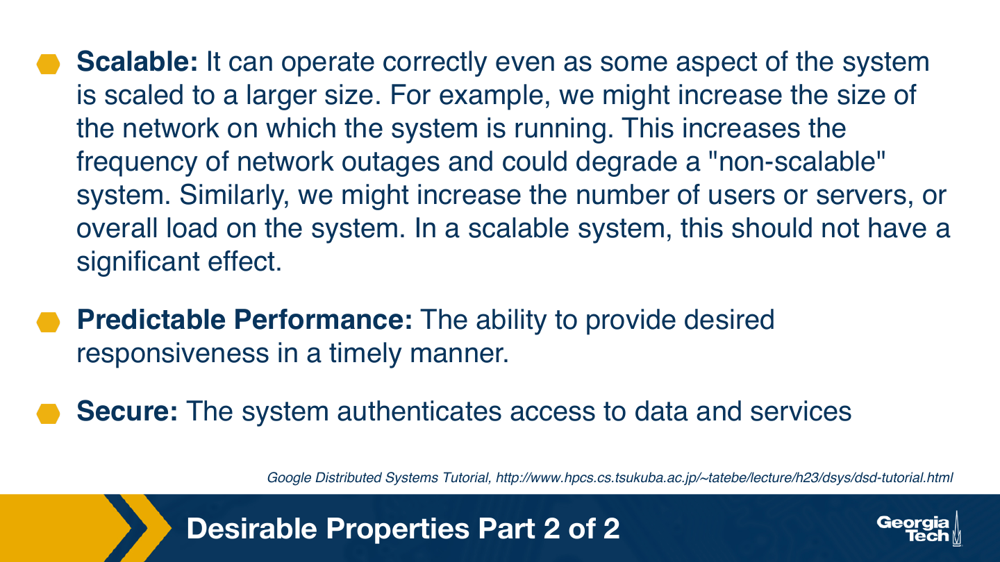

We want the system to be scalable. We want to make sure that it can operate correctly even as some aspect of the system ends up getting scaled to a larger quantity, to a larger size. For instance, we may increase the number of components in the network, may overall increase the network size. And if we increase the number of components, then we are introducing a increased probability that there is going to be a failure somewhere in the system. Well, we don't want the system to start performing quartz just because now we are operating, we're deploying the same application the same service over a larger network, over a larger number of nodes.

Similarly, if we maybe increase the number of users in the system, that may introduce some increased load, and because of that, each of the users may end up experiencing some service degradation. This is not what should happen. In a scalable system, this will not be the case.

### 8.6. Predictable Performance and Security

We want the system to offer predictable performance. So regardless of fluctuations in load, of failures, of partition, ideally the system will be such so that it has predictable performance.

And we want the system to be secure. So what that means is that it would, in some manner, authenticate the access to both the data, the state that it maintains, and the services that it provides. And I'm sure you can think of other useful and desirable properties of a distributed system in a distributed application.

## 9. Correctness

### 9.1. Inputs and Outputs

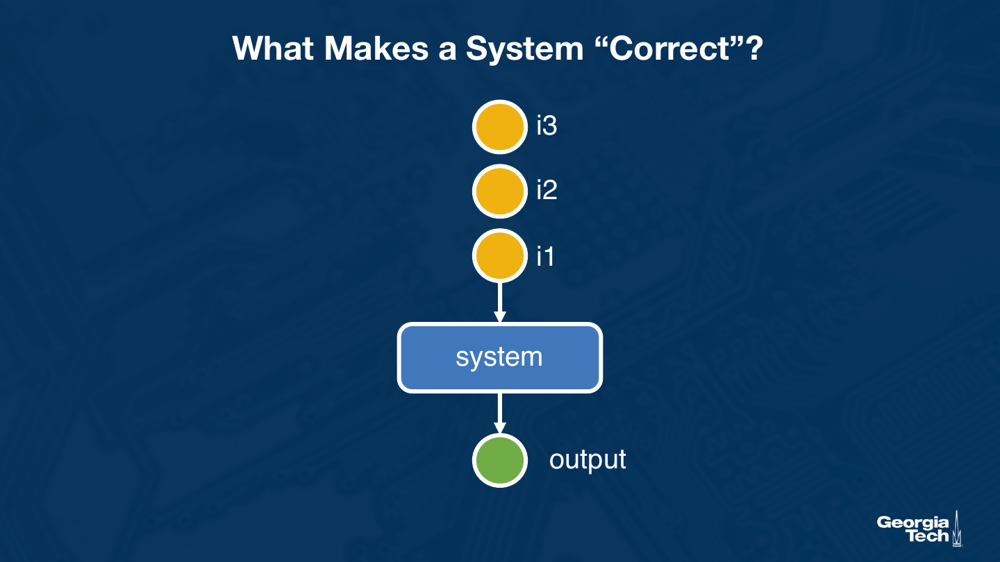

Let's talk some more about correctness. What does it mean for a system to be correct? Earlier in the definition we offered, we said that a distributed system should behave as if it were a single coherent entity. What that means is, if we consider the inputs a distributed system receives, if the same set of inputs were given to a single coherent entity, then the output of the distributed system and the output of the single coherent entity should be identical. In such a scenario, we can say that the distributed system is correct.

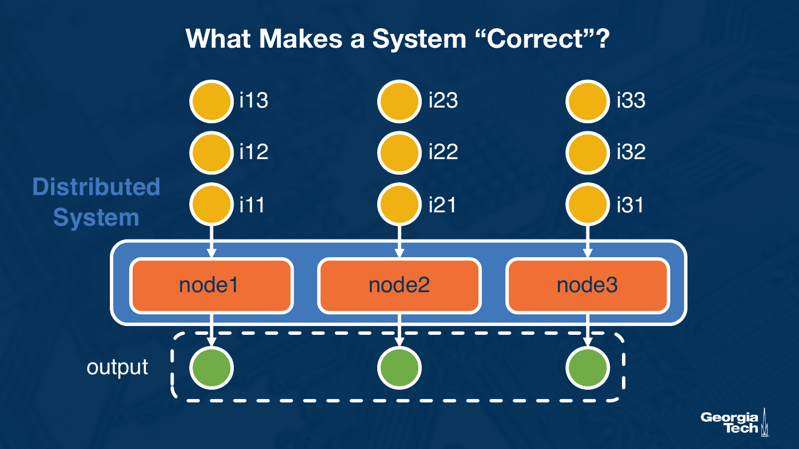

But what do inputs and outputs mean in a distributed system? A distributed system may have multiple nodes. Each node may be receiving its own sequence of inputs. The output of the system reflects all nodes, the actions that take in response to all inputs, and any of the state changes that they perform.

### 9.2. Input Ordering

What does it then mean to have same inputs? Same inputs, it may correspond to some values or some parameters associated with the input events, but also that somehow captures the timing and the ordering of the sequence of those input events. So when we think about the input, we need to think about whether the input was first delivered on node 1 and then node 2 had its input value delivered. This is also important to be captured. Why is it important? Because this ordering can somehow impact the output that's observed at each of the individual nodes. So when thinking about answering the question whether or not a system is correct, we need to be able to explicitly think, not just about the individual sequence of events that was observed, or inputs that was observed at one node, but we need to be able to think about the ordering among all of the events that occurred at each of the nodes and how the output events correspond to that input sequence.

### 9.3. Consistency Models and Strict Consistency

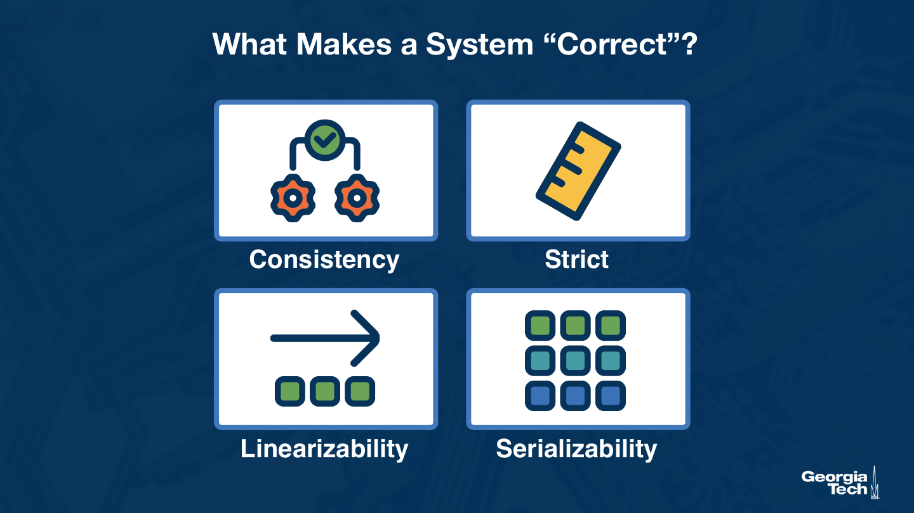

The guarantees we can make about the ordering that occurs in a distributed system is captured in the consistency model. In an ideal case, we would like to be able to make a guarantee that all events, all changes in the system, will have a single uniform order, and that this is going to be identical to the actual order in which these events occurred in the real world. In addition, we want to make sure that every single node, all participants in the system, agree that this indeed is the order of all the events in the system. This is what we call strict consistency, and it's next to impossible to achieve in practice. The reason why we said it's next to impossible is because it's impossible to guarantee that all nodes in a distributed system will have precisely the same notion of time and the same way to think about the relationship, the timing relationship of different events. We will talk much more about time in the next lesson.

### 9.4. Linearizability

Since strict ordering is impossible to guarantee, there are many other properties and consistency models that have been defined and found useful when analyzing and designing distributed system. For instance, a linearizable system is one where group of operations that accesses, that reads or that modifies some piece of shared state, and therefore impacts the output, this group, and we call such groups of operations transactions, want to make sure that this group will not appear in a way interrupted or interleaved with some other groups, some other transactions that are ongoing in the system. So in a linearizable system, these groups of operations, these transactions, they will appear as if they were executed one after another.

### 9.5. Serializability

Serializability is another important property, which talks about overall the ordering of these groups of operations, these transactions. With serializability, the system is supposed to guarantee that the outputs correspond to some interleaving of the transactions, but this interleaving may not quite correspond to the real-time ordering of the individual operations. However, this interleaving will correspond to an interleaving that could have occurred even if all the operations were executed on a single node. So you try to re-run through the same system again. A serializable system will specify that all the nodes in the system must be in agreement on the same ordering of the operations. It may not quite match the real one, but it has to be identical ordering that's perceived by all the nodes in the system.

## 10. The CAP "Theorem"

### 10.1. Consistency, Availability, and Partition Tolerance

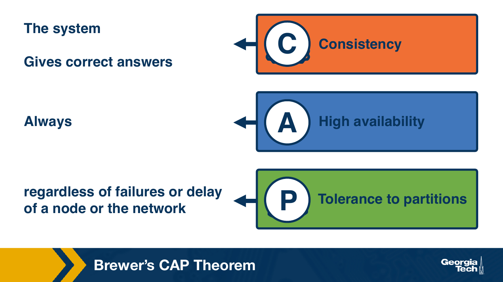

Let's now, as part of this introductory lesson, also introduce the capped error. We stated these desirable properties for a distributed system: consistency, high availability, tolerance to partitions. These properties are critical in what is known as the CAP theorem or conjecture, since it's not exactly proven, and it was stated 20 something years ago by Eric Brewer, a computer science professor at Berkeley.

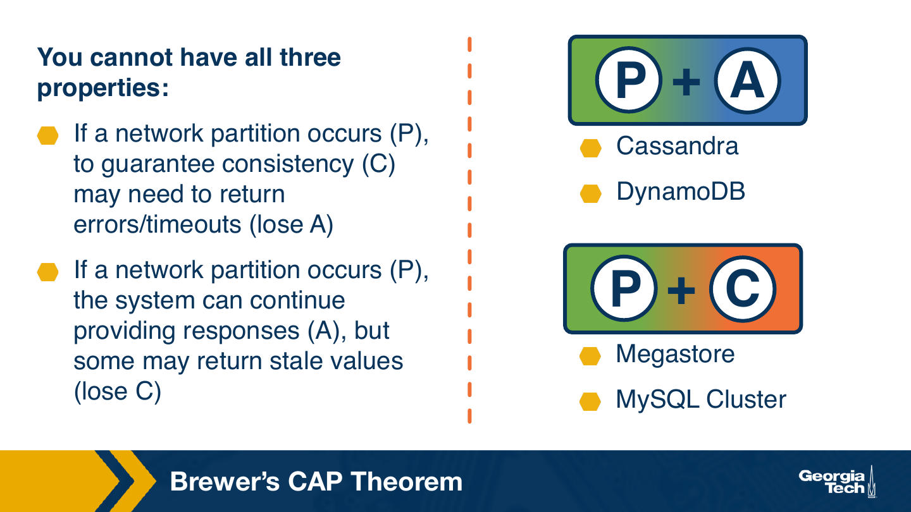

What the CAP theorem says is that a distributed system cannot meet all of the three desirable properties. If a partition occurs, you can either have consistency or availability, but not both. Of course, if there is no network partition, the system can have both consistency and availability.

### 10.2. System Design Choices

Systems are sometimes classified by the trade-off their design decisions make with respect to the consistency versus availability. So for instance, popular key value stores like Cassandra and Amazon's DynamoDB, you may be familiar from 6210 with DynamoDB, they choose partition and availability, pna. Google's mega store, that will mention in a later lesson, or MySQL cluster, for instance, in the event of practitioning, they earn the site of consistency. So they use p and c. In the case of partitions, they guarantee consistency, but not necessarily availability.

### 10.3. Availability and Slow Responses

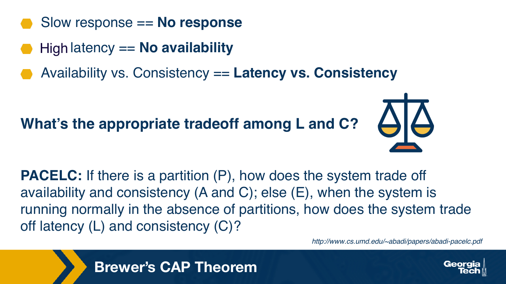

When considering the CAP theorem, it implies that there is this availability versus consistency trade-off, and this trade-off really only exists when there is a network partition. It kind of says otherwise they can both be met. But it's not hard to see that there is an ever-growing number of applications where a slow answer is no different than no answer at all. Businesses lose customers. They can be catastrophic consequences. So for such systems, the manifestation of low latency, a slow system, that's an equivalent to a system that is not available. So whereas a network failure network partition forces us to think about this trade-off between availability and consistency, the situation of a overloaded or a slow network, then in many settings may introduce another important trade-off between latency observing requests that are received in the distributed system, versus consistency.

### 10.4. Latency Versus Consistency

It's easy to see that such a trade-off exists. If the network is slow, what are our choices? We either need to provide an answer based on a version of the data that was stored locally, or the layer responds until the system verifies whether the most recent version is indeed stored locally, and that may take some long time and may result in a high response latency.

This observation is summarized in work by Daniel Abadi, and it's abbreviated as PACELC. So just like systems can be classified based on the design tradeoffs they make around availability versus consistency, they can be further classified based on the design trade-offs that they make with respect to latency versus consistency. This paper gives some examples of that, but we will mention these trade-offs more explicitly as we describe concrete systems in some of the future lessons.

## 11. Summary

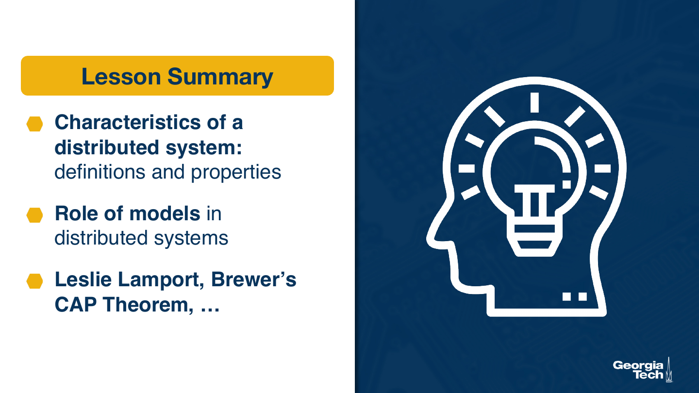

Let's summarize what we've learned in this lesson. We saw what are distributed systems and discussed some of the prevalent definitions and some of the desirable properties of a distributed system. We also discussed the importance of well-selected models for analyzing and designing better distributed systems. And finally, we learned about some important references and computer scientists that continue to influence distributed systems advances today.
