# Lesson 3: Time in Distributed Systems

Source: [Lesson 3 — Video](https://www.youtube.com/watch?v=fqycuss1OIo)

## 1. Introduction

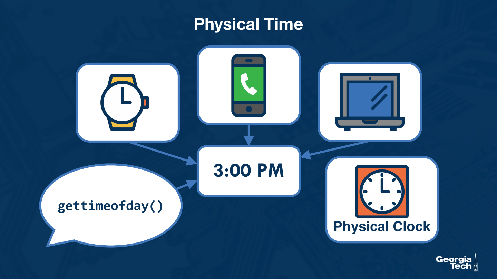

In this lesson, we will discuss the concept of time in the context of distributed systems. Time is seemingly a well understood concept. You can look at your watch or your phone or on the corner of your display, and read the current time. You may have had experience in the past with instrumenting your code with commands such as get time of day, to read the current time at any given point of time in the execution. When looking up the current time via any of these methods, we actually read the value of some clock that we have access to. This is a real clock, physical clock, and the current time we read in this manner is called physical time.

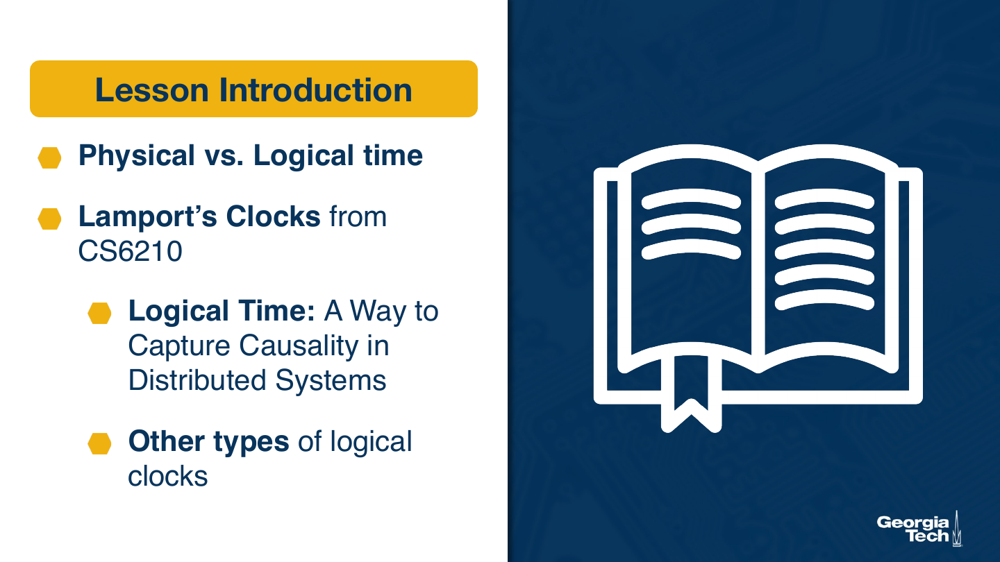

In this lesson we will see why it's hard to rely on physical time in distributed systems, and instead we will learn about logical time. Those of you who have previously taken the advanced operating system scores CS6210 may remember the lesson on Lamport's clocks. We will review Lamport's clocks, and we will also talk about other types of logical clocks and why each of those is useful.

## 2. Why Do We Need Time?

### 2.1. Ordering, Causality, and Correctness

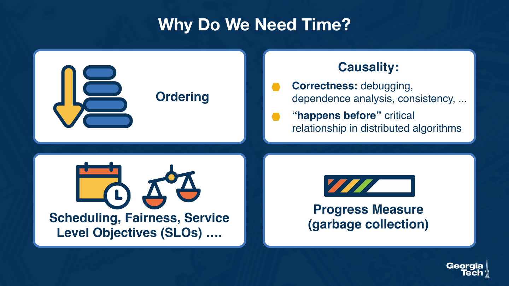

Let's start by trying to understand what is the main reason we need time in a distributed system. When we talk about a single note localized computing, it is easy to determine precisely the sequence of events or operations and to uniquely determine the order of each operation in that sequence. Ordering is an important property. By knowing the order in which two operations occur, we can determine their causality, whether one operation somehow affects the other. This is important for the correctness of the system. We needed to perform debugging. We needed to maintain consistency of the updates to the state of the system, and so forth.

### 2.2. Resource Allocation and Garbage Collection

Ordering is also important during resource allocation operations in a distributed system, such as during scheduling, particularly when we are concerned with maintaining some properties such as fairness, priorities, or other service level objectives.

If we know the order of the operations across nodes in a system, in their potential dependencies, we can analyze the system and make observations about its progress. For instance, if we know the dependencies among different operations and determine that the output of some operation will no longer be needed by any other operation, we can perform garbage collection and free up resources which are no longer needed. Without knowing that all nodes have advanced sufficiently beyond the point in time when they might need this old value, it will be impossible to safely remove it.

## 3. Why Is Measuring Time Hard in DS?

### 3.1. Observing Events at the Receiver

So if we understand what time is, and if we agree that it is useful, what makes it so hard to use time in distributed systems? Why can we not just read the local clock at each node to find out the current time locally in the same manner as what we do if we had a single node system? If we understand that we need time in order to order the events in a distributed system in a correct way, let's see what are the ways we can make observations about the timing of events.

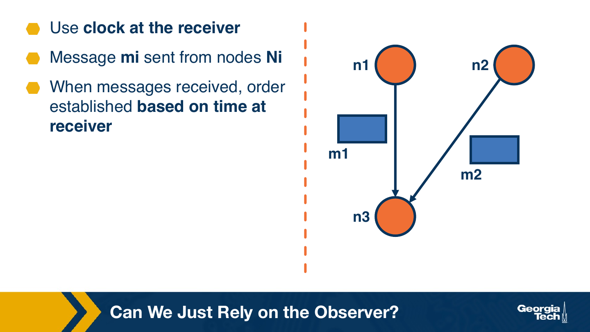

One simple way is to rely on the receiver to make observations about the timing and ordering of events. Let's assume that each node in the system sends a message whenever an event occurs. When we have a system with three nodes as in this figure, let's say M3 receives messages from the other two nodes about the events that have taken place there. N1 sends a message. N2 sends a message, and N3 receives both of these. Let's say it first receives M1, then it receives M2, and then determines that the two events have occurred in the corresponding order.

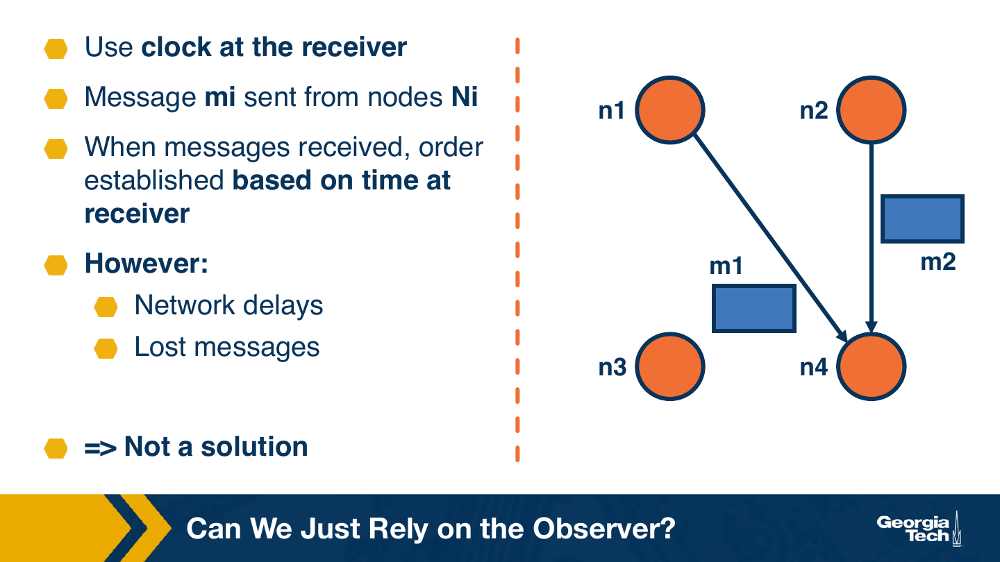

The problem is, we don't have any guarantees about the time it takes for these messages to reach other nodes. It is possible that the message associated with the event that happened first in real time simply took longer to travel through the network. It is also possible that if there is a fourth node in the system, and four, because of differences in the network latencies, that fourth node will receive messages in a different order from N3. Moreover, some messages may be delayed infinitely or lost completely. It will be very confusing to try to make sense of what's going on in this system, and it will be impossible to make any guarantees about the correctness of its execution if notes cannot reach decisions about the order of events. So we cannot just rely on the receiving side, the observer, to make decisions about time and ordering.

### 3.2. Local Timestamps and Clock Skew

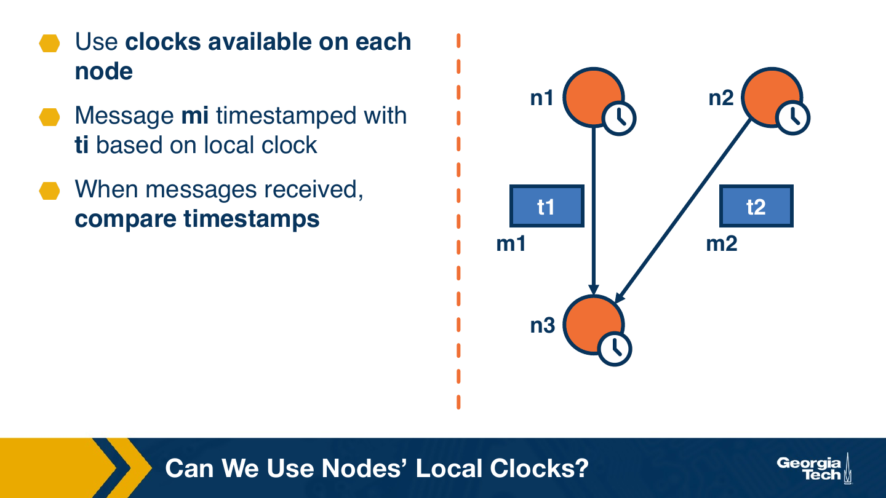

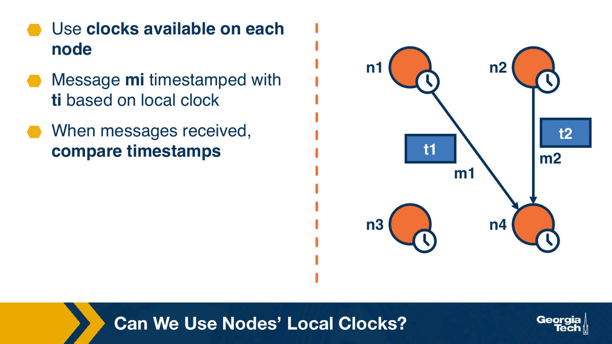

If we have clocks tracking time at each node, each node can timestamp their messages with their local clock. When another node receives these messages, their timestamps can be checked, and the messages can be ordered based on their time steps. So even if there are message delays, M3 can compare t1 and t2 and know that M1 needs to be before M2. Importantly, whichever node receives these messages, based on the timestamps, it will order the messages in the same way. In that sense, the order is unique and precisely in the order in which they were indeed generated.

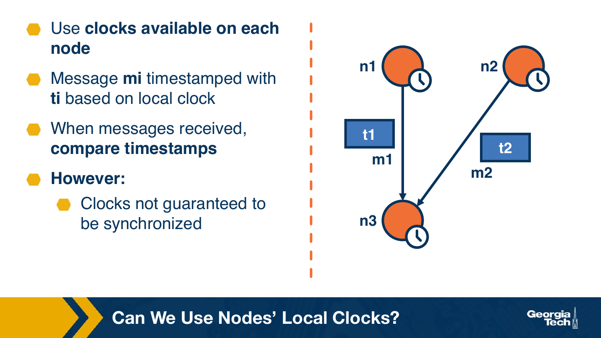

The problem is that it is hard to make a general assumption that there are globally synchronized clocks that can be immediately available at each of the nodes in the system. If there is a large enough skew in the clocks at N1 and N2, and say N1 is the one that is ahead in the time it's reporting, it is possible that the timestamp that is generated by the clock at N1 has a value that will correspond to a later time than the timestamp that's associated with M2, even though M2 was the one that was generated later. If that's the case, then when M3 receives the messages, it will just look at the timestamps, and it will make an erroneous decision about which one was the first event that was sent.

### 3.3. Timing Assumptions and Failures

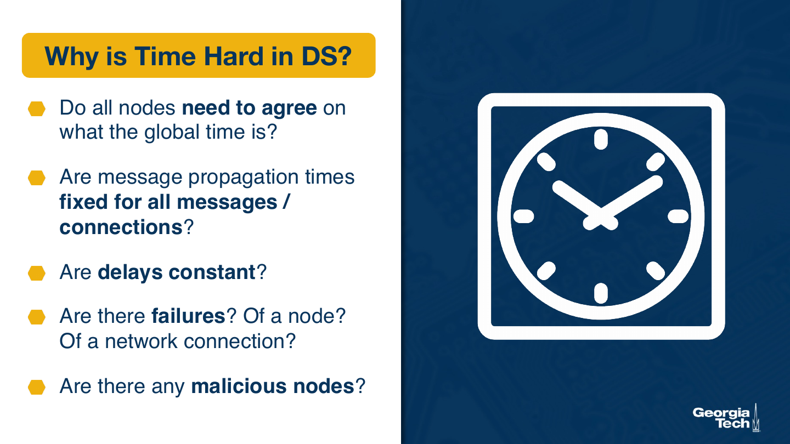

In summary, these examples illustrate several aspects that make reasoning about time and how events are ordered with respect to time, very difficult and distributed systems. Guaranteeing consistent availability of globally synchronized clocks is hard. There is no guarantee that the messages will take sixth time to propagate through the network. There is no guarantee when there are delays in the network that those delays will be consistent across nodes, meaning a message may be delayed when sent to N3 but not to N4, which will reverse the order in which it is received on different nodes. And also there is no guarantee that there won't be failures, either of nodes or of the network. And all of this can also be further complicated because we may not be able to trust all nodes in the network.

## 4. Logical Time

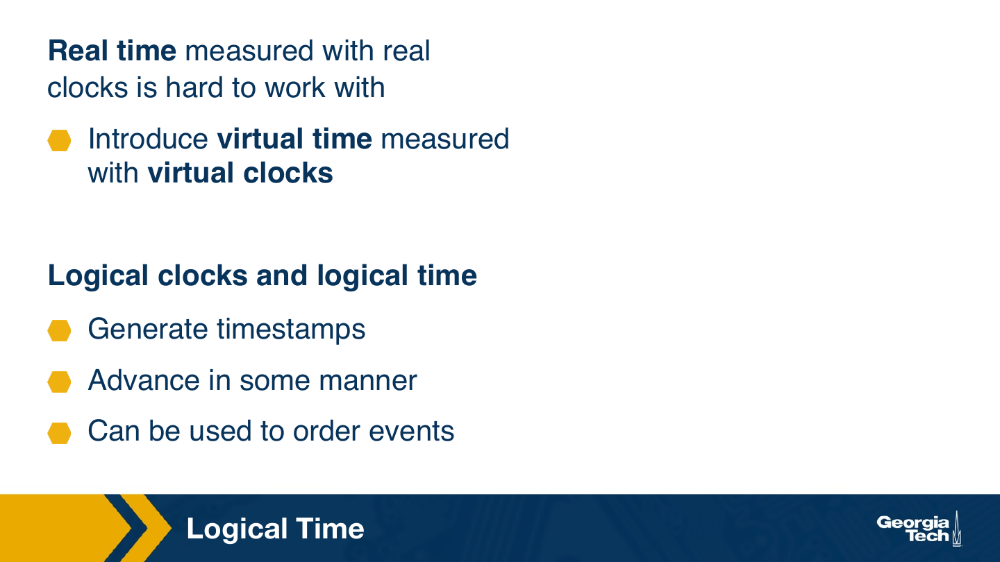

We explained that in distributed systems, it is hard to work with real physical clocks and the real notion of time that they measure. But we also explain that we do need somehow to capture the concept of time. The solution to that problem is to introduce some virtual concept of clocks and time. We do this via what we call logical clocks.

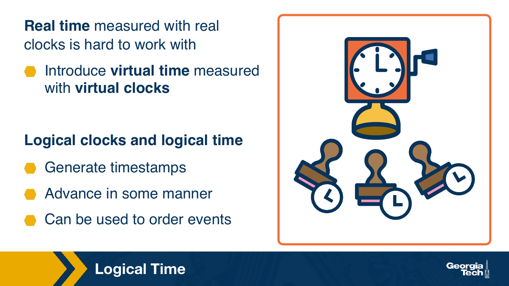

Unlike real clocks, logical clocks don't measure the same notion of time we're familiar with in the real world. But just like real clocks, they generate some type of timestamps. These timestamps do advance in some manner, and they can be used to let us reason about the ordering of events, about which one happened first, which one happened afterwards. In that sense, a logical clock is some generator of timestamps where these timestamps can be useful in conveying information about the real ordering and relationship of events in the system.

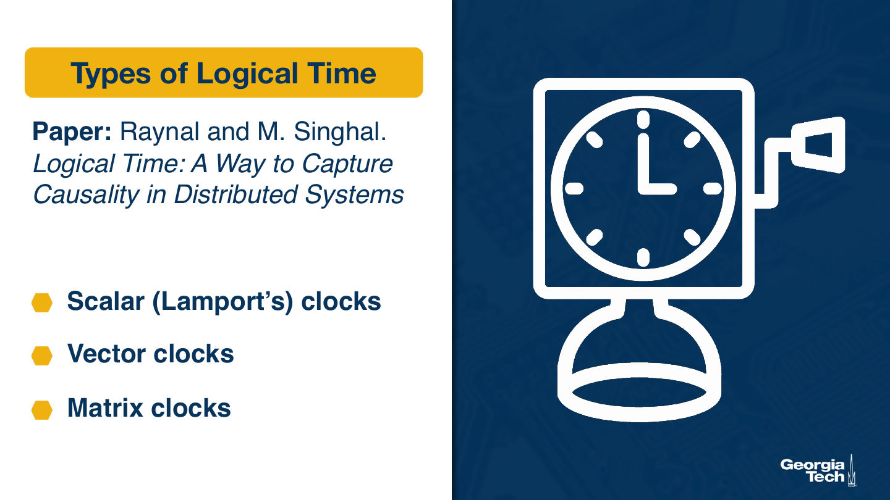

The paper logical time: a way to capture causality in distributed systems describes what makes a logical clock a good candidate for measuring time. It also describes three types of logical clocks and the guarantees that a system can obtain when using each of these clocks. The three main types are scalar clocks, also called Lamport's clocks, vector clocks, and matrix clocks.

The paper also discusses implementation techniques for the different types of clocks and gives more detail on the history of how these concepts have evolved. We will skip the discussion of some of that detail from the lesson, but you're welcome to look at it if you want to learn more on this topic.

## 5. Common Notations

### 5.1. Events, Histories, and Happens-Before

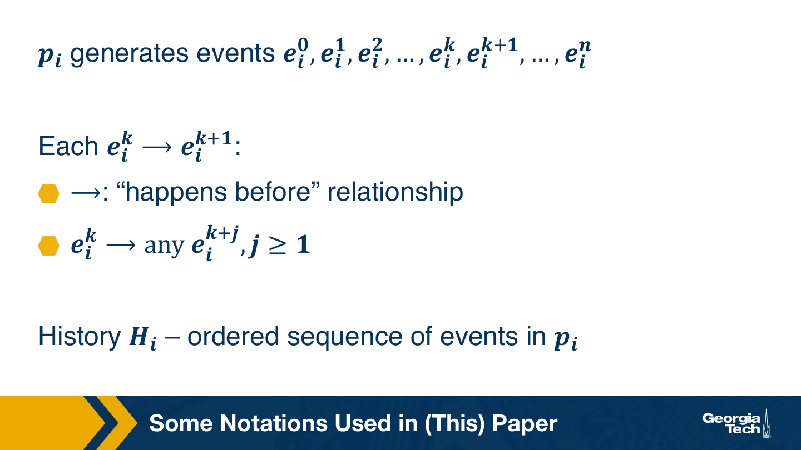

Before we go into further detail, I want to introduce some notation that we will use in this and some of the subsequent lessons. The execution of a process p i is a sequence of events. Each event e sub i of k happens before the event e sub i of k plus 1. This arrow notation is a common way to express the happens before relationship e sub i of k happens before amy is a pi of k plus j where j is greater than or equal to 1. The ordered sequence of events in the execution of a process p i is also called its history.

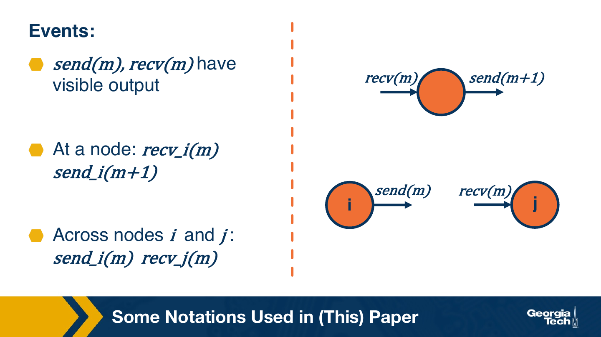

We will focus, particularly at least in the beginning, on events related to sending and receiving a message. These events are important because their effects are clearly visible to other nodes, so it will be important for us to be able to correctly order them. At a single node, the receipt of a message m will always happen before some subsequent message n plus 1. There may be some other processing that happens internal to the note, but let's not think about that now.

Across two notes i and j, send and receive events are also related by this happens before relationship. Sending a message at the sender note i always has to happen before receiving that message at the receiver j, otherwise there wouldn't have been anything that node j could have received.

### 5.2. Execution Diagrams

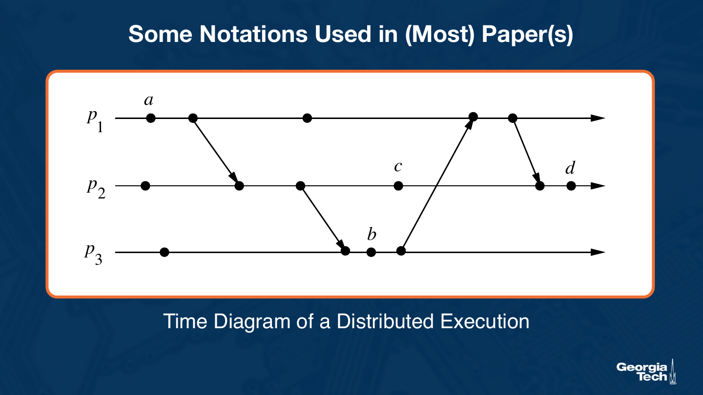

Another notation that we will use in this course is to plot diagrams of the executions of the different processes and their events. In this figure, we show three processes, each with some events corresponding to the dots. The messages in the system are shown with arrows. The arrows start at the event send m and point to the event receive m at the destination process. These dots that don't have an arrow correspond to events internal to the process.

## 6. Concurrent Events

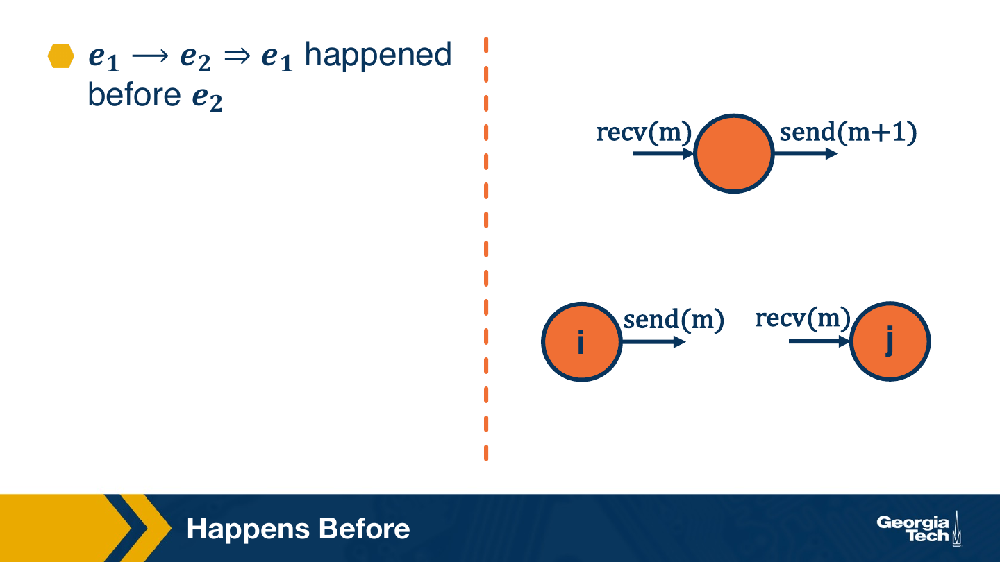

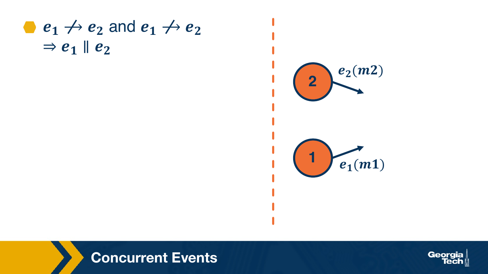

Reset two events can be a happens before relationship. This was the case with the examples with the message send receive events that either involve the same note or the same message. However, there may be situations where two events are not related based on the happens before relationship: neither e1 happens before e2, nor e2 happens before e1. For instance, this may be the case if e1 and e2 involve different and completely unrelated processes. We call such events concurrent events, and use this notation, e1 is concurrent to e2, to denote this.

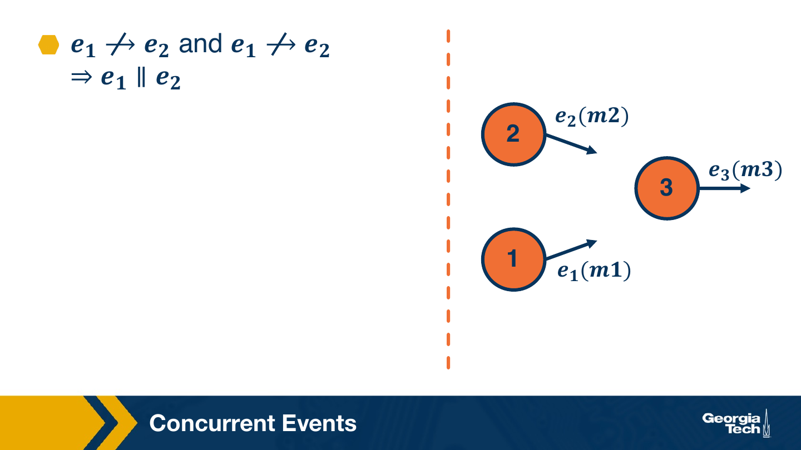

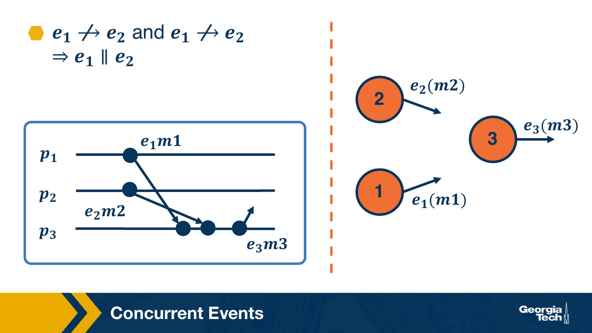

Of course, both of these events may have happened before some other event. For instance, if we assume here that the messages sent by notes 1 and 2 are first received by node 3, and then node 3 sends a message M3, both e1 and e2 would have happened before this last event e3. We can show this on a time diagram as follows: e1 sends M1 that's received by process 3. Event e2 corresponds to sending M2 at process 2, and that's received by process 3. And both of these events are before the event of sending the message M3.

## 7. Logical Clock

### 7.1. The Clock Consistency Condition

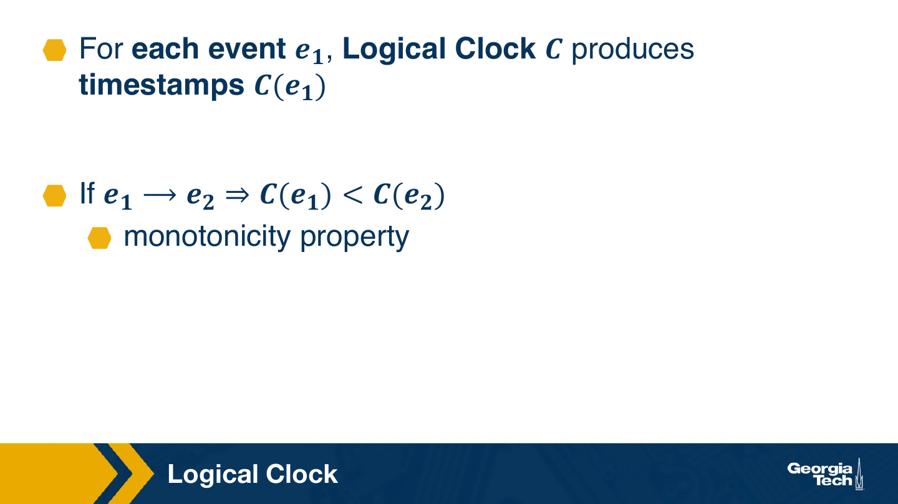

With this information, let's now move forward to a more formal definition of logical clocks. We said we need logical clocks to generate timestamps, but these timestamps need to guarantee some properties in order to be useful. Particularly, whenever two events are related by the happens before relationship, we need to make sure that their timestamps reflect this. So if e1 happened before e2, then e1 needs to have a timestamp that's smaller, so that it shows earlier time than the time associated with e2.

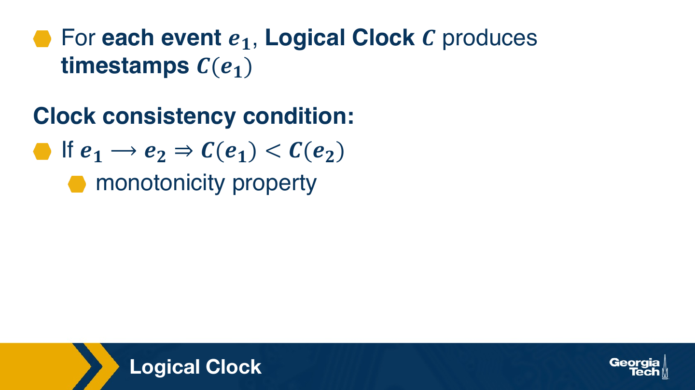

This means that the clock has to be monotonically increasing. It cannot repeatedly produce the same timestamp, or to start decreasing the timestamp value. That would be like time holding still, or like going back in time. This is one of the conditions a logical clock must satisfy to be useful. We call this the clock consistency condition. What this means is that for a logical clock to meet the condition C1, it will have to guarantee that the timestamps of e1 and e2 reflect the happens before relationship, if indeed the event e1 happened before the event e2.

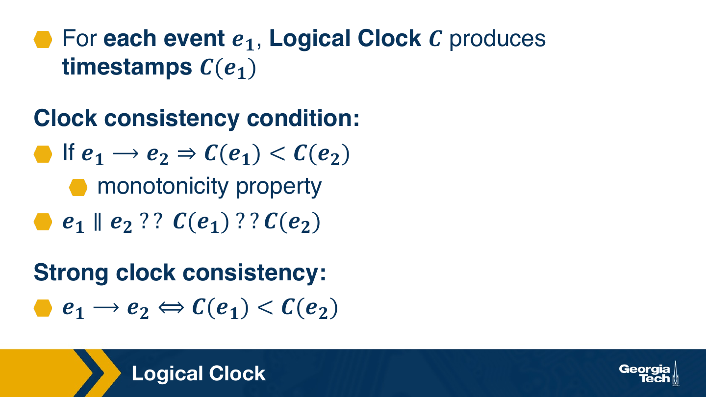

The clock consistency condition doesn't tell us anything about two concurrent events. It alone doesn't say what happens when events are concurrent, whether their clocks will be the same or different.

### 7.2. Strong Clock Consistency

When we think about real clocks, we know that if the timestamp of one event is greater than the timestamp of another event, then the first event happened later in time than the second event. Logical clocks that give us this guarantee, that when we look at the timestamps only, we can uniquely determine which event happened before the other, we call such clocks as satisfying a strong clock consistency property.

### 7.3. Representing and Updating Time

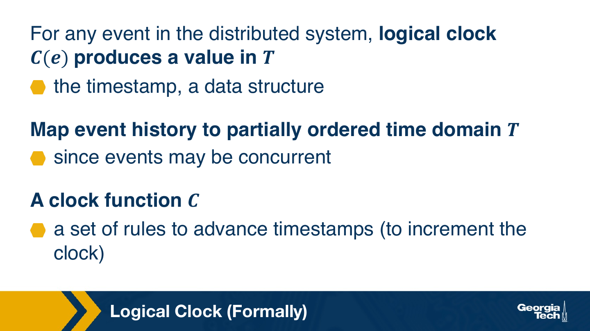

So a logical clock then is used to timestamp events in a way that maps the history of the execution of the process to a partially ordered time domain t. The clock function is a set of rules that must be followed to produce proper consistent timestamps. To implement a logical clock, we must decide on the data structure used to represent the timestamps, and the rules that will be followed to advance time.

## 8. Lamport’s Scalar Clock

### 8.1. Scalar Timestamps

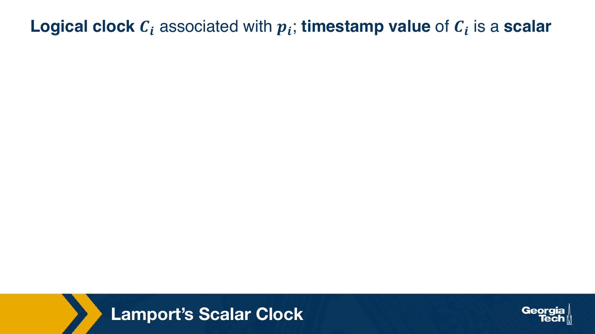

The first clock that we will describe is the scalar clock. It was originally proposed by Leslie Lamport, and that's why it's also called Lamport's clock. Those of you who already took advanced operating systems should already be familiar with this clock. As the name suggests, this clock is a scalar. Each node has its own implementation of the clock, which executes the clock rules to produce a new timestamp for the clock. A node only knows the value of the timestamp that it computed, meaning each node may have its own view of the current time, but everyone sees the clock as a single scalar value, and hence it the name.

### 8.2. Clock Update Rules

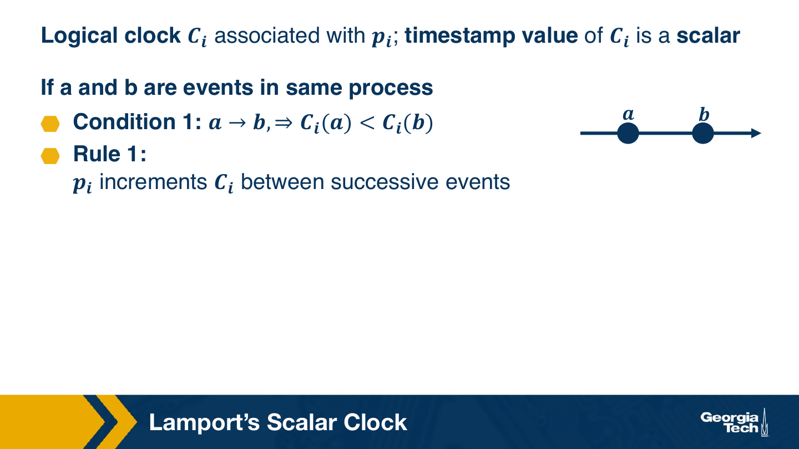

The rules for how the timestamps are updated can be observed from the following conditions, which must be satisfied. For two events a and b which are in the same process, if a happens before b, then the timestamp of a must be smaller than b. From this condition, it's easy to determine the first rule: a process has to increment the value of its logical clock each time it generates a new event.

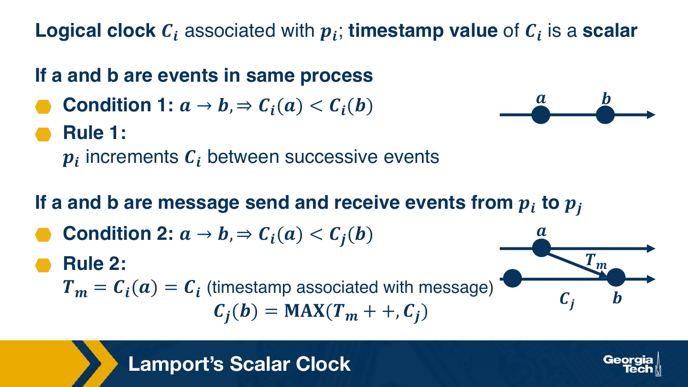

For two events a and b are two different processes, where a is the event of sending a message m at process pi, and b is the event of receiving that message at process pj, we have to make sure that the timestamp ci of a, which is the timestamp at the process pi, is less than the timestamp cj of b, where cj, that's the clock at note pj. We have to ensure this because sending a message precedes the receipt of the message, so the timestamp associated with the sending event has to be smaller than the timestamp associated with the receiving event. Then the rule for the clock should be such so as to guarantee that cj of b is greater than the timestamp of descending event ci of a, but also the timestamp cj has to be greater than any other timestamp that was previously used at the node where the message was received at pj. We have to guarantee that in order to meet the rule number one. This information gives us the following formulation of the clock rule.

### 8.3. An Example with Three Processes

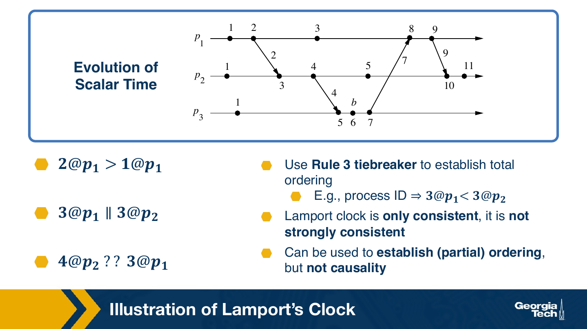

Let's look at an example of how the logical clock can be used. We have three processes P1 to P3, and each has its own clock instance C1, C2, and C3. A number of events occur at each process. Some are internal, and some correspond to messages that are being sent or received. The values above the events correspond to the timestamp generated by the corresponding clock, and the timestamp is a result of the clock following the clock rules.

Let's look at some of the events here. For instance, at process P1, the second event has a timestamp 2, and this is because its timestamp has to be greater than the timestamp of the previous event at process P1. At process P2, the second event has a timestamp 3 because it has to be greater than the previous event that process 2. This one has a timestamp 1. But also this event corresponds to receiving a message, and its timestamp has to be greater than the timestamp associated with the event where the message was sent, and in this case that timestamp is 2.

### 8.4. Concurrent Events with Equal Timestamps

Now let's take a look at the events that have a timestamp 3 at processes P1 and P2. If we look at these two events, we know that they both follow the event with timestamp 2 at process P1, but that's all we know about that. They're not related in any other way, and everything that happens later in each of the processes is completely independent of whether we perceive that event three at process one happened first, or that the event three at process two happened first. These two events are clearly concurrent, and so it's okay for their timestamp to be the same.

### 8.5. Concurrent Events with Different Timestamps

Now let's look at events 3 at P1 and 4 at P2. Event 4 at P2 has a greater timestamp value. What does that tell us? Based on the representation in this diagram, they happened around the same time. Actually, if you look really closely, it almost looks like the event with time step 4 at P2, as if it happened a little bit before the event with time step 3 at P1, and yet this one has a greater timestamp. Is this a problem? It actually is not a problem.

Lamport's scalar clock satisfies only the clock consistency condition, meaning that if a happens before b, it guarantees that the timestamp c of a is less than the timestamp c of b. But it doesn't guarantee anything about the other way around. With Lamport clocks, just by looking at the timestamp, we cannot make a guarantee about the happens before relationship. So what does that mean for these two events specifically? If we look at them, we see that in principle they're also concurrent. They both happened after the event time stamped with 2 at process 1. For this event, clearly they're both happening in the same process, so it's obvious why that is the case. For the event time step 4 at process 2, well, this one happens after the event timestamp 3, which in turn was in response to a message that was sent at time stamp 2 at process 1. So that's why we know that both of these happened after the event timestamp 2 at it process1, but otherwise these two events are not related. Nothing changes in the remaining part of the execution if we swap their perceived order.

### 8.6. Why the Ordering Is Useful

So we may wonder then whether these logical clocks are actually useful. If we look at the scalar clock value, we will conclude that the event time stepped 4 at process P2 happened after the event time step 3 at process P1. That does not correspond to the order of these events in real time, if we assume that the diagram illustrates the events precisely with respect to the real time and if the x-axis is to be considered to be time. But this is okay. This scalar timestamp value, it is still allowing us to establish a order, and if these events are observed by anyone in the system, they will all see the same timestamps associated with the events marked 3 in P1 and the event marked 4 in P2 and so everyone else will make the same conclusion that the event 3 at process 1 happened before the event 4 at process 2. This is not the conclusion that corresponds to the real ordering of the event, but since these two events are really concurrent, and their perceived orderings can be interchanged without any consequence on correctness, it's okay. The important part is that everyone in the system will be able to observe a unique ordering of these two events and that everyone will be able to observe the same ordering.

### 8.7. A Total Order and Tie-Breaking

With that, the scalar clock gives us a mapping from all events in the system to a partially ordered list of timestamped events. The list is partially ordered because there can be concurrent events that have the exact same timestamp. This is the case with these two events with timestamp 3. If we really need to have a total order among all events in the system, and we need everyone to be in complete agreement with that order, it is still possible to do that. We just need to come up with some tie breaking rule that will be used to establish order among the events with equal timestamps. Since the order doesn't really matter for the correctness of the observation, we can come up with some random rule, as long as everyone in the system agrees to what that rule is.

A common rule that's easy to implement uniformly across all nodes is to use the identifier of the process as a component of the timestamp. The combination of the process ID and the timestamp value then will be distinct among all nodes, and it can be used to order all the events that have a matching timestamp t. If we follow that rule, the event 3 at P1 will be perceived as being ordered before the event 3 at P2, and that's because the ID of P1 precedes the ID of P2. And again, even though this is not the case in real time, everyone will agree that these two events are ordered in the same way, and therefore it is useful.

### 8.8. Estimating the Number of Events

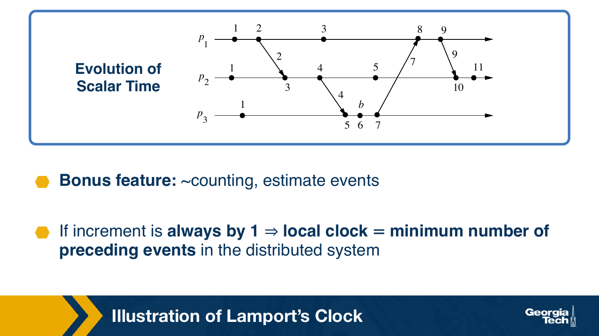

The Lamport clock also has some other properties. It can be used to estimate the number of events. If we know that the timestamp counter is always incremented by one, then by looking at the timestamp at one process, we know the minimum number of events that have occurred anywhere in the system prior to this event. And this will consider all other notes, even the ones that have not communicated with this node in the past. The actual number of events may be larger, so this is not quite counting events, but it's useful to know the minimum.

### 8.9. Consistency and Efficiency

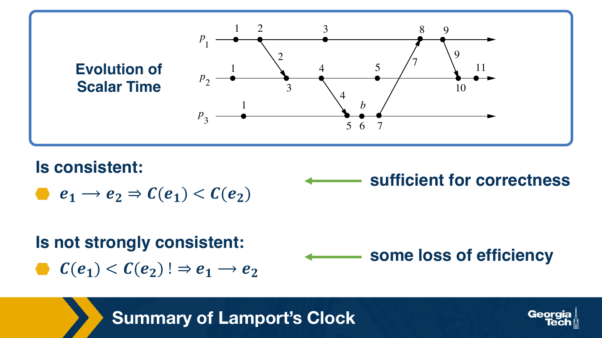

To summarize, the way a Lamport clock represents and updates time makes this type of logical clock a consistent clock, meaning that it can allow us to order events uniquely and to make that ordering visible across all nodes in the system. This is one of the key requirements we need from a clock. But Lamport's clock is not a strongly consistent clock, meaning that we cannot rely on it to give us complete information about causality. If a timestamp c of e1 is less than a timestamp c of e2, this doesn't mean that e1 happened before e2.

Not supporting the strong consistency property doesn't make the clock incorrect. The first property is sufficient for a clock to be useful for correctly maintaining the ordering of the events in all scenarios where the ordering is truly important. Whenever we have events that are indeed dependent, that will be reflected in the Lamport's clock timestamps. The lack of a strong consistency guarantee only means some loss of efficiency. This is because if we're using this clock, some events that may not really be related will appear that they are, and that they need to be ordered in some specific way, and the distributed system will try to enforce that ordering, or how that ordering is perceived across all nodes. So in that sense, it may cause some delays in how events are processed in order to ensure that the perceived ordering is captured at all nodes. And we see here that some events may appear to be ordered in a specific way, even though in reality they're concurrent and their ordering can be easily interchanged.

## 9. Vector Clock

### 9.1. From a Scalar to a Vector

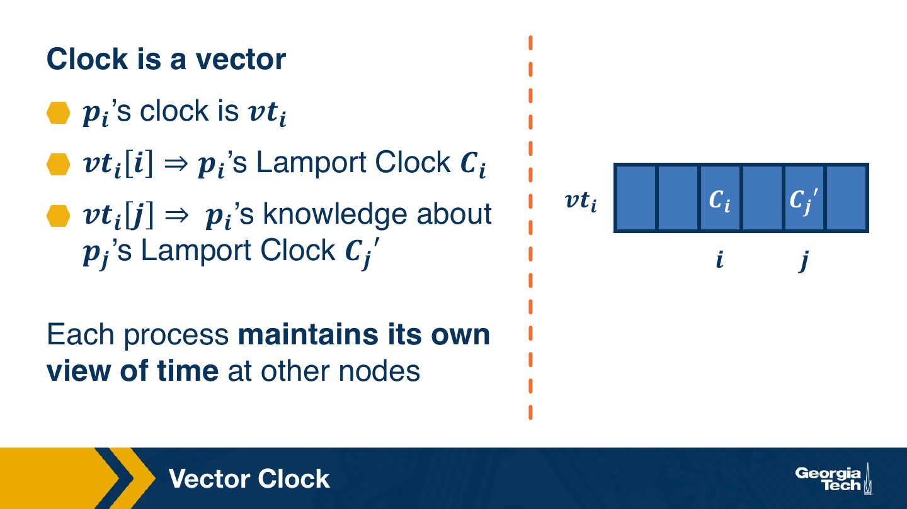

Lamport clocks are simple to use, but it's unfortunate that they do not provide the strong clock consistency and that we have to introduce these random tiebreakers. Can we do better? One example of a more powerful, though also more complex clock, is the vector clock. As the name suggests, the clock is not a single scalar element, but rather a vector of scalars. The dimensionality of the vector is proportional to the number of nodes in the system. So in terms of size overheads, the clock has a size overhead of of n, where n is the number of nodes in the system. This is in contrast to the constant size l of 1 for the scalar clock.

As with scalar time, each node in the system maintains its own view of what is the current time in the system. Each node may have a slightly different view of time. The vector clock at node p i, which is going to be VT of i, that's how we will mark it, in its i element, it will have the Lamport scalar clock for that node. The same vector clock at node p i, v t of i, in all of the other elements of its vector clock, will have its own perception of the current time of the corresponding node. So VTI of j is p i's knowledge about pj's Lamport's clock cj.

### 9.2. Vector Clock Update Rules

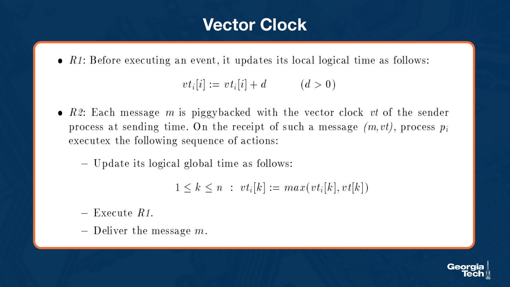

Let's look at the rules that tell each node how to update its vector clock in response to events. Based on the description in the paper, rule 1, R1, says that before executing an event on process pi, pi has to increment the i element of its vector clock VT of i. The value of this element has to be incremented by some value d, where d is greater than zero, and commonly this would be one. With this rule, two events in the same process pi will be time timestamped appropriately.

For events on different processes, again we want to make sure that the time that the clock is able to measure captures the causality among events in these two processes in a correct way, meaning that if one event is the cause for another, like which would be the case if one event is the sending of a message and the other is the receiving of a message, then the two are ordered correctly, and that order is captured in the vector clock timestamps. To achieve this, we have the second rule R2 as follows: when node pi receives a message, that message will be time stamped with the sender's clock, and we'll have some vector timestamp VT.

On receipt, pi will update its clock to make sure that each element in its own vector clock is the maximum of the value for that element in its current clock and the value of that element in the vector clock timestamp that's associated with that message. In that sense, pi will advance its own time by updating the height element of its vector clock, but will also update the remaining elements in the vector clock, and therefore we'll get an updated view of what else is happening in the system. And it will rely essentially on the sender's view in case it was lagging behind. That means that the sender would have had a higher timestamp for the corresponding nodes in its vector clock that was delivered with the message.

Once this update is complete, pi will proceed. So the update happens when the message arrives at the node, but before it's really delivered to pi. Delivering the message to pi will correspond to the receiving event, and this receiving event will update the clock of pi based on rule1. When this happens, the timestamp that pi associates with the message receipt is guaranteed to be larger than pi's previous timestamps, and it is also guaranteed to be larger than the timestamp that was used to send the message. Using these two rules, the timestamps will be updated appropriately, and the two events can be ordered correctly.

### 9.3. An Example of Updating Vector Time

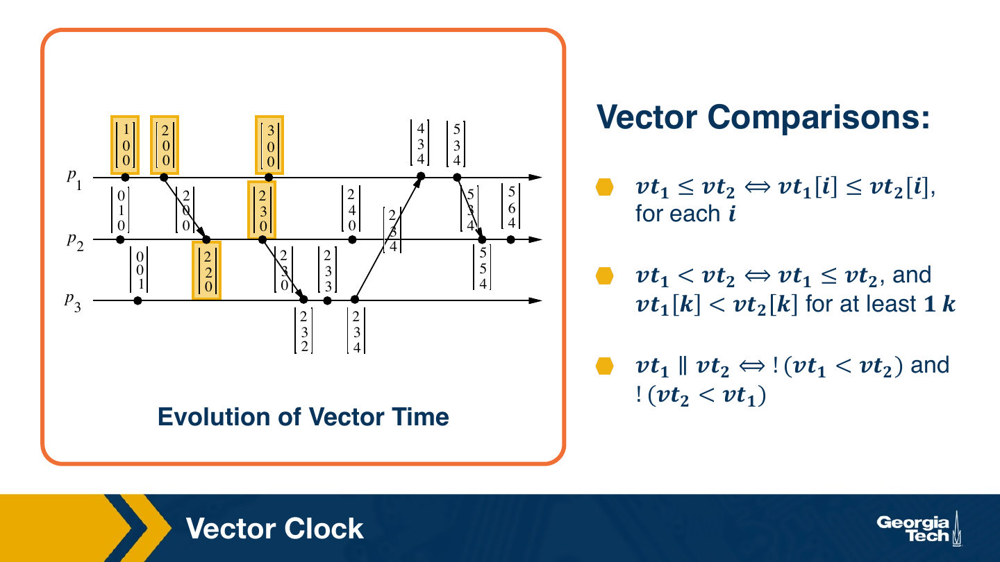

Let's work through an example to see how vector time works. Let's take a look at these three highlighted events. These are their timestamps. They correspond to the first event in P1, timestamp 1 0 0, the second event in P1 with timestamp200. This event sends a message to P2, and this message has a timestamp 220. Based on the first rule, when this event occurred, the vector clock was updated to increase the pi element. And if we compare these two values, we see that the values in this vector clock, all of them are greater than or equal to the values in this vector clock. And in fact there is one element, the first element, that has a value that's strictly greater. So if we compare these two timestamps, this time stamp is larger than the previous timestamp. This event follows the previous event.

If we take a look at these two events of sending and receiving the message, we know that based on the clock rules what would happen with the timestamp that generated by the vector clock on node P2. When P2 receives this message, the message will be timestamped as 2 0 0. Its timestamp before this event was 0 1 0. When it received the message, it will update its values such that the timestamp corresponds to the maximum of each of the individual elements. But then it also has to update the second element of the vector clock, because this is the receipt of the message event. So the time stamp at P2 at this point, the vector time stamp will be 2 2 0. If we compare this timestamp to the previous timestamp, each of the elements in this time stamp is greater than or equal to then the elements in this timestamp, and there is at least one element that's strictly greater.

### 9.4. Comparing Vectors and Detecting Concurrency

Let's formally specify how to compare vectors. Vector time v t of 1 is less than or equal to vector time v t2 if each of its elements is less than or equal to the corresponding element in VT2. Now what we really want is a strictly less than relationship. VT1 is less than VT2 if it is less than or equal to, but there is at least one element in VT1 which is strictly less than the corresponding element in VT2. When we have the scenario when one vector timestamp is strictly less than the other vector timestamp, this will allow us to order events by the happens before relationship.

When we have two vectors where neither one is strictly less than the other, then we call them concurrent. For instance, these two events are concurrent. The value 3 is greater than the value 2 in the second vector clock, and the value 3, which is the second element in P2 here and P2's timestamp here, is greater than the value 0 in the second element in P1's timestamp. And if we look at the execution here, we already discussed this. These two events are indeed concurrent.

### 9.5. Strong Consistency and Concurrency

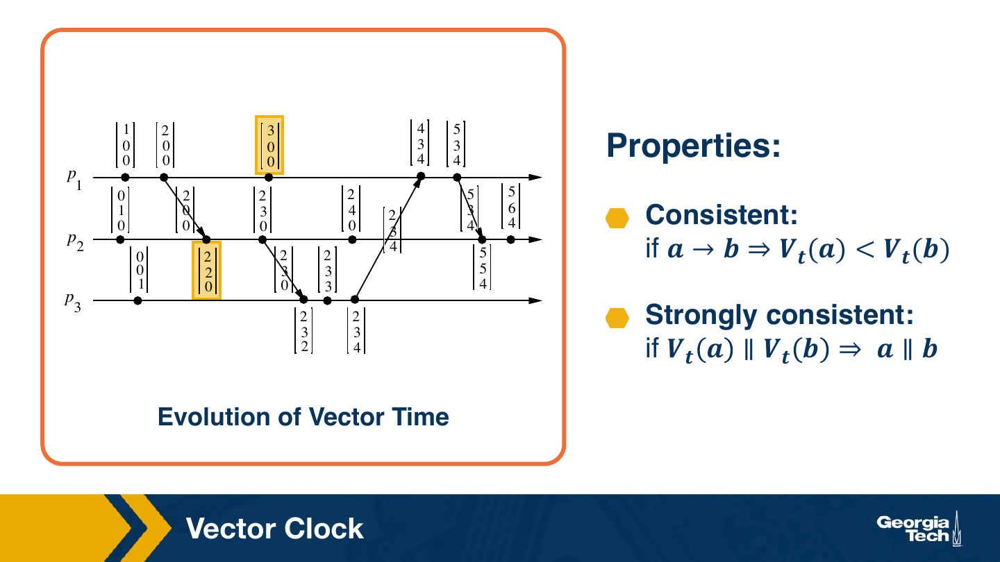

Like the Lamport clock, the vector clock also has the clock consistency property, but it also is a strongly consistent clock. If the clocks of two events are concurrent, meaning neither one is strictly smaller than the other, that guarantees that the events are also concurrent. For instance, let's look at these two elements. They have time stamps 220 and three zero zero. Based on the first element, the value of the clock at P2 is lower. Two is less than three, but based on the second element, the value of the timestamp at P2 is larger. That means that these two clocks, these two events are concurrent. And indeed these two elements also had the same clock values when we showed this example with the Lamport clock. They were both three.

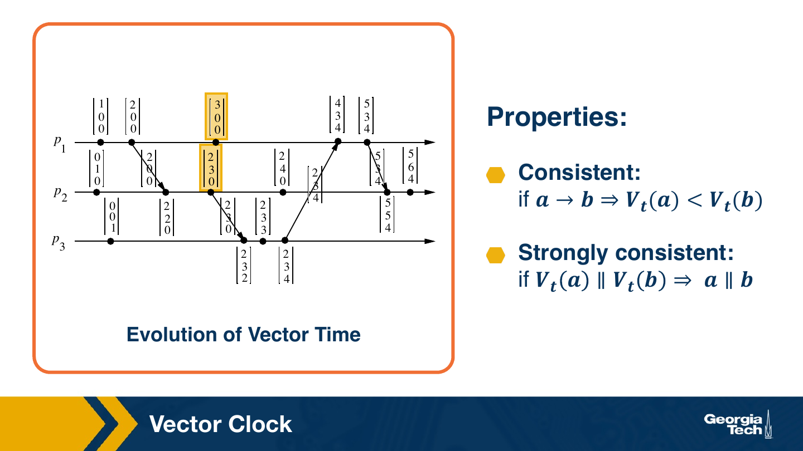

Now let's look at these two events. The event at process one has timestamp three zero zero, and the event at process two has a timestamp two three zero. When we used Lamport clocks, if you remember, these two events had time stamps 3 for the event in P1, and a timestamp 4 for the event in P2. We said that what that would have meant is that the distributed system would have tried to enforce an ordering among these events, even though they really aren't related. If we take a look at the two vector clocks of these two events, we see that neither one is strictly less than the other. So the vector clocks correctly capture that the two events are concurrent, and the system will be allowed to reorder how these events are processed, and therefore it will be able to gain some efficiency without losing any correctness.

### 9.6. Overheads and Compression

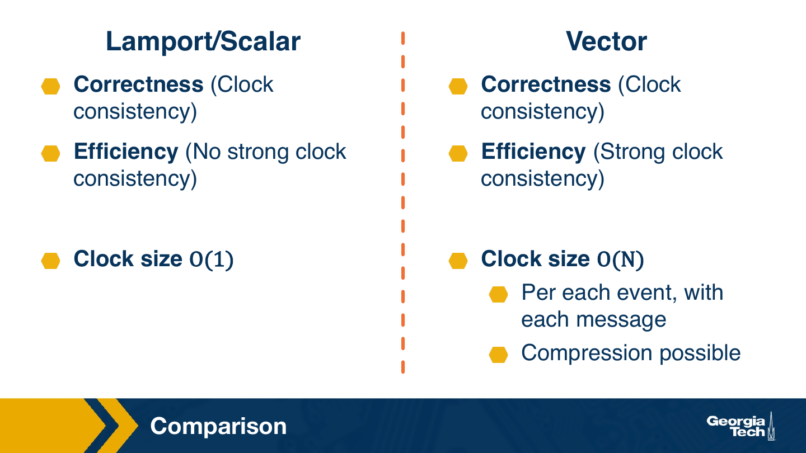

This makes vector clocks quite useful despite the fact that they are more expensive to implement than Lamport clocks. They offer additional opportunities to make the execution of the distributed system more efficient while maintaining the same correctness, but at the cost of having to maintain clocks of a larger size. This larger size of ofn is the clock state that is needed at each node in order to maintain the node's view of time. It is also the size of the timestamps that need to be associated with each event and sent with each message.

It is possible to use some compression techniques to reduce the size. For instance, if many of the clock values are the same, or if they're not changed from the previous time step. The paper describes some of these techniques for those of you who are interested.

## 10. Matrix Clock

### 10.1. What the Matrix Represents

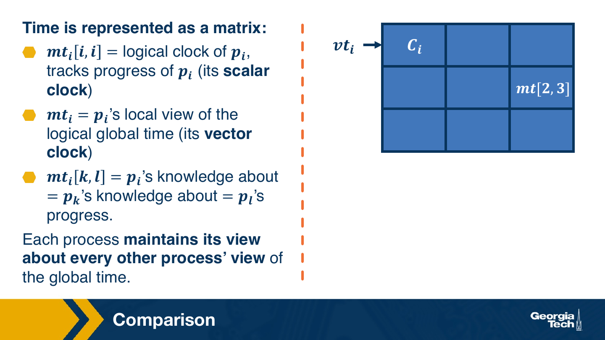

We can extend the ideas captured in the vector clocks and introduce matrix clocks. As the name suggests, the clock is now a matrix of n rows and columns. For a process i, the element in the position i i of its matrix clock corresponds to that processes scalar clock. So for instance, the element in the position 1 1 is the scalar clock of process P1.

For a process pi, the i's row corresponds to its vector clock. So this is pi's view of its own time in the i element, and its own view of what is the other node's time. Of course, we said the other nodes may be further ahead in the review of time, so pi's view may be stale in that sense, but vector clock time is still useful.

All of the other elements, so all of the other rows in the matrix, correspond to pi's view of what the other node's view is of the time in the system. So for instance, the element in position 2 3 corresponds to, in this case, P1's view about P2 current knowledge of the time, and therefore the progress of process 3, P3.

In that sense, if a scalar clock maintained only the view of global time for an individual process, the vector clock maintained for each process its view of its own time and its view of the progress of others. Matrix time now also allows a process to maintain its view about every other process's view of how time is progressing in the system.

### 10.2. Costs and Garbage Collection

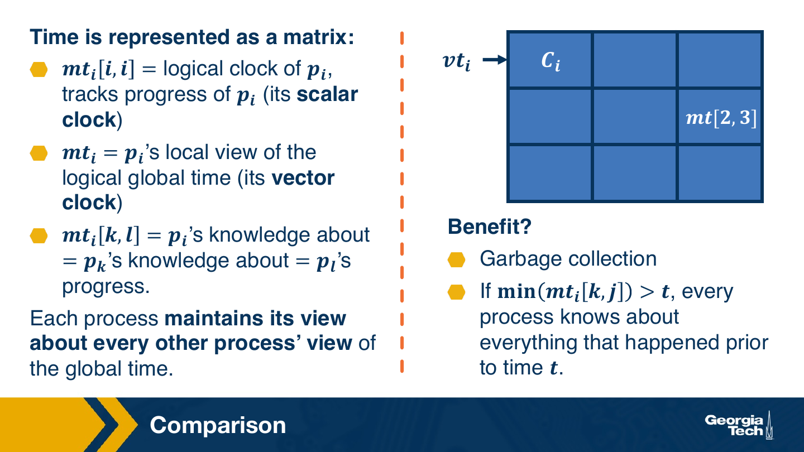

Clearly, maintaining time music matrix clocks will be more complicated than the other two clocks. The rules are more complicated. There are more things that need to get updated as we are updating the time. We now have to maintain a whole matrix, so it takes more bytes to maintain this clock and to send the timestamps around. But matrix clocks also offer some additional benefits over vector clocks that make them quite appealing.

Specifically, because they allow each note to understand how others view the rest of the system, it is possible to use clocks to implement garbage collection. Garbage collection is important. We don't want to keep state at a note just because we think someone somewhere in the system might still be using it. In a distributed system, because some notes may be lagging behind others, it is quite possible even though the state is released and intended to be deleted at one node, for some other node in the system to still need to reach that point of the execution.

With matrix time, just by looking at the timestamp, this now matrix timestamp, we can tell whether it is safe to delete some piece of state. For instance, if we know that that state was supposed to be deleted at timestamp t, then once all the elements in the matrix advance beyond this value t, we know that every process in the system knows everything that has happened prior to time t, and this would include the information, the message about deleting the state.

## 11. Summary

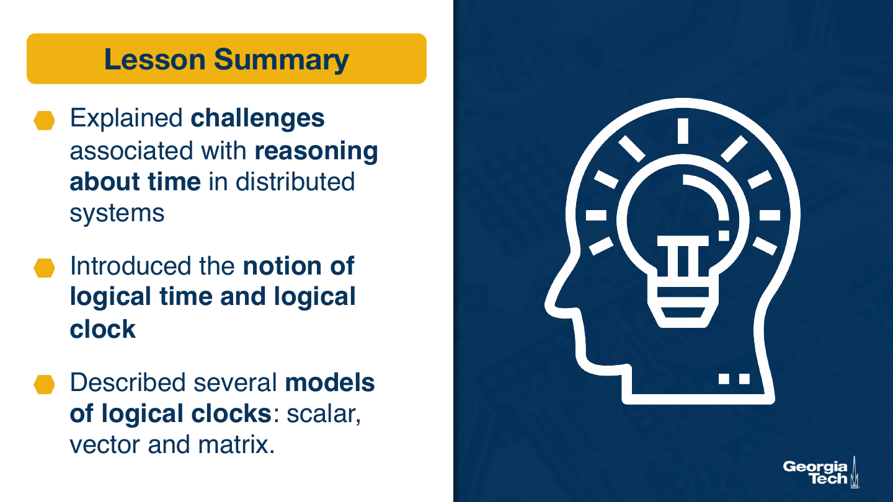

Let's summarize what we learned in this lesson. We explained the major challenges associated with reasoning about time in distributed systems. We introduced the notion of logical time and logical clocks, and we described several models of logical clocks: scalar, vector, and matrix.
