# Lesson 4: State in Distributed Systems

Source: [Lesson 4 — Video](https://www.youtube.com/watch?v=YSmSvQKr6rI)

## 1. Introduction

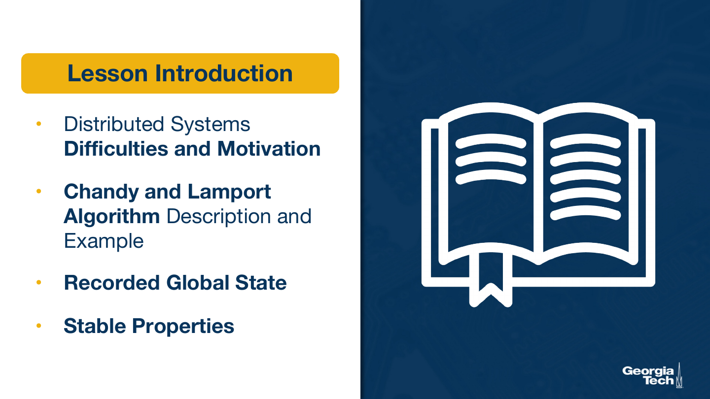

In this lesson, we will discuss some of the challenges related to maintaining state in distributed systems. We will specifically be concerned with the challenges around capturing a correct snapshot of the global state of the system so we can use it to understand what's going on in the system, what are its properties. We will also talk about the Chandy–Lamport algorithm for capturing snapshots of global state in distributed systems.

## 2. Challenges about State in Distributed Systems

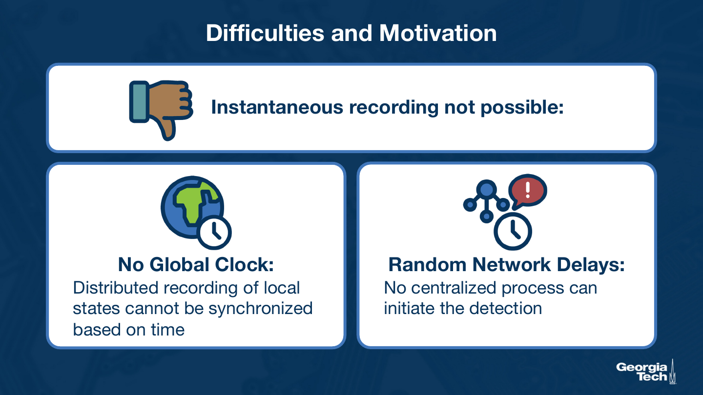

Let's talk about the challenges surrounding state in distributed systems. The reason that determining the global state is hard is first and foremost, because we don't have globally synchronized clocks. Without globally synchronized clocks, we cannot program every single note and tell it and every single channel to capture their state at the exact same moment in time. We also cannot simply assume that different nodes can instantaneously tell each other to capture their state. We have random network delays, so it is not possible to guarantee that all nodes will receive all such messages at the exact same time.

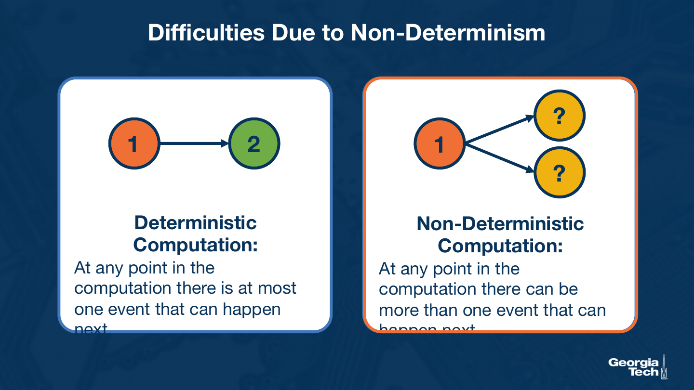

The other thing that makes this very difficult is that as in any parallel system we have multiple processes executing concurrently, so at any point of time, there are multiple events that can take place. This makes the overall distributed system a non-deterministic system, and reasoning about order, consistency, all of those important properties is really hard in a non-deterministic system even when talking about a single multi-threaded system. And here everything is made even harder because of the lack of a global clock and the random network delays.

## 3. Global State, Snapshots, and Other Terminology

Before we dive into the discussion of the algorithm, we will introduce a number of definitions and concepts.

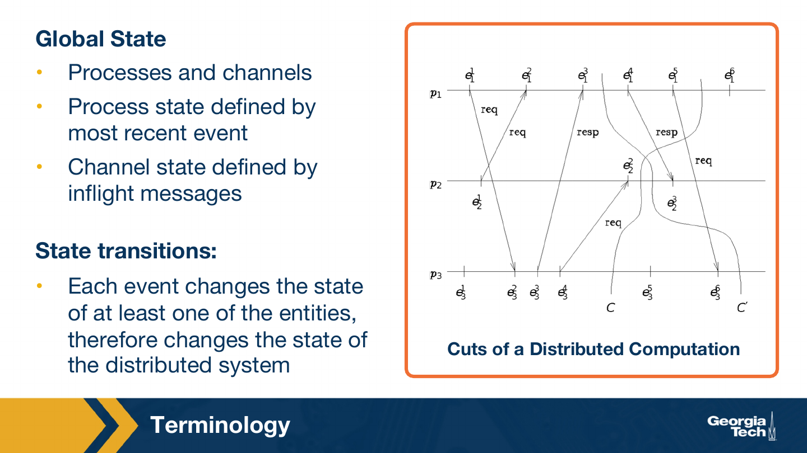

Recall, we said a distributed system is represented by the nodes and the communication channels that connect them. Nodes interact by sending messages to each other, and sending and receiving a message corresponds to events in the system. In this illustration, the events are marked with e and they're indexed by the process at which the event occurs and the sequence number of that event in the process. A process may have other events that don't involve messages, but perhaps update some internal variables, some internal state. In this event, e35 is an example of this.

At the very least, to execute a program it means that each note will go through a series of events. In that sense, to know what is going on with the execution of the program, what is the state of the distributed system, all we would need to know is what are the internal events that have occurred at each node, and what are the messages that have been received and sent by all of the nodes, and of course, how these are ordered and interleaved. This tells us both how far has a node progressed in the computation, but also if there are any messages that are still implied. For instance, if node p2 has sent the message m21 to node p1 but that message is not among the messages would have been received at p1, then that will mean that that message is still in flight. The fact that a message is still in flight, that tells us something about the state of the communication channel between the nodes that are connected via that channel. So if we want to know something about the execution of the system, it is important to know about these messages that are still in flight, and so we need to know about the state of the channels.

Therefore, the state of the distributed system is a collection of the states of each of its nodes or processes and the state of the each of the channels that connect. Whenever an event occurs, that changes the state of at least one of the system components. In a very simple case where the only events are those corresponding to sending and receiving a message, each event affects one process and one channel. For instance, if the event corresponds to receiving a message, then there is one less event in flight in the channel and one more message that was received by the processor one more event that occurred at that process.

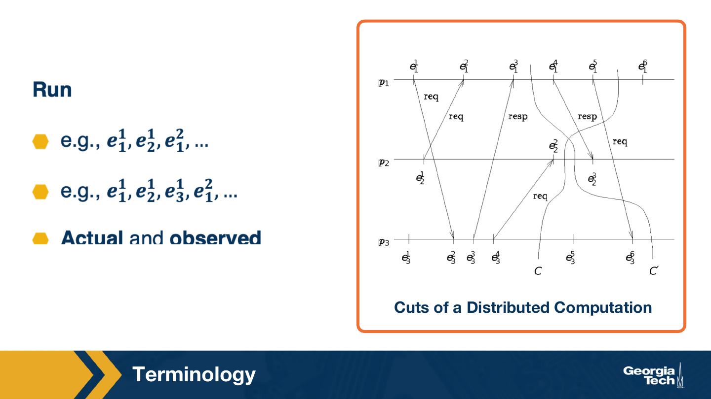

If defined in this way, the state then refers to a point in time in the execution, and it is also useful to know something about how the execution proceeds, and we can think of it as a sequence of state transitions. Since the state transitions correspond to an event occurring, we can keep track of the state transitions just by keeping track of the sequence of events that trigger them. For instance, if the execution was such that first p1 sent a message to p3, so this is event e11, this is the message, and then process p2 sent a message to p1, that's event e21, and then p1 received the message from p2, so this is event e12, then the sequence of events e11 e21 e12, that corresponds to the sequence of events that took place of the system. This is called a run.

The sequence may correspond to a schedule of events that indeed happened in the system, and in this case, this is an actual run. But it is possible that when observing the system, we don't notice that another event e3 1 has actually happened as well just after the message was sent by process 2. We're simply just not aware of it. In that case, the actual run of the system is the following: e11 e21 e31 e12.

We talked about time already, and how hard it is to tell exactly what is the order of events in a distributed system, so you know already that we cannot guarantee that we will always know the exact ordering of the events and the exact actual run. Based on what we talked so far in the previous lessons, you already have an intuition that being able to think about the observed run, this is what corresponds to some ordering of the event, not necessarily the real one, a legitimately possible ordering of the event, that this is also useful.

### 3.1. Cuts and Consistent Snapshots

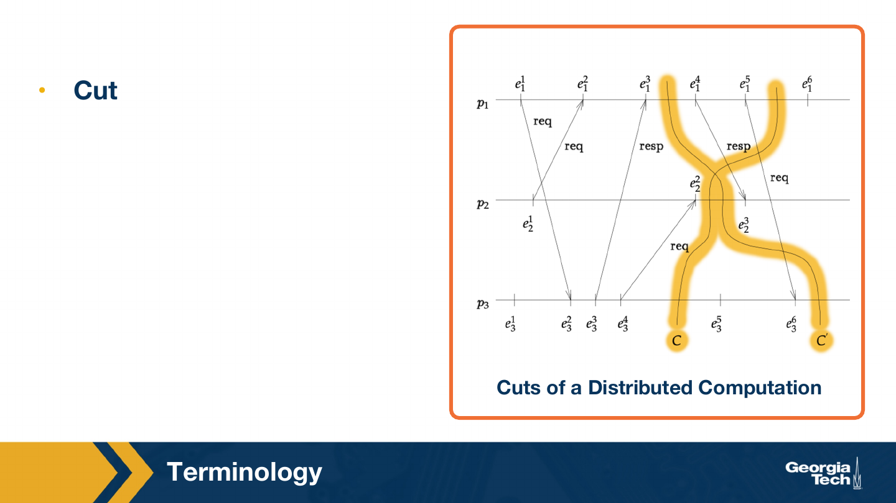

To get a sense of the state of the distributed system, we can simply look at the states of all of its components, of all of its processes and all of its channels, and that's like drawing some line that cuts in some manner these execution timelines. Let's look at this line or a curve, I should say, that's marked with c.

First, the reason that this is not a line but a curve goes back to the time problem we can't guarantee that we'll be able to get a precise cut at the exactly same time at all nodes in the system. So here, by the time we get the information for all of the processes and all of the states, we have a cut which says that p3 has sent this message m4, and that's the event e34, and then we have information that this message has been received by process 2, this is event e22, and then if we take a look over here, we have information that p1 has sent the message, this message to p2, this is event e14, and also that it has sent this message here via the event e15 to process three. Now, neither one of these two messages has been delivered, and if we take a look at the cut, sure, that correctly corresponds to states at p2 and at p3 that precedes the actual delivery of the events. So clearly, these messages are still in flight. They're still in the corresponding message channels.

Now, let's take a look at these other cuts c prime. This cut c prime corresponds to a state that says that process 3 has received this message over here at e36. We know that this message came on a channel from process p1. Now, if we take the cut forward and if we take a look at the state of p1 that's represented in that con, we see that this state precedes these other events. It precedes the event e15 which is where the message was actually sent. So we have a cut that tells us that p3 received a message from p1, but there is no record on p1 of that kind of message ever being sent. This cut doesn't really make sense.

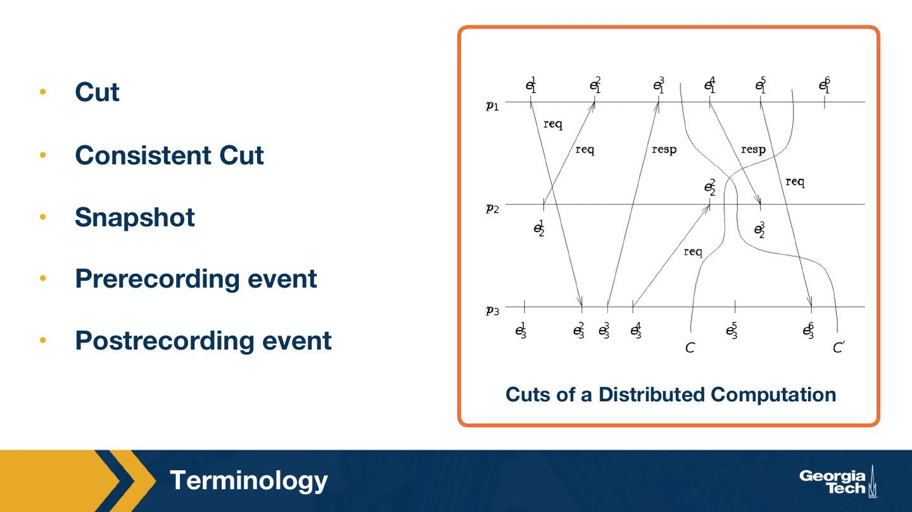

Therefore, what we really care careful is to capture not just any random cut in the system, but rather a consistent cut. The consistent cut of an execution corresponds to a snapshot, and just like with what we saw with the runs, the snapshot may not correspond to a situation that the system has really been. Perhaps, when looking from the perspective of an external observer with absolute sense of global time, it is never the case that for instance, node p2 here is in a state that it has not yet received this message sent from p1, whereas p1 has already sent the message even for p3. This was the case that the information that we captured with this cut c that we said was consistent. Although this cut may not correspond to a real situation that sort of observer with absolute knowledge of global fruit is aware of, as long as the snapshot corresponds to some possible point in the execution which could have been represented via a consistent ordering of the events, then that's a consistent cut, and as a snapshot of the execution, it is useful.

### 3.2. Pre-Recording and Post-Recording Events

Now, before we move into the algorithm we will introduce two more terms: pre-recording and post-recording events.

When we capture the state of a process when trying to get to a consistent cut, or rather to determine a snapshot of the distributed system, then all events which occurred prior to the point of time where the snapshot is taken at a process are referred to as pre-recording events. And all of the events that follow the point in time when the state was recorded, the point in the execution when the state was recorded, then these subsequent events are called post-recording events.

## 4. System Model

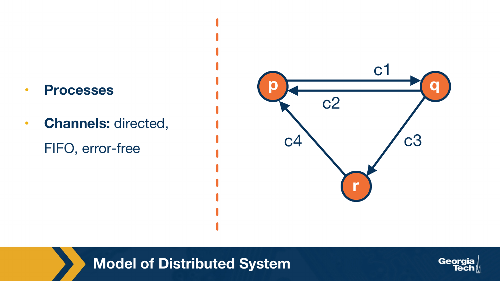

You will notice that in many of the lessons, before presenting an algorithm, we will describe the system model. We already gave some examples of models in distributed systems and talked about why this is useful, why having models is useful. So it's important to understand any assumptions that are made in the model based on which some theory is built.

For the remainder of this lesson, we will work with a model of a system that looks like this. There are processes that exchange messages via channels. The channels are directed, meaning that there is a channel from p to q and then a separate channel from q to p, if such messages are exist or allowed in the system in this figure, for instance, there is no channel from r to q. This model will also assume that all the channels are FIFO, meaning messages are delivered to the destination in the same order in which they're sent, and that all the channels are error-free, meaning that there won't be any corruption on the messages.

These last assumptions, they don't necessarily apply to arbitrary networks, but if we take the fact that the TCP protocol as a transport, it's pretty prevalent and it operates such that it makes guarantees to its endpoints about ordered and reliable delivery, which is precisely that the messages will be delivered in order, exactly as they were sent, and that the communication will be error free, then this gives us this assumption about the channel properties. Basically, if the network links cannot guarantee the FIFO and error-free communication, then we can just use TCP socket connections among nodes, and we will achieve a system that matches the assumptions that are specified in this simple model.

## 5. Finding a Consistent Cut: Algorithm in Action

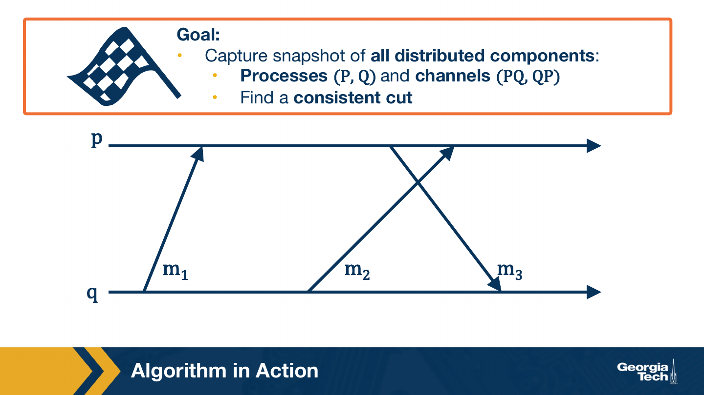

Now let's see what it takes to find the consistent cut. We'll basically see the algorithm in action first, based on the definitions we introduced and the simple model.

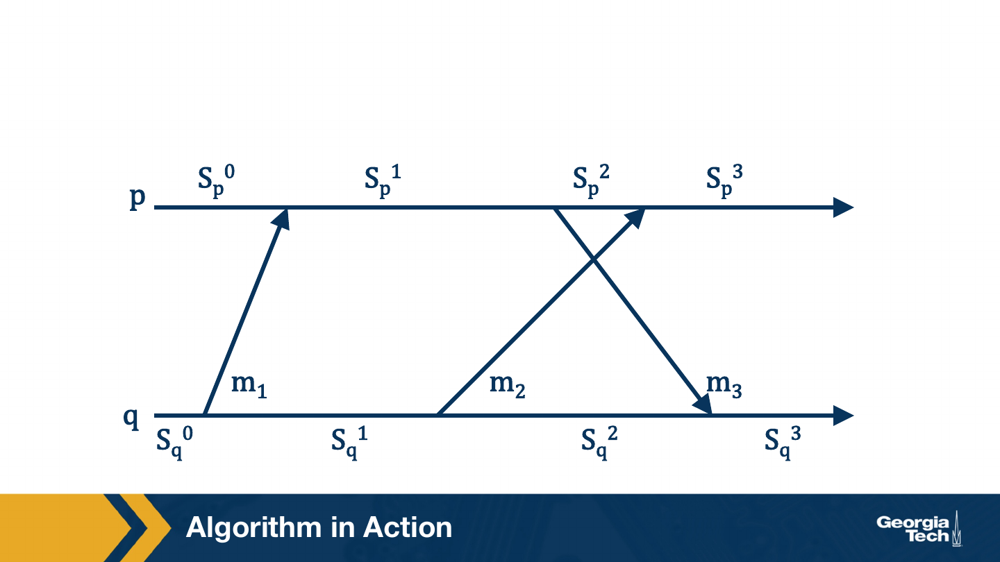

Let's first use this simple example with just two processes exchanging the sequence of messages to illustrate how this algorithm that we're yet to introduce, how it will behave, and then we will more formally define it. Our goal with this example is to see what is the behavior of the algorithm that we need, so that we can get a snapshot of the state of each of the components of the system, of all of the processes, of all of the channels, and to make sure that this snapshot will correspond to a consistent cut in the system let's use this notation to mark the state transitions of the two processes. They both start in sp0 sq0, some initial states, and upon each event, the transition to the next state. In this simple example, there are no internal events. Only the message sent and message receive operations are events that cause a state transition at any of the nodes in the system.

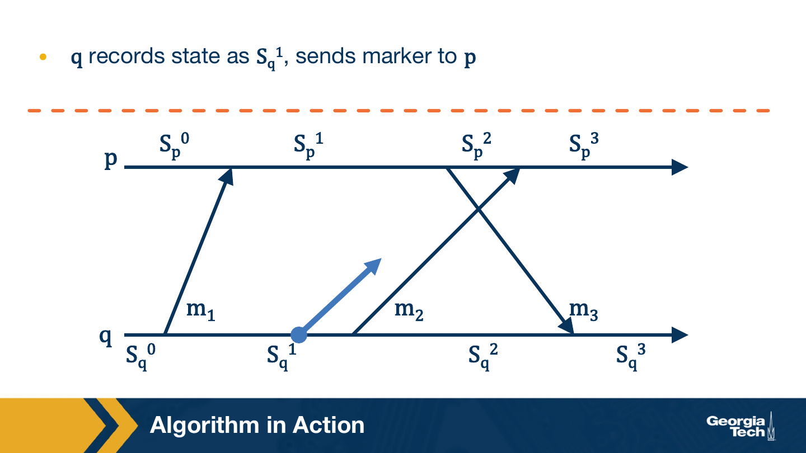

Let's start with some point. Let's assume we are observing the system and we want to capture its snapshot, and the first thing we observe is some state q that corresponds to this event sq1. Let's mark that point.

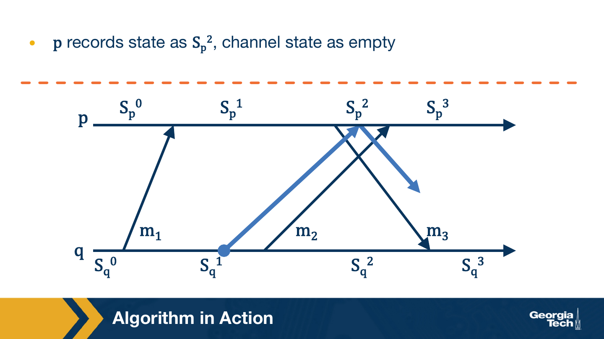

So we observe this state, we record it, and then we send a special marker message to the other processes in the system in this case, to process p. Now that the marker arrives at p, let's say it arrives at p when p is in state sp2. We know that in this state, p has received the message that was sent on queue, right? This was the marker. So we will record that the state of the channel from q to p is empty. We also know that p has sent a message m3 to q, so we need to find out what has happened to that message. What is the state of the channel from p to q? To do that, we'll then send the marker from p to q on that channel. When the marker reaches q, we realize that we already captured its state. This is where we started after all, right? We captured the state sq1. In that particular point of time when we captured the state in sq1, process q had already sent m1 and there was nothing that was received. So this is the information that we have about q.

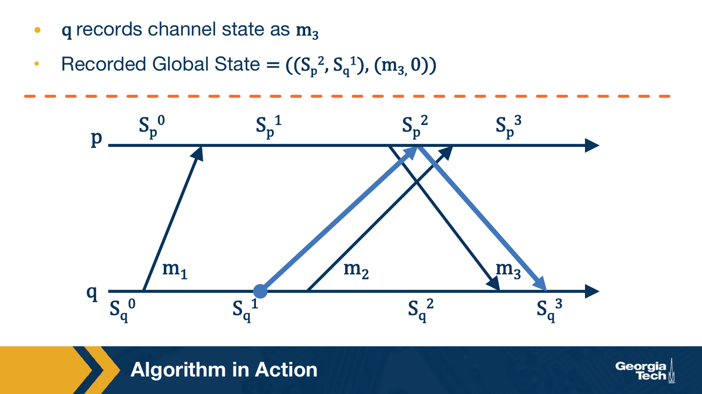

Therefore, given the state that we have of node q, the message m3 which we know that was sent by p, has not yet been received and it's still somewhere in the channel from p to q. Now, if we take a look at these events here, we see that m3 arrived at process q before the marker message. However, in terms of the snapshot information that we're capturing, we've already captured this information about process q state sq1, and therefore the state of the channel from p to q that corresponds to this state of process q is such that the message m3 is still somewhere in transit.

Now, we have a snapshot, a recorded global state of the system that corresponds to the state of the two processes sq1 and sp2 and the state of the two channels among the processes. The channel from p to q is such that the message m3 is still in transit, and the channel from q to p is such that it is empty. There are no messages in flight. Clearly, with respect to this state, there is no information that this message m2 was ever set.

## 6. Snapshot Algorithm

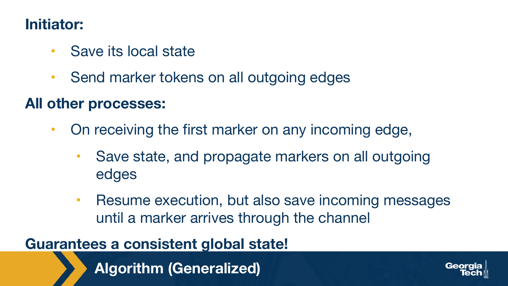

Let's now generalize the step that we described in this brief illustration. Here are the steps of the algorithm.

There is one node that's the initiator node. This is the node that will trigger the algorithm for capturing the state of the distributed system. It will first save its local state, and then it will send a marker token on all of the outgoing channels, and all of the outgoing edges.

All of the other nodes in the system will participate in this algorithm, and they'll follow the following rules: on receiving the first marker on any incoming edge, they will save their state. They will mark the state of the incoming channel sam team, and then they will propagate a marker message on all outgoing edges. And then they will just resume execution, but they will also save incoming messages until a mark, on any of the channels, until they see a marker arriving through that particular channel.

When a marker does arrive on one of the incoming channels, then the process will mark the state of that channel such that all of these messages that were received since the process captured its state originally, all of these messages will be marked as messages that were in flight.

This algorithm, with the state that's captured by the state of the processes at the particular moments when either when they initiated the algorithm or when they receive the marker, and the state of the channels captured as either empty for the channels on which a marker first arrived, or as having all of these messages in flight, the messages which they received from when they send a marker on any of the nodes until they receive the messages on any of the incoming channels, this state of the system will correspond to a consistent global state of the computation.

### 6.1. Assumptions and Formal Rules

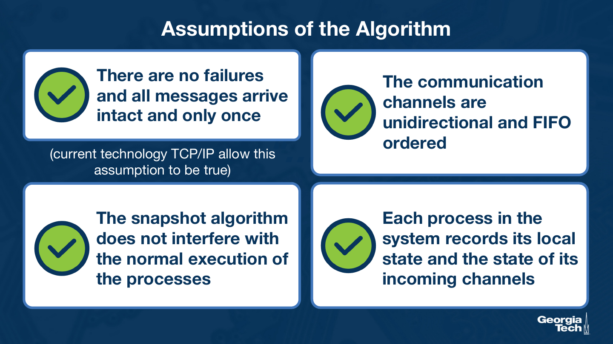

You're probably already noticing that for this algorithm to work, there are several important assumptions.

There are no failures, and all messages arrive intact and only once. And we said that current technology such as TCP, will allow this assumption to be true. The communication channels are unidirectional and FIFO ordered, and this really just means that we need to separately consider each direction of the point-to-point message exchanges among the processes. And again, TCP can give us the FIFO property.

Also, the snapshot algorithm, this algorithm for capturing global state, it does not interfere with the normal execution of the processes, meaning that the markers they don't stall or reorder the processing of the other messages. This is also, in principle, practically doable. You can just have a separate task or a separate thread that uses a separate socket and port number for the marker messages.

And also, it means that each process in the system records its local state and the state of all of its incoming channels. So at the very least, we have to make sure, or we have to make it, we're making an assumption here, that there are enough resources to be able to do this.

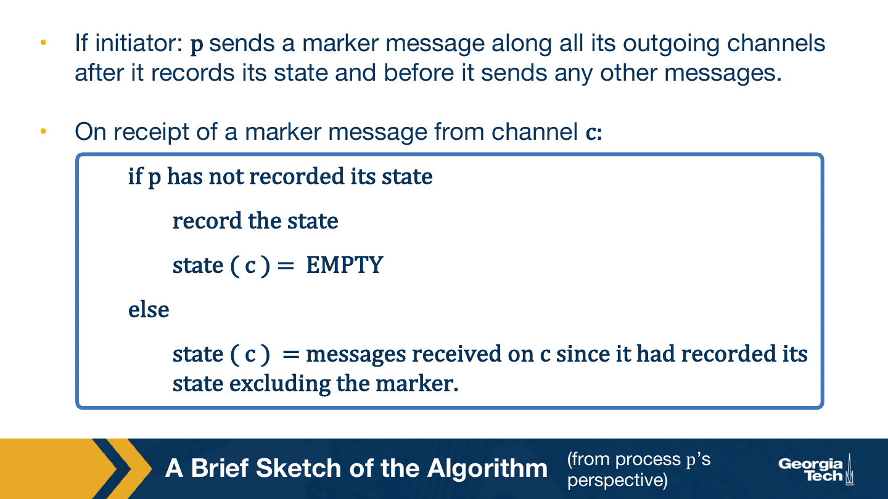

With these assumptions, the algorithm that each node executes can be formally stated as follows: if a node is initiator, and p sends a marker message along all of its outgoing channels after it records its state and before it sends any other messages. On receipt of a marker message from a channel c, if p has not recorded its state, then p will record its state and mark the state of the channel c as empty. Otherwise, the state of the channel c is going to be equivalent to all the messages that were received on c since the note p had recorded its state excluding the marker message.

## 7. Global State

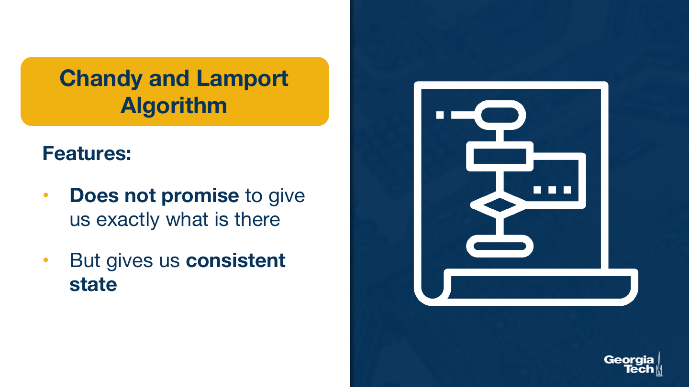

The algorithm we described is the chandelier inputs algorithm for finding global snapshot in a distributed system the state captured with this algorithm doesn't necessarily tell us where the system exactly is in its execution at this specific point of time. You saw in the earlier example that it had the state for q that preceded the arrival of m3, and that's why we had to account that m3 is the message that's still in flight in the channel. But the algorithm guarantees that the snapshot of the global state that will be created by following the rules of the algorithm is a consistent state in the distributed system.

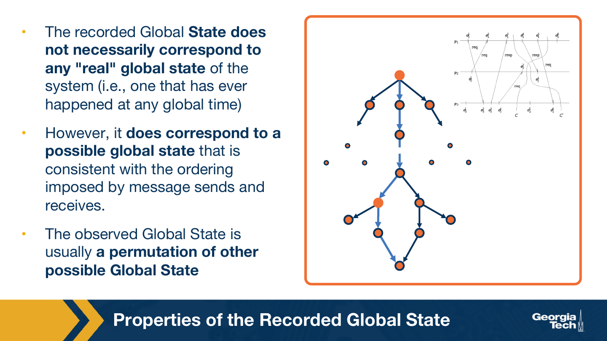

In other words, the recorded global state does not necessarily correspond to any real global state of the system, not an actual state in which the system currently is, or in which the system even has been in some prior time during its execution.

If we try to visualize all the possible states of the system, we can create a lattice that looks sort of like this illustration. For the three process system that we used in the initial visualization, the system would definitely start in the initial state before any of the nodes sent any messages, and then the next possible state could be any one of the states where either one of the three processes sends the very first message. By following all the possible transitions in the system, we can identify all the possible states through which the system could have transitioned, and the state that's discovered by the chandelier port algorithm will correspond to one of these possible global states. In other words, it will be consistent with the ordering imposed by the message sends and receives that would have led us to that possible global state.

This observed global state that we can observe by following this algorithm may not correspond to an actual state of the system, but it is a permutation of that state or other possible global state.

### 7.1. Possible Runs and Causal Relationships

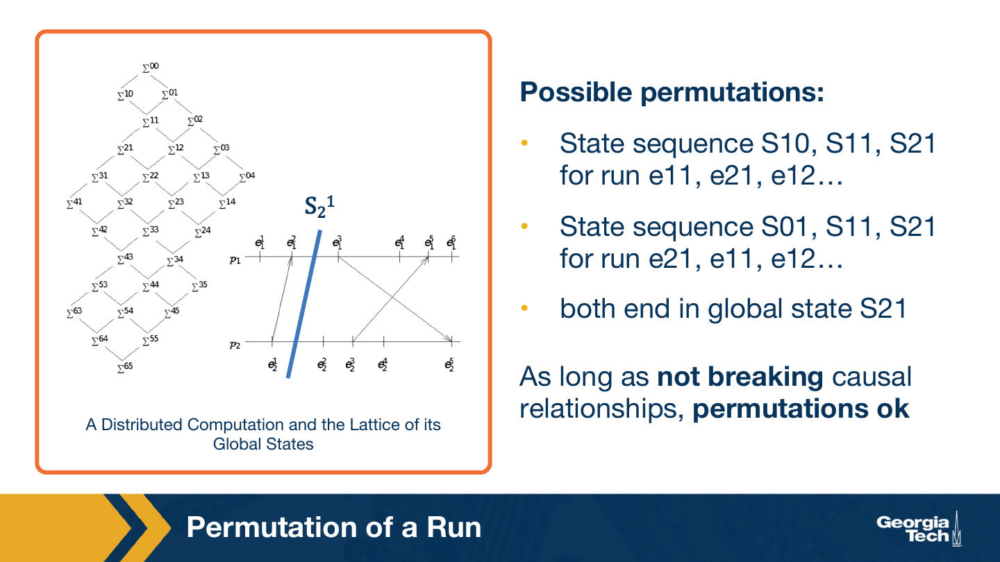

So here is a representation from the paper showing the possible global states for a much simpler two process execution. In this figure, each of the states is marked as sigma ij, where the first index corresponds to the state index of p1, of the first process, and the second index to the state of p2, the second process.

While executing the algorithm, it is possible to capture a sequence of states: first s10 s11 s21, and these will correspond to a run that consists of the events e11 e21 e12. Or we could capture some other sequence of events s01 s11 s21. The initial event that we captured was slightly different, and this state would correspond to the run that has e21, then e11 happened, and then e12. Both sequences ultimately end in the state s21, the state in which p2 has sent the event e21, has sent first message from p2 to p1 and in which process p1 has executed the first internal event e11, and it has executed the second event which is that of receiving the message that p2 sent to it.

So as long as these two permutations, as long as they don't break the causal relationships among the events, meaning that they don't correspond to a situation where one process observes that a message was received, but when we look at another process, we don't see that that message was ever sent, then those permutations are okay. And that's the case with this state that's captured s21.

## 8. Properties of a Global State

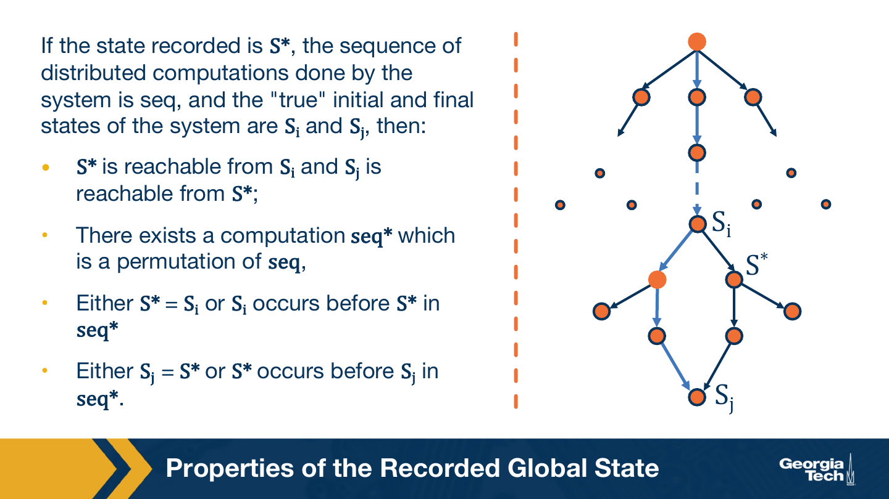

Let's see the formal definition of what a global state is. Let's say the state that is recorded is s-term, and the sequence of distributed computations done by the system is denoted as a sequence. And let's say that the true initial and final states of the system are some states s i and sj.

Then the recorded state of the system s star is a state that is reachable from s i. S i is the initial state, so the state s star is reachable from s i means that it is one of the possible states that we can reach once we follow the execution from s i forward. If we know that the true final state of the system is sj, then by knowing s star, we know that if we continue capturing snapshots of the system the sequence of snapshots will ultimately reach to and capture the true final state of the system as j.

This tells us that there is some computation sequence sequence star, which is a permutation of the actual sequence of events which took place in the system and that we said was sequence. And in that permutation sequence star, we know two things.

We know that either the recorded state s star is the actual true initial state of the system as I'm, or that the true initial state of the system s i is a real state that occurred before the state that we recorded as star. And also, we know that either the true final state of the system sj is the actual state that we recorded as star, or that s star is some state that occurs before as j with respect to this schedule sequence star.

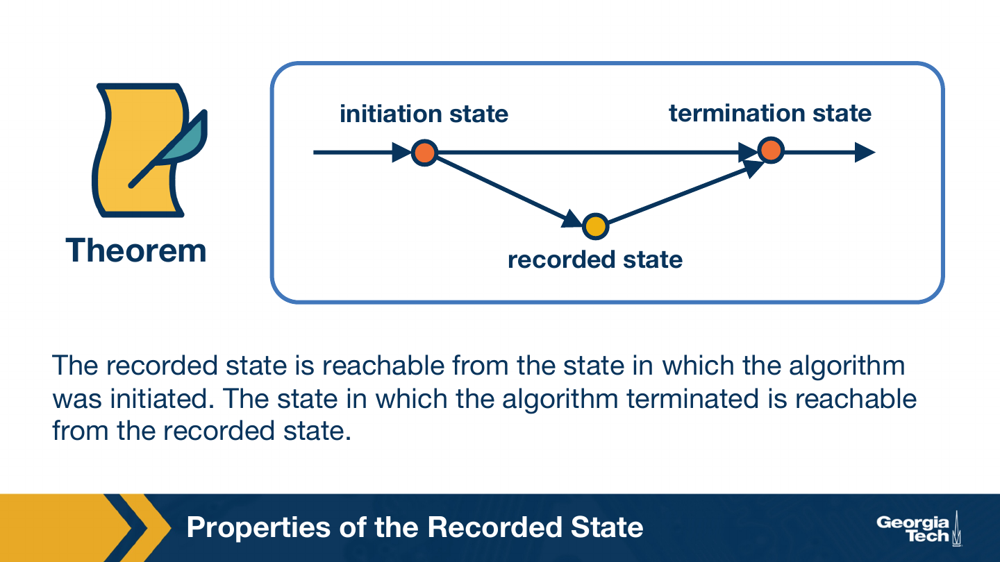

The paper goes on to prove a theorem that by following the Chandy–Lamport algorithm, we're guaranteed that foreign execution of a distributed system which takes the system from an initial state to a termination state, the recorded state is such that it is reachable from the state in which the algorithm was initiated and that the state in which the algorithm terminated for real is a state which is reachable from the recorded state. The recorded state is not necessarily, let's repeat, it's not necessarily an actual state that appeared on the real execution from the initiation state, the state where the algorithm was initiated, and the determination states, the real state in which the system was when the algorithm terminated.

## 9. Benefits of Global State: Evaluate Stable Properties

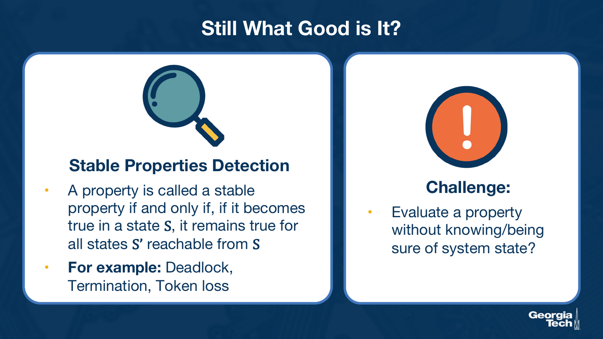

Knowing a possible state of the system such as this s star, is still very useful to know, even if the system wasn't ever in that state. It allows us to evaluate what are known as stable properties of the system. A stable property is a property of the system which, once it becomes true, it remains true for the remainder of the execution of the system.

For instance, if we observe a state of the system s and analyze it and observe that the system is in a deadlock, deadlock is an example of a stable property, although not a desirable one, but a stable one, because once the system is deadlocked, it will remain in a deadlock state in all subsequent states unless you actually do something else.

On a more positive note, if we capture a state using this global snapshot algorithm, and if we observe based on the state that some phase of the computation has completed, then we know that in the true final state of the system that phase of the computation has also completed. And so if there is anything that maybe we need to trigger some garbage collection, or or some actions that are a consequence of that phase being terminated, we can now take those actions.

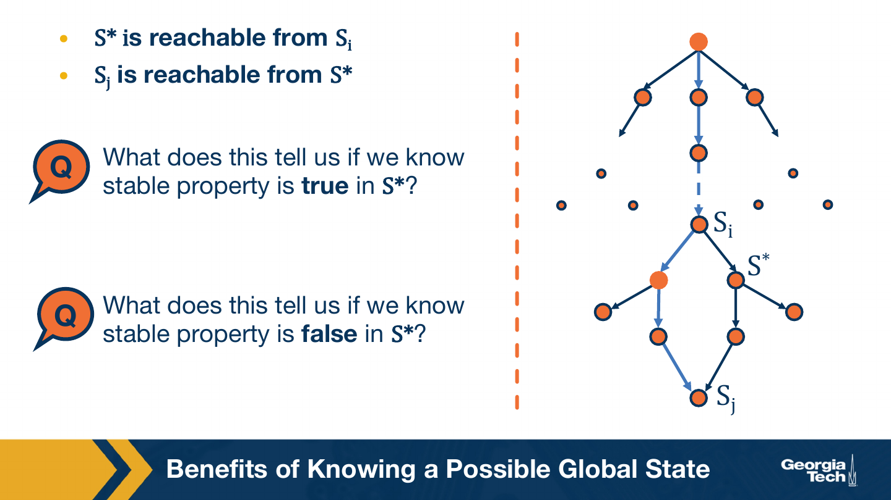

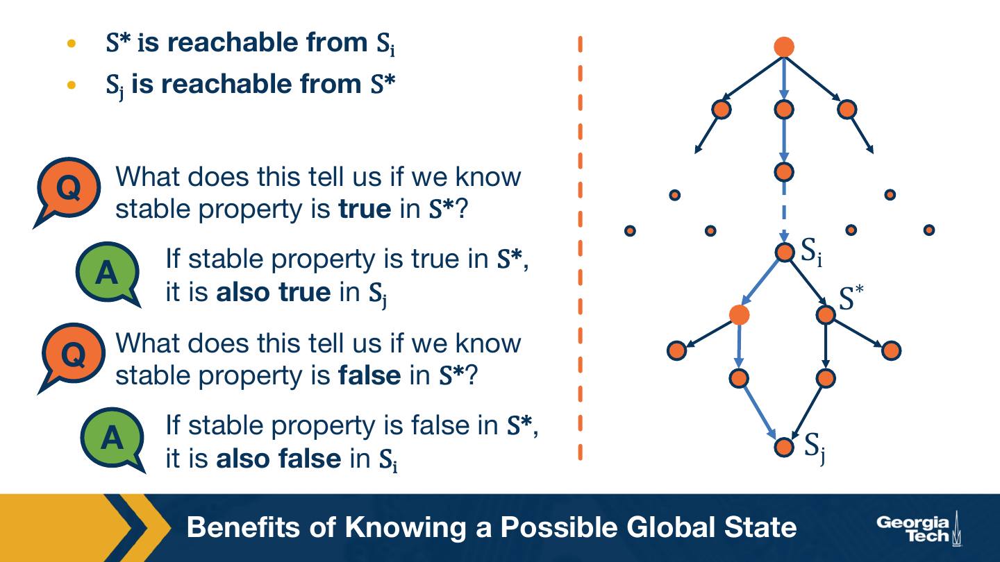

So let's talk about this some more. We know that s star is reachable from the state of the system in which the algorithm was initiated, and then we also know that the final state of the system, the state in which the system indeed is when the algorithm completes, is a state as j that is reachable from this capture state as star. So what does this tell us if we know that a stable property is true in the capture state s star? Or what does it tell us if we know that stable property is false in the capture state s star? If a stable property is true in the state as star, then we know that it is also true in sj, the state in which the system indeed currently is. That's quite useful.

If a stable property is not true in the observed state, then we really can't say anything about whether it eventually became true between that observed state and the state in which the system currently is. We only know that if it is not true in the state as star, that it could not have been true in the initial state. We said a stable property is a property which, once it becomes true, it remains true for all of the state transitions. So if it's not true in s star, it could not have been true in some previous state as i. This is the only thing that we can say.

## 10. Definite vs. Possible State

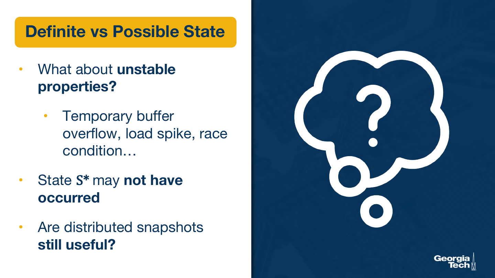

Now there are also unstable properties that are important. An unstable property is a property for which there is no guarantee that once it becomes true, it remains true for forever. For instance, buffer overflow is a temporary property. A race condition is a temporary property.

What can we do about these unstable properties? We're capturing the state of the system s star. We know that this is a state that may not have occurred for real, and then we're looking at some property, and that property we know is transient, may have existed for a period of time and then disappeared. Knowing whether or not that state, that property, is true in this state as star, this hypothetical, this possible state as star, is that actually useful? And in that sense, are distributed snapshots useful? The answer to that is still yes, because if we observe that an unstable property is true in some possible state as storm, that tells us that this property can possibly be true under some condition in the system.

Knowing that there is a possibility for the system to be in a situation where there is a buffer overflow, or a race condition, or a spike in loan, is still very useful information. It can tell us that we need to change something about the system in order to prevent such situations from possibly happening, or at least to make sure that we can deal with them in some way.

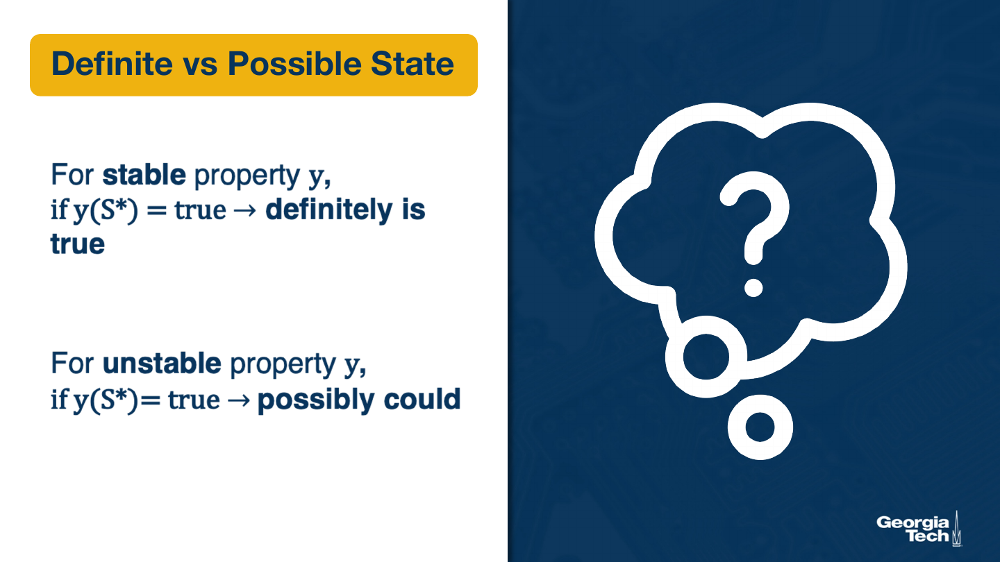

So if we determine that the system is in a state with a stable property, we know that that's definitely going to be the state of the system at the end eventually. If we determine that the system is in a state where an unstable property is true, then we know that there is a possibility for that unstable property to be true at the end of the execution.

## 11. Summary

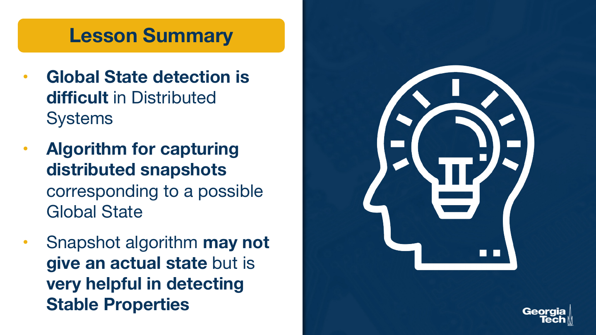

To recap, in this lesson, we discussed several things. We discussed that global state detection is difficult in distributed systems. We presented the chandelier import algorithm for capturing distributed snapshots that correspond to a possible global state, and then we explained that although the snapshot algorithm, that may not give us an actual state, it is still very helpful in detecting stable properties and in reasoning about some other possible properties of the system.
