# Lesson 5: Consensus in Distributed Systems

Source: [Lesson 5 — Video](https://www.youtube.com/watch?v=oN1O1wuzanE)

## 1. Introduction

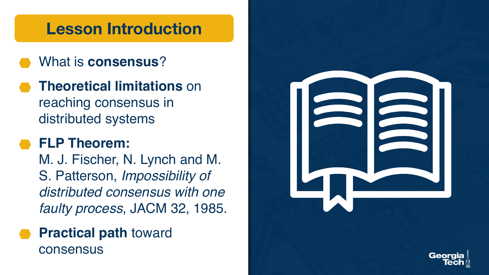

In this lesson, we will talk about consensus, or about the ability of distributed nodes to reach an agreement. Consensus is an important mechanism which is critical for making forward progress in distributed systems. We will present a theoretical discussion of some of the limitations of guaranteeing that a consensus can be reached, in other words, that progress can be made.

For this, we will discuss the seminal work of Fisher Lynch and Patterson, also known as the FLP theorem. For this, we will talk about the paper impossibility of distributed consensus with one faulty processor. And as the title of their paper suggests, this theorem will prove that under most general assumption it is impossible to guarantee that consensus can be reached in a distributed systems in the event that there is even a single failure.

Given that there are distributed systems everywhere, this impossibility clearly has not prevented us from building real practical distributed systems. So we will then provide some hints toward how a practical solution can still be achieved despite this theorem. In the future lessons, we will go into more detail into concrete examples of such practical solutions.

## 2. What is Consensus?

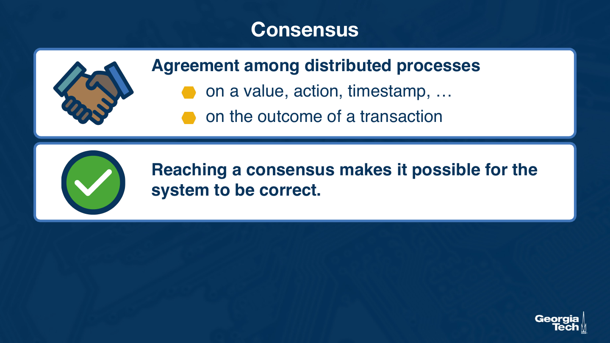

Let's first define what do we mean by consensus. A consensus is the ability of multiple distributed processes to reach an agreement on something. It can be an agreement on the value of a piece of shared state. It can be an agreement of taking a particular action. It can be an agreement on the value of the current timestamp to be associated with a particular action, or an agreement or reaching a particular point in the execution.

For instance, one of the most common places where this type of agreement is needed is to agree upon the outcome of a transaction. Imagine performing a bank transaction where you're moving funds from one account to another. And if the information of the first account is stored on one server and of the second account on another server, we have to make sure that both agree whether the transaction will be successful or not in order to correctly debit or credit the account.

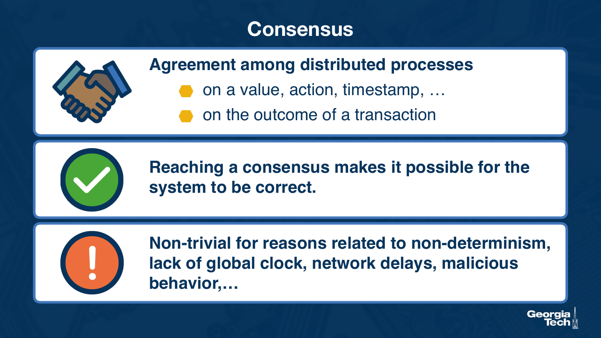

In other words, the ability to reach a consensus is a key ingredient in making sure that a distributed system is going to behave correctly. There are a number of factors that make it hard for nodes to reach consensus. We mentioned some of these: distributed systems are non-deterministic. There can be multiple things happening at any given point in time, and the order of these operations may be different across different executions. There is a lack of global time. The network's not always reliable or predictable. There may also be notes that are either faulty or that intentionally cheat, so they're malicious, which may also make it hard for the system overall to reach a consensus.

### 2.1. Three Required Properties

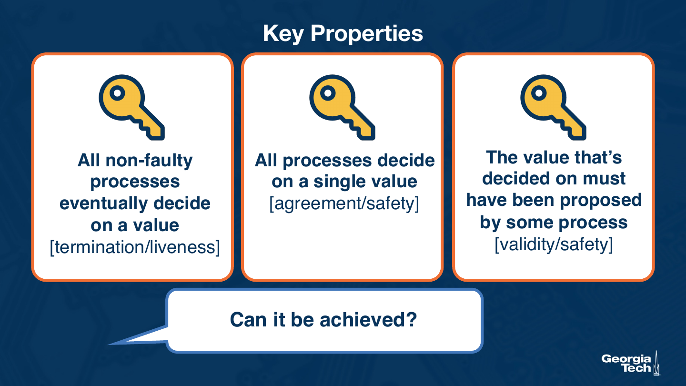

The ability of a distributed system to reach a consensus implies three key properties.

First, all non-faulty processes eventually should decide on a value. The first property is that of liveness, or that there will be a guarantee for some forward progress such that the process of negotiation involved in reaching a consensus, or the consensus algorithm, terminates. The process will terminate if each of the processes which are non-faulty, eventually decide on a value. We call this the termination or the liveness property.

The second property is that all processes should decide on a single value. This concerns the correctness aspect. A consensus protocol needs to guarantee that all processes decide on a single value if each process decides on a different value, that's hardly a consensus, and there is very little use of such a protocol.

And the third property is that the value which is decided on must have been some value that was indeed proposed by some of the processes, or by one of the processes. Further, this agreed upon value cannot be something arbitrary. It has to correspond to a legitimate value proposed by the participants in the distributed system.

These are all desirable properties, and the question we'll discuss in this lesson is whether these can even be achieved.

## 3. Preliminaries: System Model

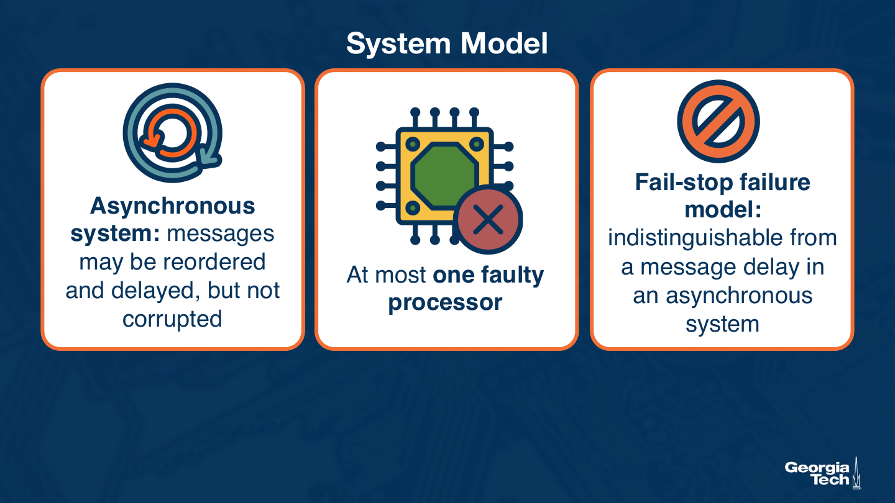

Before discussing the FLP theorem, let's first describe the system model and introduce the necessary definitions. We will consider the question of whether or not a consensus can be achieved in the distributed system which has the following characteristics.

First, the distributed system is asynchronous. What that means is that messages may be reordered and delayed, but not corrupted. Then, we will assume that there is at most only one faulty processor. And finally, we will assume that the types of failures that may happen in the system are represented with the so-called tail stop failure model. Field stop model is one where the only thing that can go wrong with a node is for the node to just stop working. Whether it crashed or deadlocked, we don't have to further distinguish this. And a field stop failure is also indistinguishable from a message delay, that's an infinite message delay in an asynchronous system.

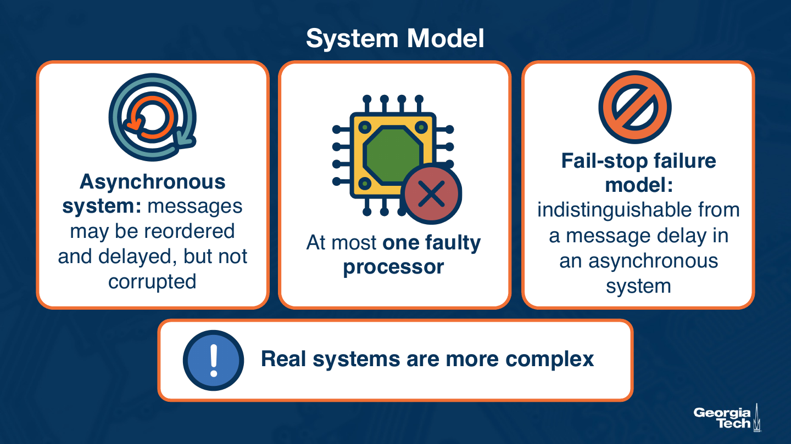

We know that real systems are really much more complex than this. Messages can be corrupted. The node may start exhibiting some erroneous behavior that causes it to send a wrong message or not to act correctly in response to messages it has received. This kind of behavior may be transient or permanent. Also, a node may become malicious and it may intentionally try to cause the rest of the system to fail. It may start colluding with other nodes in the process.

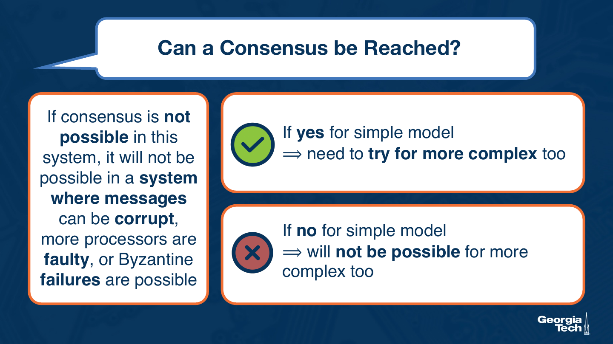

Analyzing the question of whether consensus is possible using the simple model we introduced is still very useful. If we find out that the answer is yes, that a consensus can be reached with the simple model, that gives us no guarantee that a consensus could be reached in a more general, more complex system, so we'll have to further investigate. However, if we find out that the answer is no, that reaching a consensus is not possible even with this kind of simple model, then we immediately know that we will not be able to guarantee consensus if the system were more complex.

## 4. Preliminaries: Definitions

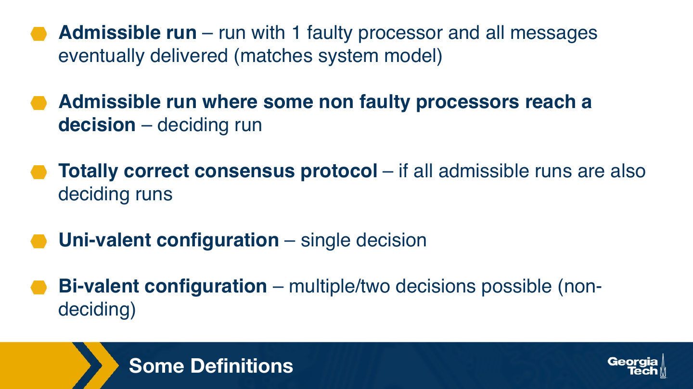

The theorem and the proof use some specific terms in the discussion, so let's look at those. Recall here the terminology that we introduced in the lesson about global state.

An admissible run is a run, or an ordering of events in the system, where there is one faulty processor and all messages are eventually delivered. This type of run matches the system model. An admissible run where some non-faulty processors reach a decision, that's a deciding run.

A totally correct consensus protocol is a protocol where all admissible runs are also deciding grants.

A configuration of the system in which the system can reach a single value is called a univalent configuration, and this would be part of a deciding run. A configuration of the system in which multiple, or rather at least two decisions, are possible is called ap valve configuration. This configuration does not match a state of the system where a consensus has already been reached, and so this is still a non-deciding configuration.

So armed with these definitions, and in the context of the system model, we will now move on to discuss the FLP theorem.

## 5. FLP Theorem

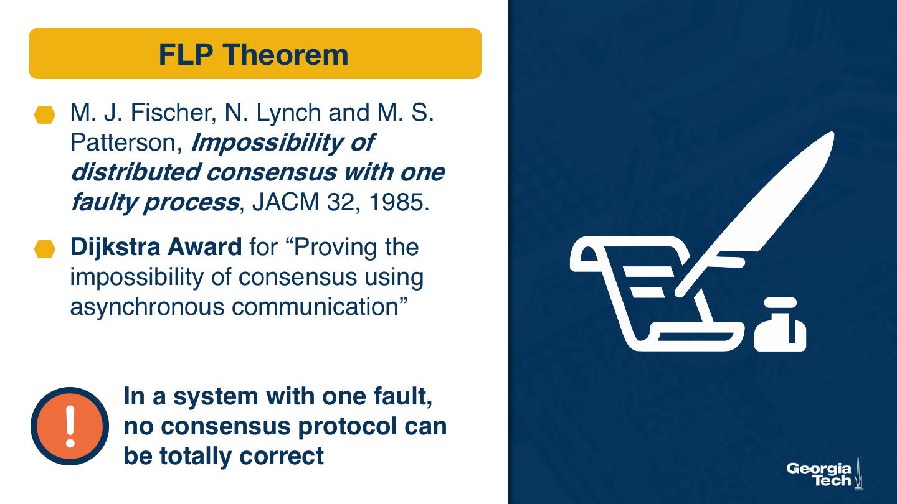

Let's finally look at the FLP theorem. The FOP theorem was published in a paper by Michael Fisher, Nancy Lynch, and Michael Patterson. And based on the first initials of the author's last names, this is known as the FOP theorem. The question of whether or not there are theoretical guarantees on whether consensus can always be reached in a distributed system had received a lot of attention prior to this work. This work was considered as a hugely important result and was ultimately awarded with the Dijkstra award, an award named after Edgar Dykstra and given for major contributions to distributed computing.

Title of the paper is impossibility of distributed consensus with one faulty process. So as the title suggests, the answer to this question is no. In a system with one fault, no consensus protocol can be totally correct.

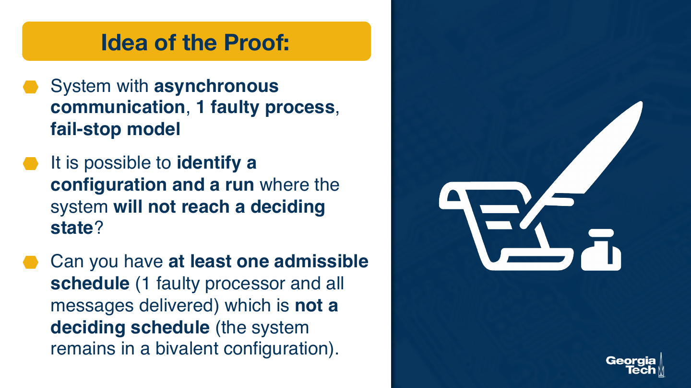

The quick intuition behind the proof is as follows: be considered the simplified system model of allowing asynchronous communication, but limiting the system to just one faulty process with a failstop failure model. Then, with the system model, they ask whether it is possible to identify a starting configuration and a legitimate admissible run such that the system does not reach a deciding state. Another way to ask this is to try to answer whether it is always possible to identify one admissible schedule in a system with one faulty processor, where all messages are delivered and where the system remains in a bivalent configuration, where basically no single decision can be agreed upon.

## 6. Proof in a Nutshell

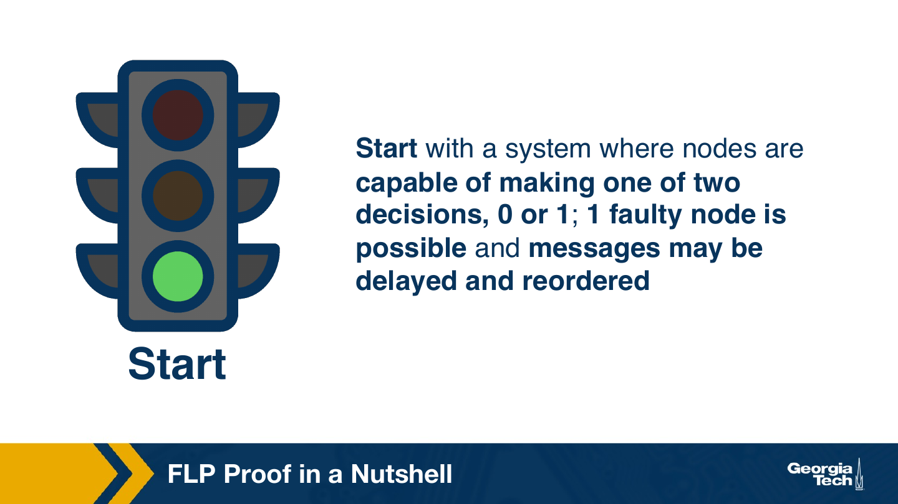

We will not go through the proof in details, but would illustrate it at a high level. We will start with a system where nodes are capable of making one of two decisions: zero or one. Remember, we're talking about a system where one node failstop failure is possible and messages may be arbitrarily delayed or reordered.

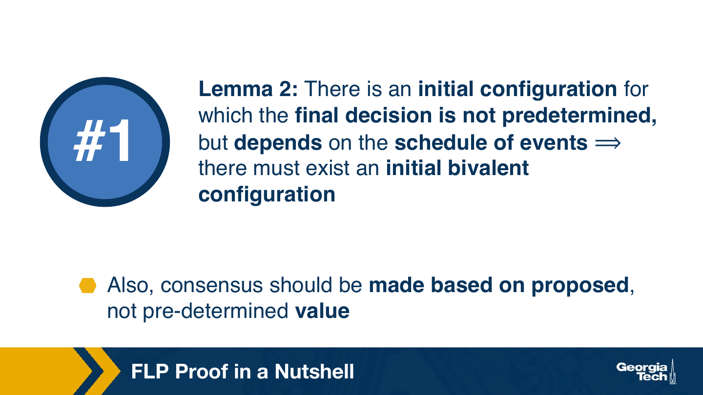

There are several lemmas in the paper. We'll start with the second lemma. And the second lemma in this paper shows that in a distributed system which is based on the simple system model, there must be some initial configuration for which a final result is not a predetermined result.

The proof for this is simple. Assume that all initial states have predetermined outcomes, and let's say the outcomes are one of two values: zero and one. If you describe each of the configurations by the zero or one values of their initial states, they show that it is possible to guarantee that there will be two configurations which differ in the state values at one single process. So if it turns out that that one single process is the one that's faulty, then the admissible run which gets executed within the context of each of the two configurations is actually the same, since the faulty processor will not contribute in either way to the runs that get executed from those initial configurations.

So in such a scenario, starting from the same initial configuration, you can reach a zero or a one. This is an example of a configuration without a predetermined outcome, and it's also proved that such an initial state does exist. Also, if the system only has predetermined states, that makes it trivial to prove that it won't be able to reach consensus, because remember, consensus requires that the agreed-upon value is something that one of the nodes actually proposes, and not some fixed predetermined pre-agreed-upon value.

### 6.1. Moving from Bivalence to Univalence

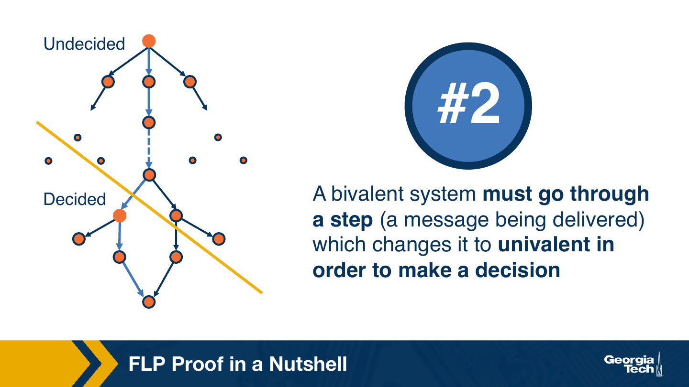

The next argument made in the proof is that there must be a single event in the system, like a single message, that changes it from a system that has a b balance state, where it cannot make a single decision, to a univalent state, where a decision can be actually reached. If we look at the lattice of all the possible state transitions, we started in a configuration where the state wasn't decided, the decision wasn't decided, and we expect to be in a state where a decision can be decided. So that's change from these two states of the system will have to happen with some message transition that takes the system from one side of this dividing client to the other.

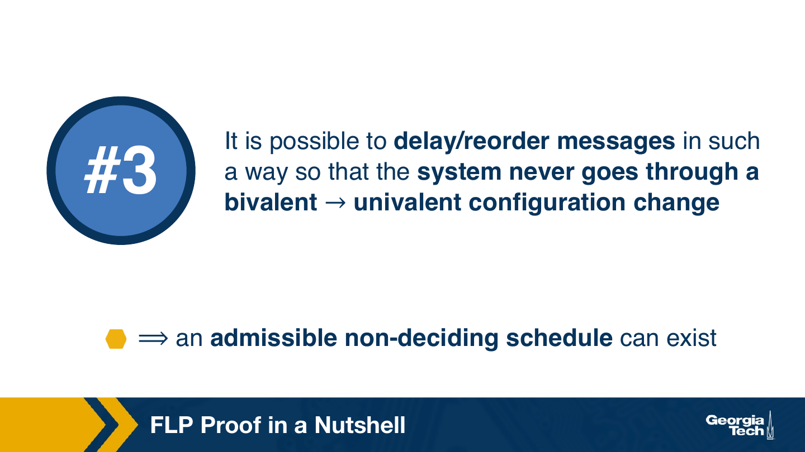

The final argument that they make and show in this paper is that it is possible for this one message that takes the system from one state to another to be sufficiently delayed beyond the run of the admissible schedule, which means that the system will never transition from a vivaland, undecisive, to a univalent, decisive state.

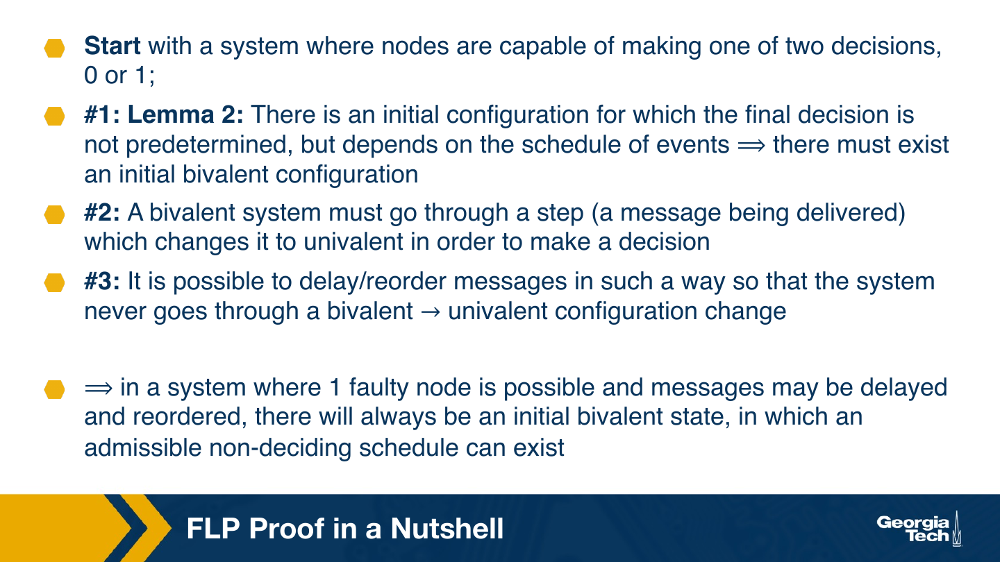

Therefore, they prove that in a system where one faulty node is possible and where messages may be delayed and reordered, there will always be an initial bivalent state from which the system goes through a sequence of message exchanges that are part of an admissible schedule, but where one message may be delayed as a result of which that schedule will not lead to a decision, or not lead to a consensus being reached.

## 7. Is Consensus Really Impossible?

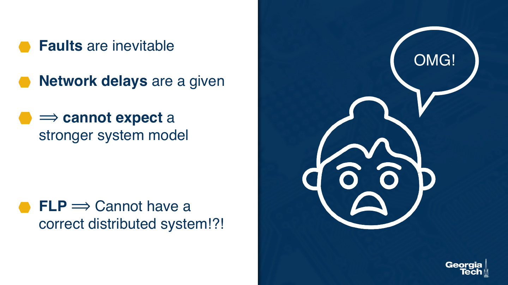

Is consensus really impossible? The result is quite concerning. We know that faults are inevitable. We know that network delays are also inevitable. We cannot guarantee that we can build a system which will have stronger guarantees than just having one fault and asynchronous messages. These are messages that are reordered and delayed but still ultimately deliver. If this is the case, this seems to suggest that FOP is proving that it will be impossible to build a distributed system for which we can guarantee that it can behave correctly.

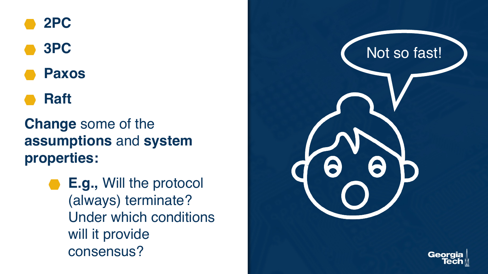

Fortunately, that's not quite the case, since we have been relying on distributed systems quite heavily and quite successfully for a very long time. To ensure their correctness internally, we rely on different consensus protocols: two-phase commit, three-phase commit, Paxos, Raft. We'll be discussing some of these in the next lessons.

These protocols do not contradict the FLP result. Instead, they change some of the initial assumptions or the properties of the system model. By doing this, these protocols let us achieve consensus, but they further specify what are the conditions under which the protocol will terminate or under which the protocol will provide consensus versus not.

## 8. Summary

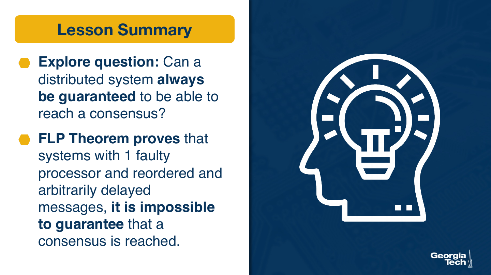

So let's recap this lesson. We explored the question whether a distributed system can always be guaranteed to be able to reach a consensus. This important question was answered by the paper by Fisher Lynch and Patterson, where they proved the FLP DRM, which says that in a system with one faulty processor and where messages can be reordered and arbitrarily delayed, it is impossible to guarantee that a consensus will always be reached.
