# Lesson 6: Replication

Source: [Lesson 6 — Video](https://www.youtube.com/watch?v=Rh4KJ5U5Dw4)

## 1. Introduction

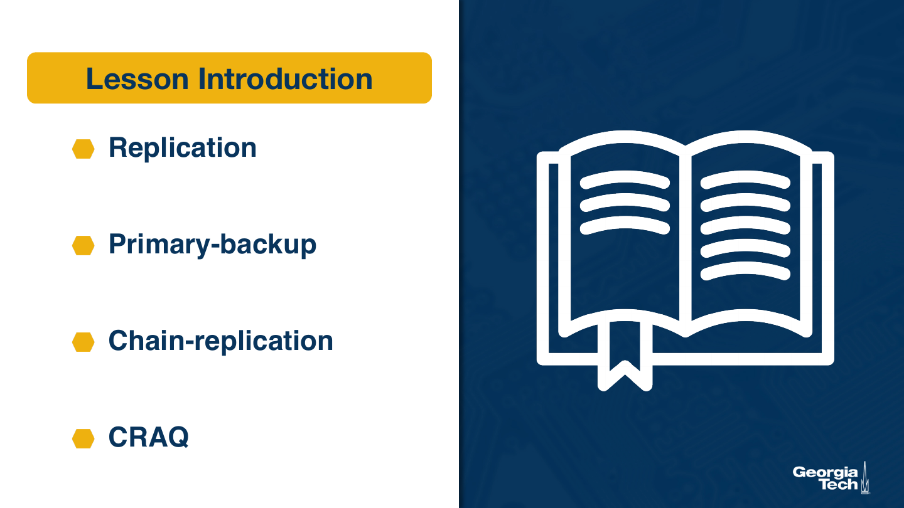

We mentioned replication multiple times already. In this lesson, we'll look at a few common replication techniques with the goal of making sure you understand the terminology and the tradeoffs.

## 2. Goal of Replication

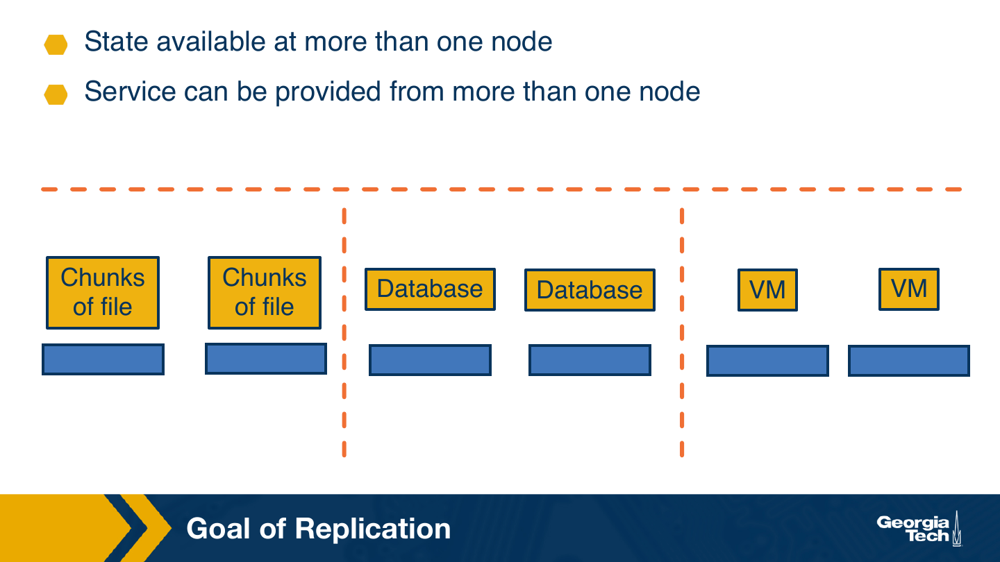

Let's talk about the goal of replication. With replication, the system maintains the same state at more than one location. The state can be entire files or chunks of files, as with distributed file systems. It can be entire tables, as with distributed databases, or it can be application level state or operating system level execution state that's associated with entire virtual machines, for instance.

Having the same state available at more than one location, this means that different nodes can provide the same service. The same service can be served from multiple locations. For instance, different nodes can serve the same file or file chunk. They can execute the same database queries, or they can execute the same application deployed in different virtual machines, if those virtual machines are replicated.

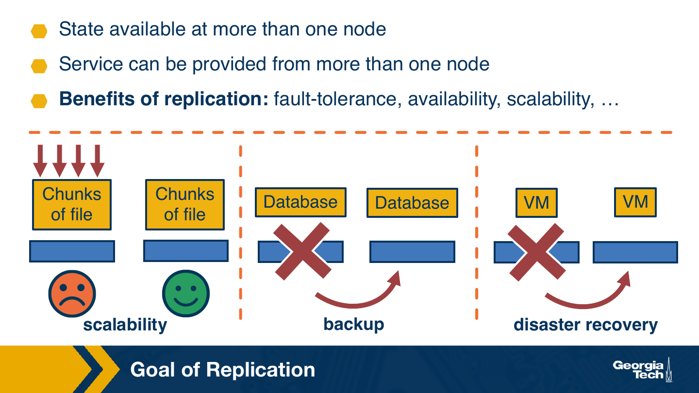

There are multiple reasons why replication is useful. One is fault tolerance. This allows us to ensure that even when there is a permanent or a transient failure somewhere in the system, the same service can continue to be delivered. For instance, if the first node storing the database fails and if the database is replicated, then all the state and all the transaction records can be retrieved from the backup replica, and the query can be served from that location. When it comes to virtual machines, a common technique that enterprise businesses use is to replicate a VM to a faraway data center, and this is used as part of a disaster recovery mechanism.

Another reason for replication is to improve the system scalability. For instance, in a file system, as the load in terms of the number of requests increases, if the state is stored on one machine only, the file service will become very slow to a point that maybe by some clients it will be perceived as completely unresponsive, as if the service is down. Now, by replicating the files on multiple machines, the request can be distributed, and each machine can serve a portion of the request, and this improves the scalability of the system in terms of the number of requests that it can serve.

## 3. Replication Models

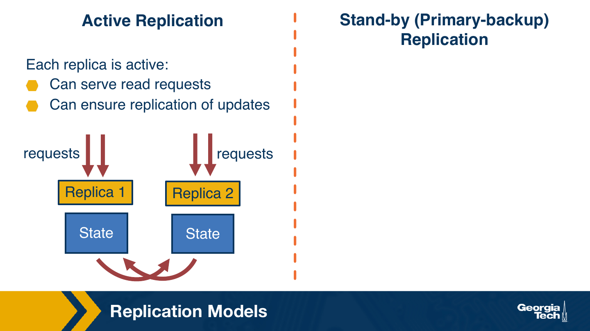

There are two main replication models. The first one is called active replication, and the second one is called standby replication, or primary backup.

In active replication, each node is active, can accept and handle requests. For reads, there is not much that needs to be done other than just serving the read. And when a replica receives a request that requires some change to the state, a write operation, an update, it must ensure that those updates are appropriately replicated to all of the other replicas.

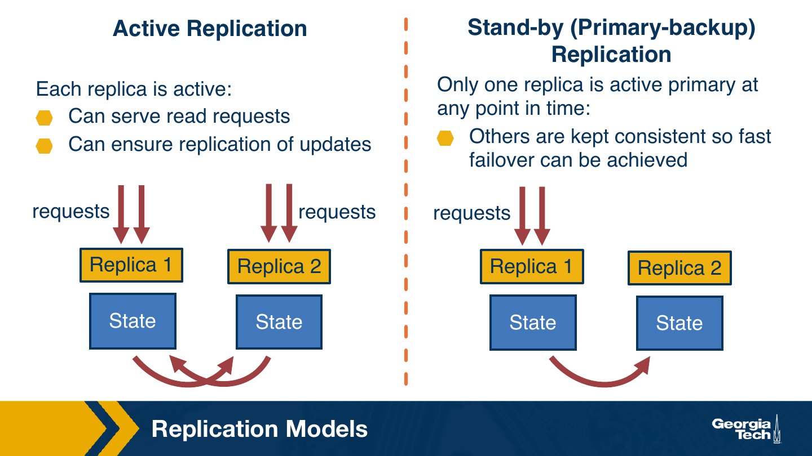

For standby or primary backup replication, as the name suggests, only one replica at a time is the active one. This is the only replica that serves the request, and all the other ones are on standby. When there is some failure, one of the other replicas needs to intervene and take over as a primary. In the scenario, on a read request, again, there isn't anything that needs to happen. But when there are requests that update the state at the primary node, the primary needs to ensure that those state changes are correctly updated to the other replicas.

## 4. Replication Techniques

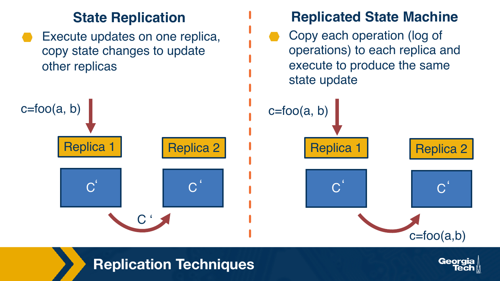

There are two main techniques that are used to implement replication. These are called state replication, or replicated state machine.

In the first scenario, any operations that modify the state are executed on one of the replica nodes, and then the modified state is copied over to directly update the now stale version of the state at the other replicas. For instance, let's look at the scenario. We have two replicas, replica 1 and replica 2, that maintains some state c. Let's say there is an operation foo that updates the state c at replica 1. The operation will be performed locally and the update will be reflected. Now, once that completes, this is propagated to the other replicas, the actual modified state, and at the other replica, the state is updated in place.

In the second scenario, replicated state machine, the same operations are submitted essentially to all replicas, and executed at each location separately. This makes sense to do if the execution of the operation is deterministic, meaning we don't expect the different executions of the same operation will produce different results. So let's take a look at what would happen with replicated state machine in the same scenarios where we have two replicas.

Again, the operation foo is submitted at replica 1 with the intention of having the state updated from c to c prime. Now, replica 1 performs that update. It will perform the update of its local state, but the message that it will communicate with replica 2 is not of the new value of the state. Instead, it will propagate a message about the operation that it executed, about this operation foo. The operation foo will be executed locally at replica 2, and the state at replica 2 will be updated from c to c prime as well.

### 4.1. Trade-Offs

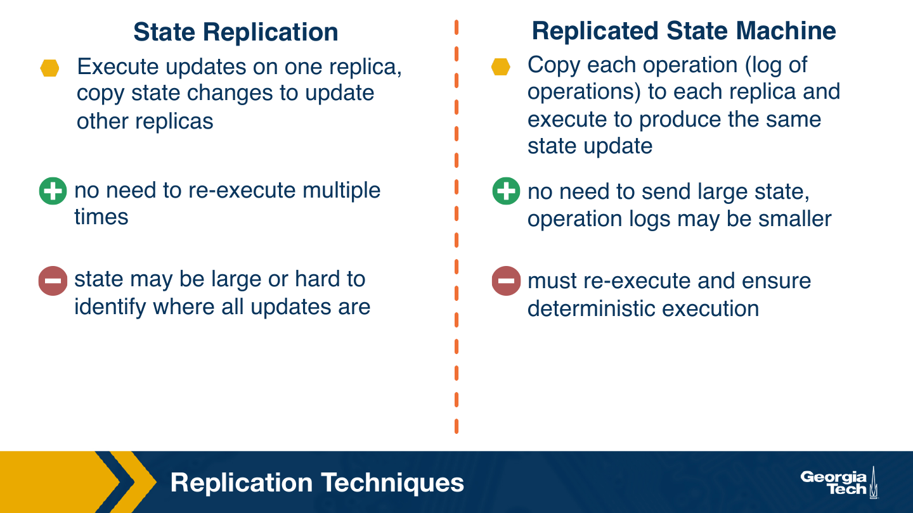

One of the benefits of directly replicating the updated state is that there is no need to re-execute the same operation multiple times. The downside is that the state changes may be large. They may be sort of spread out all over in terms of different file chunks, different portions of the database, and so it may be hard to identify where all the updates are.

In the second scenario, there is no need to send large updates to the state. Copying just of the logs that contain the information about the operations which got executed may be much smaller. However, the downside is that the same operation must be re-executed at each location. And of course, this only is applicable if the execution is deterministic.

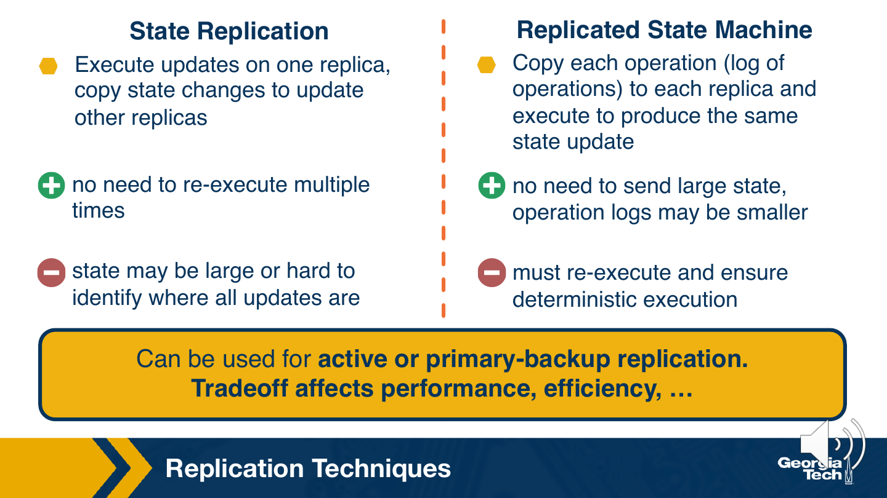

These trade-offs should be considered when determining what's an appropriate replication technique for a given scenario. But regardless of which one is chosen, either technique can be implemented and used both with active or with primary backup replication.

## 5. Replication and Consensus

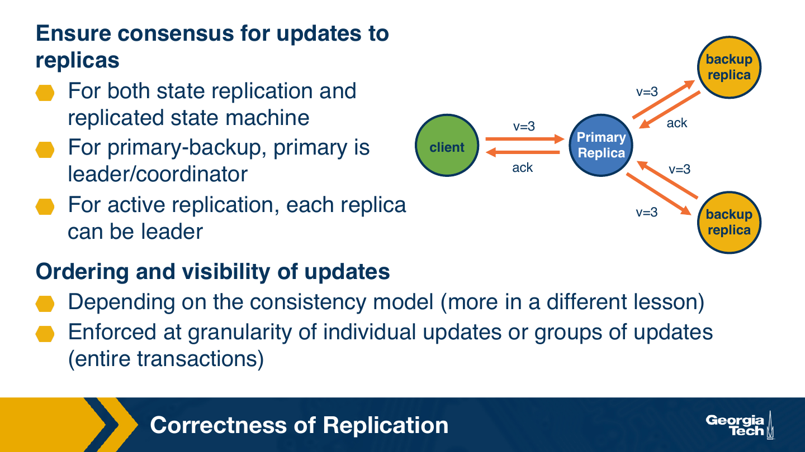

Regardless of whether replication is performed using state replication or state machine replication, it's important to ensure that the replication is performed correctly. What this means is that we have to make sure that each state update, or the information about each log entry, is reflected at each of the replicas, that the update has the exact same value, and that a consensus can be reached among all of the nodes for what this value is. In that sense, you may execute Paxos, Raft, or Viewstamped Replication protocol to ensure the correctness of the replication process.

In the case of primary backup replication, the primary is an obvious choice for the leader. For active replication, each of the replicas may be a leader at some point, though this is not necessary. Consistency management may be simplified if we have some designated replica for the writes.

In that sense, the ordering and the visibility of the updates, meaning when an update will be propagated to all replicas and how the visibility of different updates is reflected across each node in the system, this depends on the consistency model. We'll talk more about some of the relevant consistency models in some of the later lessons. It also depends on the granularity at which updates get performed. It can be that each update needs to be applied correctly individually, or it may be that updates are somehow grouped in some manner, and this is achieved by relying on some transactional support to delineate groups of updates that need to be applied as an entire group.

## 6. Chain Replication

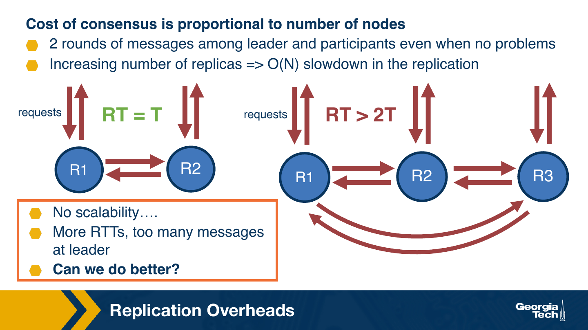

During the previous lesson we talked about consensus. We described that to reach a consensus, regardless of the protocol, there are many messages that need to be exchanged among the leader and the participants. This means that as we add more replicas, the response time for the updates will start increasing. And it will start increasing both because the response has to wait for more round trip times among the different replicas to be completed, but also because each of the replicas that needs to handle the request now also needs to send and receive more messages. So that slows down the capacity of that replica node.

This means that the scalability of the system will start to suffer. For a system to be scalable with respect to the increase in the load, we expect that its performance will not be affected, at least not significantly, as the load increases. And this clearly is not going to be the case here. So can we do better with the question?

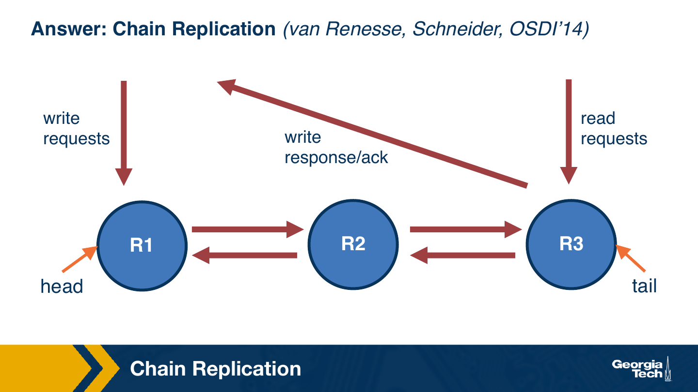

One answer to this question is to use a technique that's called chain replication which was originally published at OSDI in 2014. In chain replication, let's consider the same scenario of having three replicas r1 through r3, and the first one in chain replication is known as head, and the last one is tail.

Write requests are always sent to the head. When the head receives a write request, it replicates it only to the next replica in the chain. Each element in the chain will in turn update the subsequent replica until the tail is reached. When the tail is reached, the tail acknowledges the write.

In this case, performing a write will require performing just as many writes as with the more naive technique. However, the replication leader, the node r1 with the write request was received, is only handling the messages that are required to copy, to propagate the write, just to one of the replicas, not to all. This makes the leader much less of a bottleneck compared to the solution where it has to communicate with all nodes.

Read requests are served always from the tail, meaning that they're guaranteed to see the latest committed update.

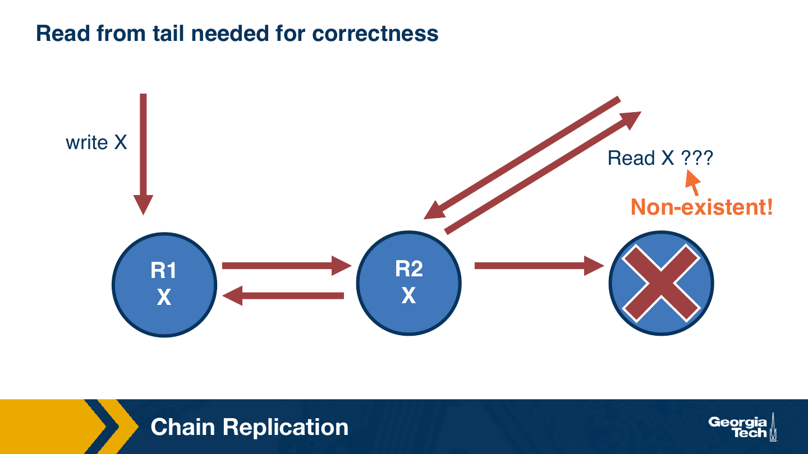

One reason for not allowing the reads to be served from the intermediate nodes is that there may be situations where a write, as it's propagating through the chain of replicas, ultimately does not reach the tail. Maybe the tail has failed. In that case, that write will be discarded. That update will not be applied in the system, will not be committed to the system. And if we allow a read operation to see that non-existent update, clearly that system will not behave correctly.

### 6.1. Benefits and Limitations

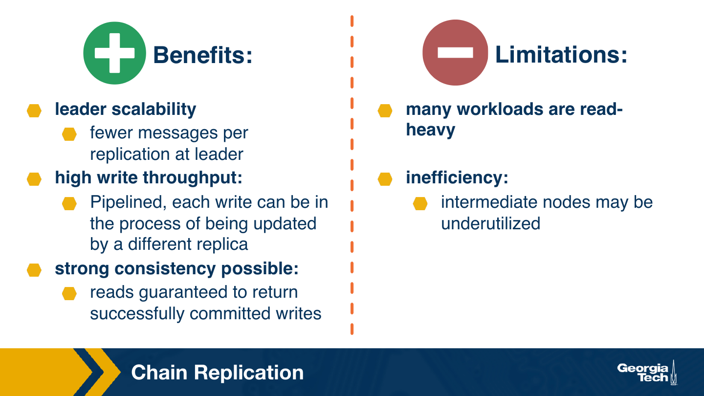

So what are the pros and cons of this approach? Clearly, we have greater leader scalability. We can afford to replicate to more nodes, and therefore potentially get better fault tolerance without requiring that the leader sees a increase in the load of messages that it has to submit and receive.

Also, we actually have higher write throughput with this technique because it uses what's called pipelining. As one write gets pushed through the chain of replicas, a second write may be accepted by the leader and pushed through the chain of replicas. In a way, the chain will be processing these write updates as if it were a pipeline.

Also, because we are reading from the tail only once a update has been propagated through the entire chain and committed, it's possible to make strong consistency guarantees that the reads will return only the successfully committed writes in the right order.

But there are downsides with this technique. One main downside is that it really is not very applicable to workloads that are very read intensive, because such workloads cannot take advantage of any of the intermediate replicas. In that sense, as a technique, it suffers from a low efficiency of the nodes. The intermediate nodes may be very underutilized, particularly in the cases of read heavy workloads.

Now, read heavy workloads are important. There are many applications out there that have several orders of magnitude more reads than writes. So we clearly need to have a technique that works well for read heavy workloads.

## 7. CRAQ

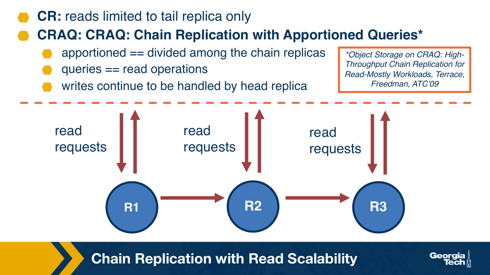

So the limitation with chain replication, the problem with chain replication, was that only the tail replica was handling reads. And this is what made chain replication as is not appropriate for workloads with read heavy request patterns.

One solution which addresses this problem is a so-called CRAQ, or chain replication with apportioned queries. This technique builds on the original chain replication technique, but makes several modifications. One is that reads are apportioned, divided among the different replicas in the chain. Queries, by queries, we mean here the read operations, and the writes here continue to be handled by the head replica, by the leader of the chain.

The title of the paper where this technique was described is object storage on CRAQ high throughput chain replication for read mostly workloads, and it's by Jeff Terrace and Michael Freedman. It was originally published at the USENIX annual technical conference in online.

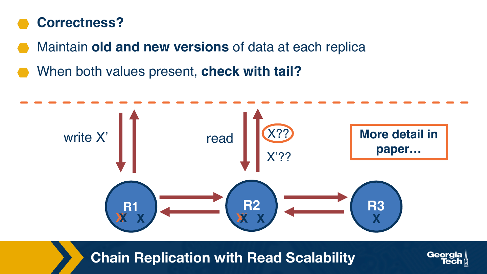

You can probably immediately see that there is a potential issue with this kind of technique, allowing different replicas to see the reads. We said that writes are only committed once they reach the tail replica. Imagine that at the same time there is a write that's issued at the head that's trying to update a value x to x prime, and at that same time, there is a request for a read that appears at replica 2. Now, the value of the state at r2 is still x. R2 has not yet seen the update to x. So the only possible value that r2 can return when it sees the read is the value x. However, there is this update to x prime that's in progress, so perhaps we should make sure that r2 returns x prime. In fact, r1 may already have updated the value at r2 to x prime. So in that case, r2 has x prime, but this update has not been propagated through the chain. We don't know whether it's going to get committed, and so again, we don't know whether we should return x, the old value, or x prime, the value which just got updated at r2.

### 7.1. Keeping Multiple Versions

The solution to this that's used in CRAQ is to keep multiple versions of the data at each nodes. When writes propagate through the chain, the new value gets stored, but it's marked as a new value, and the old value isn't discarded.

If a read arrives at one of the replicas before the write value is confirmed with the client, the replica will serve the old value. After the write is acknowledged, the replica will start serving the new value x prime, and it can actually discard the old value.

It is okay, and actually makes sense, for the system to respond with the most recent committed value of the state, as opposed to with an unconfirmed but currently in progress update. This corresponds to a sequential consistency model that's appropriate and desirable for most applications.

In the event when a request arrives when both of the values are present, a replica can check with the tail to see if the new value has reached the tail, and if it hasn't, then it knows to use the old replica. If it has, then it knows that the new value has been committed and confirmed with the client, and it can start serving the new value.

The paper also discusses the process of chain management: what happens when intermediate or end nodes in the chain fail, how to rebuild it, how to guarantee that the operations are properly ordered even in certain corner cases, and also discusses some optimizations that use multicast to propagate the updates.

## 8. CRAQ vs CR Scalability?

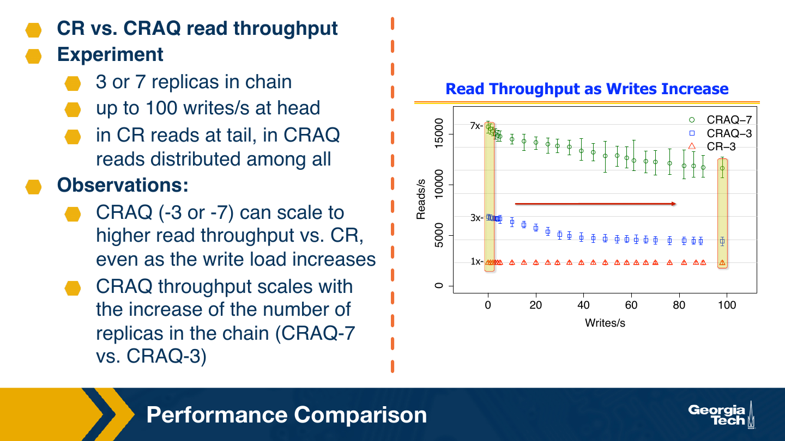

Let's look at the results from one set of experiments presented in the paper that compared the scalability of CRAQ relative to the basic chain replication. The comparison metric in the experiment is a read throughput. It makes sense to use this metric. After all, CRAQ was designed precisely to improve the read throughput of the replication technique.

In the experiment, the authors use a different number of replicas to form a chain, either three replicas or seven replicas, and they use a workload that consists of a mix of writes and reads. All the writes are issued at the head, and are varied from zero writes per second to 100 writes per second, so the rest of the workload is read-based. Remember, in chain replication, the reads are handled by the tail, and in CRAQ, they're going to be distributed among all nodes.

This is an illustration from the paper, and it illustrates how the read throughput changes as the rate of writes in the system increases. The points with the different colors in this graph correspond to the red triangles, to chain replication with three replicas, the blue squares, to CRAQ with three replicas, and then the green circles, to CRAQ with seven replicas.

What we see from these experiments is that the CRAQ technique consistently delivers higher read throughput than chain replication alone. We see that using the same number of replicas, using three replicas, at low write loads, CRAQ is able to achieve almost three times higher read throughput compared to chain replication alone and that even at a much higher update rates, at higher write rates, it's still delivering much higher read throughput compared to chain replication. And this makes sense because all of the replicas in CRAQ are involved in serving reads.

For each update in CRAQ, now each of the replicas has to maintain two copies, has to check which of the copies it needs to serve, and this is the reason why the throughput start, for each of the CRAQ bars, starts dropping as the rate of writes in the system increases however, regardless of that, it still delivers higher read throughput compared to chain replication. We also see that CRAQ scales very well with the number of replicas. We would expect that if we now create a system where we introduce seven replicas as opposed to three replicas, that that kind of system will be able to handle much higher number of read requests. We see in this graph that CRAQ 7 does deliver nearly 7x higher read throughput compared to CRAQ 3, CRAQ with 3 replicas.

## 9. Summary

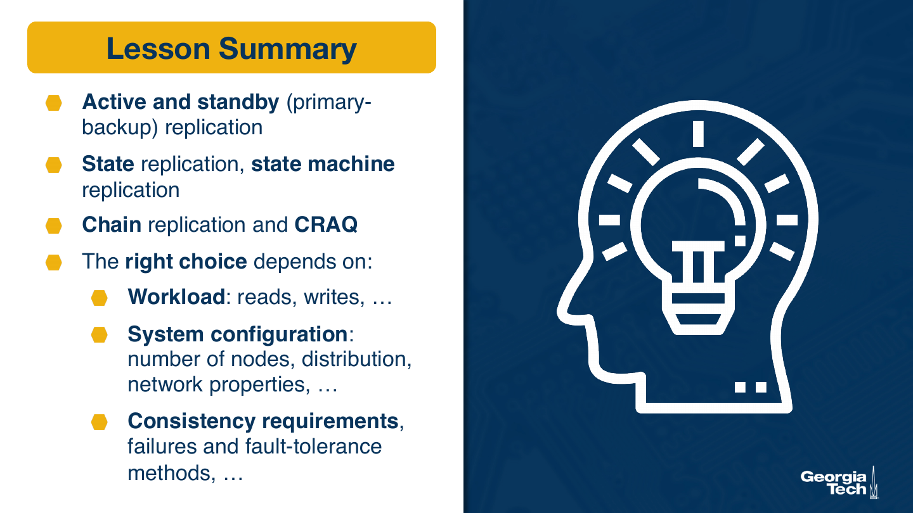

Let's summarize this lesson. We discussed two main replication models: active and standby, or primary backup. We used several techniques used to implement these models. We talked about state replication versus state machine replication, and we also described chain replication and an improvement upon the classical chain replication solution called CRAQ.

What is the right choice is going to depend on a number of factors. One factor is going to be the workload itself. Is it mostly read intensive? Are there lots of writes? How are these distributed over time? Whether these rights are really issued toward the same shared state, or mostly isolated to separate portions of the state in the system. It's going to depend on the configuration of the system, the number of nodes, the failure rates, the properties of the network, round trip times, bandwidth. And it's going to depend on the consistency requirements that the system is aiming to provide to the applications. We will continue talking about some of these issues in some of the upcoming lessons.
