# Lesson 8: PAXOS and Friends

Source: [Lesson 8 — Video](https://www.youtube.com/watch?v=49yCsAOV3pk)

## 1. Introduction

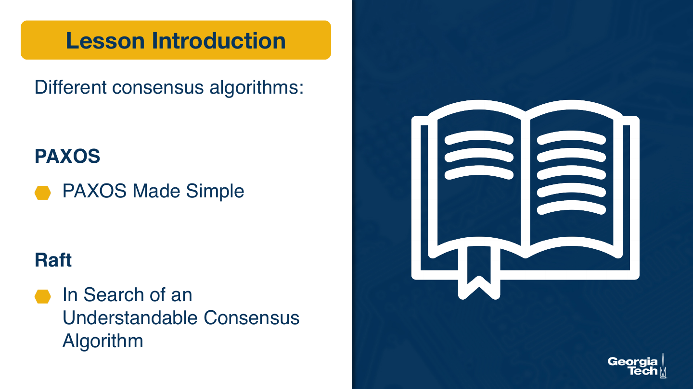

In this lesson, we will primarily talk about two consensus algorithms which are widely used in production systems: paxas and Raft. For Paxos, we will base the discussion on the following paper: pax is made simple by Leslie Lamport. And this is not the original taxes paper, but rather a simplified later presentation of this work. For Raft, we will base the presentation on the paper in search of an understandable consensus algorithm presented at usnix ATC in 2014. There is an extended version of this work which has some proofs, and that's available on the project Github page.

We will also briefly mention some concrete implementations of consensus-based services, which are based on these algorithms, though they don't necessarily follow them exactly per the original specification.

## 2. Goal of Consensus Protocol

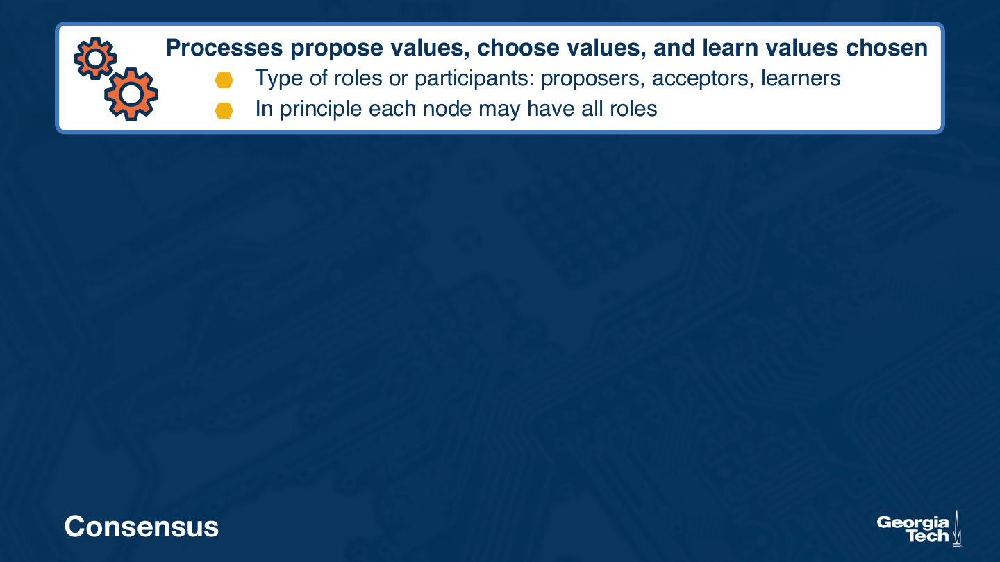

Let's informally see what is the role of a consensus protocol one more time. Remember, by consensus protocol, we mean that a group of processes in a distributed system can agree on what is the value of a shared state. And we need an algorithm or a protocol that will make sure that such agreement can be reached, that the value in which the processes will agree is a valid value that was indeed proposed by somebody.

To do this, we will consider a distributed system where nodes have different types of roles. There may be proposer nodes, which are the ones participating in the system by proposing possible values for the shared piece of state. There will be acceptors, and these are the nodes that participate in the agreement by evaluating proposals and deciding which one of them is indeed going to be chosen as the proposed value. And making this type of decision typically considers some notion of the order of the proposals, typically based on some timestamps. And finally, there will be learners, and these are the nodes in the system that need to access. They need to read the value. They need to learn what is the current value of the shared state. Typically, based on this, they will decide how to proceed further in their execution.

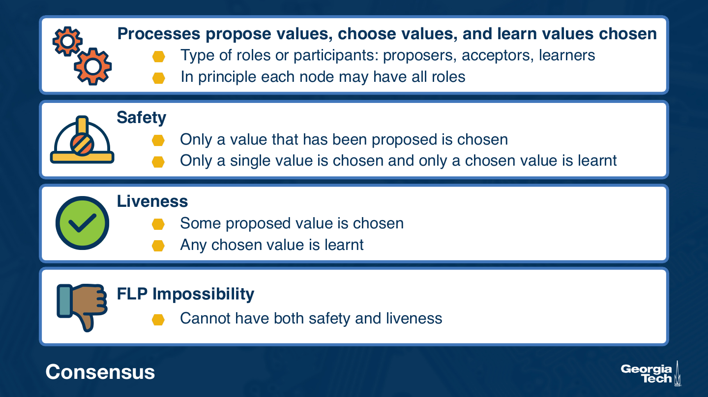

A consensus protocol must guarantee safety and liveness. Safety means that only a value that has been proposed is chosen. It also means that only a single value is chosen, and that only a single chosen value is learned by the learners. Liveness means that some proposed value will ultimately be chosen, and that this chosen value will ultimately be learned.

Keep in mind that we discussed the FOP theorem which said that it was impossible to have both safety and liveness in a system where there is a possibility of at least one failure.

## 3. 2PC and 3PC

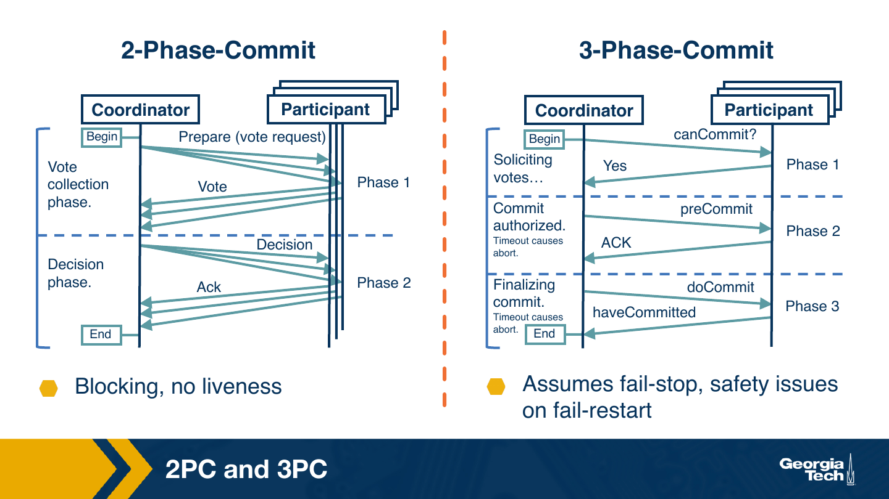

Two protocols originating from the database community are examples of consensus protocols. These are called two pc, two phase commit, and three pc, three-phase commit.

In the two-phase commit protocol, there is always a coordinator, and it is assumed that this coordinator will not fail. The coordinator proposes a value that all participants need to agree on. The participants vote. The coordinator tallies the votes, and then communicates this decision. This means that it commits the decision at that point. The protocol is simple, but it blocks if there are failures. So it does not guarantee liveness for sure.

The three-phase commit protocol addresses this blocking problem. There is an initial pre-prepared phase, followed by the actual prepare phase, when the votes are solicited, and then the decision phase, when the decision is communicated to, or eventually learned by, all. If a node fails, this protocol won't block all nodes, so it guarantees liveness. However, it only works with a failstop mode. It assumes that if a node fails, it won't restart, or that if a message is delayed beyond the timeout, it will not be ultimately delivered at some later time. And if that's not the case, the protocol will raise issues with safety, meaning that it will not be able to guarantee which proposed value is agreed upon at which node.

## 4. Paxos History

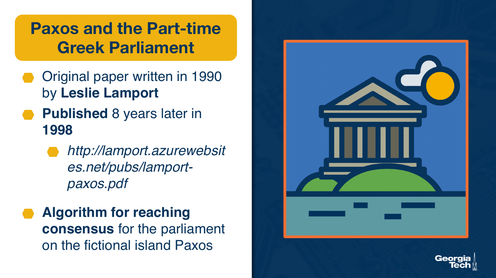

One of the most popular consensus protocols is Paxos. And let's start by talking about the history of paxis. The original paper about Paxos was written in 1990 by Leslie Lampard. Interestingly, the paper wasn't published until eight years later in 1998. Part of the reason that it wasn't published is because the reviewers, the original reviewers, really didn't appreciate the humorous description of the algorithm that Leslie Lampert originally presented in terms of busy parliamentarians on some fictional island Paxos, in ancient Greece.

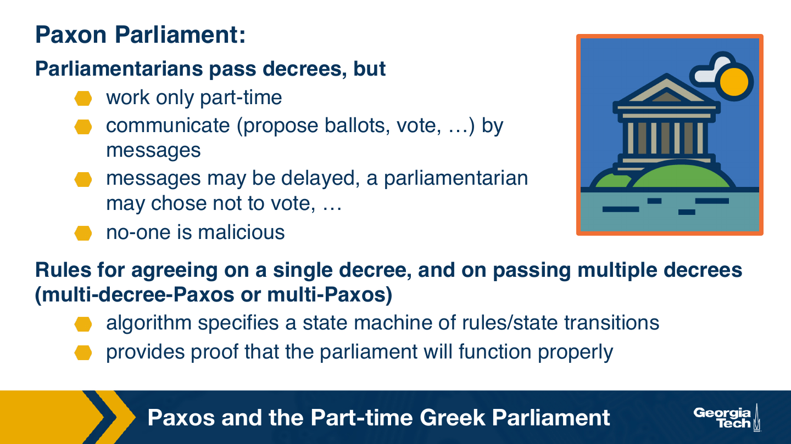

In this original paper, the paxon parliament needs to pass decrees, but the parliamentarians work only part time. They're not cheating. Just they're busy with other things. They communicate by sending each other messages, but these messages may get delayed or lost, or even when they're working, the parliamentarians may choose not to cast a vote for a decree. The algorithm represents a set of rules. This is the protocol that needs to be followed by the participating parliamentarians in order for them to agree on a single decree, and to also run the government by passing multiple decrees consecutively. This sort of complete version is called multipaxus.

The paper describes the consensus problem that can occur on Paxos, presents the algorithm, which is essentially a state machine of rules or state transitions that must be followed in order to pass decrees, and the paper also includes proofs that by following the algorithm, the parliament can function properly.

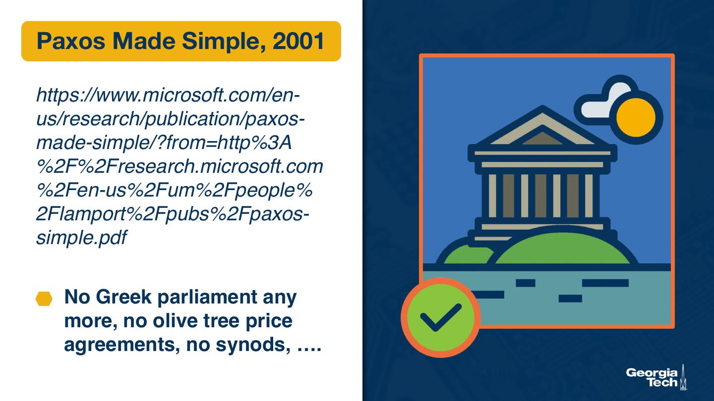

Despite the fact that paxis was demonstrated to be practical, it was a proven consensus algorithm, and it was practically implemented and deployed in operation, for many readers, its original description was also very unapproachable. This led less little input to write a new paper on Paxos in 2001, appropriately titled Paxos made simple. And this is the paper that will serve as the basis for the description of the Paxos algorithm that we'll use in this class. So no, we will not be talking about Greek parliamentarians, but I do encourage you to take a look at the original paper, and I'm curious to hear your opinion on it.

## 5. Paxos Made Simple

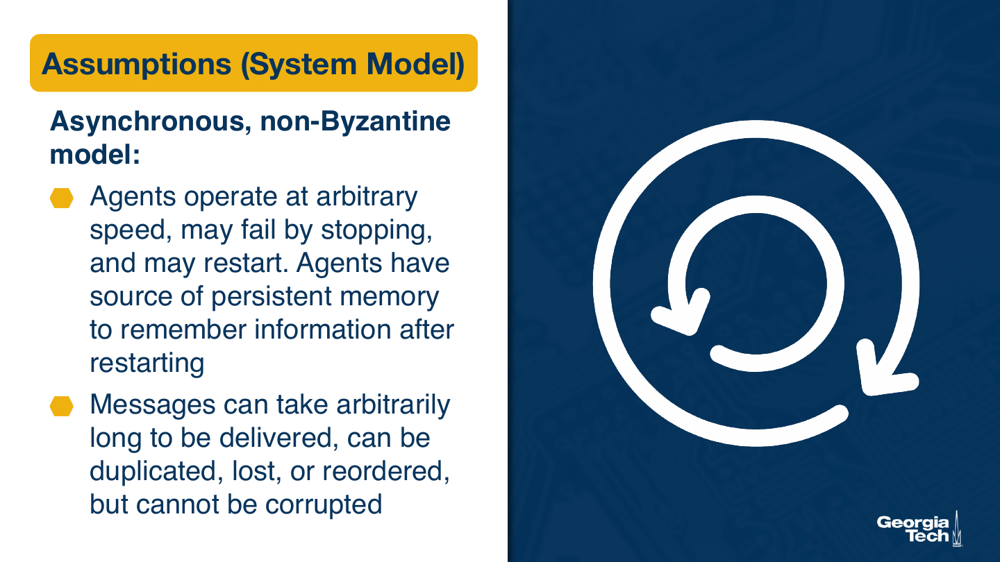

So let's now talk more about Paxos made simple. Let's specify the system model first.

Taxes is designed for systems with asynchronous communication and non-byzantine process failures. The agents, the participants in the algorithm, they operate at arbitrary speed. They may fail by stopping, and they may restart. The participants in the algorithm have some source of persistent memory to remember information after restarting. This persistent memory in the original parliament version of taxes was the ledger where the parliamentarians would keep a record of the decrease. Messages in the system can take arbitrarily long to be delivered, can be duplicated, lost, or reordered, but cannot be corrupted.

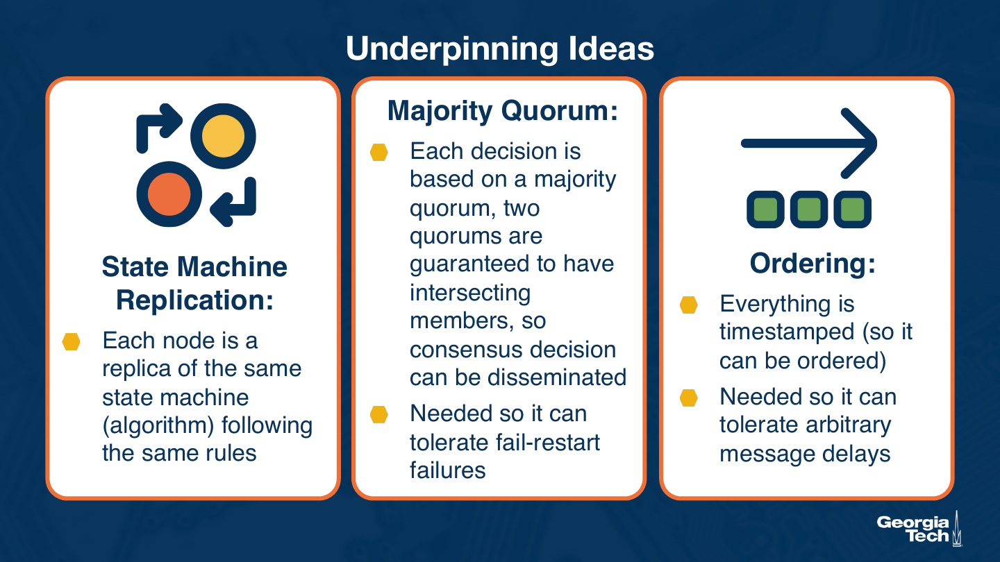

There are several main ideas that under pinpaxas. The first idea is that of state machine replication. We will talk more about this concept, but for now, consider that it means that each node is a replica of some state machine, of some algorithm that captures the state of the system, the ledger, and it follows the same set of rules that determine how the state is updated.

A second idea is majority core. Taxes makes all decisions based on majority core. By requiring a majority of the participants to be part of the quorum in order to reach an agreement, it is guaranteed that two quorums will always intersect. This makes it safe to disseminate consensus decisions even when some nodes have failed and are not participating in a consensus round, because when they restart and they need to catch up, they're guaranteed that the quorum that they will ultimately participate in will have at least one participant that had already learned about these past agreements. This is necessary for the system to tolerate both fail stop and failed restart failures.

Finally, Paxos works even when messages arrive out of order. It does this by heavily relying on time steps such as the lanport logical clocks we talked about already. In Paxos, everything is time stepped, so that it can be ordered. Again, we need this in order to tolerate arbitrary message delays.

## 6. Paxos Made Simple: Phases

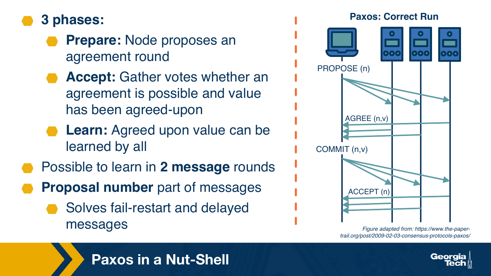

Let's talk about the different phases in the taxes protocol. The protocol has three phases.

During the first prepare phase, a note which is trying to propose that the rest of the participants reach a consensus and agree upon a value, sends a proposed message. The proposed message is timestamped by the order number of the proposal, so proposal number one, proposal number two, and so forth. This value serves like a timestamp of the proposal, so one can distinguish an older from a more recent proposal. In this illustration, and is that timestamp indicating the order number of the agreement proposal.

The initiator, or the node that's currently leading this protocol round, then gathers responses from the participants. The responses are messages sent by the participants in which they communicate whether they're willing to commit to agree to a proposal with the same proposal number if the notes have already agreed to something, these response messages will include information about the value that they're willing to agree to and the timestamp of the agreement proposal they're agreeing to.

Once the leading node gets sufficient notes to agree to commit the proposal in the nth round, imp communicates this information with all participants by sending them a message about the round of the agreement and the value they're agreeing to. If the initiator receives a confirmation from a quorum number of participants, it knows that the agreement has been reached in this round. If it wants to initiate a next round, it will increment the value n. It's possible to do this in two rounds.

Essentially, the proposal number, by being part of the messages, it not only allows us to, allows the access participants to order properly the messages in the proposal agreement, but it solves the problems with a fail restart, and with the fact that there may be delayed messages, so we know which messages belong to which proposal.

## 7. Paxos: Prepare Phase

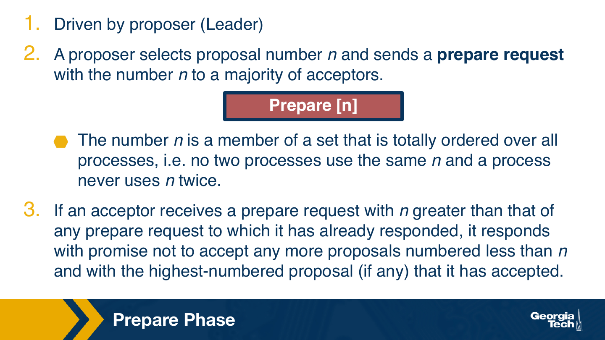

We will start discussing the prepare phase. Each consensus round in taxes is driven by an initiator called a proposer, and you can think of this as the leader of the round. The proposer will select proposal number n, and then sends the prepare request with the number n to a majority of acceptors. The number n is a member of a set that's totally ordered over all processes, meaning that there won't be any two processes that will use the same end, and a process will not be reusing the same end twice.

If an acceptor receives a prepare request with n that's greater than that of any prepare request to which it has already responded, then it responds with a promise not to accept any more proposals with a number less than this value n. If an acceptor has already accepted a higher numbered proposal, then it will respond with that number so that the proposer knows it has to advance the proposal numbers it will use in the future.

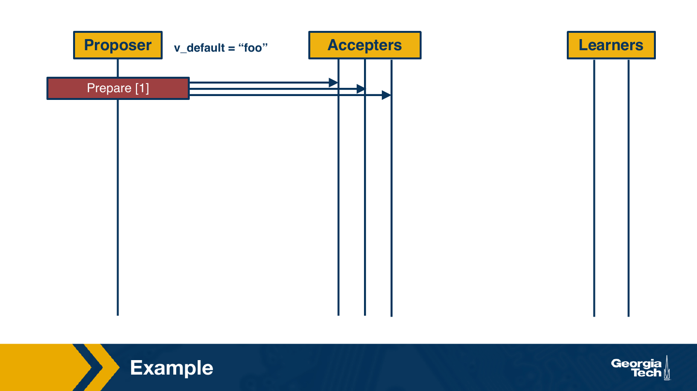

For instance, here, the proposer wants to propose some value, let's say foo. It starts the prepare phase. It chooses a proposal number one in this case. It sends this to all acceptors. The acceptors are the other notes that participate in the consensus, and the agreement needs to be reached among the proposer and at least the majority of the acceptors.

There are other nodes in the system. These are called learners. These are the clients that will at some point want to learn the value of a proposal by contacting a sufficient number of the participants, sufficient number of the acceptors. I should point out that any one of the acceptor nodes could be a proposer. The proposer is not some special designated node in paxas. And in that sense, there may be multiple proposals happening in the system at the same time. That's why the proposal number is an important element of the protocol, because it lets us differentiate among all of these ongoing proposals, and it allows us to order them.

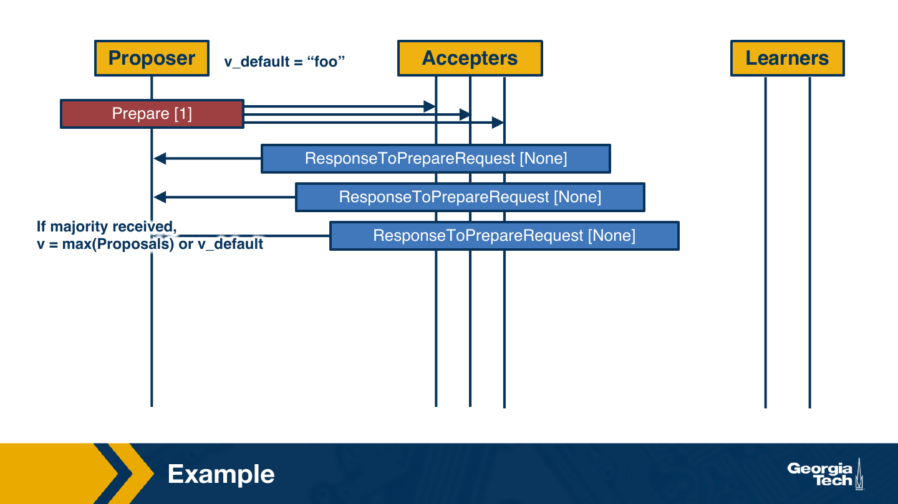

When a participant, an acceptor, receives the preparer message, it looks at whether it is able to make a commitment to commit to this incoming proposal given the proposal ID. Again, if the acceptor has not previously agreed to anything else, it will be able to agree to the proposal. It will send the promise to indicate this agreement in the response to the prepare request. That's the case in the scenario in this example, and we will look at what happens in other cases shortly.

A key thing with Paxos is that it is designed to work correctly even when notes fail and then later restart and rejoin the system. To achieve correctness, everything that happens needs to involve a confirmation from a majority core. If there are n nodes in the system, the proposer has to receive agreement from at least n over two plus one responses for a majority quorum to be met. So this completes the prepare phase.

## 8. Paxos: Accept Phase

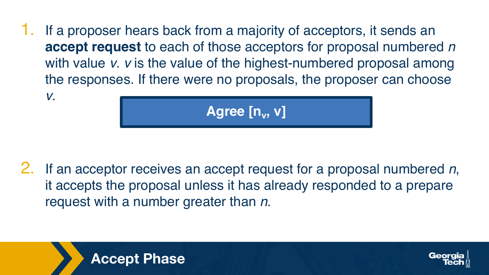

Next, let's look at what happens in the accept phase. If a proposer hears back from a majority of acceptors, it sends an accept request to each of those acceptors. The accept requests will have the proposal number n. You also include the value. If based on the responses, the proposer learns that there was a value that was already agreed upon, it will communicate this value. Otherwise, it is free to choose whichever value it wanted to propose. That was foo in our example.

If an acceptor receives an accept request for a proposal number n, it accepts the proposal unless it has already agreed and responded to a prepare request that came from some other proposer and which had a higher number than the number n that it's currently looking at.

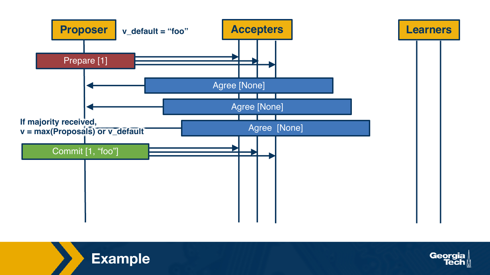

So let's continue with the same example. Here, all acceptors agreed to the prepare proposal message, and they responded that they have not accepted anything else before. Since a majority of responses was received by the proposer and there isn't a higher number proposal that was previously accepted, the proposer is free to choose whichever value it wants. And so it sends a notification. It sends a commit message to all the acceptors with the proposal number one and the value foo.

## 9. Paxos: Learn Phase

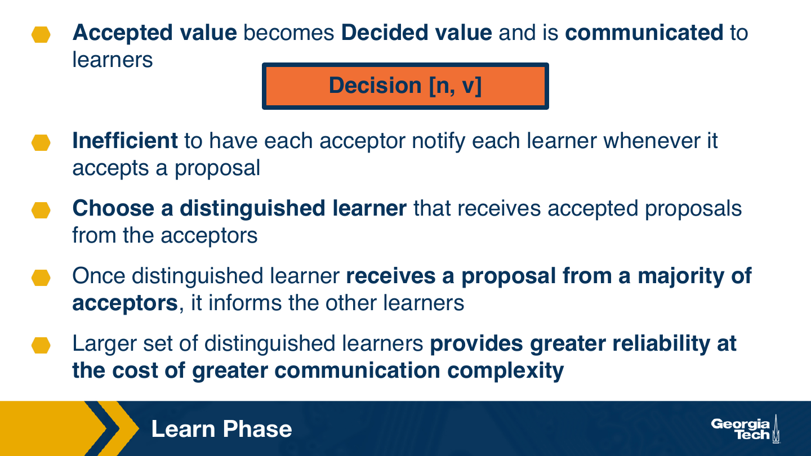

The prepare and accept phase of the proposal form the right side of the operation of the protocol, when someone needs consensus, when writing a new value in the system, it's trying to change the state somehow. There is also a read phase when the clients access the notes to learn what has been agreed upon in the distributed system notes. And this is what we call the learn phase.

When an acceptor receives a commit message, it knows the value that has indeed been accepted for that proposal ID. The accepted value at that point becomes the decided value, and can be communicated to learners. We can alternatively think that a learner can send a learn or a read request to some of the acceptors, and this is the value that it will receive in response.

Remember that notes that participate in the agreement may fail and restart, and because of this, the read has to be done by a majority quorum again, meaning that a learner would need to receive a matching decision from a majority quorum of acceptors. To achieve this, every acceptor, or at least every working acceptor, would need to send a decided value to a learner, and this can be quite inefficient.

One way to address this is to choose a distinguished learner that receives accepted proposals from the acceptors. Once the distinguished learner receives a proposal from a majority of the acceptors, it informs the other learners, or they can just make a read request to this learner when they need it. This, in a way, separates the nodes in the system that have to be involved in enforcing the correctness of the rights, so these are the preparer and the acceptors, from the notes that are involved in the read, the distinguished learner. This technique of separating which nodes serve rights versus reads is commonly used in distributed systems, since often, if all nodes participate in both types of operations, we end up with both slowing down the writes and the reads.

Now, you can easily imagine how we can improve the reliability of the system, of this kind of solution, by having not just one distinguished learner, but a set of designated distinguished learners. And this will, of course, come at a cost of some more additional communication.

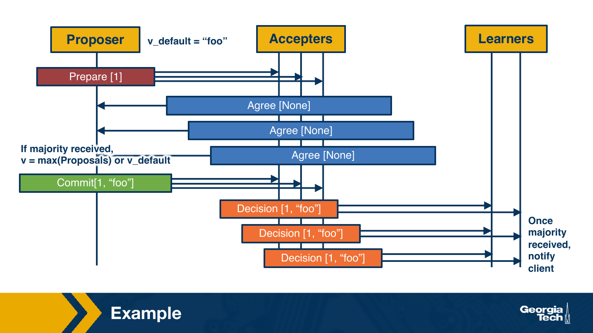

To continue with the same example, we stopped here at the proposer sending the commit message to all the acceptors. When received by the acceptor, the acceptor now knows the value that's accepted. Proposal 1 has a value of foo, and it can disseminate this decision to all learners, or to all distinguished learners. When a learner receives identical decision messages from the majority of the acceptors, it knows what the decision is. And then if any other clients need to be notified, they will be.

## 10. Corner Cases

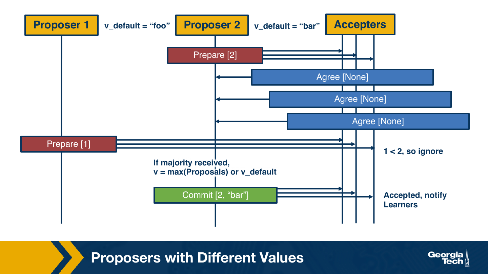

So with this example, we presented a very simple case. There was only one proposal. No note failed, and the acceptors had not agreed to nor accepted any previous proposals. In practice, this ideal case may not quite work out like that, and all of these other situations may come up.

For instance, there may be a scenario where two of the nodes in the Paxos group are trying to propose something at the same time the way a node chooses a proposal ID is such that it combines some local counter with a node identifier, and this is how the protocol ensures that the IDs can be different. So these two proposals that are happening at the same time will have different proposal IDs based on which they can be ordered. Let's say in this illustration, the acceptors first receive a prepare message from proposal ID number two and agree to it. Now, our proposal ID with number one also shows up, and the preparer message with ID 1 is sent to the acceptors. When they receive this message, they'll realize they've already made a promise to agree to a proposal with a higher number ID, and therefore, they will ignore this message. Proposer 1 will eventually figure out it has no log. So the proposer one can retry a proposal with a higher number.

Also note here that despite the fact that the proposal by proposer number one was issued before an agreement was finalized for proposal number two, the protocol allows proposal number two to actually continue and be completed. Proposer number two will ultimately receive majority of these agreement messages, and will decide that it is going to commit proposal number two with the value of bar.

### 10.1. Preserving an Accepted Value

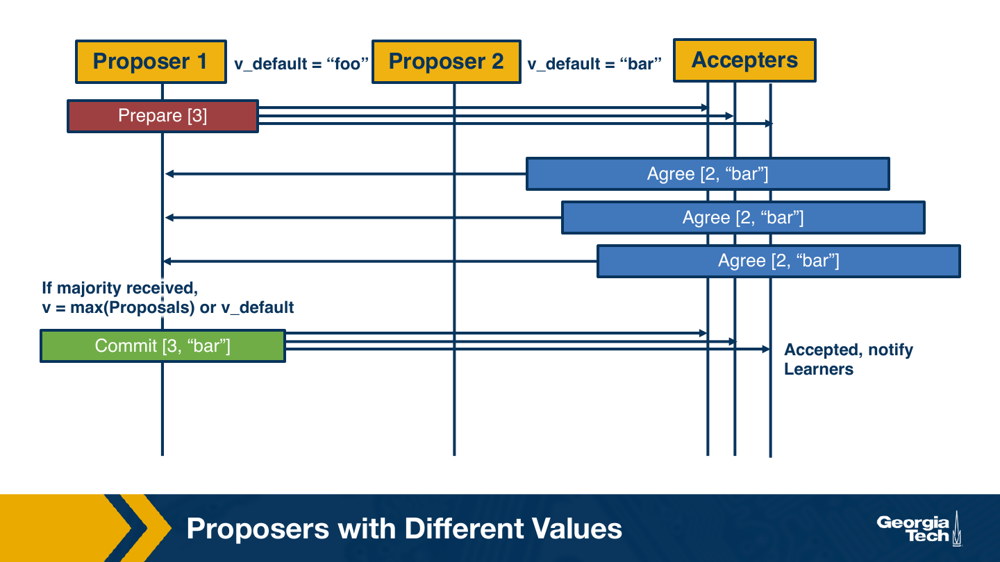

Now here is another important aspect of Paxos. We said that reaching consensus of a value means that once the agreement has been reached, this agreement will persist. The value won't change sometime later. If you think of the Greek parliament for a second, then once they decide a decree, it will be written in the ledger, and it will stay there. There may be later laws that will be agreed upon that will supersede that earlier one, but the value of the earlier decree won't change.

So this is what Paxos guarantees as well. Once the nodes agree what is the state of the system, let's say in this case that the value is that of bar, based on proposer 2, the proposal that it issued, then let's assume there is a new proposal that's coming from another node. Maybe this is the same note proposer one, whose proposal ID one was ignored earlier. So now, this proposer will send a preparer message just like before.

Now, in this case, the acceptors have already accepted a value, so their response is that they can participate in a proposal as long as its value corresponds to the value of the proposal that they had already accepted, the highest number accepted proposal. So here, all acceptors respond that they can participate in a round as long as it corresponds to the value bar which was agreed upon in proposal number two. So the proposer will receive a majority of these agree messages, and what paxis will do in this case, it will allow forward progress. It will allow proposer one to commit this proposal with the desired ID 3, but with the already accepted value bar.

The thing to note here is that the acceptors insist on the value bar, because they've already accepted it. If the prepare 3 proposal came before the accept operation was completed for proposal 2, then the acceptors would have discarded the previous promise to proposer 2 and would have issued a new promise to this new proposal, because proposal 3 had a higher ID. These proposal IDs are used in the protocol as timestamps.

## 11. Paxos vs. FLP

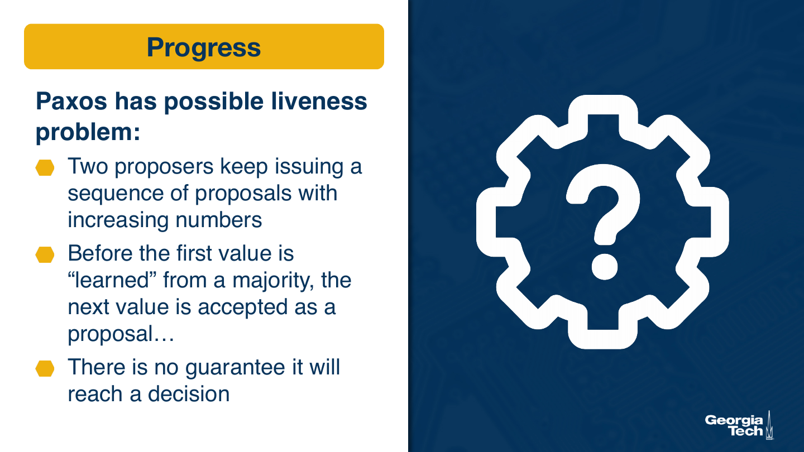

Remember now, we said that Paxos is not at odds with the FLP theorem. What do we mean by that? It is a protocol that makes it possible to reach a consensus, but it doesn't guarantee that progress can always be made. It doesn't guarantee liveness.

This situation we described at the end of the previous module is such that two proposers keep issuing a sequence of proposals with increasing numbers. If before the first value is accepted by the majority of the acceptors, or even learned by the majority of learners, next value in the system comes in and is accepted as a proposal, then no note will receive a majority quorum for the previous value, and this previous value will not be learned. If this continues, then there is no guarantee that the system will reach a decision. There's no guarantee that the system will be making forward progress.

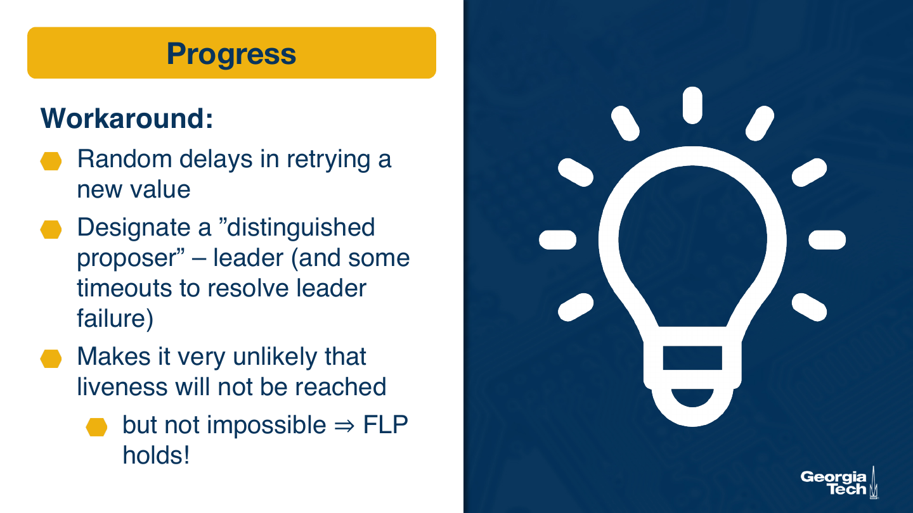

To prevent the situation like this, there are some common workarounds. The proposer nodes can use some random delays when they're retrying, or before they retry a new value, so they don't repeatedly cancel out each other's proposals. The system can also use some modification where a single proposer is designated as a distinguished proposer, as a leader. And again, we can introduce some timeouts here to deal with potential leader failures.

With these workarounds, in practice, it becomes extremely unlikely that the liveness problem will occur. Ultimately, the timeouts will ensure that proposals are not being submitted at the same time, and one will become a winning one, one of the proposals. Note however that these workarounds just make it very unlikely that consensus will not be reached, but they don't make it impossible, meaning that FLP still holds.

## 12. Multi-Paxos

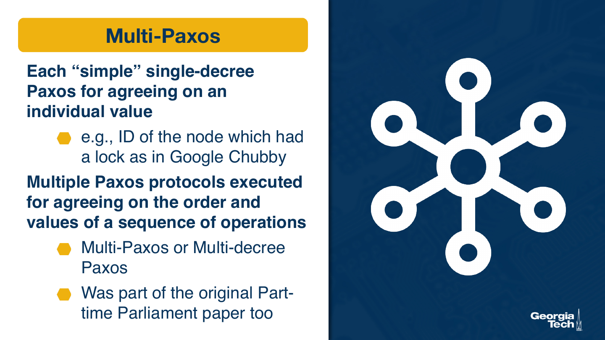

Paxos allows the system to agree on a single value. In practice, program executions require entire sequences of updates to the application state, to the database, and so forth. And this is achieved by multiplexes.

In multiplexes, each simple single degree pexis would be used for agreeing on individual value. For example, this value can correspond to the ID of the node which has a lock. This is a real example of Paxos used based on a service that's used by Google called Chubby.

In practice, nodes need to agree on the order and values of a sequence of operation. For instance, it's not just one log holder we care for, but we want to guarantee that the information about the sequence of log holder updates is consistently seen or learned by all of the clients in the system. And to do this, paxis becomes what's referred to as multipaxus, or multi-decree access. This is actually not an afterthought or a later extension of the protocol. This was part of the original part-time parliament paper too.

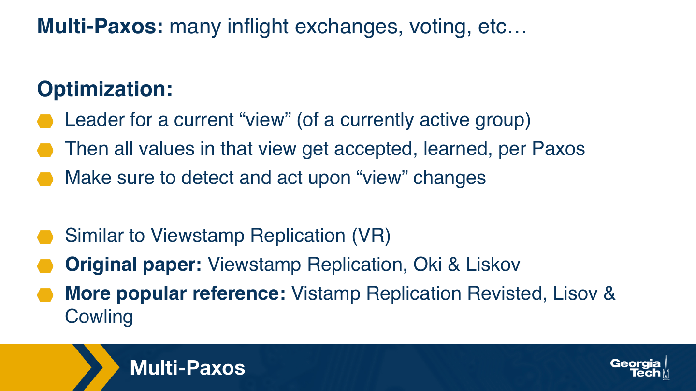

Clearly, running multiple access exchanges for different proposals makes everything more complicated. There are many more messages that are in flight. To optimize this, there are a number of common techniques. One of the common techniques is to separate the stages of the execution where only one proposer is allowed to submit winning proposals. That proposer becomes a leader. Having a leader makes sense only with respect to the current active group of participants in the protocol. If more nodes join, or notes fail, it may be necessary to elect a new leader. When a leader is elected, it's as if a note becomes in charge of the current view of the system and its currently active nodes.

Once a leader is elected, all values in that view get accepted and learned per Paxos as before, in the order in which the leader proposes them. It's important to ensure that nodes can detect when a leader and a view need to change. This protocol is very similar to another famous consensus protocol known as view stamp replication, or VR. View stamp replication was originally presented as an idea only, by Oki and Liskoff in their pay-per-view stamp replication, and later, it was revised in viewstep replication revisited.

## 13. Paxos in Practice

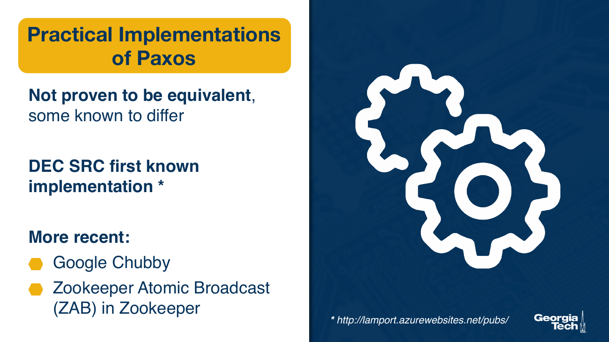

Praxis has been around for quite some time, and there are a number of implementations of the protocol which are used in practice. The first known implementation, according to Leslie Lampert himself, is the one that's used at dex systems research in the 90s. This effort is what in part motivated Leslie Lampard to resurrect the old project, the old rejected part-time parliament paper, and to finally have it published.

More recently, paxis has been incorporated, in some cases with some modifications to the specification, in a number of real systems. More famous are the Google chaby service that we mentioned already in the log example, and also a similar system that was originally developed and open sourced by Yahoo called Zookeeper. It implements a variant of the paxis protocol. These systems are used in practice by data center scale applications to deal with log management, synchronization, so clearly scenarios where consensus is critical.

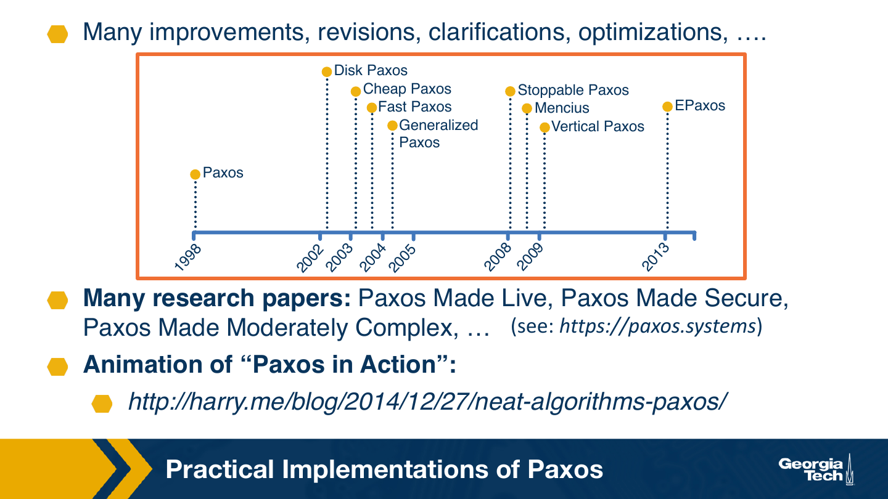

There are a number of other implementations of paxas, and I'm including here a timeline illustration of some of them published in a blog by the author of one of the more recent research papers taxes made moderately complex, Denise autobook and her name. She was a PhD student at Cornell and is now at Google. The blog is published at the site Paxos.systems.

A number of other papers have been published incorporating other improvements, revisions, clarifications, optimizations, to some elements of taxes.

Given all of this, there is a lot of information available on Paxos online in many different formats. This website here, for instance, includes an animation of taxes in action where you can see what are the different types of messages and outcomes that can happen during different phases of the protocol.

## 14. RAFT

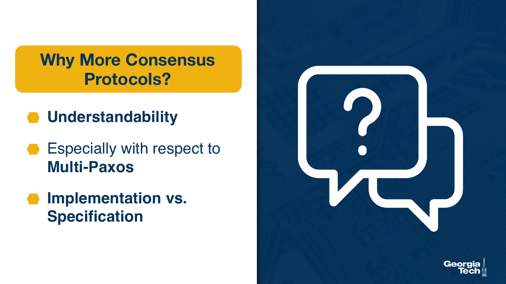

Now we'll look at another protocol for consensus called Raft. So if Paxos was proven and practical, used in all these systems, why do we need more algorithms? The main reason why this has been the case is tied to understandability. What this means is whether the protocol is indeed sufficiently simple, so that practical implementations can be accomplished per specification. Remember, the specification of the protocol is what is proven. If the implementation doesn't follow the specification, then we cannot guarantee that the implementation is correct. In this case, even trickier as one starts to add optimizations to improve performance. And with Paxos, the argument is that really there is a lot of complexity even in a single agreement round. And in practice, distributed executions need to go through many agreement rounds, and really, we're talking about multiplexes that we care for.

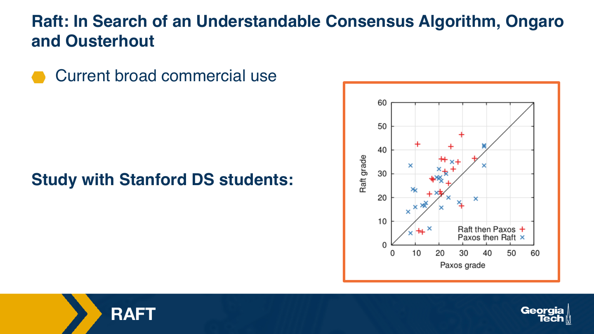

The answer to this understandability problem is Raft, a protocol that was proposed by onongo and astor haute in 2011. Like Paxos and its variants, Raft is also broadly used in real systems, has real deployment. And given that it's a much newer protocol, clearly, it has seen a lot of quick adoption.

The authors, as part of the paper, did an actual user study to evaluate the understandability claim for Raft versus Paxos. Here in this figure from the Raft paper, they show how students score on a Raft versus Paxos test. Students were divided into two groups: one which took the pax's lesson before the rant lesson. The second one took the lessons in the opposite way. We see that regardless of the order of instructions, students scored higher on their understanding of Raft versus on their understanding of taxes. And the paper includes some additional data to support their understandability claim.

## 15. RAFT Overview

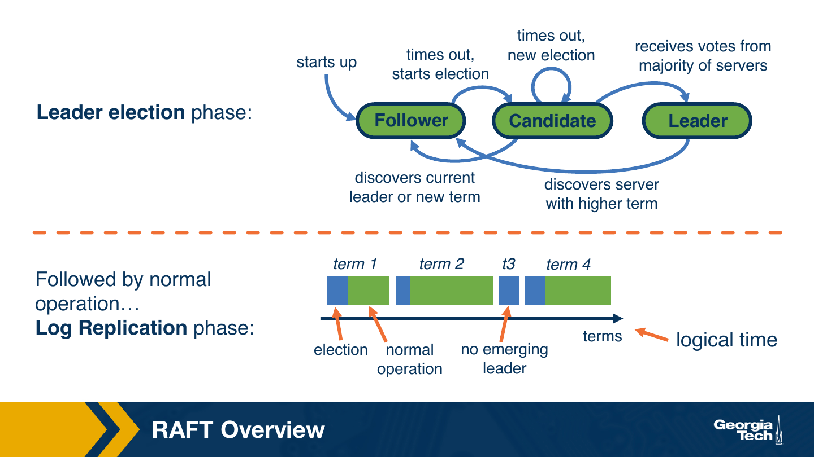

Let's look at a brief overview of Raft. Unlike Paxos and multipaxus, Raft has a distinct leader election phase. Like in Paxos, anyone can be a candidate for a leader, but only a note which receives most votes becomes one, is elected to p1, and the rest are followers.

After a leader is elected, the normal operation phase starts, which is that of log replication. During this phase, the leader makes proposals for updates and replicates this information among the followers. Each time a new leader is elected, Raft refers to as a new term. This is similar to what would be called view in view step replication, for instance. A leader can be active for an arbitrary duration, or for an arbitrary number of updates to the log replication phase. By explicitly separating the leader election from the log replication phases, Raft makes it easier to reason about the behavior of the system and to keep track of which proposals should be winning proposals versus not.

## 16. RAFT Leader Election

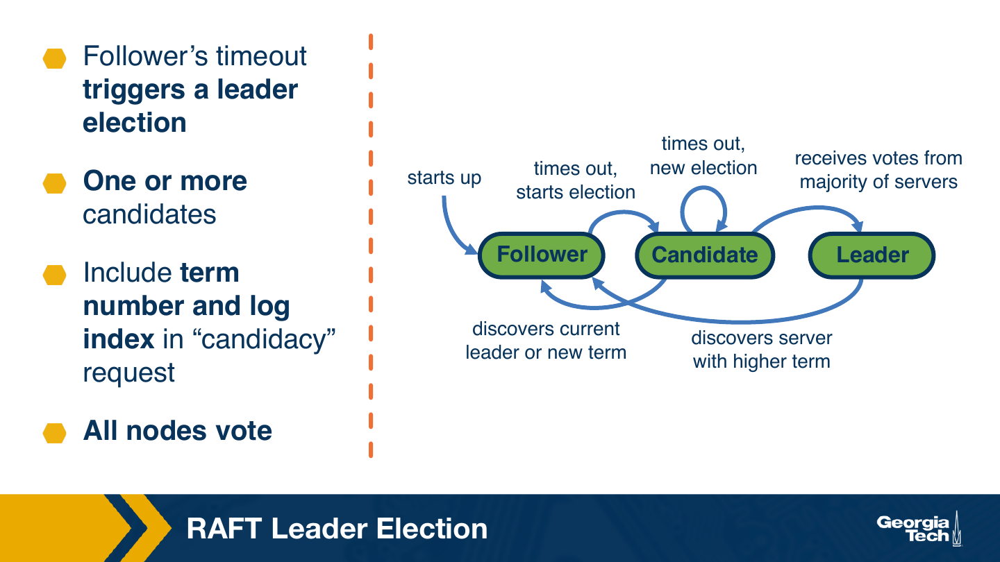

Let's look at the leader election phase. All nodes in the system exchange heartbeat messages with the leaders to know that the leader is still active. If any of the followers times out, does not receive in time a heartbeat message from the leader, you will assume that the leader has failed, and it will start a leader election phase.

Any server that's applying to be a candidate for a leader will send a message which will include information about its current term, remember, we said this is like the equivalent of view, and the index of the most recent event in this note's log. This message will be sent to all nodes. All nodes in the system have the right to vote, and the leader is elected based on majority votes. Notes and Raft follow a set of rules which guarantee the election safety property, which is that there will be at most one leader in any term.

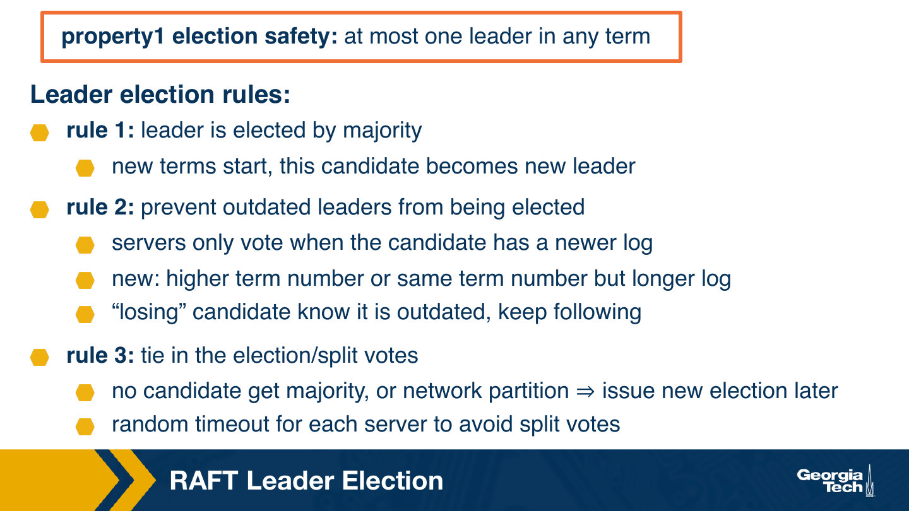

There are few rules for this phase. The first rule is that a leader is elected by majority votes. When a candidate becomes a leader, a new term starts. The second rule says that a vote cannot be cast for an outdated leader. This prevents such leaders from being elected. What this means is that servers will only vote for candidates when that candidate has a newer lock. A newer log means that the server has, the server that's proposing to be a leader has a higher term number, or it has the same term number, but a longer lock. This makes sense. We don't want to have a leader which doesn't have current up-to-date information about what's going on in the system.

The other thing that will happen during this leader election phase is that losing candidates will learn that their log is outdated, and they'll become followers. But you know, now they have information that they need some catching up to do in the system.

Rule three deals with the fact that there may be a kind of elections when votes are split. This happens when no candidate gets majority, or when there is some sort of network partition. To ensure liveness in the protocol, in this case, Raft adapts a similar approach as to what's adapted in Paxos and uses some random timeouts, random delays, for each of the servers and then restarts the leader election phase. But given the random delay, not all of the leader candidates will restart this phase after the exact same period of time, and that's why it's more likely that we'll end up with a winner.

## 17. RAFT Log Replication

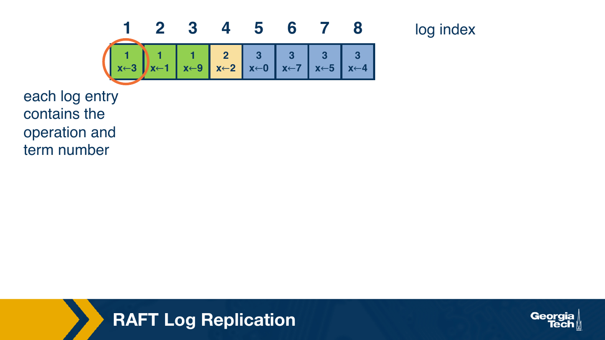

We will illustrate now the log replication phase. Each node maintains a log of entries. A log entry contains the information about the operation that was performed, for instance, that x was updated to the value 3. Each entry is identified by the term during which it occurred and the index in the log.

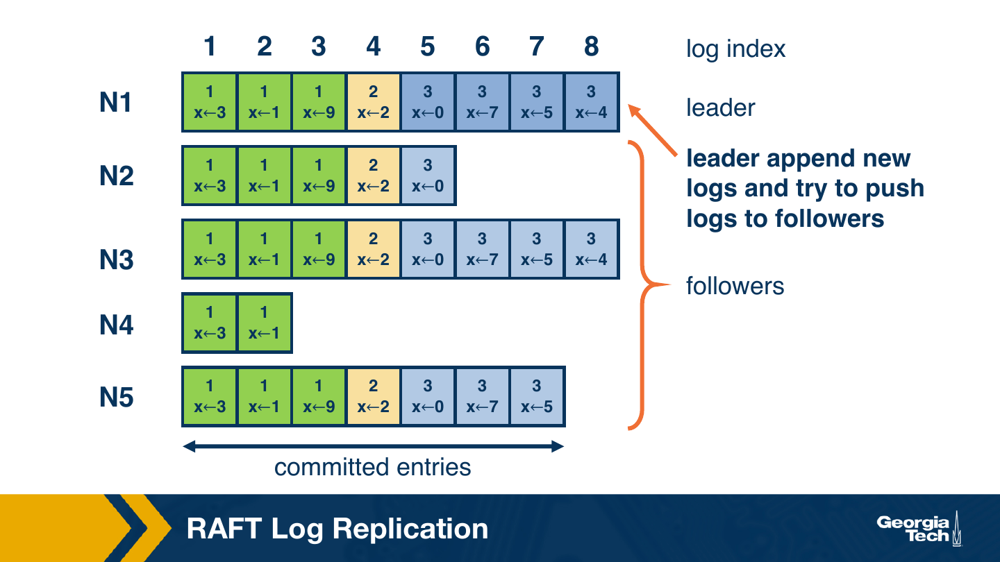

Let's assume the first node is the node which has been elected as a leader. This makes sense, since this node does not have a shorter log than the others. The leader accepts requests for updates from clients, appends these to its long, and then tries to push them onto the logs of its followers.

The followers may be up to date, which is the case with the third node of the system, for instance, or they may lag behind. In this figure, node 4 is a node that likely has failed for some time since it has missed information about updates which have occurred in the previous terms. Unfortunately, this can easily be detected once the node is live again, and it can retrieve all the missing log entries from the leaders, and then add them to its log and replay them in the correct order.

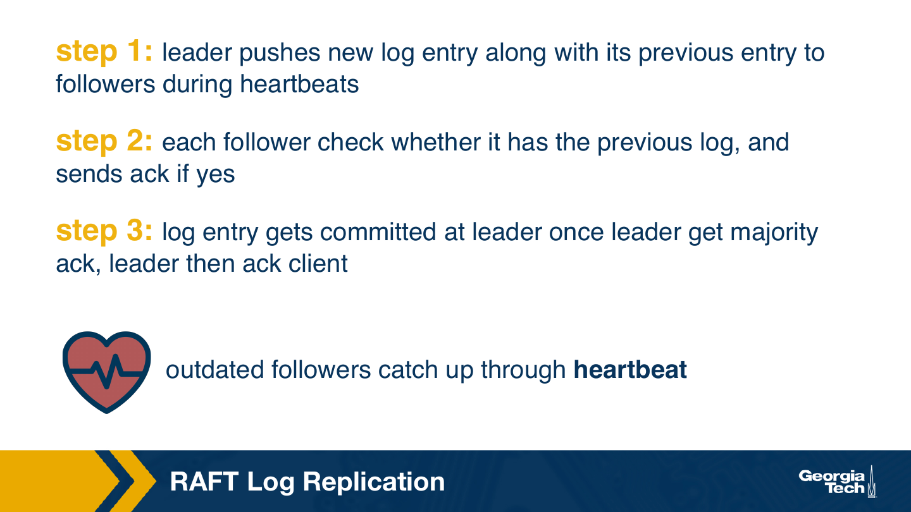

To replicate log entries, the following steps are performed. First, the leader pushes the new log entry, along with information about the previous log entry, to the followers. And it does this during the heartbeat. Each of the followers checks first whether they have the previous log entry. If they do so, that means that they are currently up to speed with the system, and therefore, they can now accept this incoming, this new log entry. If that's the case, then each of the followers will send yes as an acknowledgement.

If the leader receives majority of acknowledgements from the followers, it will at that point be allowed to commit the new log entry at the leader node. And the leader can at that point notify the client, whoever requested that this new log entry be committed in the system, that the operation has completed. The information that's exchanged during the heartbeats allows outdated followers to catch up.

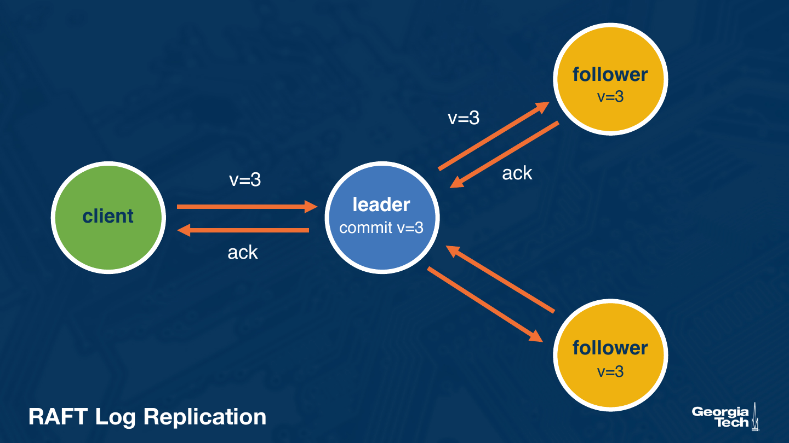

Here is a brief animation of how an update from a client would be replicated among nodes that are using the Raft protocol. The protocol will guarantee that there is a consensus on whether the update successfully is applied in the system, which value needs to correspond to the updated value, and how to order updates coming from multiple clients.

Let's say a client wants to add an update to the system that v is equal to three. It does this by contacting the leader. The leader replicates this information to the followers, waits for the followers to acknowledge, and if that's the case, it commits this information to its long, is free to acknowledge this to the clients and move on.

### 17.1. Log Matching and Leader Changes

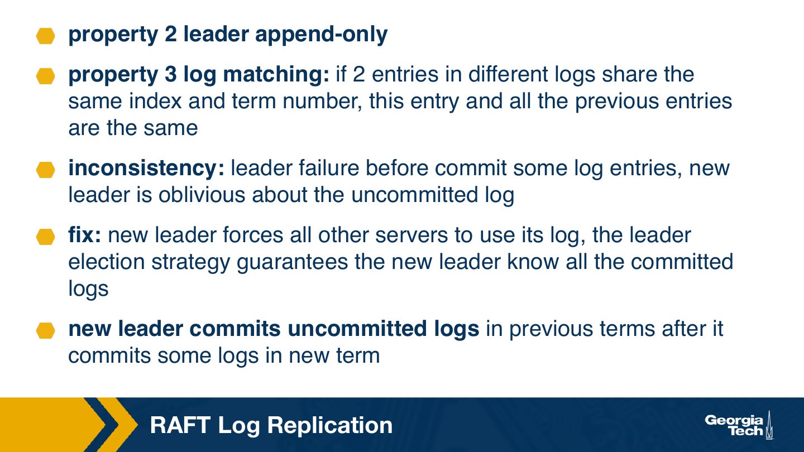

The following steps make it possible to guarantee the correctness of the execution during the log replication phase. First, we rely on a property that the log at the leader is an append only log. Next, we rely on the fact that we have an append only long, in order to achieve this next property, which is that of log magic, that it is possible to compare the longs at two different nodes, and decide how to order them, which one is lagging, and so forth. In Raft, it is possible to compare the logs in a rather simple manner. If two entries in different logs share the same index and the term number, then this entry and all of the previous entries will be the same. These properties make it possible to keep track of which is the value that needs to be chosen as the next value, or the most recent one, by the consensus protocol.

It is possible for a leader failure to occur before committing some log entries. In such a scenario, the new leader obviously will not know about these uncommitted portions of the lock. Fortunately, this is okay, given the semantics of the protocol. The new leader forces all other servers to use its lock. The leader election strategy guarantees that the new leader knows everything about the committed locks. Any log entries which were uncommitted and the new leader was unaware of, may be discarded. The clients of the system will know that the update request was not successful. They will not receive that acknowledgement, and therefore, the clients will just have to try again.

If a newly elected leader has some uncommitted log entries from a previous term when he was a leader, once it becomes a leader again, it has a chance to commit these uncommitted logs in the new term. In that sense, if a client waits long enough, its request may in fact get committed, and it may receive an acknowledgement.

### 17.2. Snapshots and Recovery

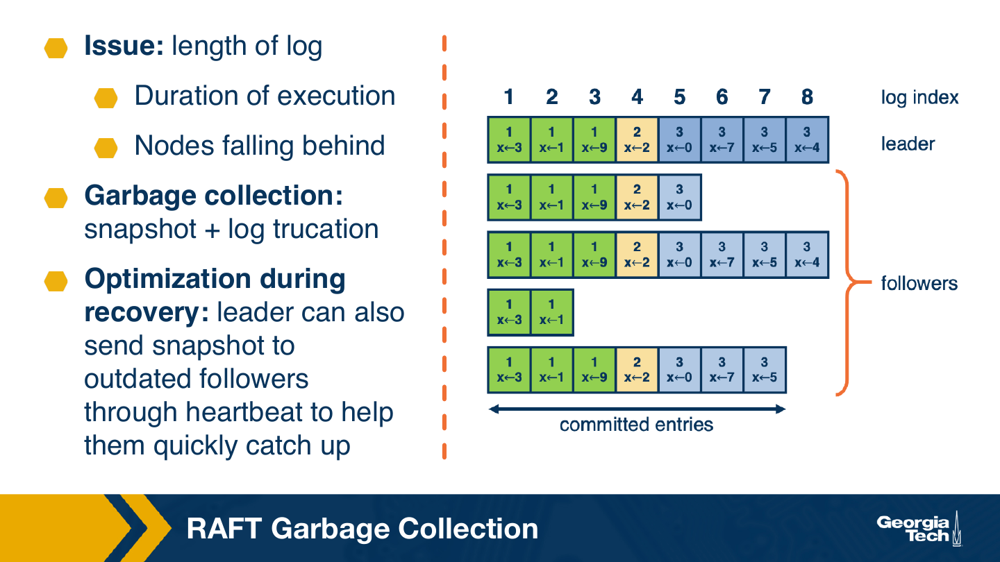

The log in the system may become quite long. It is also possible for a node in the system to have fallen quite behind, like for instance, note 4 in this case. Once it's back up, it will have a long log to replay in order to catch up with the other nodes in the system. A common way to deal with this is to periodically truncate the log by taking a snapshot of the node's committed system state. Creating a snapshot makes it possible to discard the older log entries and to garbage collect what's no longer going to be needed by anybody.

When a node such as node 4 needs to recover, Raft allows for the leader to send to it the current snapshot of the state, as opposed to the log with the sequence of updates which need to get re-executed to bring n4 to the current speed. This is a way to optimize the recovery process. You will possibly need to send more state, because you need to send the entire snapshot, and that may be longer than, maybe a larger amount of data than just the log. But then you don't have to re-execute all the steps in the log. You can just use that snapshot and restart immediately.

## 18. RAFT Safety

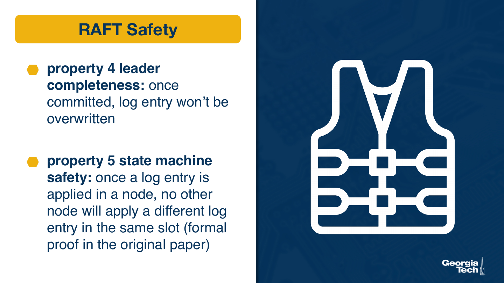

Grab guarantees safety by having the following properties. It has a property about leader completeness. Once committed, a log entry won't be overwritten. It also has a property about state machine safety. Once a log entry is applied in a node, no other node will apply a different log entry in the same slot of the lock.

All of these properties that we mentioned about leader election, log replication, about safety, the formal proofs that appear in the original longer paper about ram. And following these properties, this is what guarantees that Raft will ultimately allow nodes to agree upon a single value, that a single value will be chosen, and that eventually, it will be learned by all nodes.

## 19. RAFT in Action

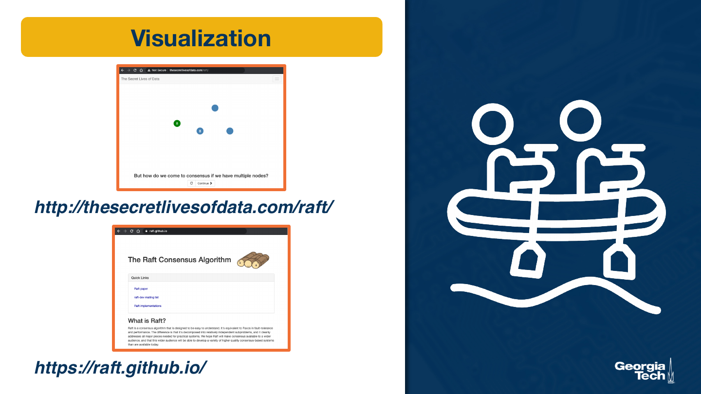

Like with Paxos, there is a lot of information online on Raft. I recommend the following two links which include, interestingly, some interactive animations of how Raft works, how the messages are exchanged, how values get selected, how leaders get elected. The Raft Github repository also includes a link to many known Raft implementations in different languages.

## 20. Summary

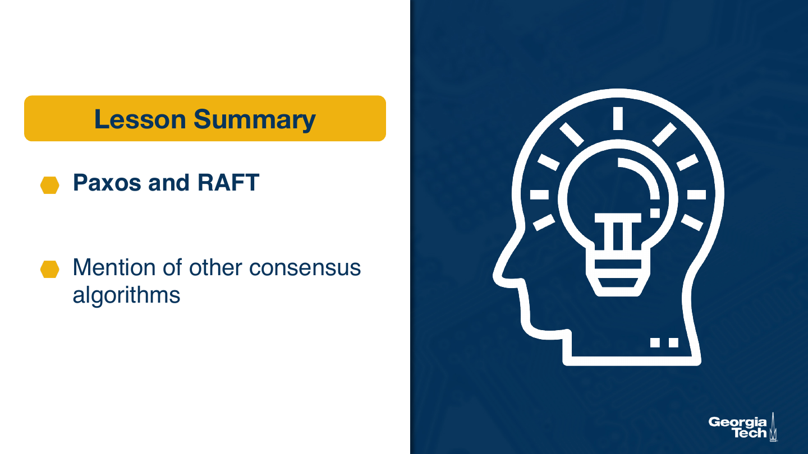

Let's summarize this lesson. We discussed two of the most popular consensus algorithms: paxas and rant. And we also briefly mentioned several other solutions which both influenced the design of these algorithms, or enabled further optimizations, and or operationalize them.
