# Lesson 11: Peer-To-Peer & Mobility

Source: [Lesson 11 — Video](https://www.youtube.com/watch?v=HOJ-loCbQy0)

## 1. Introduction

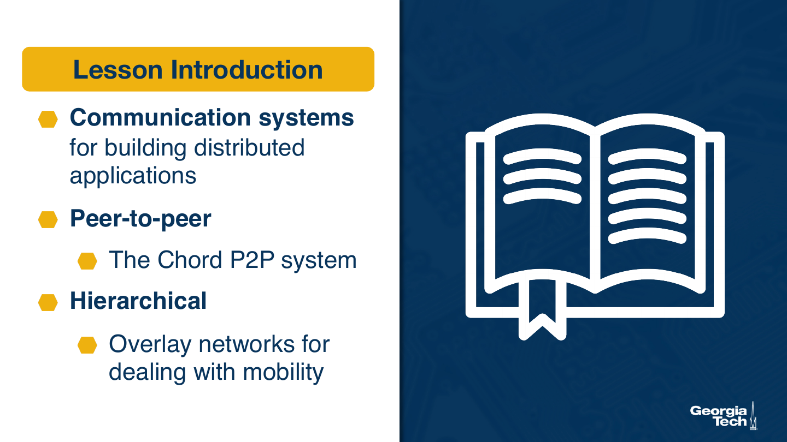

In this lesson, we will talk about some aspects of the communication services for distributed systems. In the previous lessons, we talked a lot about the communication among different nodes in the distributed system. In this lesson, we will talk about some aspects of the messaging layer on top of which distributed systems are built. Particularly, we will focus on two aspects: peer-to-peer communication, which is common in highly distributed and decentralized systems. For this, we will describe in more detail the Chord peer-to-peer system. And then we will also talk about hierarchical solutions for building communication overlay networks, for which we will describe how they can be used to address mobility in distributed systems, meaning situations where the participants move and it becomes important to understand where to send messages so they can quickly reach the destination even if the destination node or the user or client has moved.

## 2. Communication Support Assumed So Far

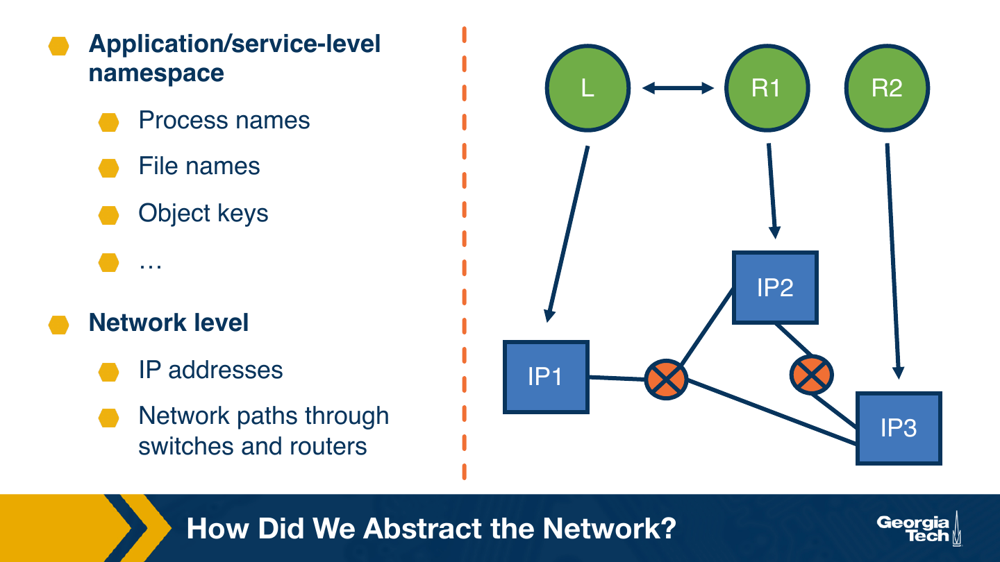

Let's first look at the assumptions we made so far about the communication support in the system. We talked about scenarios where a process, an entity in the distributed system running on one node, communicates explicitly with another process running on another node. Even in the situations we presented for replication or consensus, where ultimately the same information was exchanged among multiple nodes, we still described how this is achieved by multiple such point-to-point message exchanges.

At the application level, or even at the level of the distributed services, when we describe where a message should be sent, we do that with some application level identifiers. These identifiers specify, for instance, the primary node of a replication cluster, where they specify the node which stores a portion, a chart of the object, that corresponds to a certain key range. Basically, at these upper layers, there is some namespace that is used to specify the various endpoints in the system.

The same namespace needs to get mapped to the namespace that is used at the network level to identify who the messages should be sent to. The network level namespace, at this level, the identifiers are the addresses of the nodes. This can be IP addresses, or it can also be link level addresses if the system is intended to operate only in a cluster in a data center with a local area network.

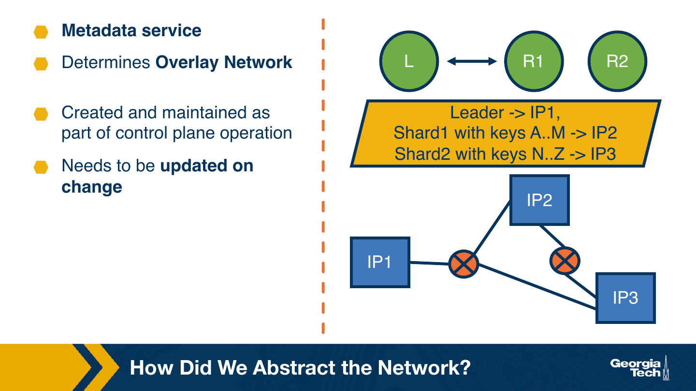

We can imagine that there is some intermediate state that is used to support this remapping. We can think of this as an overlay network. We describe at the upper level what are the endpoints we want to communicate with in the context of the overlay network, and this layer maps these to the exact network level addresses and paths that need to be traversed by the packets. As part of the control plane of the distributed service, when different processes are created and launched, the network address, say the IP address, will be recorded, and then the information about all the mappings can be distributed to all the nodes. We would need to be able to assume that this can be done each time anything changes in the system.

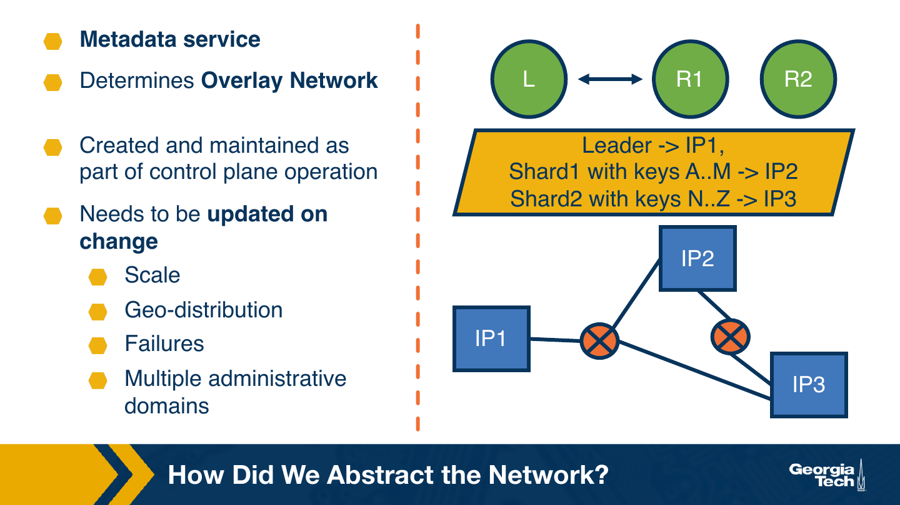

Now, note, we have to bring in this assumption about there being changes in the system forward. A system which is designed with an assumption that nothing changes will not be very useful. It will not be very general. At the very least, failures are a common thing in distributed systems, so we have to make sure that the design makes it possible to deal with failures, and therefore, to deal with some changes. A system which allows for these mappings to change can also be more easily reconfigured, for instance, if we need to scale it to a larger number of nodes, if there is an increase in the load in the system, or if we have to reconfigure it in some other ways if something about the workload dynamically changes over time.

As long as we have a way to make the correct network address available, we can make it possible for the messages to be sent to the correct node in the distributed system. But there are few more things that we care for. First, we need to make sure that the correct address can be determined quickly even when things change. As I said, it may not be realistic to assume that it can be quickly distributed to all the nodes which will want to communicate with a given node. And this is because the system is simply too large. Or basically, we need a solution that can be scalable and can be used with large systems.

This may be particularly tricky if this is a system where changes happen too frequently. So for a system that's very dynamic, that may imply that there is a need to distribute information to a large number of nodes very frequently, and this may introduce a lot of overhead. So we need to rethink this design.

Also, the nodes in the system may belong to different administrators. The system, in a sense, may be decentralized, so we cannot assume that we will always know where to distribute this information, precisely to which nodes we need to distribute it. And we have to make sure that we can deal with these kinds of situations.

In short, we need some mechanism that will allow us to maintain this state and to make it possible for messages to be exchanged among the different application level entities by ensuring that the corresponding network level identifiers can be discovered and used even when we have to deal with all of these issues related to scale, to geo-distribution, failures, decentralization, and so forth.

## 3. Interconnect Support

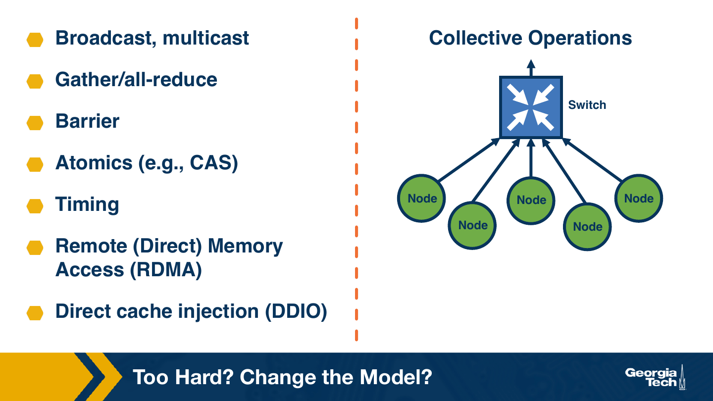

Let's say a few words about the interconnect network. This is the network device hardware and drivers that are used by the communication services. We will not go into this in much detail, but for completeness, let me say that the network itself may provide capabilities to do much more than just send messages from source to destination.

At the most basic level, it typically is realistic to assume that there is support for broadcast, or for sending a message from a one node to all the nodes in a group of nodes, or in the network, or multicast, from one to some of the node in the system. This is supported as a combination of the network interface card, the driver, and also the protocol stack. At the very least, this can include some capabilities for the network interface card to recognize that a packet is addressed as a broadcast packet or as a multicast packet, and then the node belongs in that multicast group. And this capability would be a combination of something that's in the protocol, in the devices, and also in the switches in the network.

Broadcast and multicast are example of what we refer to as collective operations. More advanced networks include support for other types of collectives. For instance, collective operations include support for various m-by-n communication patterns where there are messages among multiple nodes. An operation that's referred to as gather or all reduce is a communication operation where a node waits to receive messages from all of the nodes in that communication group. Collective operations can also serve as synchronization primitives. A barrier, it's like a binary getter operation where all nodes need to ensure that everyone has reached that barrier point before they continue to the next phase of the operation.

Also, the interconnection hardware can include support for atomic operations, such as compare-and-swap. This is a sufficiently general and popular atomic operation that's available in current high-end interconnection networks.

Some other relevant features include the fact that some of the recent interconnects include some support for timers, for for timestamps to be generated by the network hardware itself, so for packets to be timestamped with some counters that denote real time including. And these timers are maintained on the network devices, on the NICs and switches. This is helpful, because in such scenarios, you don't have to rely on the host CPU to generate those timestamps. This can be particularly important given the fact that very dominant in data centers what's called remote direct memory access, or RDMA. This allows packets to be transmitted from one node to another directly by relying on the network support, without having to engage the CPU on the individual nodes. And so if you can rely on the NICs to provide the timestamps for such communications, that's really helpful.

Another important feature is support for directly injecting data into the caches of the nodes that are communicating. This is useful, because in such cases, you don't have to make a memory access in order to retrieve the data that was received, but can directly find the payload of the data directly in the caches. And we know that there is a huge difference between accessing data from caches versus even from the local memory.

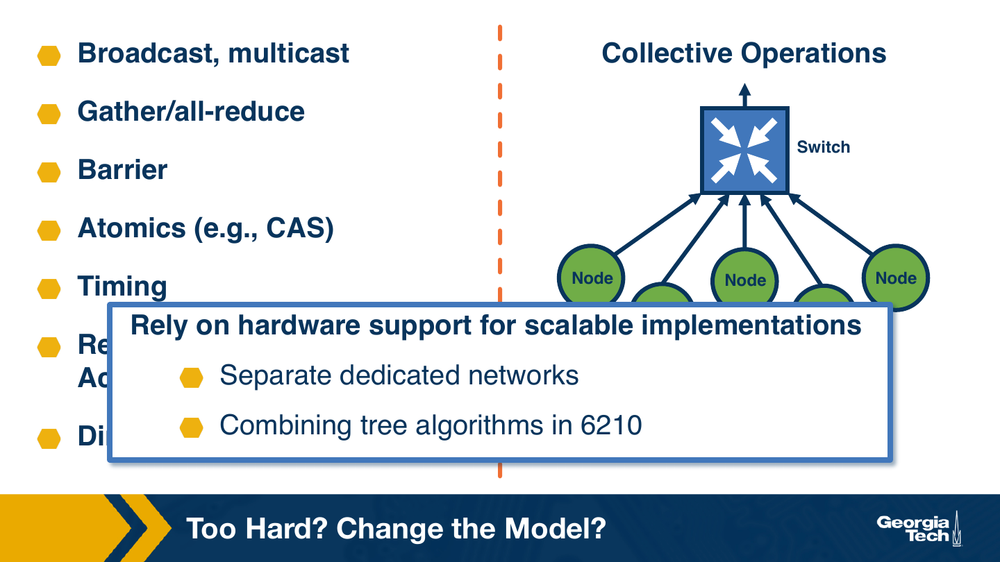

So all of these types of functionalities require some additional support from the interconnect in order for us to achieve scalable implementation of this functionality. In some cases, this is as extensive as actually including a separate dedicated network. For instance, in some of the high-end high-performance computing systems, it's not uncommon to find dedicated networks specifically implemented for some types of collective operations. One example, you may remember in CS6210, we talk about the tree combining algorithms for barrier implementations, and there are some high-end systems that provide supports for them in the interconnect itself.

## 4. Peer to Peer Systems

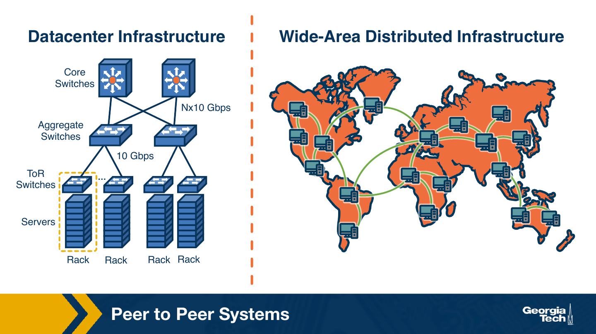

Let's now take a completely opposite view of a distributed system where we cannot make any assumptions about the hardware capabilities supported by the interconnect. For us to rely on some advanced capabilities of the interconnect, we need to make assumptions that all nodes in the distributed system have been outfitted with the same infrastructure. More importantly, these kinds of high-end capabilities are available for interconnects for building tightly coupled data center clusters, data center systems. Looking more broadly across the wide area internet network, the only assumption we can safely make is really the presence of IP, of the internet protocol.

So here, the question of how to manage the mapping of application level identifiers to network level identifiers, or IP addresses, is still open. This is particularly tricky when the wide area application needs to run across nodes that do not even belong to the same organization and are not managed by the same administrator, like say, what we could assume with the Facebook or Google distributed data centers.

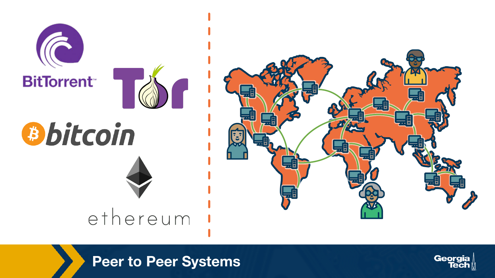

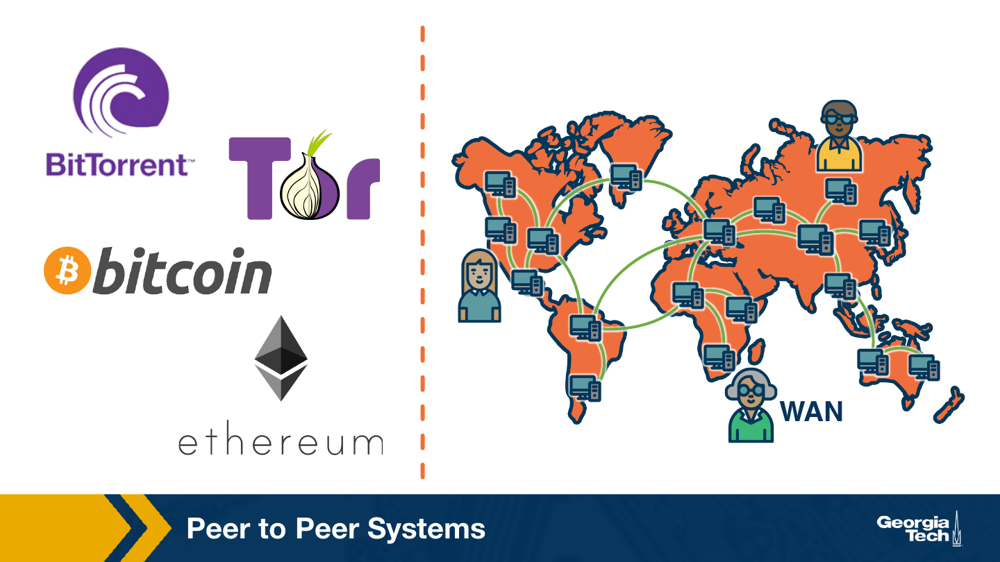

One important class of such applications is represented by peer-to-peer systems. There are many popular examples of peer-to-peer systems, particularly for sharing of content, music, videos. As the name suggests, all nodes in such a system are peers, meaning no one node is more important than another, and that they collaborate or cooperate and help each other as real peers would always do. One characteristic of such systems is that the only thing that they assume about the network is that they can use IP addresses to communicate among nodes. There is no other assumption about other protocols, and no other assumption about the scale of the network, or about some particular structure or topology of the network. I highlight this, because what we'll say about peer-to-peer systems can also be applied in a data center, or in applications and services used in the same organization in large-scale distributed systems.

## 5. Connectivity in P2P

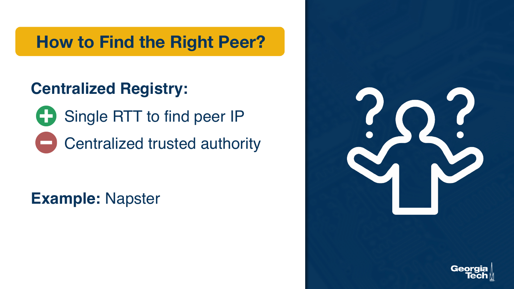

So how did the peer nodes in a peer-to-peer system find out how to connect to each other? One way to do this is to assume that there is a well-known centralized registry that everyone can register with. This, in a way, is a similar assumption is what we have in centralized services for data centers, that there is some central entity that knows which process runs where, which data is stored on which server, and this information is used by all nodes to ensure that requests can be appropriately routed. The peer-to-peer music sharing service Napster, which maybe you have used it, or maybe you recall it as part of the story about the history of Facebook from the movie the social network, was an example of a peer-to-peer service where the information about which songs were available through which peers was maintained centrally.

The fact that there is a centralized entity that has the information about how data is mapped to different peers makes it possible to find out which peers should be contacted within a single round-trip time. You just need to contact the centralized registry, and you find out this information. This, of course, is positive. However, the centralized registry is both a single point of failure, and also, it presents a possible limit on the scalability. Finally, we have to assume that all the peers have to trust that entity.

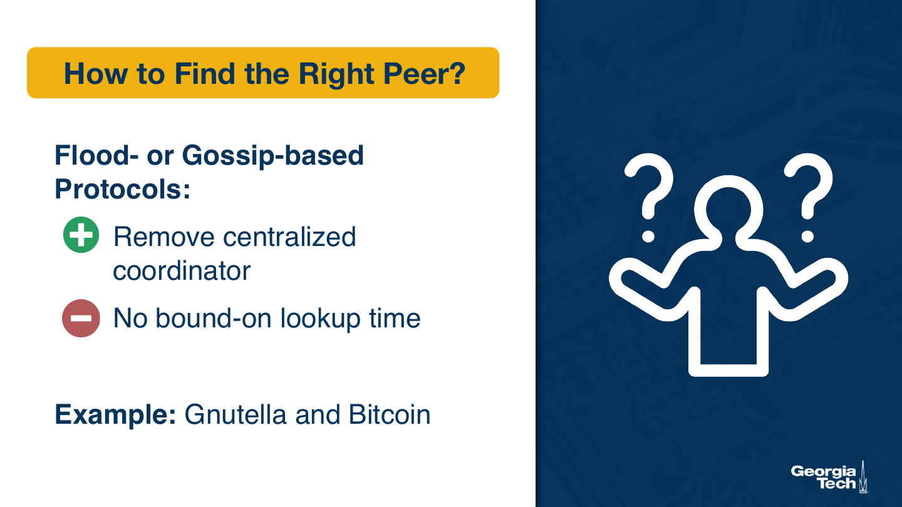

Another approach is to completely eliminate reliance on any centralized authority, and to use the so-called flooding or gossip-based protocols. As the name implies, each peer would just broadcast the information about the content it stores, or about the requests that it can or it needs to serve, to everyone. And in this way, eventually, the right target node will be identified. This approach does not make any assumptions about a trusted or a centralized authority. However, it also does not provide a bound on how long it would take to find that the right peer. Gnutella was one of the original systems which used the gossip-based protocol, and also, the Bitcoin peer-to-peer system relies on a gossip protocol.

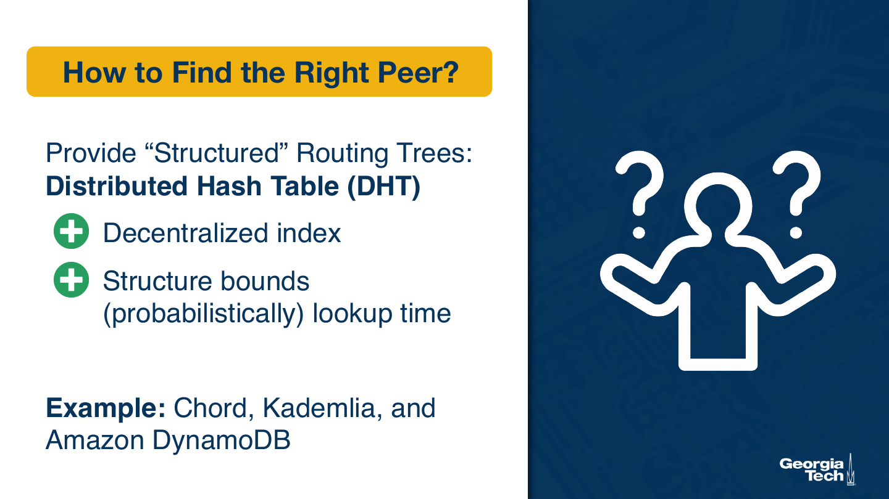

Finally, a more popular approach is to use a distributed hash table algorithm, or a DHT. This kind of approach allows for a decentralized index, where many nodes can be involved in providing information about how the data or the service is distributed among the many peers. And the structure of the DHT such that it makes some guarantees about how many lookups it will take to find the information about the right peer, at least probabilistically, kind of in the best case, or at the average, or in most of the cases.

Chord is one popular example of a DHT based peer-to-peer system. Chord, along with several other systems, like pastry and tapestry, were developed around the same time in the early 2000s from different academic groups. And this was around the time when peer-to-peer systems were gaining in popularity. We will use the original Chord paper to describe how DHTs are used in more detail.

Another example of a DHT-based peer-to-peer system is Kademlia, which is quite popular today. Kademlia is used as part of the Ethereum blockchain system. And as i mentioned, if you recall, the concepts that we'll discuss in the context of peer-to-peer systems are also relevant in general for distributed systems even when thinking about data centers and data center services and applications. DHTs in particular are a common building block. For instance, the Amazon DynamoDB uses DHTs, and you may remember it because it was one of the papers that's covered in 60 to 10. We also mentioned DHTs as a way to route requests to the appropriate chart in a key value store in some of the previous lessons.

## 6. Distributed Hash Table (DHT)

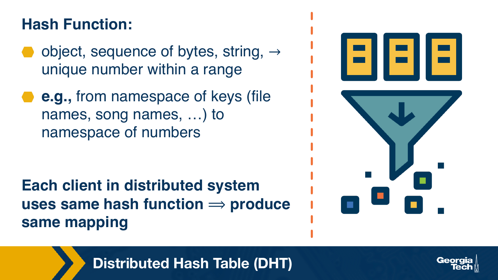

So what is a DHT? The main element of a DHT is its use of a hash function. A hash function takes some input, some sequence of bytes, can be an entire file, a portion of a file, a string, and it processes it, and it produces some unique and condensed form, some type of signature of that input string or object. The function has some unique properties. And for instance, it guarantees that it will always produce the same output from the same given input. It's also guaranteed to randomize how the inputs get mapped to some sufficiently large space of these output identifiers.

When using a DHT, every single participant in the system would use the same hash function. This would allow them to produce the same unique number, the same identifier, as an output from applying this hash function on the same input. The input can be the name of the file, or that a client is looking for, the name of the song, some other key, and the DHT will produce an identifier which could be an identifier for the node that stores that content. In that sense, the tht translates the namespace of the input, the key, to a much simpler namespace of some essentially integer numbers.

Once we have this translation, the actual nodes in the system can be mapped to this space of integer numbers. We have seen this design referred to as all of these nodes are using the same pseudorandom function. So it is some random function, but given that all the nodes are using the same one and they have this requirement that it should map the unique input to a unique output, it's referred to as a pseudorandom function.

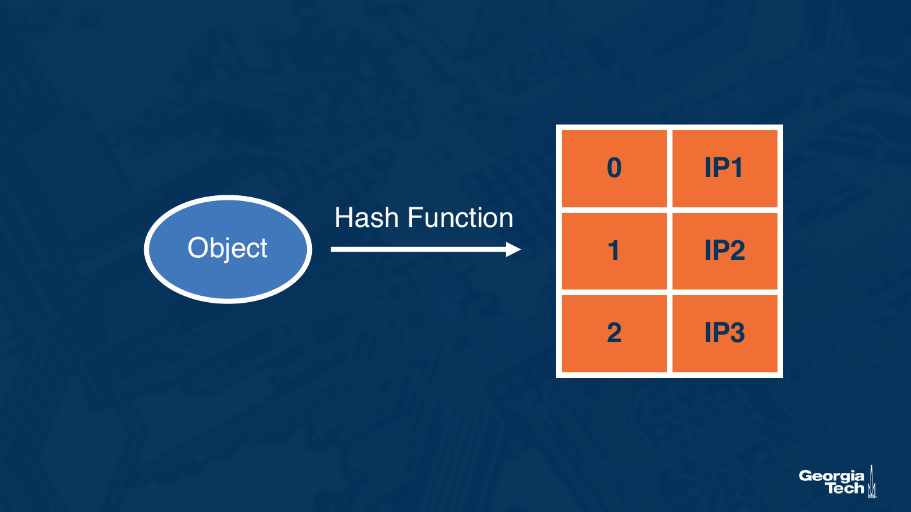

Let's look at a very simple version of this. Let's say we have a system where data is stored on three nodes, and we need to make it possible to easily determine where a data item is stored. In a simple scenario, the hash function takes the file name as the input and maps it to an integer value of 0 1 and 2. The three node identifiers can be statically mapped to these three numbers, and now any client that has access to the same hash function can now uniquely determine what is the IP address of the server that needs to be contacted when looking up a file with a file name x.

Normally, the number id space that's the output of the hash function will be actually much larger than the number of physical nodes. Also, the mapping among the node identifiers in this id space can be adjusted depending on node failures, changes in the loads in the system, or if the system is scaled up or down and we add more nodes, then we have the ability to assign different IP addresses to, let's say, the remaining integer values of this hash space.

## 7. Chord

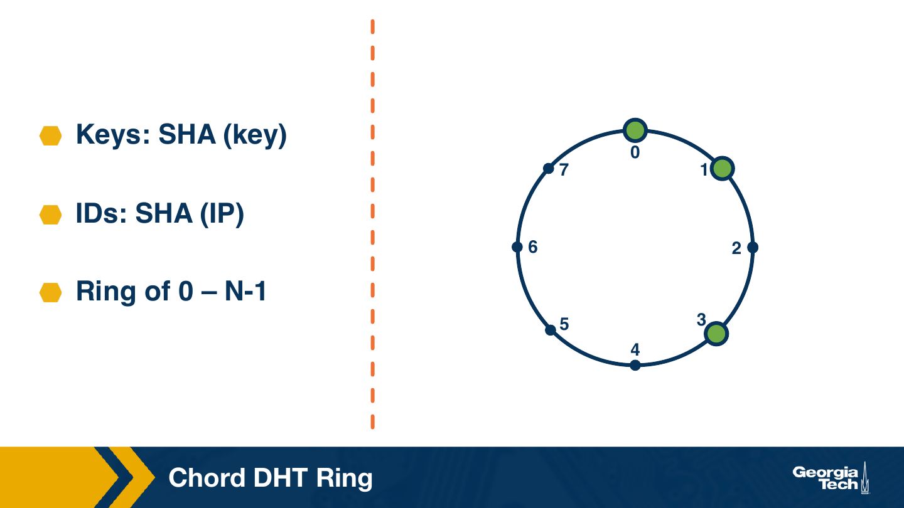

Let's specifically look at the Chord peer-to-peer system and its use of DHT. In Chord, the DHT is represented as a ring of all the numbers from 0 to some value n minus 1. In this illustration here, it's from zero to seven. This is a figure from the paper. Essentially, the keys for the objects that need to be looked up are mapped to the same namespace of identifiers, so this is the values on this ring. Also, the IP addresses of all the peers are mapped to the same space. The value n is sufficiently large, so that when using the hash function, we have a strong guarantee that there won't be collisions, and that no two peers will be mapped to the same note. Depending on this mapping, the peer notes represent the circles on this ring. So in this illustration, that there are peer nodes whose IP addresses mapped to the values 0 1 and 3.

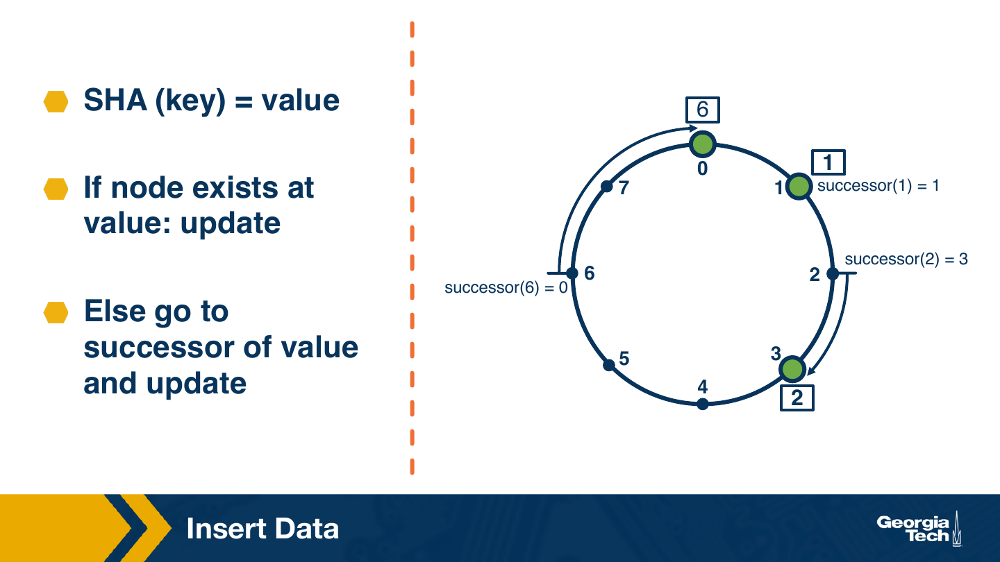

To insert information in Chord, first, the hash is compute on the data key, and then the corresponding node is updated. Let's say a data item hashes to the value 1, and then that node will be updated. It is possible to have much fewer nodes in the system than the values of the DHT ring space. If a data key hashes to a value for which there is no note, then the note corresponding to the first successor value is updated. For instance, to insert a data with a key which hashes to 2, since there is no node 2, the update will be performed at node 3, which is 2's successor. There may not be an immediate successor, in which case, the next available node is updated. For instance, for a data item whose key hashes to note 6, the note which will be updated is the next available successor, in this case that's node 0.

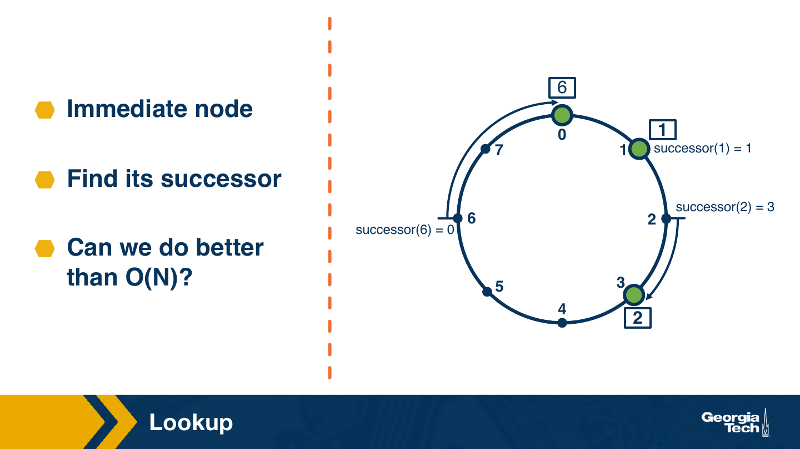

A lookup then needs to be performed against the node with the corresponding id, or its first successor. If there isn't a note that's immediately mapped to the same value, then additional trials may be needed before a successor can be reached. For instance, when looking up an item which hashes to two, we have to try only one successor, but when looking up an item which hashes to six, we have to try two successors before we can find the right node. If we were looking up for data item with a key which hashes to four, we would need to try four possible successor values before we get to the right node. So you can see how this can present the problem, since potentially, we may need to make order of n trials before we find a note which has information about where the data is, where the content is stored.

### 7.1. Finger Tables and Membership Changes

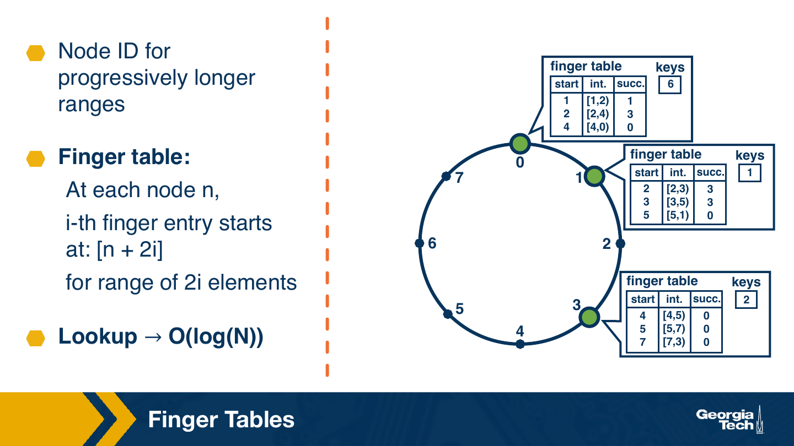

To improve the lookup time, Chord maintains so-called finger tables. Each of the notes in the system maintains information about the known nodes that serve a particular key range. The entries in the finger table are organized as follows: at each node n, the i's entry in the finger table will have information about the key range that starts at value n plus 2 to the i and that corresponds to a range of 2 to the i elements. By using finger tables, the lookup operation now, in most cases, can be reduced to all of log of n time.

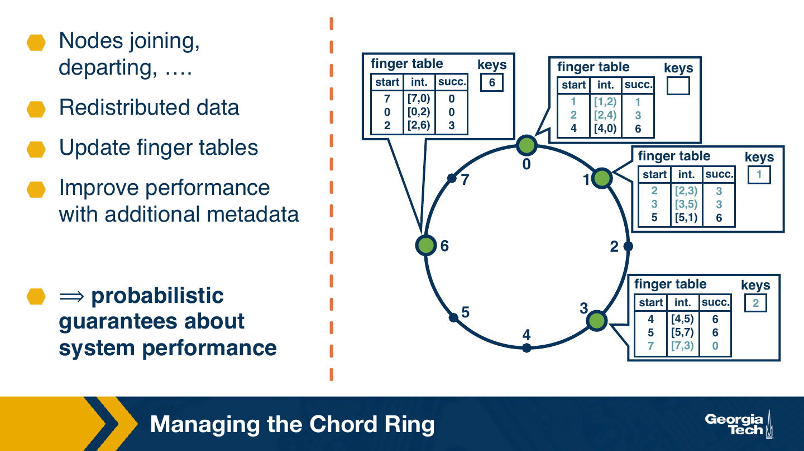

The peer-to-peer system is not static. We said one of the requirements is it's necessary to make it possible for the information about finding the right node and data to correctly reflect any changes in the system. With Chord, this information is distributed among many nodes. When there is a change, this change needs to be reflected at all the relevant notes. For instance, here is an illustration from the paper that shows the state of the system when a new node, a node that corresponds to id6, joins the system.

When the node joins, it finds where it needs to be entered and for which node it is a successor or a predecessor in the ring, and then it takes over the data that was previously stored at the corresponding nodes for which it now needs to be responsible. What actually this data is, it kind of depends on what is Chord used for. You may, if you wish, choose to use Chord to directly store the data, or typically, it's used to store information about the actual location of the data. So in that sense, what's stored in Chord is the metadata, like some sort of index.

In this illustration, the bolded entries at each of the nodes now correspond to entries in the finger tables which have to get updated to reflect that node six now joined the system and is responsible for the corresponding key range. To assist with the process of updating the finger tables, particularly for the updates that need to be performed when notes fail or leave the system, quart also maintains some additional information about the successors of some of the notes in the finger tables.

The combination of all of these elements make it possible to speed up lookup, but there are some pathological cases where the system may fail to provide an answer in the expected log of end time. And the paper describes these situations, and also derives some formulations of the cost of the operations in the system, and has proved that there are some probabilistic guarantees on how the system will behave. We say probabilistic guarantees in situations where we say that a system is guaranteed to behave such and such with a probability x. So it's guaranteed to provide a response in log of n time with some probability. The actual probabilities will depend on a number of parameters of the system, about the number of nodes, the amount of additional information that's maintained in the finger tables, about the successors, and so forth.

## 8. Hierarchical Systems

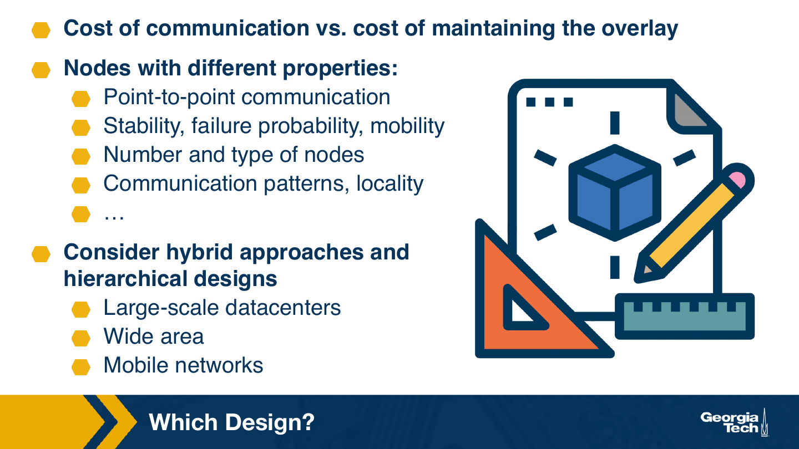

Peer-to-peer systems allow communications to scale to large number of nodes without imposing any structure on the communication paths among the nodes. Another way to achieve scalability in the communication layer is to rely on hierarchical system designs. So let's contrast these design options in a little more detail.

The Chord system is one design point using which we can organize and maintain the state that is needed to find a data item or a node that can provide a given service. The centralized approach, or the gossip-based approaches that we mentioned earlier, they present another design point. To determine which design makes sense, one should recognize that the choice of the design has some implications on the actual cost of the communication since it has some implication on the number of messages that are involved in finding a node, in performing a lookup, the number of messages that are involved in performing an update, and so forth. So the design choice will also have some implications on the overheads that are associated with the system. So the cause that's associated with maintaining all the necessary state, of updating the state when there are notes that are failing, or joining the system, or moving perhaps, and so forth.

To make a decision, one should consider basically a number of aspects of the system. What is the cost of the point-to-point communication? How common are changes in the system? How common are failures? Are the nodes of the system homogeneous? What is their number? What are the common communication patterns that are required by the workload? And so forth.

Once we take all of these factors into consideration, we often observe that what makes most sense to do is to build some hybrid approaches, or in some other way, to build some hierarchical solutions, where at different levels of the hierarchy, we make some different design choices. This is true in data centers where we have nodes connected within a rack, in some network topology, with an interconnect with some properties in terms of bandwidth and latencies. And then via some top level switches, some top of rack switches, these are connected to the backbone of the data center network. Hierarchical designs also make sense in wide area networks where we may have some locality and some different types of communication patterns among nodes that are more local to each other versus nodes that are further apart in the wide area.

And also, hierarchical designs make sense in mobile networks. And for this, we will use a paper that describes the trade-offs that should be considered when designing hierarchical networks. They're specifically targeting mobile network systems.

## 9. Heterogeneous Systems:A Mobile Network Example

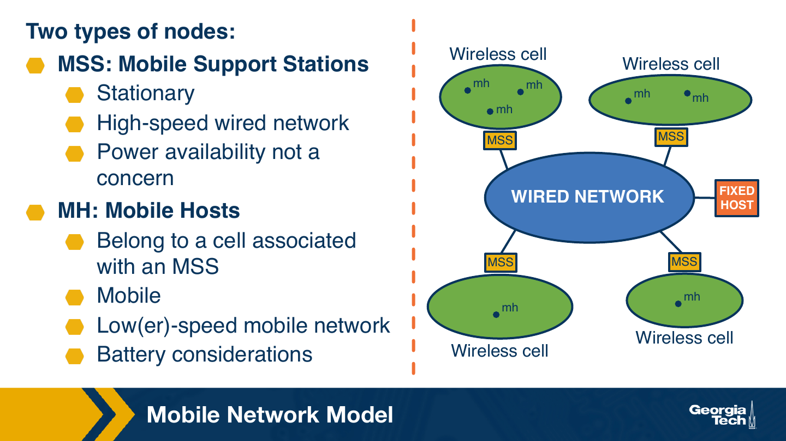

In short, when the systems are heterogeneous and include different types of elements of the system, different types of connections, this needs to be factored into the design of the various algorithms that are used in the system. And we'll take a look at this by using mobile networks as an example.

In a mobile network, there are two types of nodes. There are these static base station nodes. In the reference paper, they're referred to as mobile support stations. These are interconnected via some high speed wired network, and there is a sort of stable source of power here, so power energy usage is not that much of a concern here. Power availability rather, is not that much of a concern.

And then, there are also the mobile hosts. These would be the actual mobile devices, the smartphones, for instance. They first of all, the mobile hosts, when they're connected to this network, they're typically associated with one of these mobile support stations. We connect to the wireless network via a access point, via a base station. The nodes are mobile, so over time, they can transition from one of these cells to another. And then, they're not connected to an energy source, to sort of an infinite energy source, so they're connected to a battery. So power usage and battery consideration are much bigger factor here, compared to, let's say, at the base station level.

There may be also other fixed hosts that that exist in the system, and that are directly connected on this wired network, but we're not going to focus on them during this discussion. The goal of this wired network is to make sure that a call from any one of the mobile hosts can be routed to another mobile host wherever they might be, or a message can be sent and exchanged among these mobile hosts wherever they might be, even when they're moving.

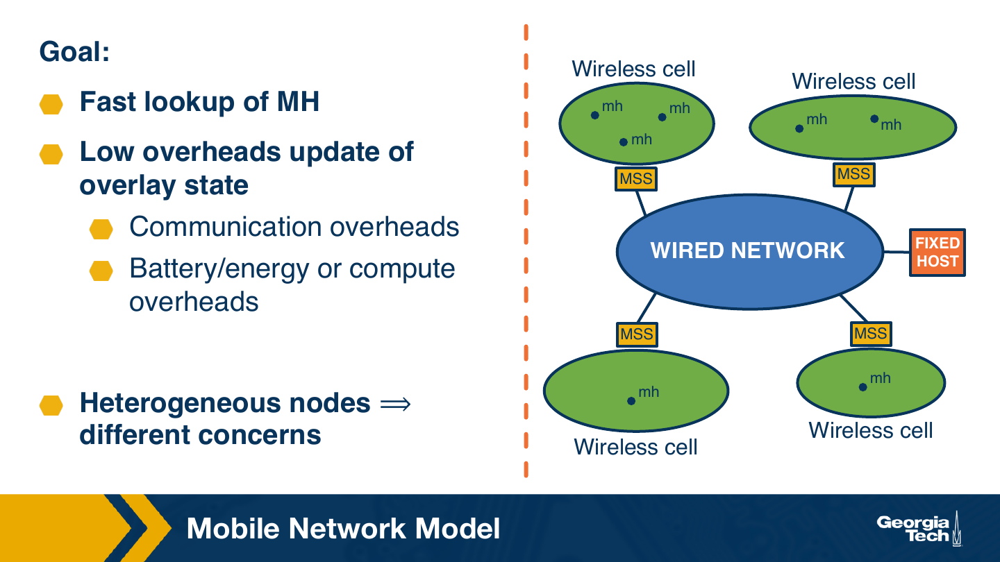

In order to achieve this goal of finding a mobile host anywhere in the system when we want to send a message, what we really need to satisfy is to provide for fast lookup. So this lookup operation will return the current address of the target mobile host, and will determine how to write messages to that target. It is also necessary for us to be able to do this, to achieve this lookup, while at the same time maintaining overhangs that are relatively low given the communication cost.

Also, particularly because we care for the battery life or the energy usage on the mobile device itself, we're particularly concerned with making sure that the overheads are low from the perspective of the mobile hosts, that not a lot of compute is required, not a lot of access to state that's maintained on mobile hosts is required, and so forth. So because in this system we have different types of nodes, right, the mobile host versus the base station, the low power versus the much more powerful, mobile versus static, now it is obvious that we're going to have different concerns on what happens for a given algorithm given the type of node that we are considering. So this kind of heterogeneity among the nodes likely will need to be captured in some type of heterogeneity of the algorithm, meaning that it is not going to involve identical set of steps regardless of the type of node. So let's look at how different algorithms can be adapted to this kind of heterogeneity, and specifically, what are the algorithms that are described in this paper and designing algorithms for mobile networks.

## 10. Alternative Algorithms

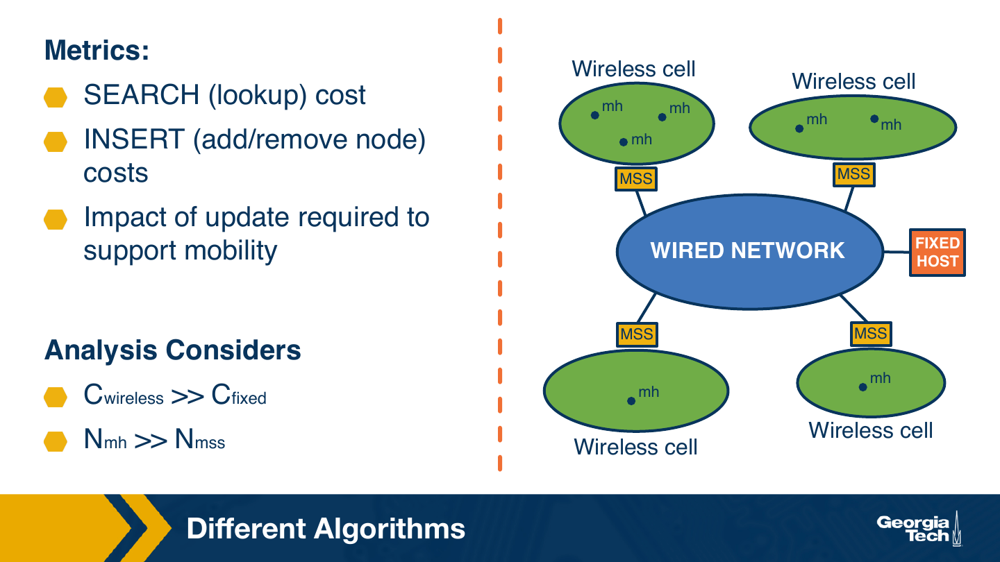

The need to deal with mobility also introduces some design decisions with respect to the algorithms that we use to update the state in the network overlay. The paper describes several algorithms for some of the basic operations, for lookup or search, they refer to it in the paper, for insert, for making a change in the network by adding or removing a node. And these algorithms are compared with respect to the cost that's associated to perform an operation, or to search for a node. And this cost is reflected primarily, in the context of the paper, it's reflected in the time that's required for the operation. And they measure time not in some concrete time units, but they measure time in the amount of time that's required to traverse a connection between different points in the network. So they kind of express the time, the complexity of these operations, with respect to the number of wireless or number of wired connections that have to be traversed. And all of the analysis consider that the cost of communicating via a wireless link is much higher than the cost of a wired connection, so that this takes much longer to perform than a wired network. And that's in generally true today. So this can be on the upwards of tens of milliseconds, where this is, you know, very realistic that this would be in just a few small number of single-digit milliseconds. This would be a fiber network. And then also, the analysis expresses these costs with respect to the number of nodes that are involved, the number of operations, or the amount of state that needs to be maintained. And here, we're going to assume that the number of mobile hosts is much larger than the number of stationary hosts. And this isn't generally true. We have way more smartphones compared to base stations.

Much of the discussion of the algorithms in the paper is related to executing a token passing algorithm among all of the nodes, and this is similar to giving each mobile host each turn for a chance to make a call, or you can think of it as giving a chance to each of the mobile notes to obtain a lock. We'll skip the detailed discussion of these application level algorithms, and instead, we'll just focus on these basic primitives, and the trade-offs that that you can experience in different implementation of these basic primitives for search and insert.

### 10.1. Comparing Lookup Architectures

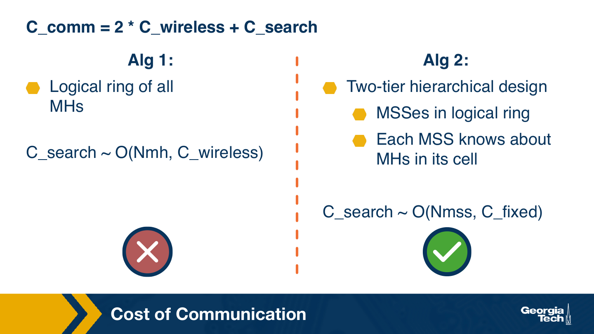

Let's for instance compare the cost of allowing two mobile hosts to communicate using two different algorithms: algorithm one and algorithm two. The cost of a point-to-point communication is always going to include two wireless transmissions, so that's the dominant portion of the point-to-point communication costs. And then, it's also going to involve the time of actually performing a lookup operation.

Now, let's consider two possible architectures. In this first one, all of the mobile hosts are directly part of a logical ring, so they're kind of organized in something that corresponds to the DHT in Chord. In this second design, the base stations on the fixed network form the logical ring. And then, each of the base stations, each of the stationary nodes, knows about all of the mobile hosts in its cell. For mobile networks, this is a reasonable expectation, since the protocol is such that the mobile host, the cell phone, performs this handshake protocol with the base station when they join the cell. So it's very reasonable to expect that the stationary node, the mobile support station, as they call it in this paper, is going to know about the smartphones that are in itself.

In this first case, the cost of a search or lookup operation is dominated by the total number of mobile hosts and the cost of the wireless transmission. In the second case, the search cost is dominated by the number of base stations, which is much smaller than the number of mobile hosts, and by the cost of the fixed transmission, right, which again, we said is much lower than the cost of the wireless communication. Clearly, the second algorithm will be better in this case.

### 10.2. Updating Location Information

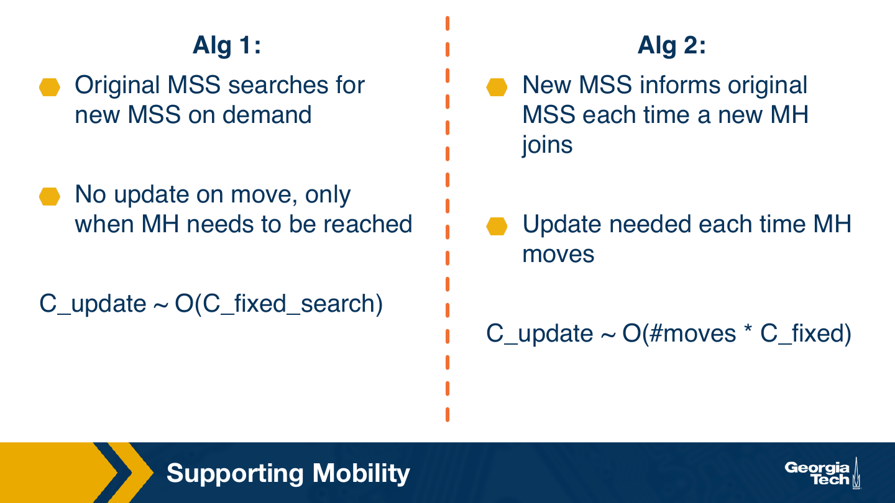

So let's agree now that the two-tiered approach, where the base stations maintain information about the mobile hosts in the cell, is the preferred approach to keep information about how to find each mobile host in the network. Now, let's assume that the mobile hosts move. And so by the definition of them being mobile, somehow, the information about them moving needs to be captured in the overall network, and the state at the base stations needs to be updated. So we'll compare again two different approaches.

So what to do in this case? In the first approach, the hosts are allowed to move and to join new cells and new base stations. And when they do so, they announce themselves to the base station, but there is no other update that needs to be performed to the state in the overlay network at the time when the node moves. However, when the nodes actually need to be reached, then the lookup message will have to somehow involve the original base station, given that we performed no update to the state in the system whatsoever.

In the second case, whenever a mobile host moves, it announces itself to the new base station, but it also provides information about the original base station. Because of this, the new base station has a chance to notify the old base station, the original base station, that it is currently responsible for the mobile host. So it means that in this algorithm there is an update performed every single time the mobile host is going to move. However, when we actually need to send the message to the mobile host, the state of the overlay is up to date, and it has the current information.

Which of these approaches is better is going to depend on the relative cost of fixed versus wireless communication. It's going to depend on the time required to perform a search over the fixed network, but it's also going to depend on the workload, on how often does a host move relative to how frequently is it involved in the communication. Basically, if we perform an update each time the host moves, but also, if every time the host moves somebody's going to need to reach it, then the cost of this update can be justified. But if the hosts move way more frequently than the frequency of the times when they're involved in some kind of communication, then performing all of these updates, many of them are not going to be necessary. So this algorithm is better for those scenarios.

## 11. Summary

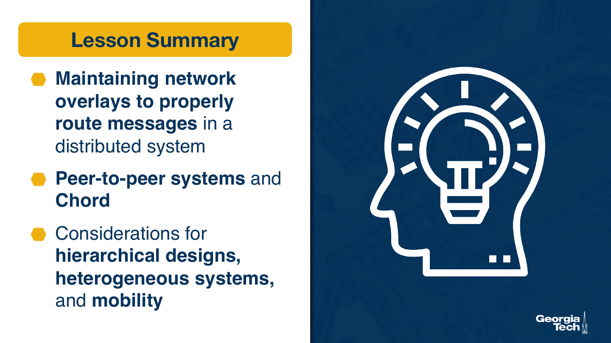

In summary, in this lesson, we talked about communication support that is needed to ensure that messages can be properly routed in distributed systems. This often comes in the form of some type of overlay network, which in some manner, translates information about the intended endpoints as specified by the distributed applications and services, to information about the network level addresses that correspond to these endpoints. We presented several considerations relevant for data centers, and then we used peer-to-peer systems as a use case to discuss several other popular designs that address scalability and geo-distribution. We also gave some examples to illustrate that it's important to consider the heterogeneity of the system when you're making a decision about the communication design. And this motivated the so-called hierarchical designs, and we illustrated this with some examples from mobile networks.
