# Lesson 12: Distributed Data Analytics

Source: [Lesson 12 — Video](https://www.youtube.com/watch?v=4FLlpRLttoE)

## 1. Introduction

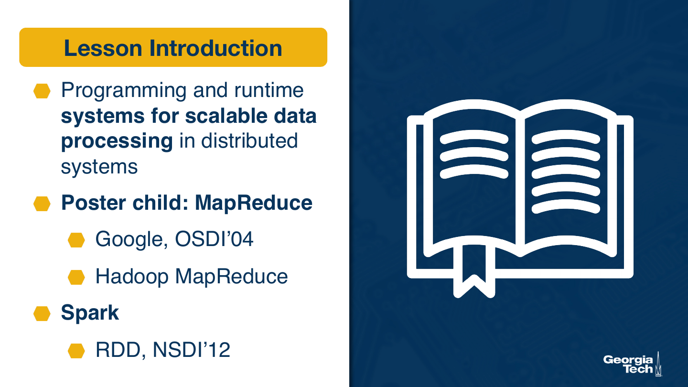

In this lesson, we will discuss several techniques common in distributed systems data processing frameworks. A major expectation of distributed applications is that they will be able to utilize the distributed computing resources to process large and growing data sets. In contrast to systems focused on storing and serving on request data from distributed data stores, the focus of the distributed data processing frameworks is to provide the programming and runtime systems for performing the distributed processing and analysis of data.

A poster child for this kind of processing framework is the MapReduce model which in its current form was presented in an OSDI paper by Google in 2004, but then it was further popularized due to the Hadoop open source MapReduce framework. Although MapReduce is a very successful and still broadly used model, there are many other systems that have emerged over the years, and these systems are optimized for different classes of analytics problems. For instance, for interactive systems, for streaming systems, where data is continuously and incrementally updated, or for systems which are adapted for a data model that better matches the application's requirements, for instance, for graph processing. We'll mention briefly some of these systems, and we will talk in more detail about Spark, with a focus on its use of the RDD abstraction to achieve speed and flexibility to support different types of analytics workloads.

## 2. Data Processing at Scale

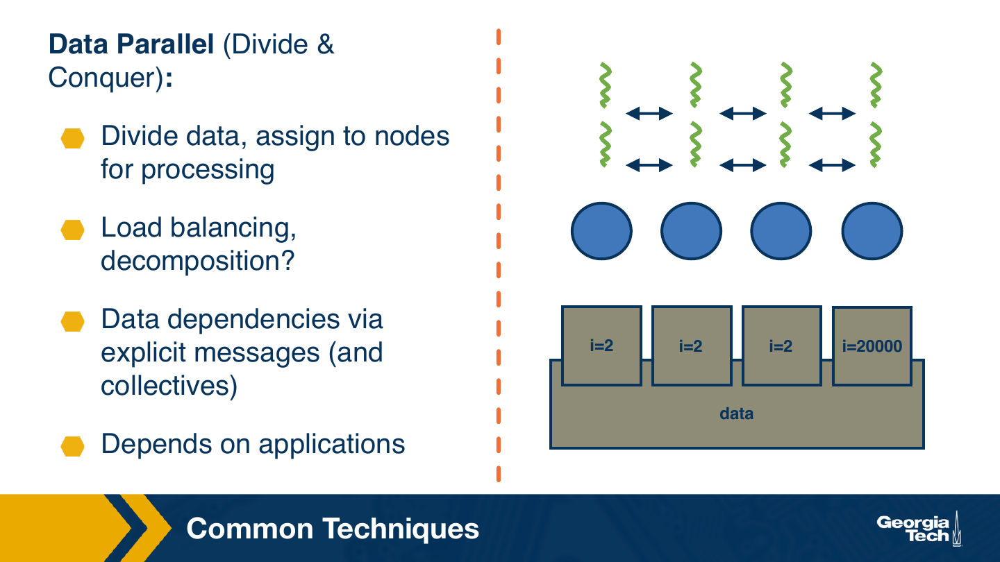

Let's look at a couple of common techniques that appear in some form in all of these data processing systems. One technique is to take a so-called data parallel approach, where the data is divided, perhaps in equal parts, but not necessarily, and each subset is assigned to a different node in the system. This is an approach commonly used also in traditional scientific applications, such as some of the scientific simulations run by the us national labs.

There are several assumptions that underline this model. One is that it is possible to achieve partitioning of the data in a way that is going to ensure good load balancing. This is not trivial. How do you know how to decompose the original data set, so you don't have unused nodes sitting idle and others which are overloaded? If the processing that's required by each node is input dependent, meaning it depends on the values of the input data and not just on the size of the input, then it is quite possible that we will run into some sort of imbalance issues.

Second, when we think about the overall process, it may be overly limiting to saying that an application can be programmed solely by processing on a subset of the data. Those applications will not be very interesting, and will not be sufficiently general. Instead, we need to assume that there will be some phases where each node computes locally, followed by some faces where it needs to communicate with others. In some cases, it is most efficient to use some collective operations, such as barrier, to make sure that all nodes have reached a point where they are ready to exchange messages. Again, whether this makes sense, it will depend on whether the application is such so that we can achieve a good load balance across the system. We don't want to have situations where there are idle nodes while others are overloaded. That will not provide the best use of the machine resources nor performance.

### 2.1. Pipelining and Model Parallelism

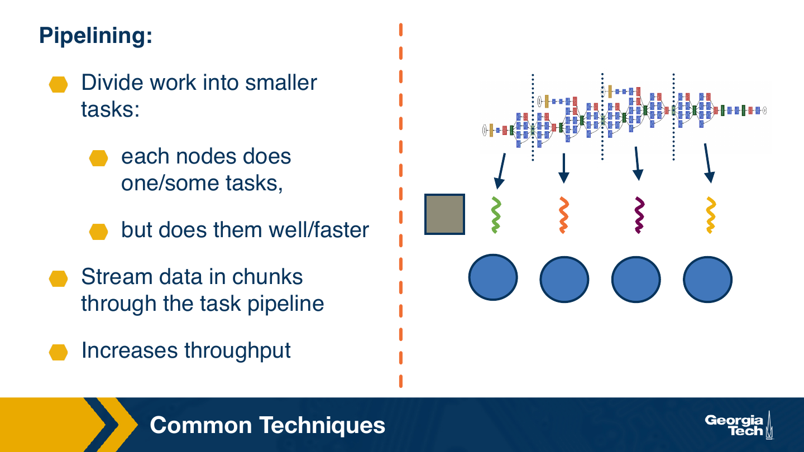

Another common technique is pipelining. This is a useful technique when we need to scale the amount of processing that needs to be performed on the data. Instead of expecting that the entire set of processing steps that need to be performed on an input data is going to be processed by a single node, we divide the work into smaller tasks, and each node is specialized for one of these tasks, or for a subset of the tasks. The data is then passed through this task pipeline until it's fully processed. The data doesn't even have to be processed all at once by all of the individual pipeline stages. It may be possible to divide the data into smaller blocks or chunks, and then to stream the chunks one at a time through the pipeline. This will achieve greater throughputs than if you're just trying to process the full data set.

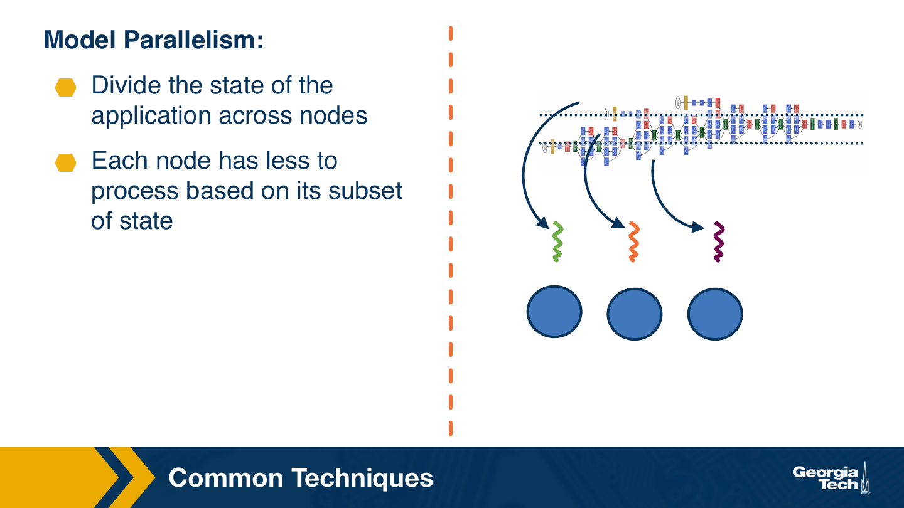

In addition, the processing requirements depend on the state that's required by the application. We can illustrate this with a deep neural network model, for instance. We can store and use the full model at each node, or we can store just some subset of the errors at the individual nodes. In that sense, each slice of this application state, or its model, is assigned to different nodes in the system.

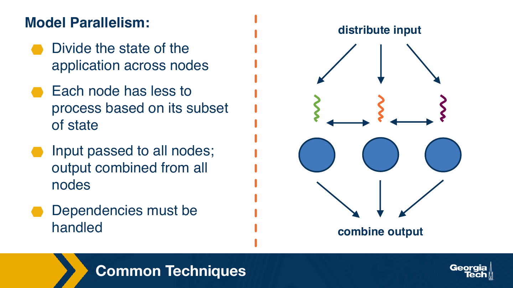

When a data input needs to be processed, it is distributed to all nodes, and each of the nodes processes its slice of the models, and then the results have to be aggregated. For instance, here is the input, and it's distributed to all of the three nodes, and each computes based on a smaller model flies, and produces a result. Of course, to correctly process a slice of the model, an individual node will have to communicate with the other nodes, depending on any dependencies that may show up across the nodes. The overhead of this extra communication needs to be factored in before deciding whether this is a good approach to take.

## 3. MapReduce Brief

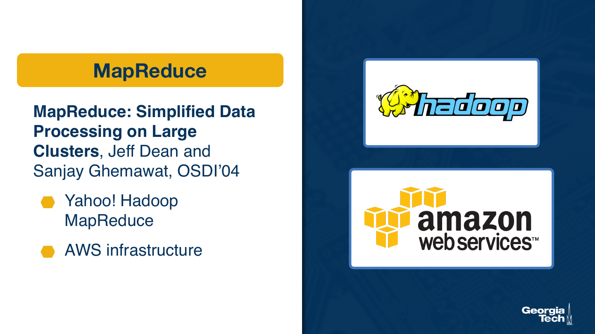

Let's look now how these techniques come together in some of the current distributed systems for processing large data sets. Probably among the most famous system that really revolutionized big data processing across the board is MapReduce. The MapReduce model was originally presented in a paper map produced simplified data processing on large-scale clusters which was presented at OSDI 2004, by Jeff Dean and Sanjay Gemmawat. And for this and other work contributions that the two of them have made to the field of large-scale systems, they've both been elevated to members of the u.s national academy of engineers and the american academy of arts and sciences.

As a model, MapReduce existed in some forms and was used in other places. For instance, LexisNexis, the company that provides data services to many communities, such as the legal, the medical communities, to governments, they had internally a similar system which subsequently they open sourced in the form of HPCC. But in this paper, they both introduced the term and also popularized the model. And what really helped was that soon afterwards, Yahoo released the open source Hadoop MapReduce stack, which has evolved over time and is still widely used. And of course, also instrumental was that the actual large-scale infrastructure became more broadly available through the rise of cloud computing, and particularly in the form of Amazon's elastic cloud computing EC2, and other AWS services.

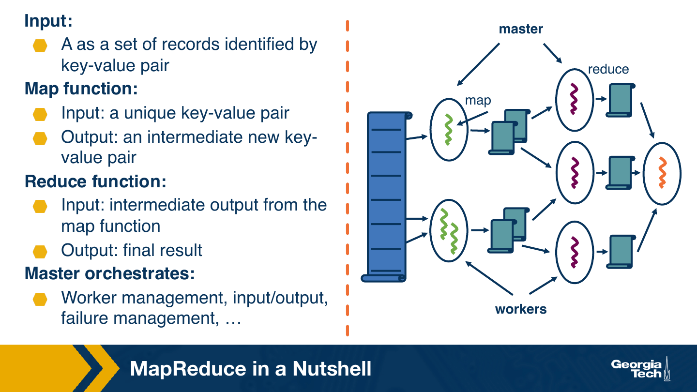

We'll describe briefly how the MapReduce model works. The input, a very large dataset, or a very large collection of files or objects, is divided into smaller chunks. Each of the chunks is passed to a worker process. The important thing is that the input data needs to be pre-processed so that each item can be associated with a key, but also, a key value association of the input may already exist. For instance, the key can be the file name, and the value can be the content of the file. A single worker may be responsible for one or more of these chunks.

Each chunk is assigned to a map operation that's going to be processed by one of the workers, and a worker may be assigned to execute multiple map operations for different input chunks. Applying the map function to the data value in the chunk produces some intermediate output, and this output can also be a collection of some data elements that are written out to intermediate files. The intermediate outputs are ultimately processed by one or more reduce functions. The reduce functions can be executed by a different set of worker processes, or even by the same set of worker processes which were involved in the map operations, provided that they have completed the map phase of the processing of the chunks that were assigned to them. Each reduce operation is going to read the intermediate files that correspond to some key range, will perform some aggregation function that combines the output from the mappers related to the corresponding keys, and the reducer will also produce some intermediate output that can be written out to intermediate files.

A final reducer may be needed to combine the output from all of the reducers into a single output. And this is all orchestrated by a master process, which determines how each of the map and reduce operations are assigned to worker nodes in the cluster.

### 3.1. Word Count and Data Flow

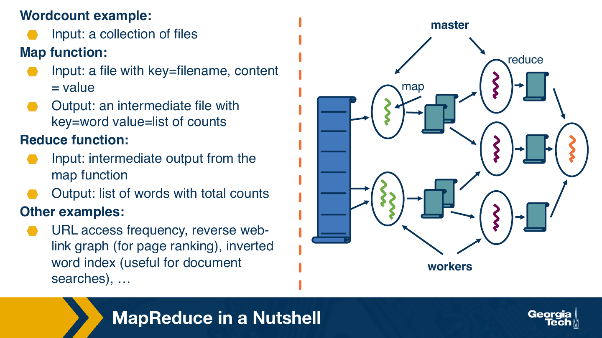

Let me illustrate briefly MapReduce with a popular word count example which is frequently used to explain it. In this case, the input may be a collection of files. The map operation would take one input key value pair. This would be a file whose name is the key, and the value is the actual content, and it will emit as output key value pairs that include a list of each word and the individual occurrence of that word once it encountered it, so the number one. Each reduce function would take these outputs for some key range, where a range is determined based on, let's say, alphabetical ordering of the keys, and would add up, or aggregate, the counts. The final output would be a list of all of the words in the input document set, and a corresponding number of appearances.

Other frequent examples used in description of MapReduce, but also in practice, include counting the URL access frequency, which is really like performing a word count, but on bunch of log files, focusing on the URLs. Performing reverse web link graph traversals, used for page ranking to support search operation. Creating inverted word indexes, which are again useful for document searches. Implementing some of these operations may require much longer pipelines of mapper and reducer operators compared to what's needed for the word count operation.

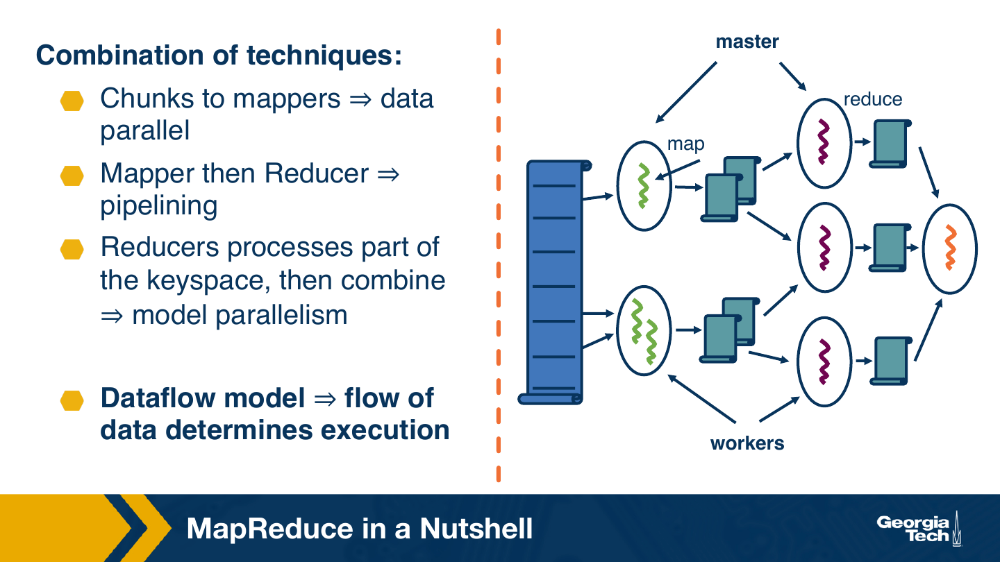

Note that in the description of this model, we have elements of each of the techniques that we previously mentioned. Dividing the data into chunks and assigning chunks to mappers, this is an example of the data parallel approach. The fact that the data processing is handled first by the mappers and then by the reducers, this is an example of pipelining. The fact that if a single reducer cannot perform the overall reduce operation, the overall aggregate operation on the entire input, and that we have these intermediate reducers, this is an example of model parallelism. We're essentially dividing the name space of the keys, the state of the application, across these different reducers, and then aggregating it.

Another way to characterize the MapReduce model is to say that it's a data flow model. This is because the execution of each of the operators in the MapReduce pipeline is determined by the flow of the data. A reducer cannot start executing unless the data for its inputs becomes ready.

## 4. Design Decisions MapReduce

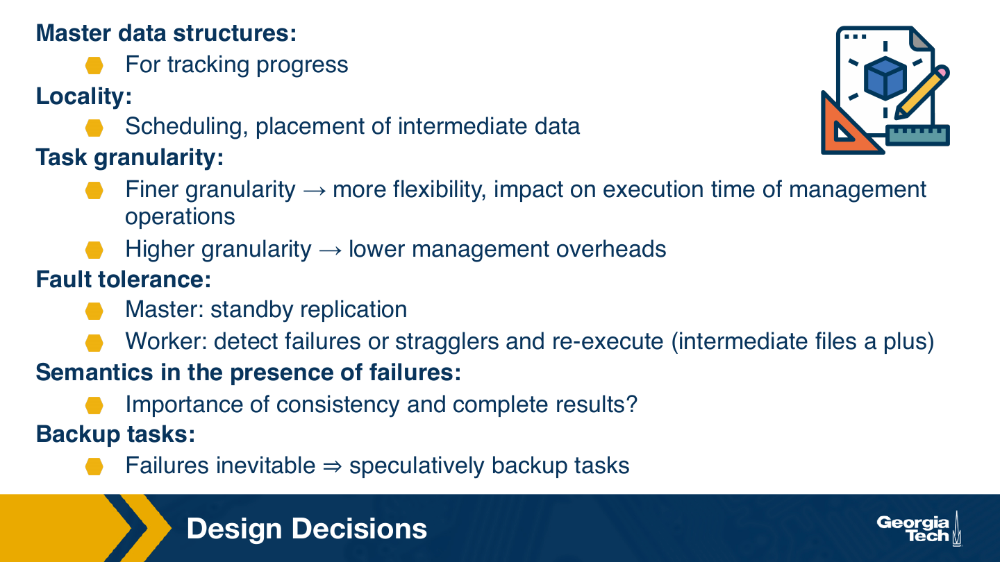

A system which implements the MapReduce model needs to make several design decisions concerning several dimensions.

There's first, the decisions regarding the master's data structures. How much state will the master maintain per worker? How will it organize it? How frequently will it update it? So how fresh will it be? How will it track progress in the system to know whether to start scheduling reducers or not yet? Second set of decisions concern locality. The locality can be with respect to how the mappers and reducers will be scheduled on which nodes. For instance, how will they be placed with respect to the data that they need as inputs, or that they produce as outputs? For instance, the intermediate results.

Then there are decisions regarding the task granularity. The task granularity that ultimately determines the control that the system will have. Which granularity can it independently scale the system? If we have finer granularity, then we have more flexibility, and that will have some impact on the execution time of the management operation. If we have larger granularity of how the tasks are organized, that's going to reduce the flexibility, but it will also lower some of the management overhead there. There will be fewer things that we'll need to keep track of.

Then there are decisions with respect to how the fault tolerance of the system will be supported. Regarding the master, since it's typically a single master, then are we going to deploy some standby nodes, like a standby replication, in order to ensure that the system will survive the master's failure? Regarding the worker nodes, we need to make some decisions. How our failure is going to be detected? Failures can concern actual node failures, but also, they can concern what we call stragglers, or nodes which are really really slow. And so potentially, we need to make decisions on when are we going to make a call that something needs to be re-executed since something's just slow. We can't really tell the difference between the failed note and a note which is very very slow, so potentially, we'll be essentially re-executing something that's still ongoing on a slow note.

And for systems of this scale, super tolerance, making good decisions regarding fault tolerance is super important, because there's so many components that need to come together for these very large systems. And we know that the more components we bring together, the system overall is much more likely to exhibit failures somewhere within one of these components.

Concerning the many workers in the system, the fortunate thing is that we do have these intermediate files that we described that the various mappers and reducers produce. And if these files are persistent, that's a plus, because we don't really have to re-execute the entire pipeline. You can just take the intermediate files that a failed node would have otherwise been accessing, and just re-execute the pipeline from that point on.

When it comes to failures, it's important to think what it means to operate with some reduced system availability. So if we lose part of the system, does that really have some detrimental effect? Are we losing data, or are we losing the ability to perform as at the same performance level as before? If failures only concern the level of performance, how quickly the system can execute, that has some set of implications. If failures mean that some data is actually lost, then we have to think about what does that mean with respect to the consistency of the system and the completeness of the results. Maybe indeed, all the data, the entire data set, had to be processed, but maybe this application remains sufficiently useful even if some portion of the entire input set, of the entire data set, was not included in the analysis.

And finally, since failures are inevitable and can have a significant impact, and because of the stragglers effect that we set, it makes sense to employ some statistics that will allow us to anticipate failures, and then to proactively create some backups of the tasks. So this is different than re-executing a failed task. This is more like speculatively creating a backup and executing potentially in parallel. If a failure doesn't occur, then the speculative backup task was maybe some wasted work, and this node can revert and become just a regular worker. And if the failure does occur, then the speculatively executed task may a be ready to go, and immediately start executing, or may have executed sufficiently far ahead, or maybe even produced results that will allow the rest of the pipeline to continue.

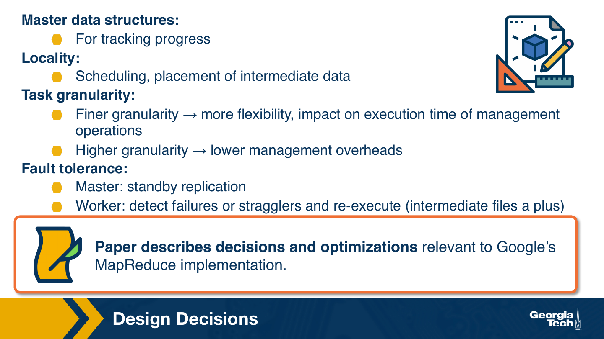

The paper describes the concrete decisions that were made regarding all of these design dimensions, and it also describes some additional optimizations which were made in the context specifically to the Google's MapReduce implementation.

## 5. Limitations of MapReduce

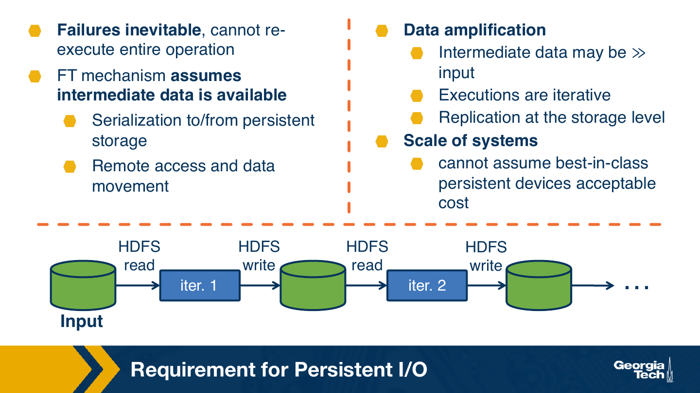

Now, there are also a number of challenges that exist in the MapReduce model and framework as we described it so far. MapReduce depends on there being persistent IO, meaning that all of these files, intermediate data, they have been made persistent. This is tied to the fault tolerance mechanisms. Inputs can always be re-read, so these intermediate files can just be re-read, and the pipeline can be re-executed from there. This intermediate data, in a sense, presents some checkpoint. This is an important decision that is deliberately made in the system, because as I said, at these scales, failures are inevitable. In that sense, having a fault tolerance mechanism that will be able to make an assumption that this intermediate data is available is important. We already talked about fault tolerance, and we described how fault tolerance methods use checkpointing, and so this intermediate data presents that kind of checkpoint.

However, there are multiple problems with this model. One is that in order for us to read or write to block storage, to this persistent storage, we have to pay serialization costs. Data has to be serialized in and out of the memory of the different workers in the pipeline. The particular challenge is that given the scale of these machines, often, there is a choice that's made that the storage components are not going to maybe be the best in class, the most expensive, so that's going to have some implication on the performance of these i o operations.

Second, we said, individual nodes may at some stage execute some mappers, and another stage, execute some users, and they will produce these intermediate files. And so we really have not a lot of control over what are the different input files that will need to be read by a given worker. With the fact that there is both remote access, and also data movement, moving the data from one node to another, that also adds performance overheads and has an impact on the end-to-end performance of the system.

There are many scenarios in which the actual application, the processing of the input set, requires multiple iterations. So if you think about it, what we mean is that the execution is iterative, if it's kind of going through multiple loops. And what that means is that this intermediate data may need to be read multiple times. In fact, if we add up the size of the intermediate data that ends up getting produced during a computation, that might actually be many many times larger than the original size of the input set that we started processing.

Now, as we said, we have large-scale systems where failures are inevitable, and we want to make sure that data is preserved. We're going to have to use some replication mechanisms at the storage level. So the storage level, for instance, typically would be the Google file system back in the Google map reduced papers time, or HDFS, the Hadoop distributed file system. It uses replication. It will replicate every piece of data on three different nodes.

And finally, given the scales of these systems, we cannot really assume that they will have best-in-class devices. Many of these components will be maybe kind of general purpose commodity components that have lower performance points or higher failure rates than whatever is the best in class storage technology, or server technology. This is going to have an impact both on the overheads that are involved in performing all of these i o operations, and also will have an impact on the failure probability.

## 6. Spark

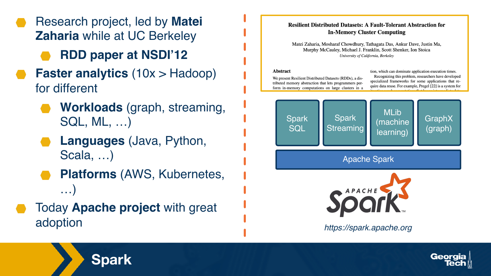

Several other frameworks exist for distributed processing of big applications, and some offer better programmability. Some offer more tailored support for particular types of data, particular types of application. In the remainder of this lesson, we'll talk some more about one of these frameworks. We'll talk about Spark.

Spark started as a research project, was led by, at the time, phd student mate zakaria, while he was at UC Berkeley. And it was published in, across really multiple papers, but one of the papers that stands out, like the first on Spark, is the paper on resilient distributed data sets, which is a feature of Spark. It was published at NSDI in 2012. Spark has been shown to provide much faster analytics for many different workload types, including graph, including streaming workload, including relational databases. It has support for many different language binding, and it can be executed. So Spark as analytics platform has native support on AWS, but it can also be executed in other types of orchestration layers. Today's park is an Apache project with raid adoption.

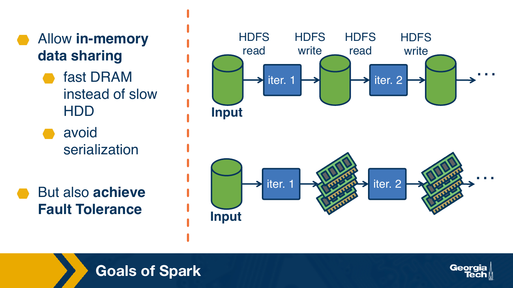

The main motivation for designing Spark is precisely to address some of the problems we described with the MapReduce framework that have to do with their i o overhangs. Spark's goal is to address these problems, to solve them, by allowing in-memory data sharing. The benefits of this are really two-fold. First, DRAM is much faster than a slow hard disk drives, or even SSDs. And second, if data is in memory, then we avoid the serialization overhangs, right? We have to otherwise somehow serialize data in order to be able to write it into a block of storage. In addition, Spark opens up opportunities to achieve fault tolerance using some different mechanisms than what was used in the MapReduce framework.

## 7. Resilient Distributed Datasets (RDDs)

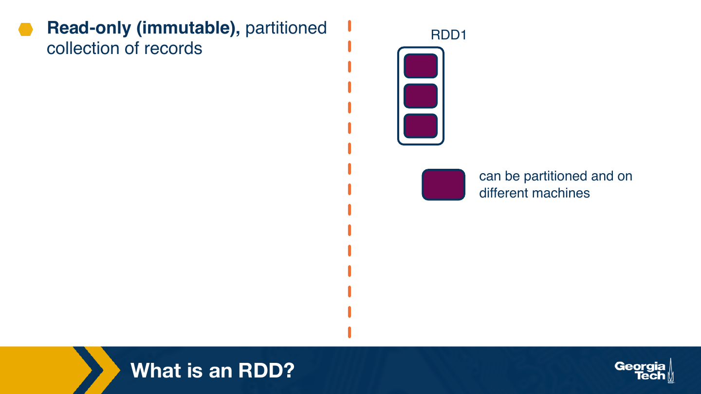

So how does Spark achieve this goal? It achieves it by relying on this RDD abstraction: resilient distributed data sets. An RDD is a read-only, which means immutable, collection of records, and they can be partitioned on different machines. The fact that something is immutable, it means it can only be created, and cannot be modified.

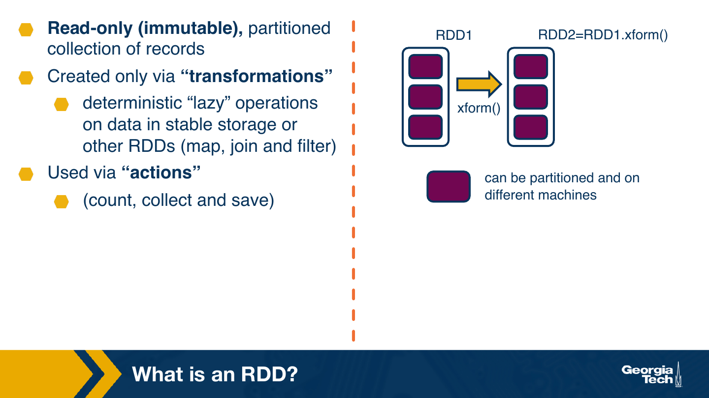

RDDs are created via so-called transformations, and transformations are going to be some well-defined operations that the Spark system supports. Spark defines these transformations as deterministic, lazy operations on data in stable storage or on other RDDs. The fact that a transformation is deterministic, it means that it will always produce the same output when applied on the same input. The fact that there are lazy operations, it means that they don't really get executed until the result is needed.

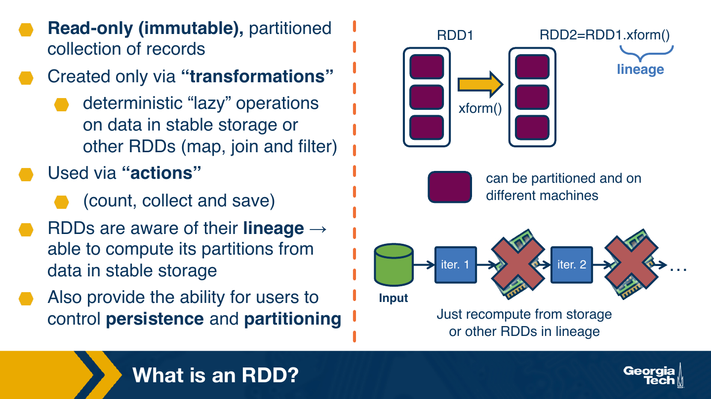

RDDs are used via so-called actions, and these include things like count, or collect, or save. And then, RDDs are also aware of their lineage, which means that what is the sequence of transformations that have been applied in order to produce an RDD. Given that they're aware of the lineage, if there are any sort of failures in the system, they know the initial input from which the first RDD was computed, and they're aware of the lineage of the different transformations that had been applied to produce the following RDDs. We can always, starting from the input, recompute the particular sequence of operations that was needed to produce an individual partition in the RDD.

The Spark system provides its users with some explicit APIs that allow them to control the level of persistence, or the type and degree of partitioning that's going to be associated with different RDDs.

## 8. RDDs through Example

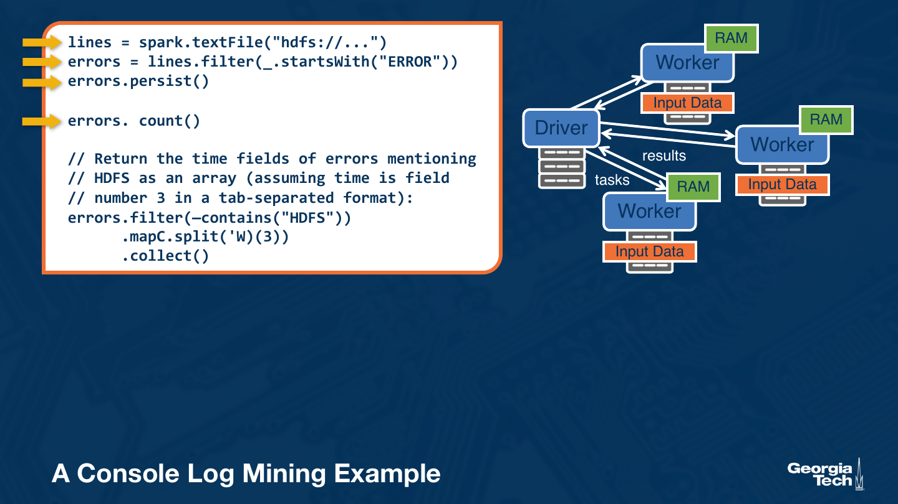

Let's now look at some of the algorithms described in the paper. Here is a log mining example that is used as an illustration in the paper. I will describe both the example, as well as the Spark execution model, at the same time.

Spark still assumes a distributed set of machines, and a large data set is stored on persistent storage. The actual computation is performed by workers, and the precise set of steps that each worker needs to perform are controlled and coordinated by this driver. Let's assume that a large log file is stored in a file system such as HDFS, and that is distributed across the many nodes.

The first line in this example shows that the first RDD lines is constructed from the HDFS files log. Next, from this RDD lines, a second RDD is created using one of the predefined transformations, filter. This errors RDD will essentially have all of the lines in the original file that contain the keyword error.

Actions can be explicitly invoked on an RDD. For instance, count, we said, is an action. So here, we're invoking the action count on the RDD errors. This is another example of an action, collect, which is called on the RDD errors after a transformation filter is applied using these parameters.

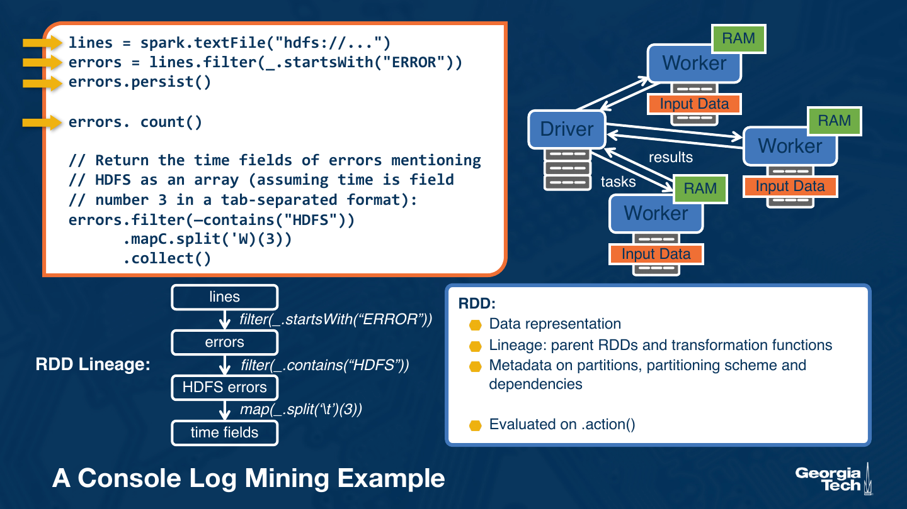

If we take a look at this line where the collect action is performed, we see that it's performed on an RDD as follows: from the HDFS logs file, the RDD lines was created, and then it was transformed to errors by filtering the lines which start with the word error. And then that was transformed to another RDD by filtering out only the lines which contain HDFS. So out of the errors, which one were HDFS errors? And then it was transformed one more time by really just pulling out the error messages from each of those lines. It was basically was somehow parsing the inputs, parsing the input lines, splitting them up, in order to get just those error messages.

The resulting RDD, and really all other RDD in the systems, includes the actual data, include information about the lineage, the parent RDD, and the transformations that were required to create the current RDD, and also some metadata on the actual partitions and the partitioning scheme and dependencies. With this information, when an action is called, such as collect, such as count, we have all the information in order to regenerate, basically re-execute, the set of transformations, and produce the resulting data. This is what we mean when we say that the actual data accesses and processing are performed lazily.

## 9. RDD Transformations

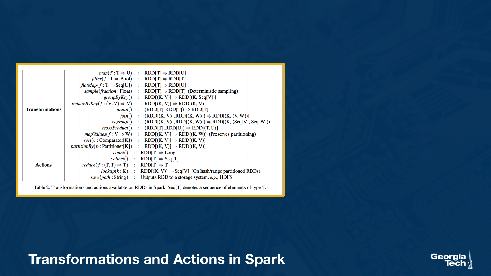

Let's try to understand better what happens during all of these RDD transformations. We said Spark supports a fixed set of transformations and actions. For instance, we mentioned map. We mentioned filter as transformation, but there are others, for instance, group by key. And then, there is join.

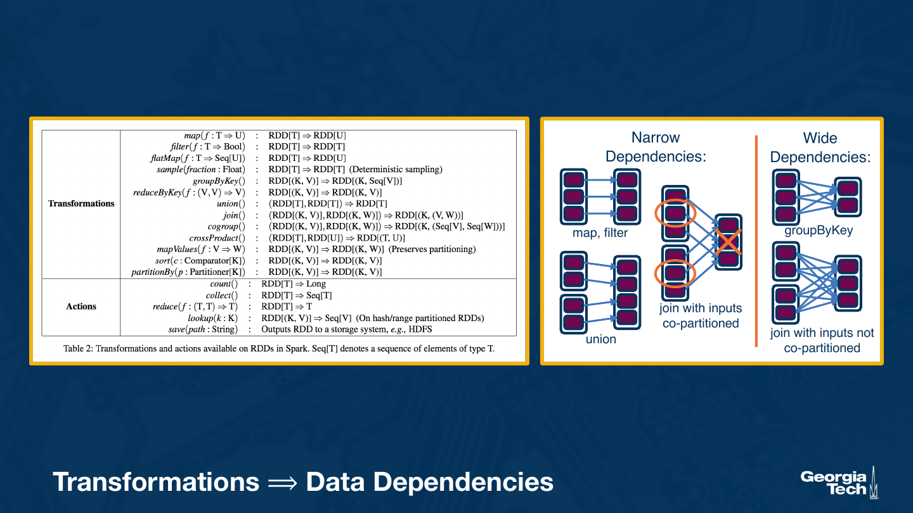

The choice about which primitive operations to include in the set of transformations was motivated by the types of data processing and analytics applications that the designers of Spark wanted to really support, that they found that they're useful, and that they're important across many of the data processing frameworks that preceded sparkles. Also, Spark has some basic actions such as count, collect, and reduce. These operations determine how an RDD will be transformed to another. For instance, map and filter create a new RDD where the elements have a one-to-one correspondence with the elements of the original RDD. Transformations such as group by key have many too many dependencies.

In that sense, if we know the lineage of an RDD, meaning the original RDD and d transformation or series of transformations that need to be applied, then that these dependencies are going to be implied by the transformations. So you can see now how it's possible, if we lose a machine and the corresponding RDD element, just by knowing the lineage, we have all the information that's necessary to determine which are the input RDDs that need to be accessed in order for the lost element to be recomputed.

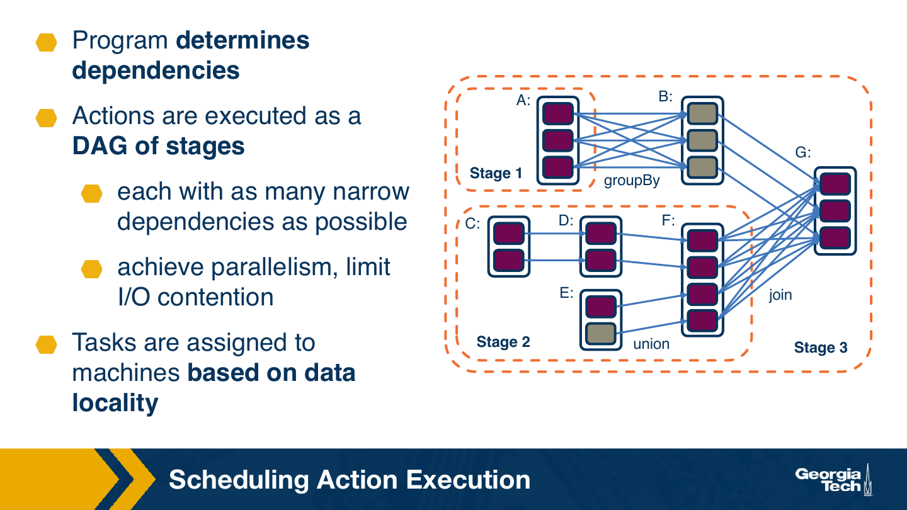

So when we look at a Spark program, the program itself will determine these dependencies. Now, when the actual actions need to get executed, this is when the directed graph that needs to get executed in order to produce each of the RDDs gets scheduled on a particular machine. And this is done in a way to achieve couple of goals. So one is kind of to create as many narrow dependencies as possible, and that way, you can achieve parallelism, and also limit the contention for IO operations. And also, this gives you an ability during the scheduling process, or this gives Spark and ability during the scheduling process, to decide how different operations are going to be scheduled based on their locality to the data that they need to access. All of that information is basically available because of the dependencies are explicitly expressed in the program and the types of the transformations that it includes.

## 10. Did Spark Achieve its Goal?

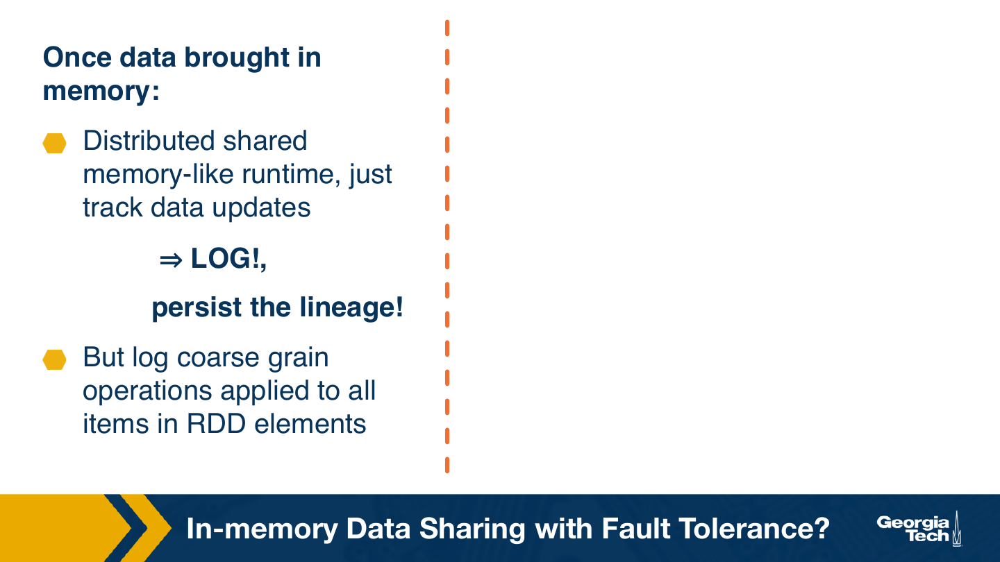

So does this design meet the goal that we had? Let's recap that Spark and RDDs were meant to achieve this goal of having in-memory data sharing and fault tolerance. The trick here, right, to have the in-memory and fault tolerance, because if data is not persisted, we can potentially lose it, right? Once data is brought into memory, sparks prolific distributed shared memory runtime, and it just tracks the data updates.

So what needs to happen at that point? Well, you just need to log the actual update. You need to persist the lineage. But note here, you're logging at a very coarse grain. You're logging information about the transformation that was applied. You're not trying to log individual updates to individual write operations, and visual data elements that are created. You just log that the transformation operation was applied on the input.

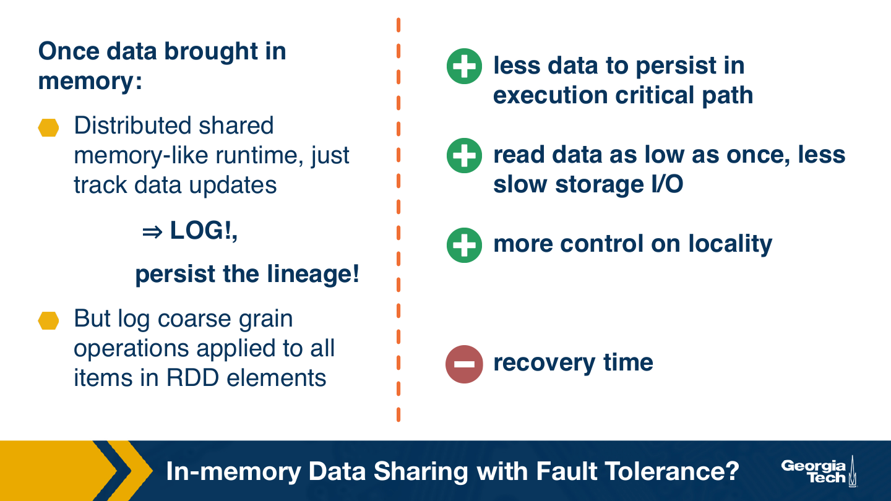

So clearly, if we only have to persist the log, there is less IO. In fact, we may be lucky, and data can be read just once, and then everything else can happen completely in memory without any access to persistent storage, other than we do have to persist the log entries. The model allows for dependency tracking, so it makes it possible to achieve locality, and to keep data movement overheads low.

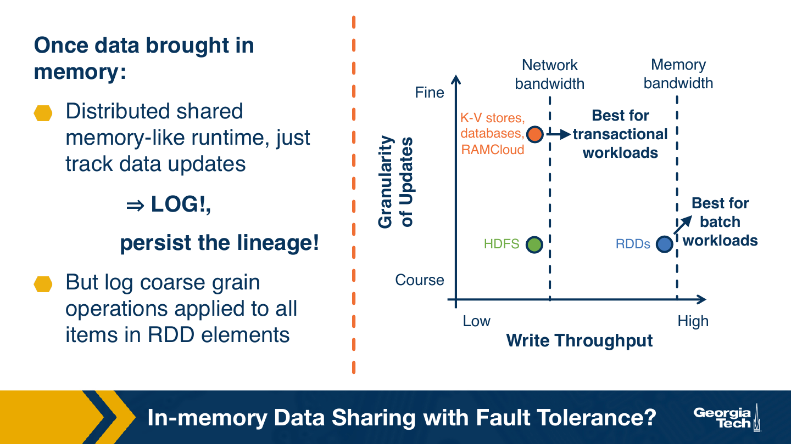

And this is obviously not absolutely free. There is a cause that gets shifted in a sense. And so if we do have a failure, and potentially, the process of recovery can become more expensive, because we may have to re-execute a longer sequence of these transform operations. The place where Spark is able to offset some of the re-execution cost is that it can use the lineage information to very selectively re-execute transformations only for the select RDD partitions that are really necessary for the particular data that was lost, for the particular partition that was lost, and nothing else, right? So we tried to organize different systems along their trade-offs of the right throughput, therefore, and the granularity of updates that they provide. We can summarize that Spark gives us both high throughput for the cases which require lots of updates, or lots of rights to be performed, and where these operations can be specified at course granularity.

### 10.1. Performance Evaluation

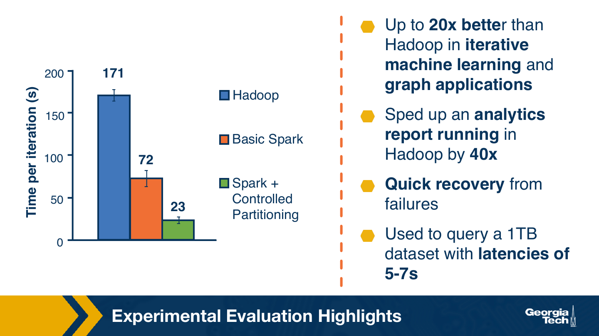

Here's a simple result from the comparison of Hadoop and Spark, and how they perform on the same algorithm, the PageRank algorithm, on some input data set. Two versions of Spark are evaluated in the paper. There's a basic one, and then another one that's optimized, which uses the placement metadata to make better decisions about partitioning, and about the placements that it will make. We see that even the basic Spark is more than twice faster compared to Hadoop, and this comes down to 8 to 9x improvement, really an order of magnitude, essentially, when all of the other optimizations that have been added to Spark are put in place. The paper includes a detailed evaluation which shows even greater gains for Spark for different applications and scenarios, and it actually shows that in practice it's able to achieve very quick recovery times.

## 11. Summary

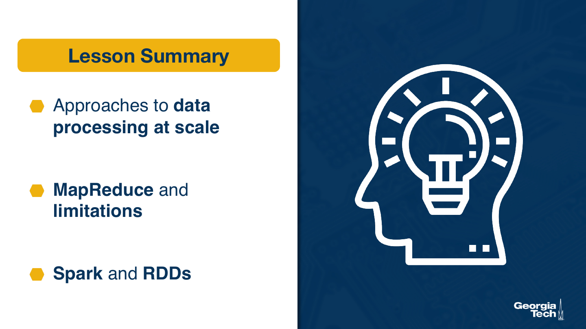

So in summary, in this lesson, we talked about different solutions for data processing in distributed systems at large scale. We talked about MapReduce, and described some of the fundamental mechanisms it incorporates, but also explained its limitations due to the excessive amount of IO and the ir related overheads. With this motivation, we then described Spark and how it is able to achieve good performance with in-memory data representation, but without losing on its fault tolerance. For this, we said Spark relies on the concept and the system support for RDDs, and the lineage information that they capture.
