# Lesson 14: Datacenter-based Distributed Management

Source: [Lesson 14 — Video](https://www.youtube.com/watch?v=K9yfJDOHeik)

## 1. Management Stack in Datacenters

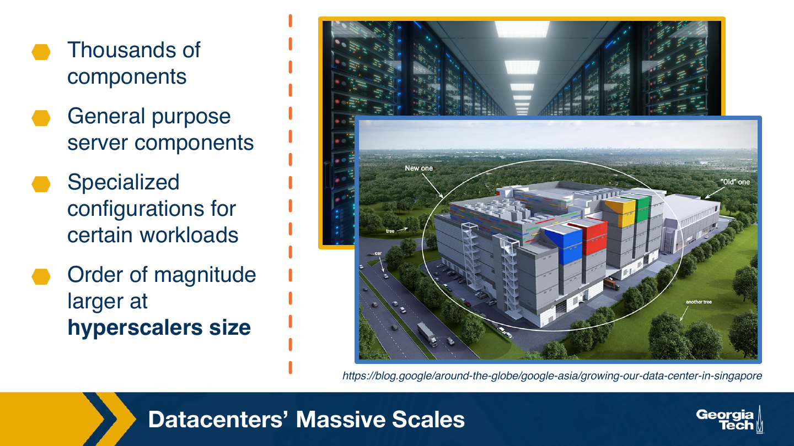

Let's consider what the overall management stack in a data center looks like. Data centers contain racks of server components, thousands of them. Sound will be server components with some compute and memory and our local storage. Others will be maybe specialized storage servers. Others may be specialized for certain types of workloads, such as for AI these days, and these will have many accelerators, such as GPUs, per node. At the level of the hyperscalers, such as Google, Amazon, Facebook, and others, the size of these systems is tremendous, and it's growing exponentially all the time. So we have a daunting management task in these settings.

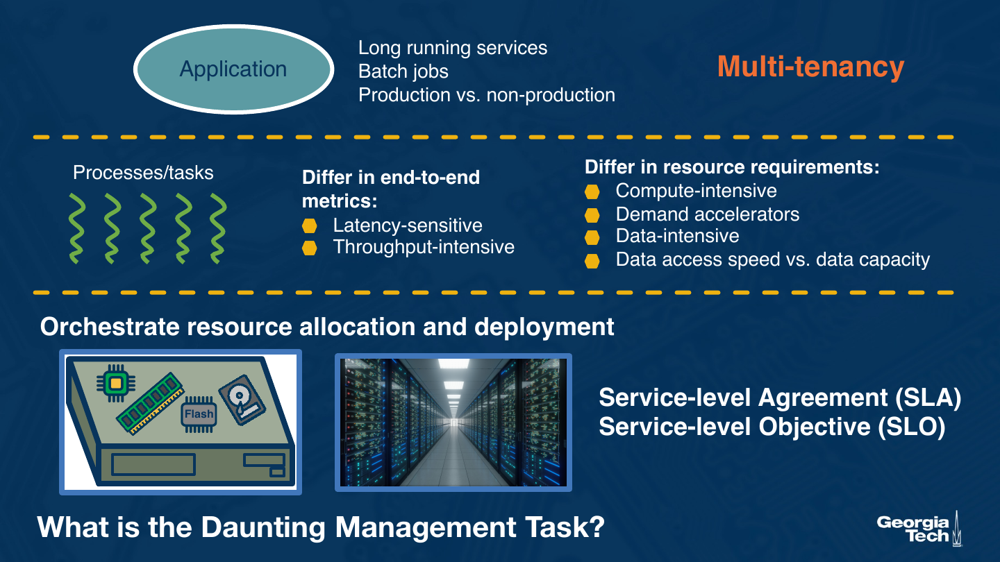

But what is it that really has to happen when it comes to the management of these systems? We need to run applications. There will likely be many applications, different types of applications. Some will be long-running jobs or services, and some may be short-running ones. In some cases, we will care for the latency, the responsiveness of the service, and in other cases, we'll have more batch workloads, and will care for their overall throughput.

The fact that there will be multiple applications, this already creates a situation of multi-tenancy. We need to manage more than one application tenant, and they may have different requirements. Multi-tenancy is also further complicated when the applications belong to different users or customers. This is common, for instance, in a cloud data center, and these workloads then need to be isolated from one another in some way.

Each application may include many processes. This may be because there are replicated application components, so as to deal with scale, or because there are different types of processing steps in the application workflow. We can think of these as tasks. I show five here in this figure, but in fact, there may be tens of thousands of tasks from a single applications. And these tasks, again, will have different requirements.

Some will be latency sensitive, meaning metrics such as execution time, or seconds per request, or seconds per query, these are going to be important metrics. Others may be more throughput oriented, throughput sensitive, and they will care for metrics such as the overall query or request rate. They will also have different resource requirements. For instance, some will be compute intensive. They may require pi and CPU resources, or specialized accelerators. Others may be more data intensive, and here, the decision is about which type of memory, or how much memory or storage should be allocated to a task. And even in this context, the allocation decision will differ depending on whether the task demands fast data access speed versus large amounts of data capacity.

All of these requirements need to be translated to specific allocation decisions for the actual hardware resources within a single data center now, and also across the many servers and racks of servers in the data center. Given the many interdependent tasks in an application, this is not simply a resource allocation decision, but it also requires orchestration of which tasks will be deployed on which node and will use which underlying resources.

The ultimate goal is to meet the service level objectives, or SLOs. This specifies something about the target performance and resource allocation that will be provided to the given application. The consequence of meeting or violating an SLO is often specified via contractual SLA, service level agreement, among the providers of the infrastructure and the customers that are submitting the applications to be executed there.

## 2. Datacenter Management at Scale

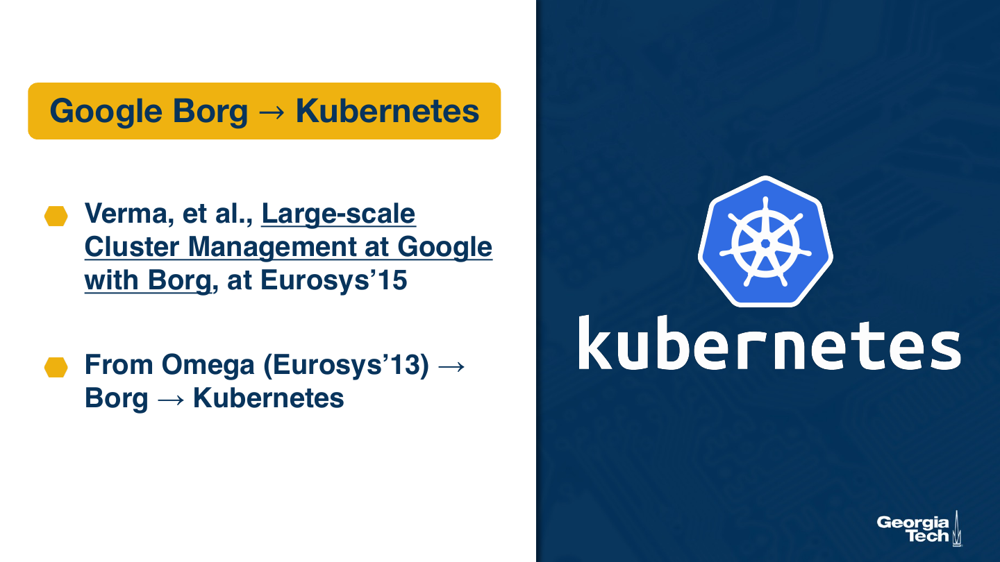

We need to perform these management tasks at scale, so let's look at a concrete example of the management infrastructure that actually achieves this. We will discuss this via the paper on the Borg resource manager, which was developed and originally used at Google. It was presented at the EuroSys conference in 2013. Borg was a follow-on on an earlier resource manager omega, which was also used at Google, and coincidentally, was also presented at EuroSys a couple of years earlier. But the important thing to know about Borg is that it forms the basis for what is today Kubernetes. And Kubernetes is one of the most widely used orchestrators in containerized data centers today.

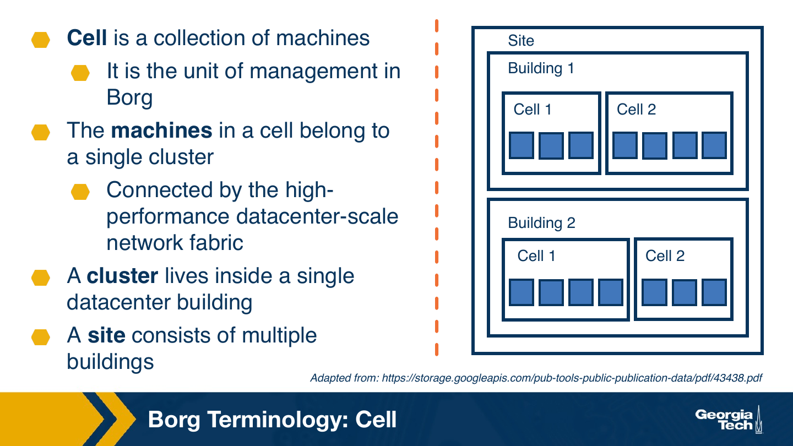

Let's look at the terminology used in the paper. A cell is a collection of machines. This is a unit of management in Borg. The machines in a single cell belong to a cluster, and interconnected by some high performance data center scale network fabric. The cluster lives inside a single data center building, and then a site may have multiple buildings, include multiple buildings, and therefore, will have multiple clusters.

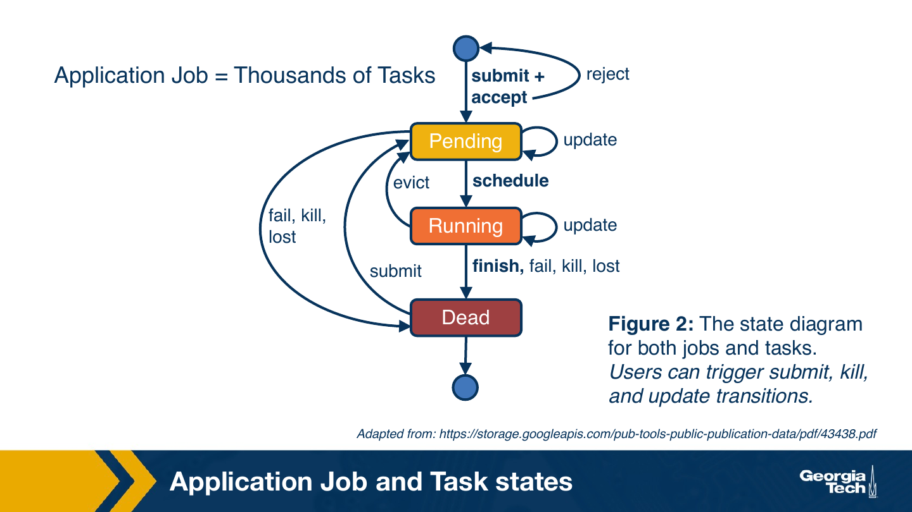

An application, when it's submitted for deployment, it is going to be represented via the actual tasks which need to be scheduled. The paper gives several examples where an application may correspond to tens of thousands of tasks. The responsibility of the Borg orchestrator is to perform resource allocation and scheduling decisions for each of these individual tasks. This is much like what an OS scheduler needs to do for all of the runnable tasks in a single system, except that this needs to be now performed across the resources of the entire data center cell.

This is the flow of a task in a system. When a task is submitted, provided that it is accepted by the system, it becomes pending. Periodically, will get scheduled. It runs for a certain period of time. The state of the task will be updated, and maybe the task will finish, will actually complete, or it will be evicted because another task needs to run using those resources. And if that's the case, it will become pending again. If a task needs to be re-executed for some reason, for instance, maybe a task failed, it's also going to be resubmitted into the eq of pending tasks. And depending on the state of the system, the scheduler may decide that it needs to sort of remove some tasks from its queue. And in that sense, it can send them straight to the dead state from which they exit the scheduler system.

## 3. Overview of Borg Operations

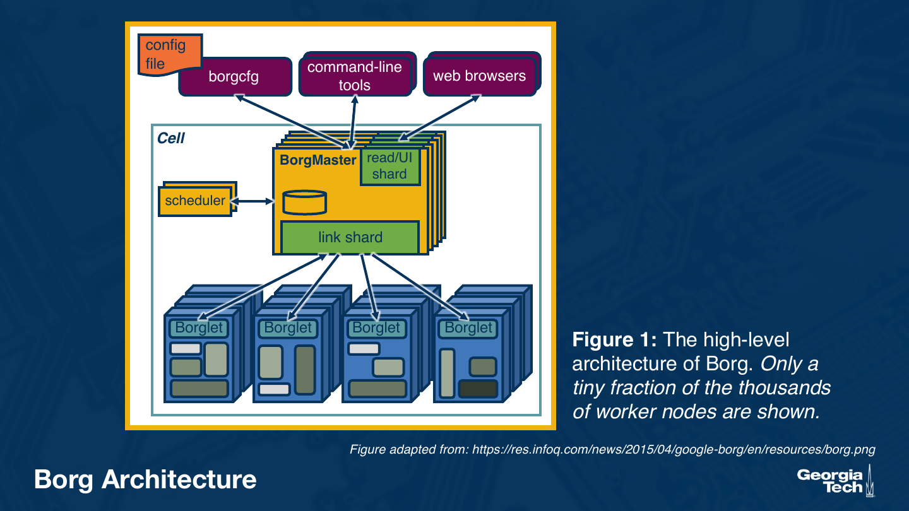

Let's look at what happens when work needs to make scheduling decisions. This is the overall architecture of a Borg cell.

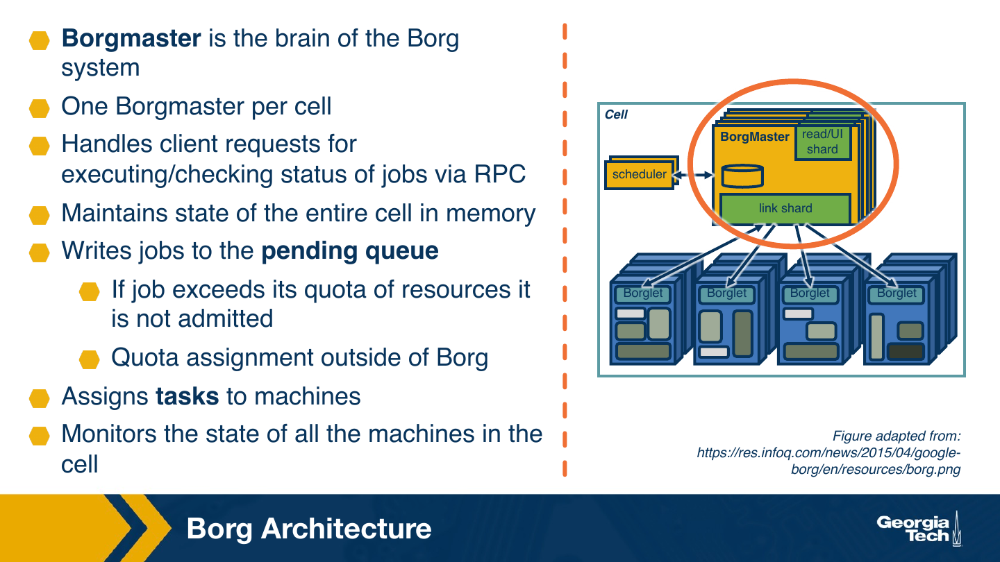

The Borg master, it's like the brain of the Borg system. There is one Borgmaster per cell, and it's going to handle all of the client requests for executing jobs, for checking the status of the jobs. The clients will interact with it via RPC messages. The Borg master maintains the state of the entire cell in memory, so you can already get us some flavor that this is going to present some limitation on how we can scale a single cell.

The scheduler determines what are the jobs that can be admitted and assigned to the pending queue. If a job in some way exceeds its quota of resources, it is not going to be included. It's going to be removed from the pending queue, or otherwise, it's not going to be admitted. And the actual assignment of these resource quotas, that's orthogonal to work. That happens outside of work. It makes the actual assignment of tasks to the different machines, and it monitors the state of all of the machines in the cell. The actual task assignment is going to be done based on scheduler logic that does include information about the state.

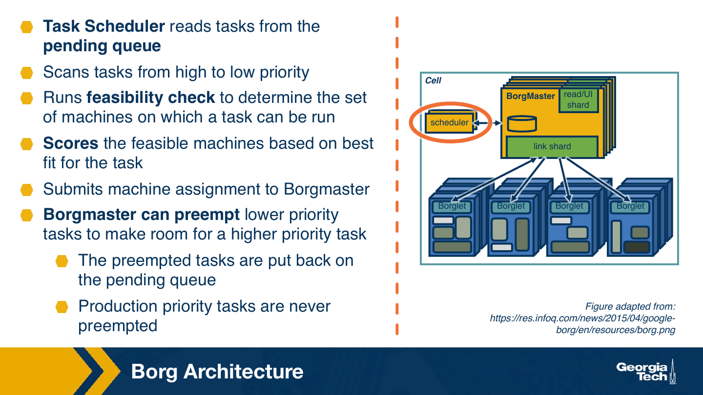

So the task assignment is the responsibility of the task scheduler component. It reads tasks from the schedule or queue. It scans them based on their priority. It runs some feasibility checks to determine what are the machines that are likely a good candidate for a particular task, and also perform some type of scoring, some type of evaluation, on the feasible machines in order to indicate what are the likely candidates, the best fits, for a particular task. And then, the scheduler submits this machine assignment to the Borgmaster. So in that sense, the scheduler doesn't really make a single recommendation that's going to get enforced. It just performs some analysis on the workload in the system, and it performs this filtering and ranking of the available resources in order to determine some good affinity among the tasks and the resources that they should be scheduled on.

The Borg master can preempt any lower priority task to make room for a higher priority task. And if a task is preempted, it's just going to get put on the pending queue. It's going to make these decisions based on these machine assignments that are submitted by the scheduler. So it's really the Borg master that actually executes the actual schedule. In certain types of workloads, like the priority workloads, they're never preempted.

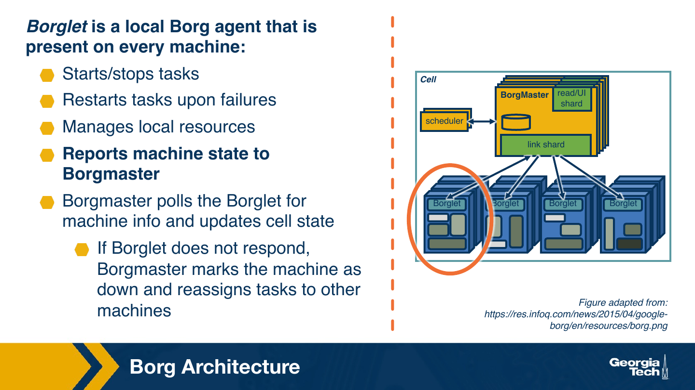

And then, we have the Borglet component. The Borglet is like a local Borg agent that's present on every single machine. It's responsible for actually dispatching the task, to start and stop the task, restart the task upon failure. It's responsible for the management of local resources. And also, importantly, it's responsible for reporting of the machine state with the Borg master. The Borgmaster actually pulls the Borglet for update, for the machine resources. And based on this information, it updates the date of the cell. If the Borglet doesn't respond, the Borgmaster will assume that the machine is down, and it will reassign the tasks to other machines.

## 4. Achieving Scalability

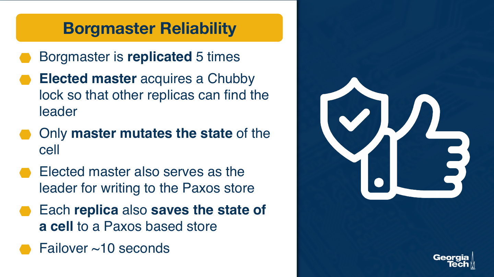

So let's now highlight specifically what are the mechanisms in this Borg architecture that contribute to the scalability of the design.

To ensure the reliability of the Borg master, since this entity is key for the performance of Borg, the Borg master itself, it's replicated. The paper states that it is replicated five times. One of the replicas serves as a master, and the master is determined using the Chubby log, which is kind of like Google's version of Zookeeper, but basically, it's decided based on some consensus algorithm. And so this is how all the replicas agree on who is the leader. Only the node mutates the actual state of the cell. This makes it possible to perform these updates quickly without having to actually acquire locks among all of the replicas.

The elected master also serves as a leader for writing to the Paxos store. Each replica saves the state of a cell by relying on a Paxos-based store as well, and there is a failover that's possible to achieve among the replicas in under 10 seconds based on the results that they publish in the paper.

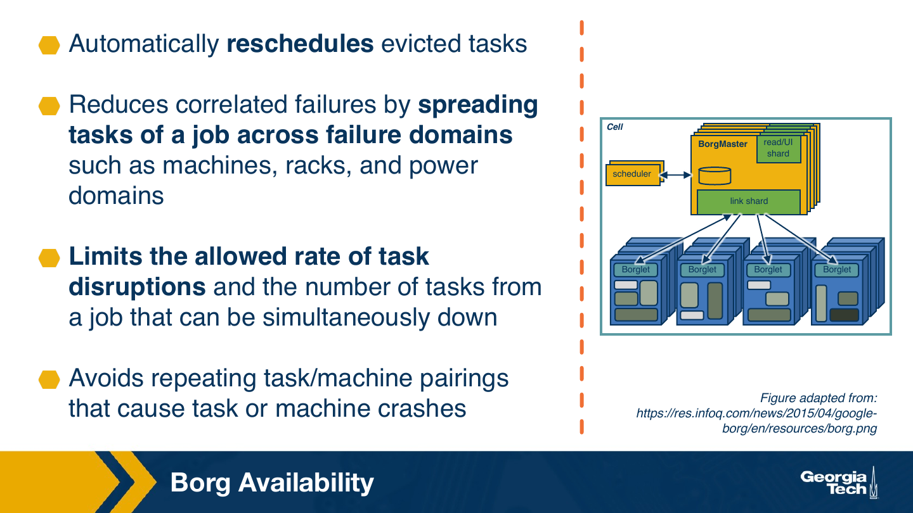

The system incorporates a number of heuristics that are designed so as to both limit the impact of failures, and to ensure forward progress. Tasks that are rescheduled, or that are evicted, they get automatically rescheduled. The system tries to maintain some information about failures that are correlated, and to keep that in mind as it's scheduling tasks, to avoid scheduling tasks along a set of resources where correlated failures are likely. It tries to avoid repeating matchings of a task to a machine if it observes that this is leading to some failures. And it also keeps track of the number of tasks of a particular job that are evicted or down at any given point of time, again, in order to ensure that there is minimal level of disruptions, and there is some forward progress.

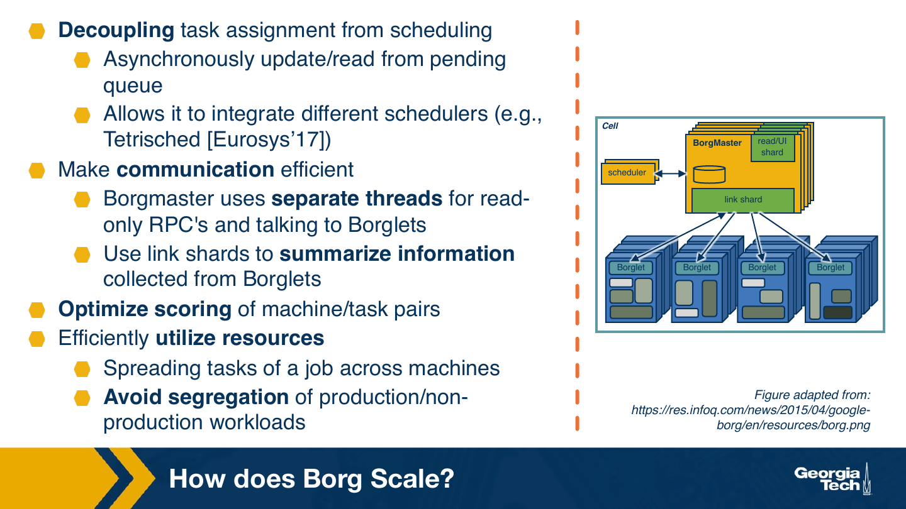

Another important decision made in work is to decouple the process of running the scheduler logics that makes recommendations about the task assignments, from the actual scheduling of the precise resources to a given task. This opens up opportunities for much more asynchrony among the different steps of when the different queues and different statistics are updated, read, and so forth, and also makes it easier to integrate different types of schedulers. One interesting piece of work, for instance, is a paper that was published at urasis in 2017, tetris sketch, that introduces programming constructs that would let tasks describe their different requirements for heterogeneous types of resources. And then using these programmer constructs and some linear integer programming, ultimately, you produce a schedule, an allocation of resources, that gives you some strong guarantees regarding the performance that you can achieve.

Other decisions integrated in the system relate to introducing some communication optimizations. For instance, the Borg master uses designated threads that perform read-only RPCs when they talk to the poor clot. And then, it also uses these shards, these link shards shown in the picture, which essentially represents some summarized form of the information that's collected from the bore glass. The number of bore glass here is really just a small fraction of the total number of bore gluts that would be under a single master node, so it's important to be able to synthesize this information that's then used in scheduling in a compact way.

And there's some additional optimizations around how the scoring of machines and task pairs is done. So basically, how the scheduler component filters out what are the good versus not so good candidates for the scheduling operation. This also takes into account decisions on how to maximize the utilization of the resources. And then, one important decision that was made in Borg is to avoid the segregation of production and non-production workloads. Production workloads here being sort of long-running services, and non-production workloads, and these are the high priority ones, and the non-production workloads being the more opportunistically scheduled batch tasks.

### 4.1. Scheduling and Resource Isolation

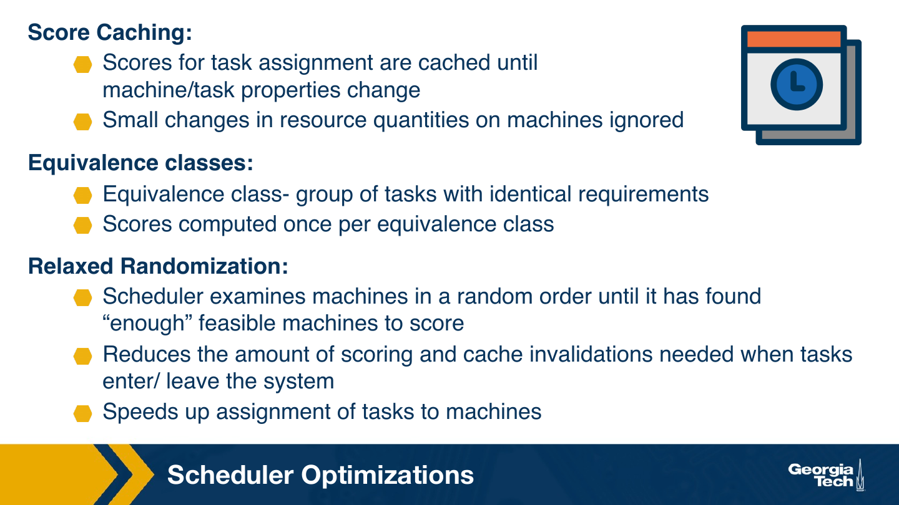

So here are some of the optimizations made around the scheduler specifically. So we mentioned that it uses scores in order to determine good candidates for machines that a task should be scheduled on. But there is an opportunity to simply cash those scores for periods of times, and not to recompute it continuously. There is an opportunity to create equivalence classes, either among the sets of tasks that have identical requirements, or sets of resources that exhibit identical or very similar properties. And then, there are some opportunities to actually get benefits from some randomization. So the scoring and filtering of the tasks can sometimes lead to situations where certain machines are in a way prioritized all the time. And sometimes, it's good to introduce some randomness and to opportunistically discover some resources that maybe are actually quite good. Just because we haven't used them for the specific task in some of the previous cycles, that may not be that obvious.

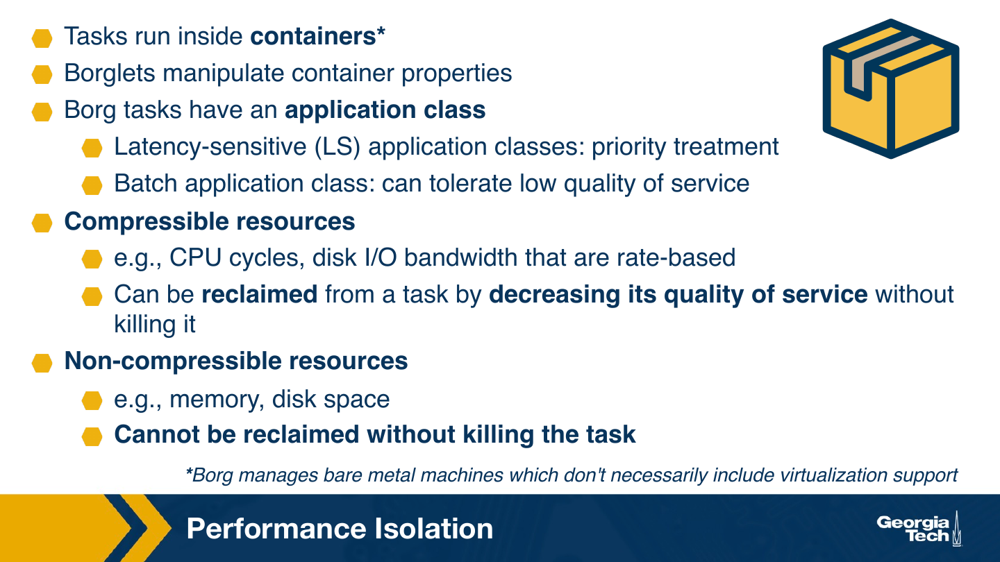

In order to achieve isolation among the different tasks in Borg, tasks run inside containers. So just like Kubernetes, today's container-based orchestrator. And the borgluts are the ones that manipulate the container properties, assign the container shares. Some of this is determined depending on the application classes which are determined by the kinds of application classes that Borg supports. And then, to what extent they can be manipulated, the resources, that depends on whether the resources are compressible, such as, for instance, CPU cycles or IO bandwidth. Can reduce the share of the resources that's available to a container. So what that means, these resources can be reclaimed, and the task will essentially exhibit some decrease in the quality of service, but it's still going to continue executing.

But then, some resources are not compressible. And in the case of Borg, that refers to memory and disk capacity. And they cannot be reclaimed without actually killing the task and sending it back to the pending queue, or potentially evicting it.

## 5. Experimental Results

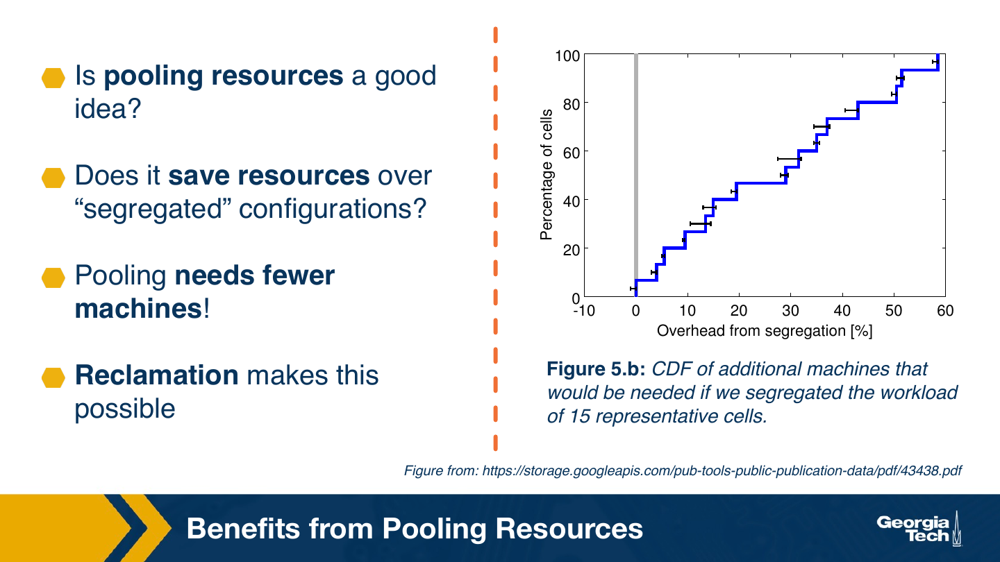

So let's look at a few results from the experimental evaluation of Borg in the paper. The paper presents several different experiments. We pick one of them to highlight one of the benefits from Borg. So one decision made in Borg was to share the underlying resources by the different types of workloads, the high priority services and the low priority batching jobs. The first decision they explore is whether this decision leads to better resource efficiency when compared to a configuration where the hardware resources are segregated and then designated to host either high priority or batch workloads.

They take a look at workload traces from a production cluster, and then they replay them in an emulated scenario, in a configuration with and without resource pooling. And then, they measure how many extra machines would they require if they were to run the workload in a segregated configuration. They call this overhead from segregation, and they find this to be anywhere from 20 to upward of 150 percent. More machines would be required. So the polling decision that they made leads to being able to execute the same workload with fewer machines.

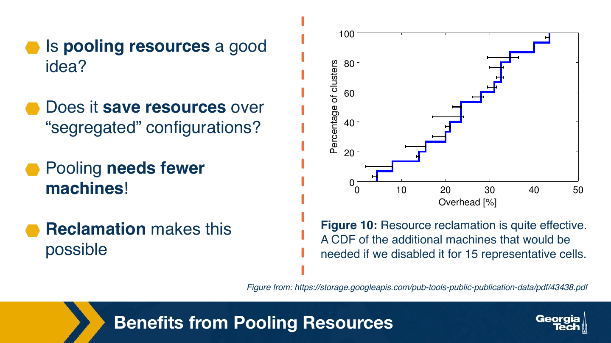

Clearly, polling resources and sharing them to serve different types of workload, saves resources over the scenarios where machines are designated for a specific type of workload. And this is made possible because of the reclamation technique that they use. This allows them to, whenever they find some available resources, to allow a low priority job to be scheduled, but then those resources to be reclaimed and given back to the high priority production workload as soon as it's necessary.

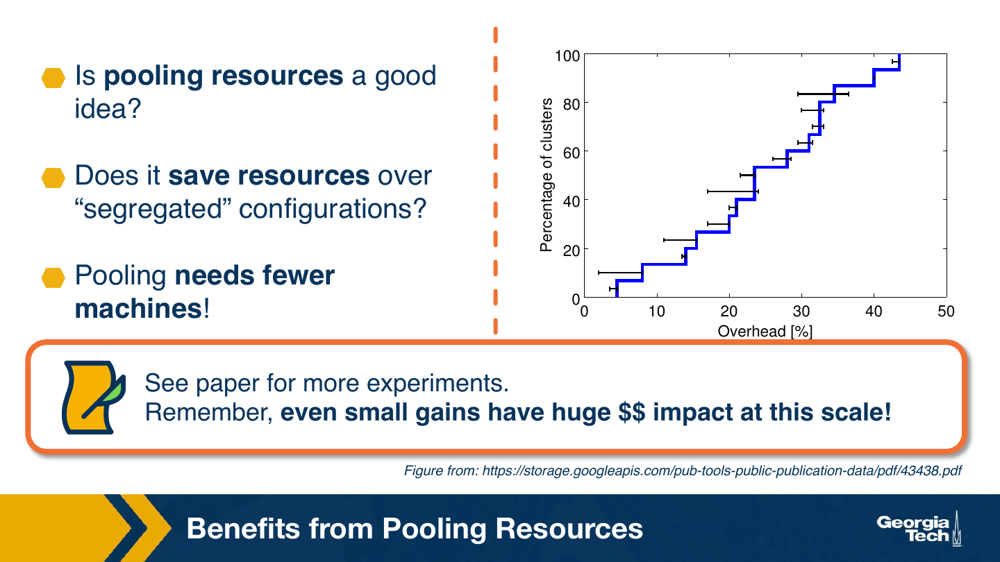

The paper includes many more detailed experiments showing the benefit of different decisions in work, and its impact on improved resource efficiency. And one important thing to note, that at the scale of the data centers such as the ones at Google, even the small gain in efficiency can have huge impact in terms of dollars, in terms of watts, in terms of a number of metrics, when you consider the sizes of these systems.

## 6. Summary

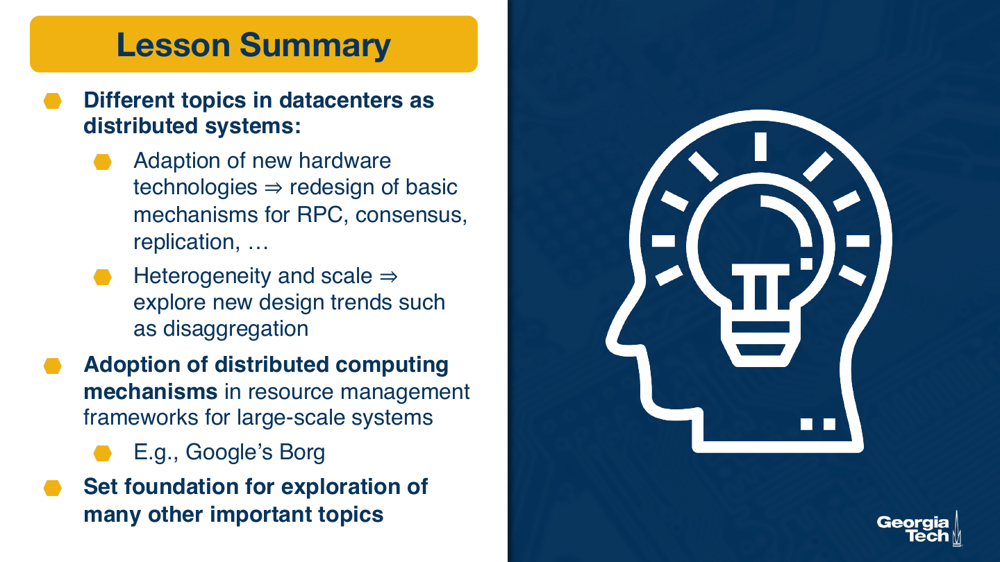

In this lesson, we looked at different topics related to data center systems. We talked about the fact that the emergence of different hardware technologies has implications on the design of even basic data center mechanisms. We said that even the implementations of something like rpc would need to be reconsidered when using some of the newer types of interconnect technologies, or some of the new types of persistent memories.

We said that the presence of heterogeneity and the goal to reach to ever larger scales while maintaining efficiencies, that this leads to exploration of new design trends such as disaggregation. These will pose some major need for redesign of the system software stack and the application services as well. We also looked at how different techniques for distributed computing come together in the development of resource management frameworks for large-scale systems. And for this specifically, we looked at Google's Borg system, the predecessor of Kubernetes.

The area of data center systems is very big. It deserves a course on its own, but hopefully, with the selection of topics covered in this lesson, we set some foundation which will help you in the exploration of many other important topics in this space.
