# Lesson 15: Distributed Machine Learning

Source: [Lesson 15 — Video](https://www.youtube.com/watch?v=PoNzGBLUnOM)

## 1. Introduction

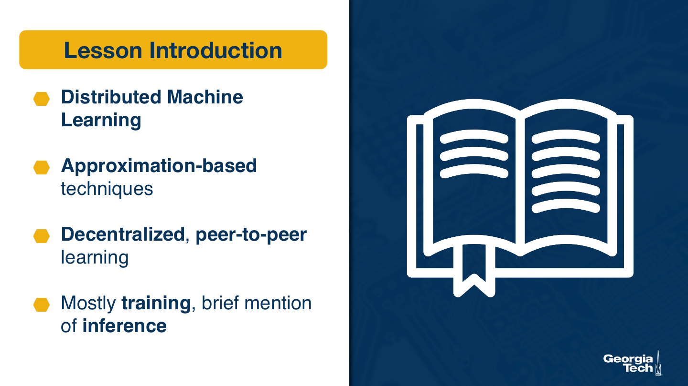

In this lesson, we will talk about system support for distributed machine learning. We will specifically do this in the context of geo-distributed systems, as opposed to data center systems. We will compare the trade-offs among different designs, and discuss the system Gaia, which leverages the fact that machine learning is approximate, and that way, it creates some improvement opportunities. We will contrast dominant centralized approaches with decentralized and collaborative peer-to-peer approaches, using the Cartel system as an example. And most of our discussions will be in the context of the training process of ML, but we will include a brief mention of some solutions targeting also machine learning inference.

## 2. Distributed Machine Learning

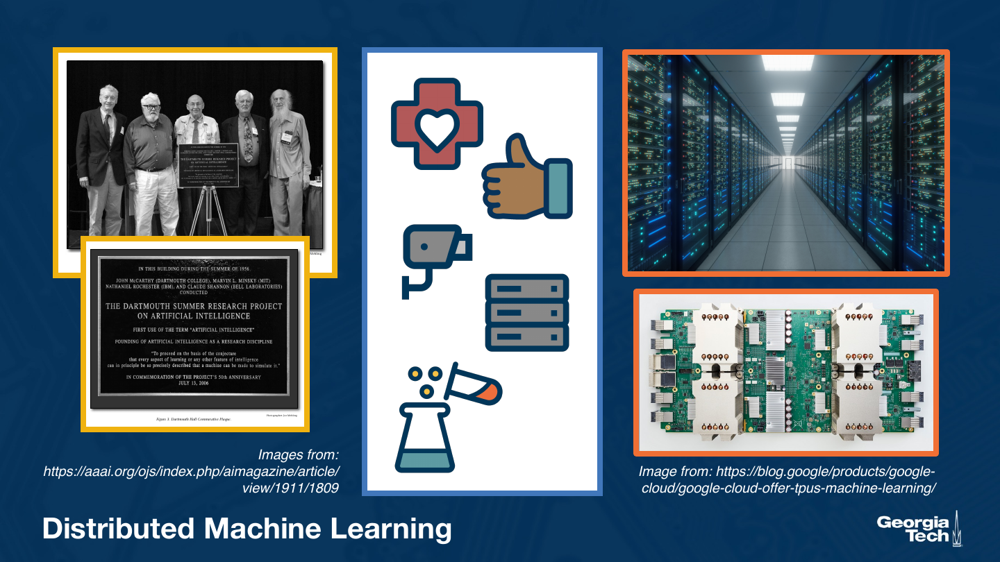

Machine learning has been going through a renaissance in the last years. Although many of the fundamental techniques, at their core, are decades old, really, the progress that has been made with hardware and software systems solutions has made these approaches practical in these years. And this is why we witness machine learning propagating across all application domains, from health monitoring, recommendation systems, visual analytics, such as for surveillance, data center management, as well as scientific discovery, such as in the processes for climate modeling, drug discovery, and much more.

The key in the success of machine learning and artificial intelligence is the ability to build robust models by using vast amounts of data, a process which is both data intensive as well as compute intensive. In data centers, this has led to massive system configurations outfitted with high-speed networks, with many accelerators, such as GPUs, or newly created classes of accelerators, such as Google's tensor processing unit.

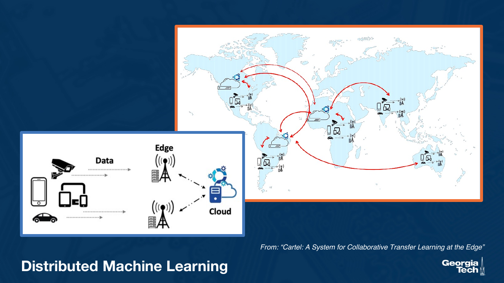

However, a lot of the data that needs to be processed is generated far from these data centers, at the edges of the networks, in the sensors of IoT devices, cameras, smartphones. In that sense, all of this data needs to be moved from the edges to the backend data centers. More so, many of these applications are, in a sense, global. They rely on data generated across globally distributed sensors and environments. This means that the data movement doesn't involve moving data just to the nearest data center, but potentially across the many data centers that are distributed across a wide area network, and this is quite expensive.

## 3. Distributed Machine Learning Approaches

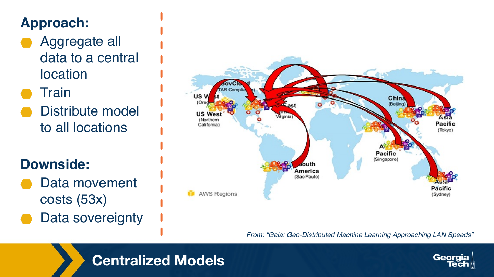

Let's look at some different approaches to distributed machine learning. The simplest model is to collect all the data from all of the different locations to a single centralized place for analysis, to build the models, and then to distribute these models to all the global locations where they will be used. The downside of this, this involves tremendous amount of data movement. And this data movement can have huge implications on slowing down the performance of the machine learning process. If we compare the time that it would take to perform the same kind of machine learning computation, if all of this data were available locally, to the scenario where the data also needs to be moved from these distributed locations to centralize location and back, we would see that the later case would be 53 times slower.

Another downside of this kind of centralized approaches is what we call data sovereignty. I mean, we have to move this data across international boundaries, and different types of laws may apply to data in different countries. An example of that can be simply privacy related.

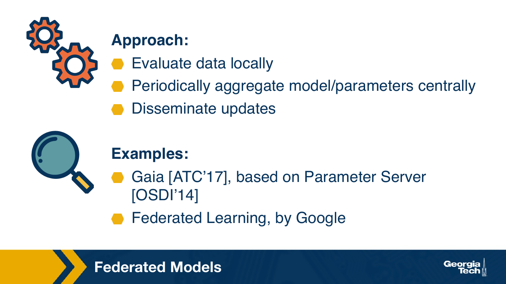

Another way to do this is by using approaches which behave more like a federated system. In these approaches, data is evaluated locally. There is some learning that takes place locally, and then periodically, these locally computed models are somehow aggregated. Their parameters are centrally collected. Based on these centrally collected updates, there is some general update that gets computed, and it gets disseminated across all locations. One example of this type of system includes a system called Gaia, which we will talk about, which was published in ATC in 2017. Gaia built on a popular distributed machine learning solution, which was designed for primarily data centers, called parameter server. This was published at OSDI in 2014. Similar goals as Gaia are part of the federated distributed learning model published by Google, which today is one of the most popular distributed machine learning models. At its core, this federated learning method uses something that's called federated averaging, in the method in which it aggregates these model updates before it disseminates the globally updated model.

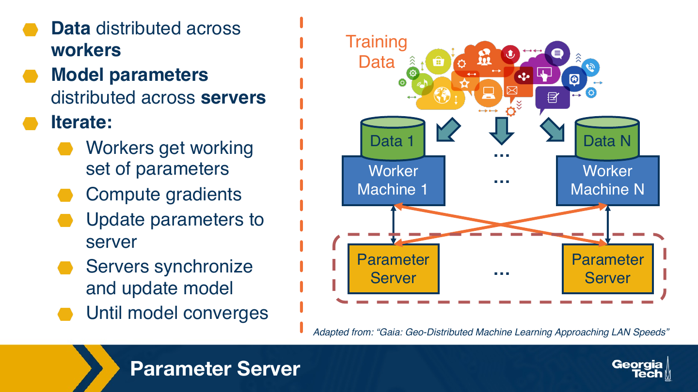

Since both Gaia and federated learning leverage functionality that's similar to what the parameter server approach already includes, or in a way directly extended in some way, let me describe, in a simplified way, how parameter server operates. The system is deployed in a data center, or in a cluster with many machines. Some of these machines will be workers, and others will be designated as parameter servers. The training data is distributed across all of the workers, and the model parameters need to be distributed to all the servers.

The learning process is done in an iterative manner. Workers get some set of the parameters. They compute, based on the parameters, some updates to the model. They compute the gradients. They communicate the updated parameters to the server. The servers aggregate this information, synchronize amongst each other. They determine how the model needs to be updated, and then this information is propagated back to the worker machines that are going to now use the updated model in the next iteration. And this proceeds until the model converges. By converge, we mean that the change from one iteration to the other is not very significant anymore.

## 4. Geo-Distributed ML

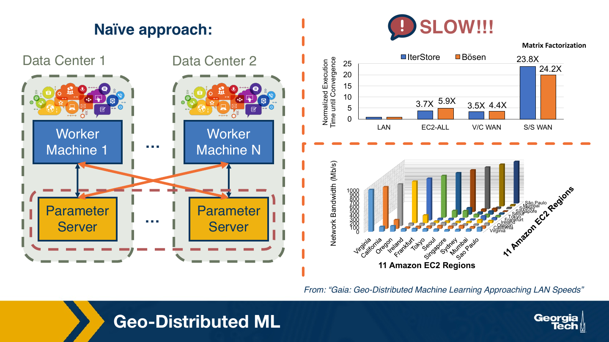

Now, we want to use the same type of machine learning system when performing machine learning operations across geo-distributed data sources in a geo-distributed manner. Well, we can simply deploy all the worker machines and the server machines in the different data centers, and functionally, this will work. However, it will be much slower.

In these results from the Gaia paper, the authors show that it is several times slower, more than 20 times slower, to perform this kind of distributed learning compared to the scenario where all of the machines are in the same data center. The main reason for this slowdown is related to the dominant characteristics of the wide area network that connects the data centers when the parameter server is configured in this kind of configuration. For this experiment, they ran the parameter server across 11 EC2 regions in the Amazon compute cloud. They observed that the slowdown was most significant when the parameter server was deployed across Amazon EC2 regions which exhibited the lowest performance in terms of their wide area connectivity. Even when the geo-distributed data centers were connected via reasonably fast wide area network, for instance, this was the case among the data centers in Virginia and California, even in those cases, the execution of the machine learning process was three to four times slower. And that's actually a significant issue.

Bottom line, taking this naive approach to take a system that was designed for a single data center and deploying it and expecting it to work efficiently across multiple data centers, it's not going to be the most effective solution.

## 5. Leverage Approximation

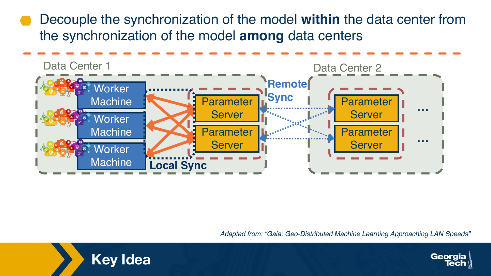

In Gaia, the authors build a solution that leverages approximation. The key idea in that work is to decouple the synchronization of the model within the data center from the synchronization of the model among data centers. What that means is that within a data center, the workers and the parameter servers will interact in the same way as before, and will synchronize regularly. However, across data centers, parameter servers will be out of sync, and they will synchronize only infrequently to perform some periodic sync operations.

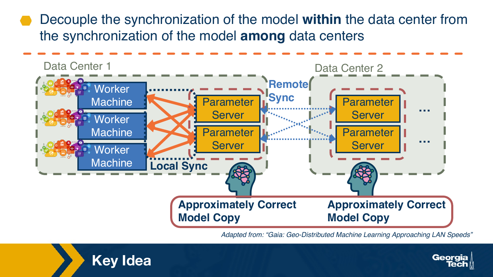

The reason why this makes sense to consider is because machine learning is already precise approximate. We always think about the model error rate, convergence, etc. This is not a problem space that really has to have precisely exact values for the application to be able to function correctly. Gaia leverages this ability to perform approximate computing to relax the consistency requirements of the system.

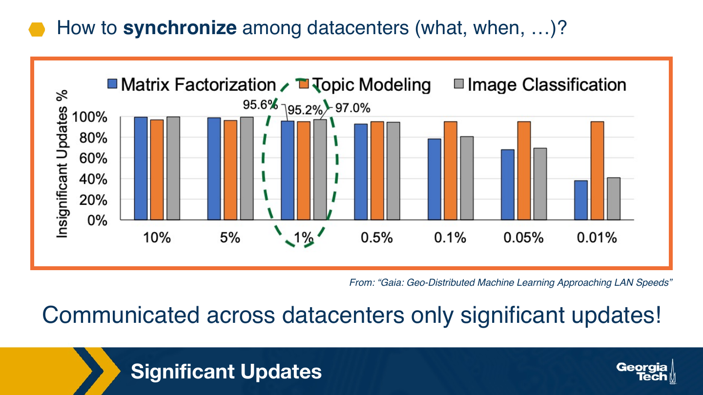

Now, how do we decide when and how to synchronize among data centers? We don't want to just randomly make some decisions of when and which data to exchange during the remote sync. Fortunately, during the iteration of the learning process, not all of the model parameters change. And even when we look at the parameters that do change, not all of them change by the same amount. The authors performed an experiment in which they look at how much the model changes with each of the gradient updates. On the x-axis in this graph, they plot the percentage of the change in the model, and on the y-axis, they plot the number of updates which didn't result in a change that was greater than the x value. Look at the 1 value. We see that they measured that anywhere from 95 to 97 of the updates were not significant, meaning that they led to a change smaller than 1.

So the key idea in Gaia is to use only these significant updates for the remote updates, meaning only the significant three to five percent of the updates will be communicated across data centers, and the remaining ones remain processed only on the parameter servers within the local data center.

## 6. Gaia: An Approximate Synchronous Parallel System

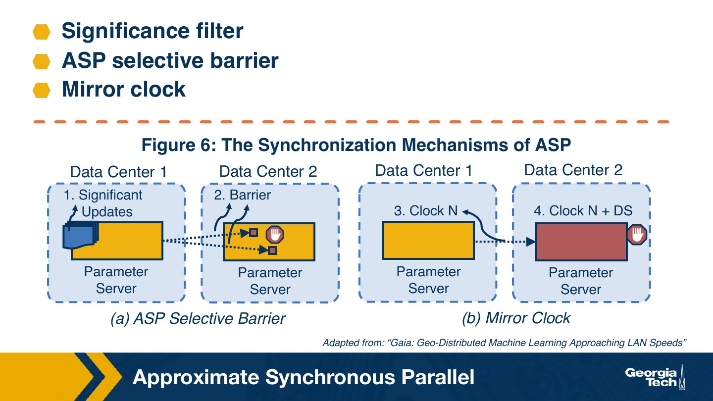

In order to achieve this, the Gaia system relies on a new synchronization model that they call approximate synchronous parallel, or ASP. To support ASP, the system needs several underlying mechanisms.

The first is a way to determine what are significant updates. The system does this by exposing an API, that would allow programmers to specify what's significant for their case. And then, the system dynamically computes the significance of the updates to, based on this function, in order to filter out the insignificant ones.

Given the much slower wide-area network speeds, sometimes, even just the significant updates would take a long time to get copied over to the parameter servers in the other data center. Since we need to make sure that the parameter servers are updated in a synchronous manner, at least for the significant update, Gaia introduces this ASP barrier. This is a way to stall the workers in that remote data center. This really just means that during a remote sync, some index that specifies the information about the updates that will be sent, this index is going to be sent first so that the remote data center knows to wait.

And finally, to make sure that one data center doesn't become too stale because of the slow wide-area network speed, the data centers exchange clock information, so they can use this to estimate the staleness and the round trip times, the one speed, and then to determine whether one data center needs to slow down its parameter servers in order for overall, the system to be more in sync.

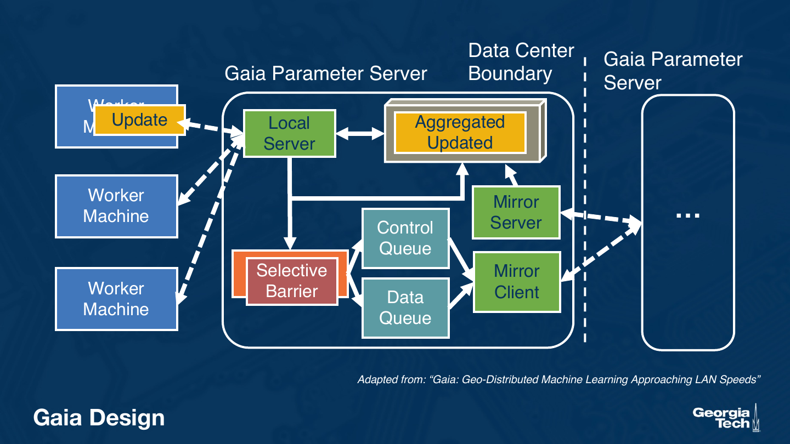

The design of the system is shown in this figure. Within a data center, workers communicate with their local parameter servers as in the original parameter server model. The updates are aggregated, and the significance filter is applied. And when a significant update is determined, this information is used to create the information for the ASP selective barrier. This is considered control information. It will be sent via separate control queue, so it's not to be somehow blocked with the all the data that is scheduled for transmission to the remote data center. All communication will be tagged with the local clock, and these clock values are used to determine when the learning process needs to be slowed down.

### 6.1. Performance Across Regions

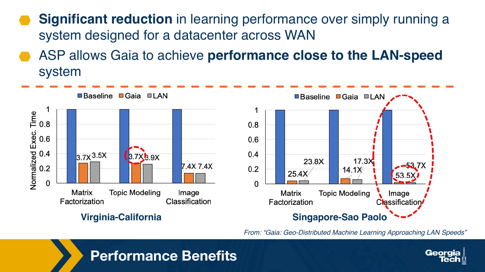

Let's look at a single experiment. This experiment is performed with 11 EC2 servers running in different AWS regions, distributed across their different data centers. In the left hand side, the data centers are in Virginia and California, and in the right-hand side, the data center machines are in Singapore and São Paulo.

If we compare the case when the machine learning is performed over a local area network in the data center versus over a wide area network, this is the baseline case, the blue case, we observe a significant drop in performance. The y-axis is normalized execution time, so lower is better. So the fact that these blue bars are so much higher than the gray bars, this indicates how much worse is it to simply use the parameter server in a geo-distributed way in the same way as when we're performing machine learning in a local data center. And of course, when comparing the left and the right hand side bar, we observe that this gap between the blue bar and the gray bar for these three machine learning applications is much greater than in the case when the two data centers are closer together, or rather, connected via a better wide area network.

More importantly, from these results, we observe that Gaia, the orange bars in each of these groups of bars, end up achieving performance in terms of the machine learning time, so how long did it take for the machine learning process to converge and to produce a model that's no longer really updating in significant manner, iteration from iteration, we observe that these orange bars are really close to the gray bars. What this shows is that Gaia allows machine learning at two distributed scales to be performed at the same speed as if the learning and all the data were localized in a single data center. That's a significant achievement.

## 7. Tradeoffs of Using Global Model

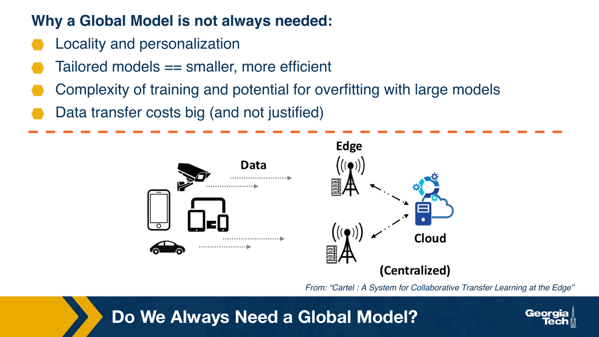

Now, what are some tradeoffs of using a global model? One thing that Gaia and Google's federated learning have in common, and also the parameter server, is that their goal is to create the best possible global model. A single global model means that there is a single unified model that will be used across the entire system, regardless of location.

But a global model is not always needed. There is a lot of locality in the data trends and patterns in different locations. These contexts can be better served by a smaller, more tailored model. Trying to build a good global model is actually much more difficult from the algorithm perspective as well. It has been shown that this leads to overfitting, less accurate models, etc, in these scenarios when the data trends tend to exhibit different properties at the different locations.

Finally, even with the optimizations in Gaia and federated learning, there's still significant costs associated with transferring the data for all of the model updates. Models can be quite large. And if these data transfers cannot then be justified with having better model, and this raises some concerns.

### 7.1. Isolated Learning

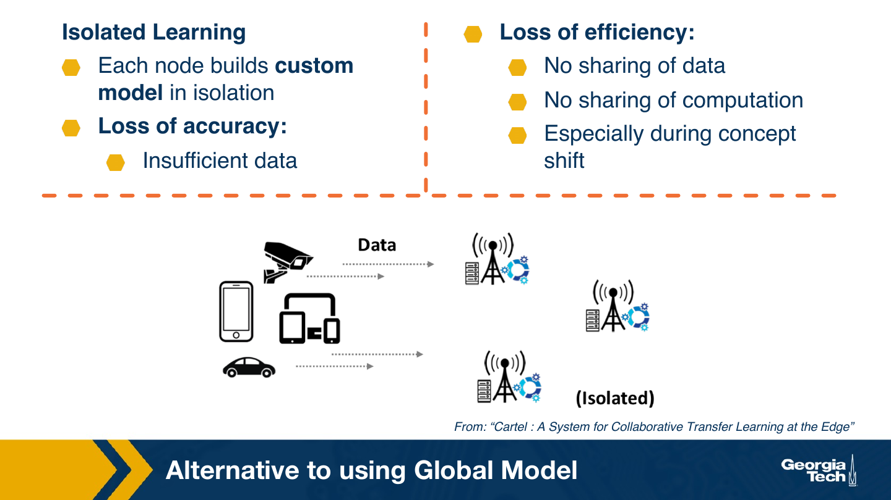

One extreme alternative is to not use a global model, but instead to perform isolated learning. As the name suggests, isolated learning would mean that each node in the distributed system would learn independently in isolation. While allowing each node to build its own custom model in isolation, it may be possible to create truly a tailored model, isolated learning is not ideal. There is loss of efficiency. There may be insufficient data at that single location, which may affect the ability of the learning process to converge to adequate accuracy.

Even if there is sufficient data, isolated learning may be suboptimal. There is no sharing of data, which means that when the same patterns are actually present at multiple locations, we cannot converge in the same way. We have to relearn the same things at each of the different locations. There's some computations that need to be performed in each of these locations, and this is wasteful, particularly given the resource requirements associated with learning. This is particularly wasteful if certain trends in the input data propagate over time from one location to the other.

## 8. Collaborative Learning with Cartel

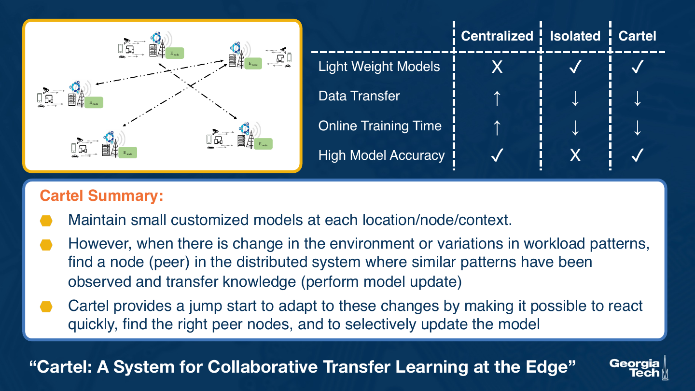

This motivates us to look at a different approach to support distributed machine learning: collaborative learning. In my research group, we developed a system called Cartel, and this enables a new mode of distributed learning called collaborative learning. The first prototype system that supports this type of learning is called Cartel. We developed this with collaborators at Nokia Bell Labs, and published it at the cloud computing symposium in 2019. Cartel has a different goal than these other systems. Its goal is to allow each node to benefit from small customized models. However, when there is a change in the environment or some variations in the workload pattern, Cartel makes it possible for the system to find another node, appear in the distributed system, where similar types of patterns have been observed before, and then to transfer knowledge from those locations.

What transferring knowledge really means is to perform some form of model update across the two locations. The system level mechanisms that are integrated in Cartel provide support to jump start the process of adapting the model at one location to some of the changes that it observes by making it possible to find the right peer note, and to perform the right type of knowledge transfer. When considering highly distributed system where the strengths of having some locality in the data trends across different locations, and then also having some situations where these trends do propagate from one location to another over time, for such systems, we showed that Cartel is quite superior compared to the other modes of learning. It's able to achieve more lightweight models compared to decentralized approaches. It requires much less data transfer time and leads to lower training time compared to decentralized approaches, and at the same time, it achieves much better model accuracy than learning in isolation.

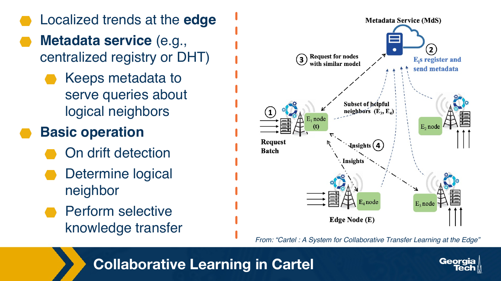

For instance, Cartel can be deployed across very distributed environments, say at the base stations of cellular towers, where it needs to learn based on data gathered from all the cell phones that are connected to that particular base station. This would be useful for a telecom operator, which maybe needs to learn how to configure and manage all of the different complex parameters of the software hardware stack of the mobile network. In fact, some published work from some of the mobile operators, such as at d, have already shown that there is a lot of locality in the data in the different locations.

### 8.1. Metadata and Knowledge Transfer

Cartel does rely on a logically, at least, centralized component, metadata service. This can be either a single server, or even some sort of DHT layer, but only to aggregate metadata about the different learning processes that are happening at the different nodes.

To perform learning, each of these nodes receive some number of requests, and then a single batch at a time, it performs a iteration of the learning process using its locally stored model. It dynamically evaluates the quality of the learning, and when it detects a drift, when it detects that the model accuracy drops, that there is some sort of change, it contacts steve metadata server. The metadata server, during regular operation of all of these nodes, aggregates periodically small amount of metadata that tell it something about the classes that are observed at each of the different locations and the accuracies that are experienced in these locations. This is really small amount of data on the order of a few kilobytes, that exchange between these nodes.

This information makes it sufficient for the metadata service to provide a note with some information that helps determine a good peer, a good what we call logical neighbor, they would be able to help with a model update. Once such a peer is identified, then the actual exchange of parameters is going to take place using this knowledge transfer mechanism.

### 8.2. Evaluation

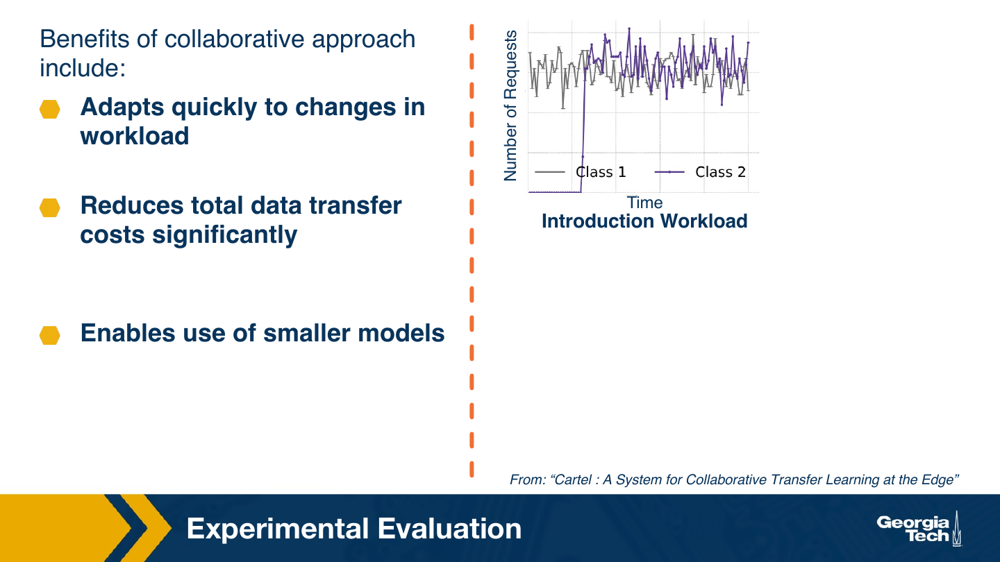

In the evaluation performed in the original paper, we compared Cartel with two extreme baselines of having centralized or isolated learning. We use different workloads, meaning different patterns of how the distribution of classes changes over the geographic locations. We considered several metrics: how quickly does the model at a single location adapt to any kinds of changes in the workload? How much data transfer is required for each of the models to be able to facilitate the learning, for the learning to converge? What is the size of the resulting model, and how long does it take to learn with such models, or to perform inference using such models? The evaluation presented in the paper already showed a lot of promise about this collaborative method.

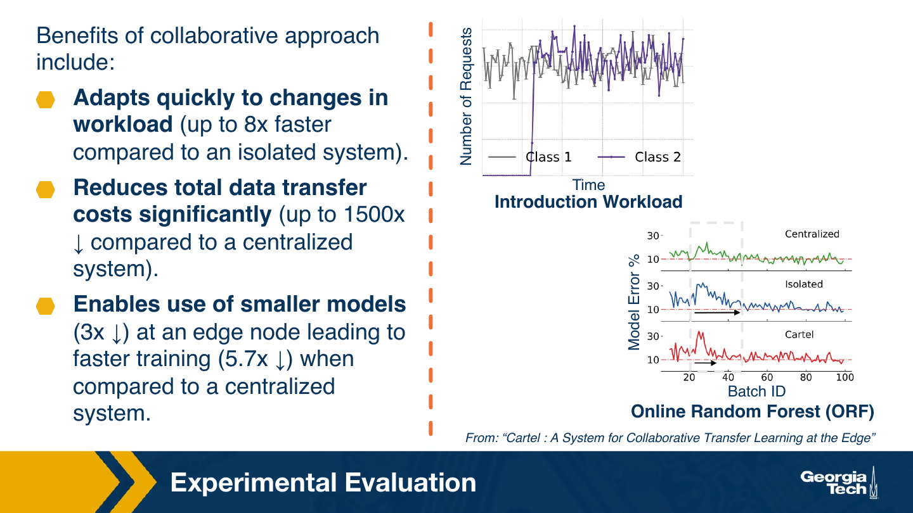

For instance, regarding these specific metrics that we use in the evaluation, we found out that when a shift in the data pattern occurs, with Cartel, a model can converge eight times faster than when compared to the isolated learning process. We found out that with Cartel, learning can be performed with several orders of magnitude less data transfer demand compared to the centralized approaches, and that the resulting model can be much more lightweight than the approaches that aim to build a global model.

## 9. Beyond Geo-Distributed Training

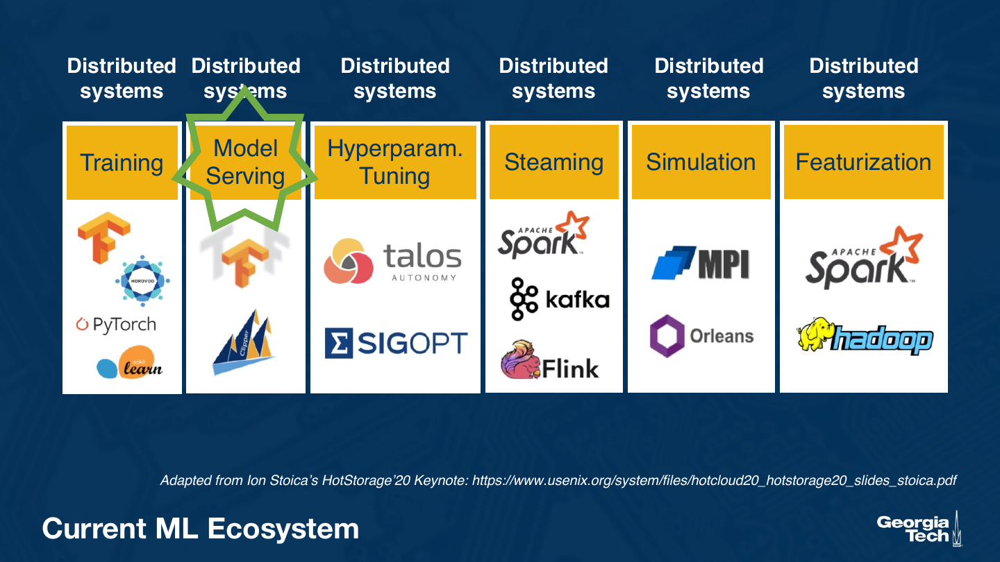

For the most part, in this lesson, we were really focused on the training part of machine learning in geo-distributed scenarios. Training is really only one step in the overall machine learning pipeline. There is obviously the phase of the model serving. This is when you can imagine that the model, once it's trained, is used to serve queries about classifications, recommendations, predictions. This is the inference phase, right? And then there are a number of other components in the end-to-end machine learning pipeline, some of which have to do with creating and optimizing the models, others with the data delivery, or the execution of the distributed tensor manipulations.

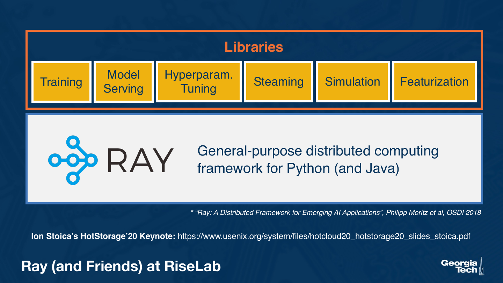

The RISELab at Berkeley developed a system called Ray that integrates all of these types of functionalities in a single unified framework. This opens up many efficiencies in the end-to-end process, which otherwise exists when you have to get all of these different types of systems to interact amongst each other, to coordinate, to exchange data. You can check out the Ray paper from OSDI 2018, or you can also see Ion Stoica's keynote from hot storage in 2020. He's also given many other talks on this topic, if you want to learn more.

## 10. Summary

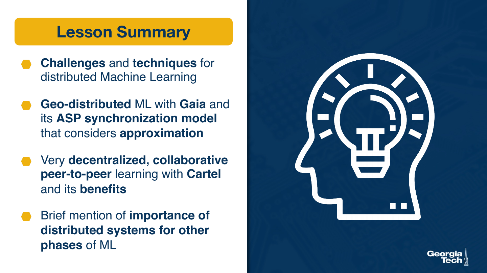

In this lesson, we discussed the challenges and some of the techniques for distributed machine learning. We focused on geo-distributed machine learning, and first, we talked about Gaia and its ASP synchronization model that considers approximation. Then, we discussed learning in very decentralized environments with a collaborative peer-to-peer model implemented in the Cartel system, and discussed its benefits. And finally, we provided a very brief mention of the fact that there are many other faces in the end-to-end distributed systems and platforms for machine learning and the importance of distributed systems for all of these other phases of machine learning.
