# Lesson 16: Byzantine Fault Tolerance & Blockchain

Source: [Lesson 16 — Video](https://www.youtube.com/watch?v=Jm-bP8UVKEA)

## 1. Introduction

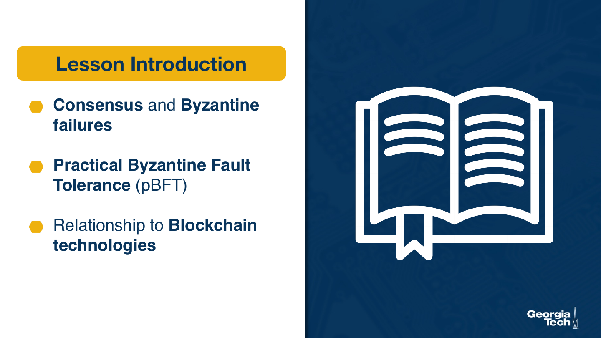

In the earlier lessons, we talked about consensus, and gave several examples of consensus algorithms. One thing all of those examples had in common was the assumption that all nodes behave properly, and that the only way that they can fail is if a node fail stops, or if the network introduces excessive delays or is partitioned.

While we cover more general security topics in other courses, in this lesson, we will revisit the consensus problem, but in the context of more general modes of failures, called Byzantine failures. We will see what we mean by Byzantine failures, and why they add another layer of complexity to achieving consensus. We will look at a famous paper on practical Byzantine fault tolerance, pbf team, and we will briefly explain the relationship between classical approaches to consensus with Byzantine failures, such as PBFD, and popular blockchain technologies.

## 2. Byzantine Failure and Byzantine Generals

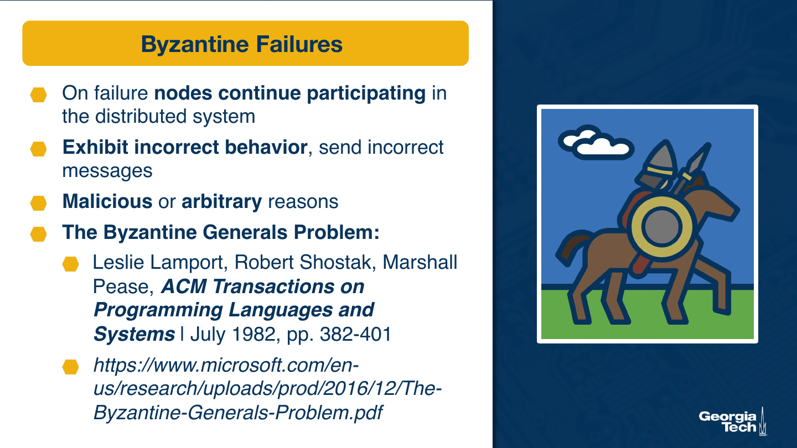

Let's talk about Byzantine failures and Byzantine generals. We said briefly earlier that Byzantine failures are failures where a node in a distributed system continues executing, but starts sending incorrect messages, either for militias or for some arbitrary reasons. The term Byzantine comes from the classical paper, the Byzantine generals problem, which was published in 82, by Leslie Lampard, jointly with Robert Joshua and Marshall peace.

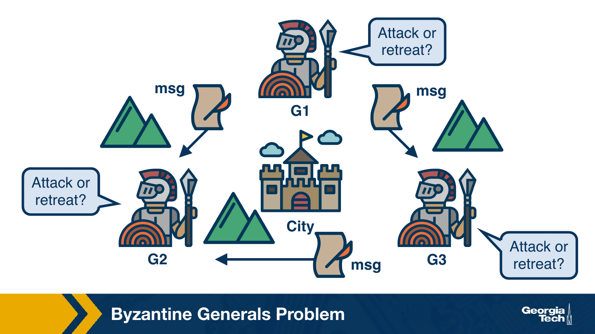

Let's describe the Byzantine generals problem. Multiple generals, each with their own armies, are trying to decide whether they can attack and conquer a city, or whether they need to wait or retreat. They cannot reach this decision ahead of time, when they're, say, altogether in some centralized location. They must first observe from their attack positions what's going on, and only then make a decision. Also, they have to reach a consensus on whether all of them attack or retreat.

One challenge is that they don't have an easy way to communicate. There are mountains in between, so they have to send messages via messengers. Each of the generals receives messages from everyone else about what their opinion is. And then a decision can be reached by, say, considering all of the messages that are received. Under some circumstances, we could have used the consensus algorithm such as Paxos, to allow the generals to coordinate.

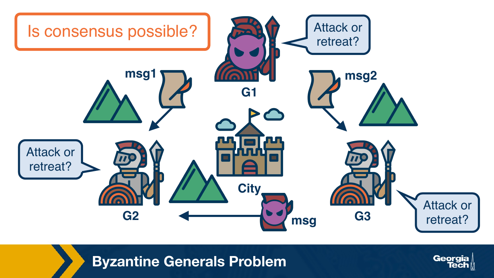

The problem is that neither the generals nor the messengers can be trusted. A general may have become corrupt, so maybe sending different information, different messages, to each of the other generals. Or a messenger may have been compromised along the way. If a sufficient number of messages end up getting corrupt for one reason or the other, when one of these other generals receives these faulty messages, the generals may reach an incorrect decision regarding the attack plan.

The Byzantine generals problem raises the question on how to reach a consensus, meaning how to ensure that a single correct decision is reached even if there are this type of Byzantine failures in the system.

## 3. Byzantine Fault Tolerance

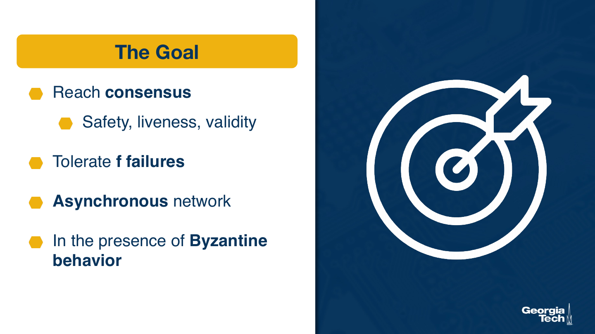

So how do we ensure we can tolerate this type of Byzantine failures and achieve consensus? Remember, our goal is to reach consensus with all the desired properties of safety, aliveness, correctness, in a way that tolerates up to f failures in a distributed system with asynchronous communication. And we want to achieve this even in scenarios when there are Byzantine behaviors.

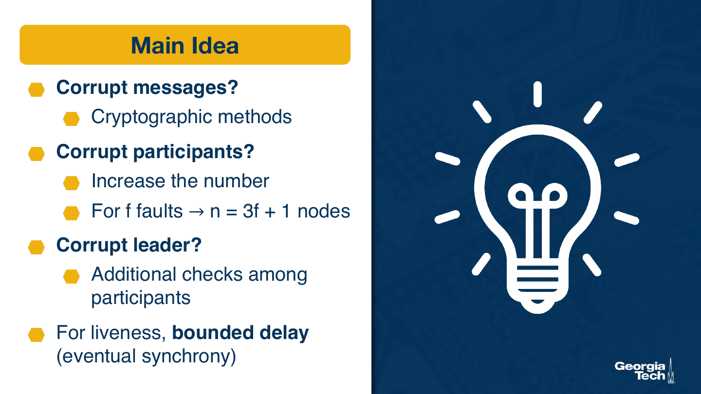

The main idea for how to achieve this can be summarized with these three questions. First, to guard against corrupt messages, we will use cryptographic methods to authenticate the communication endpoints, and secure the communication, and to verify that the messages have not been tampered with.

Second, to guard against scenarios when one or more participants are not behaving properly, we will increase the number of participants in the system in order to tolerate that failures. For a system that needs to tolerate up to f failures, the total number of participants in the distributed consensus algorithm has been proven that it needs to be at least 3 f plus one notes.

Finally, to guard against a scenario when the leader node itself is corrupt and is perhaps sending different nodes different types of messages, we will have to perform additional checks among the participants, to ensure that this is not the case.

As a reminder, FLP will still hold. So with these ideas, the protocol can guarantee safety, but to really guarantee liveness as well, there's some additional requirement that messages will ultimately be delivered with some bounded delay.

## 4. Practical Byzantine Fault Tolerance: pBFT

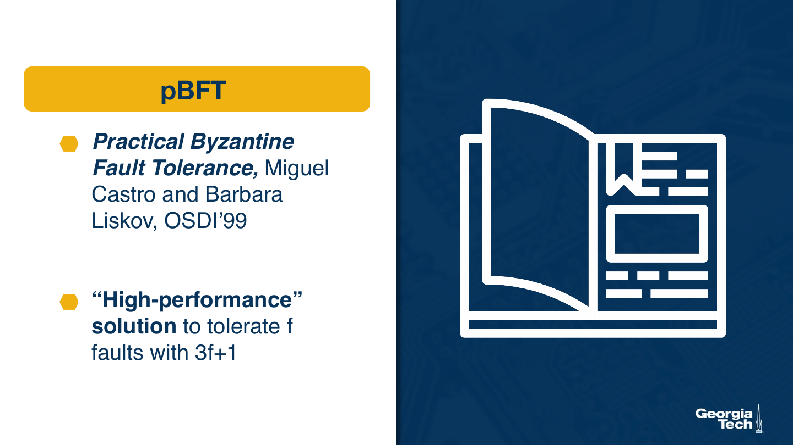

All of these ideas come together in PBFT, an algorithm for practically achieving Byzantine fault tolerance. The PBFT algorithm was proposed by Miguel Castro and Barbara Liska from MIT, and was presented at OSDI in 99. There were proposed algorithms to solve the Byzantine generals problem before, which also presented the proof for the necessary three of one nodes to tolerate at faults. But at the time that it appeared, pbf team, as the algorithm is known, was the first solution that could be used with high performance, capable of processing large number of operations per second.

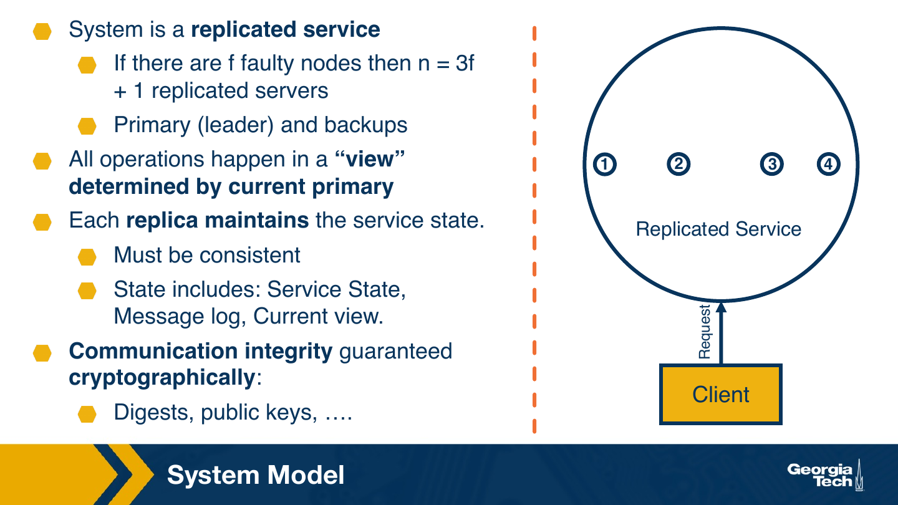

We'll try to solve the Byzantine problem for a system where a client interacts with a group of servers. These servers will implement some sort of replicated service. The client interacts with these servers, and needs a guarantee that the servers will reach a consensus when replicating the client's updates, or that they will provide responses such that the client, based on the majority of these responses, will be able to determine the correct response.

One of the replicated servers is a leader. The rest are backups, and an arbitrary set of up to f servers may fail. The primary, or the leader node, determines the current view of the system. In the view, and for that reason also, the primary node may change over time. Each replica maintains consistent information about the state of the service, the messages that are exchanged, and the view, or rather, the information about the current node that's the primary. All communication is secure, and the security is cryptographically guaranteed through the use of public key infrastructure, message digest, and similar techniques.

### 4.1. Why 3f + 1 Nodes?

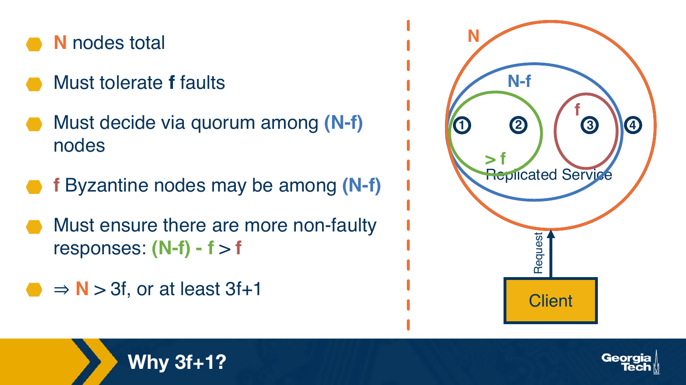

So why do we say we need three f plus one nodes to tolerate f faults? To illustrate this simply, let's consider this scenario. We have some total of n nodes in the system. Since the algorithm must tolerate f faults, it needs to be able to reach a decision about the proposal ordering, about the consensus, based on the remaining n minus f notes.

Now, if we design the algorithm in a way that it's able to make decision once n minus f messages are received, it is possible that the missing f notes were just some notes that that were delayed, and instead, the f Byzantine nodes are actually included in the set n minus f, and are sending some incorrect information. So we have to make sure that among these n minus f notes, even if the f faulty nodes are there, the remaining nodes are going to be some greater number than f, so as to be able to reach a majority quorum, and reach a correct decision.

So going from this inequality, n minus f minus f should be greater than f, that gives us that n should be greater than three f, or rather, that n should be at least three f plus one.

## 5. pBFT Algorithm

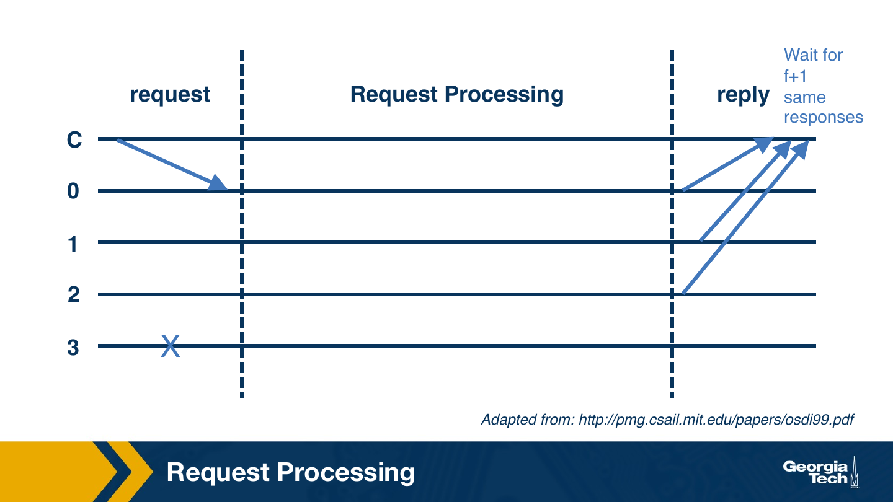

Let's take a look in more detail at the PBFT algorithm. The client makes a request to one of the servers, at least the primary, and it ultimately receives a response. Since even the leader can be corrupt, the client can send the request to all the servers, and receive information, receive responses from a number of these servers once the request is processed. Based on the responses that are received, once more than f plus one responses are received that provide the same information, the client will know that it has its correct response.

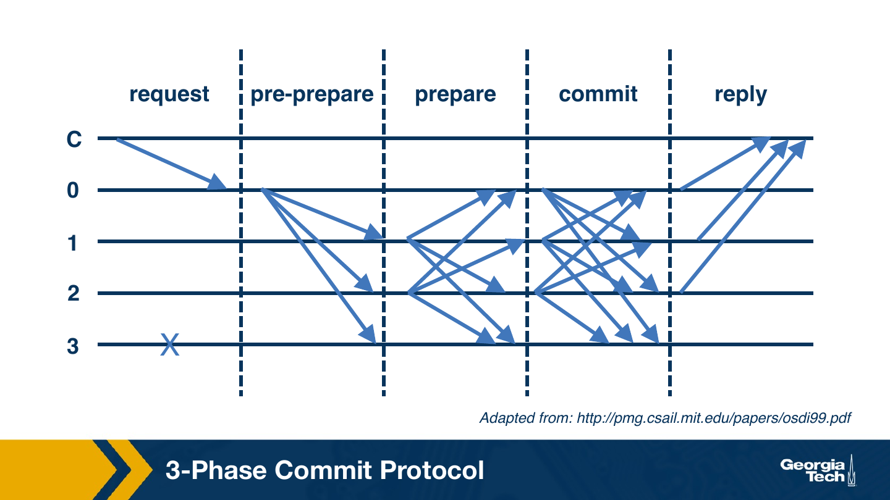

The request processing protocol executes in three phases: pre-prepare, prepare, and commit.

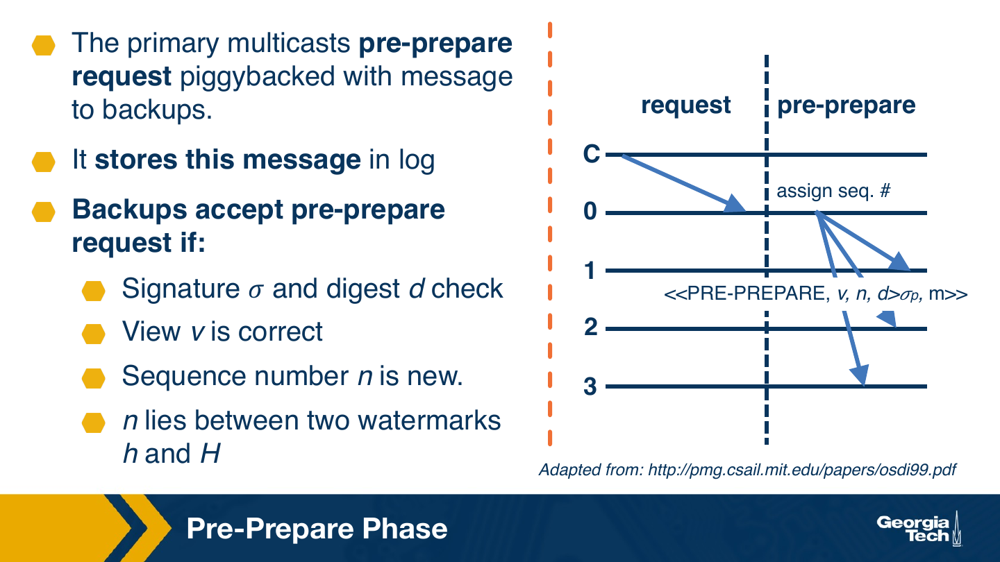

When a request is received at the primary, determine based on the view, pick some sequence number, computes the digest of the message, and multicast a pre-prepared request to all of the backup replicas, and also stores this message in a log.

Each of the replicas need to check whether they can accept the pre-prepared request. For that, they need to check that the signature and the digest of the message are cryptographically correct. They have to make sure that the view that the message is sent in corresponds to the current view that they are aware of, that the sequence number included in the message is new. And it also makes sure that the sequence number lies between two water marks. The protocol essentially keeps some maximum number of in-flight operations, and if the log is full, then any other new requests will be delayed, will be blocked. And so by performing this check, what's made possible in this manner is to make sure that a faulty primary doesn't just start sending messages with some large sequence number, and in that manner, blocking any other requests from being pushed into the replication service.

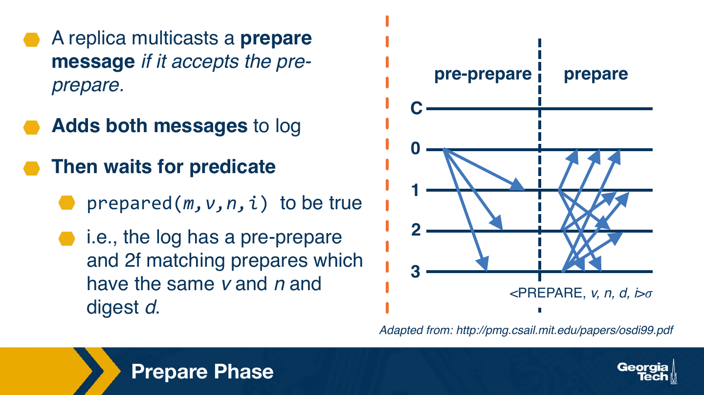

If a pre-prepared message is accepted, then the replica enters the prepare phase. At that point, it multicasts to all of the other nodes a prepare message, and it also logs that this message has been sent in its own log. Each of the replicas will then wait for two f matching preparer messages to be received from other replicas. It may receive total of more than two f messages. Some of these may be from faulty or Byzantine note, and we'll just ignore those. So we'll really wait for two f matching ones.

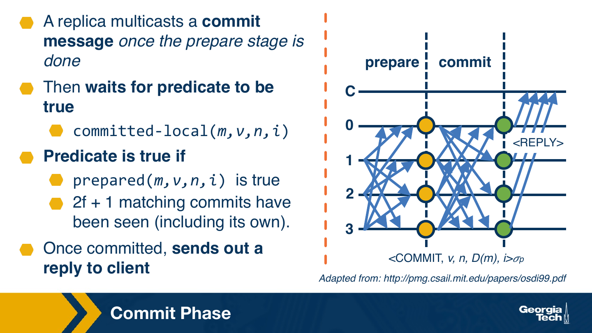

Once the prepared stage is complete, a replica enters the comment phase. It sends a commit message to all other replicas, and also logs this message. It then waits to the additional 2f matching commits by evaluating a predicate committed local. Once the request is committed, it can be executed, and a response can be sent to the client.

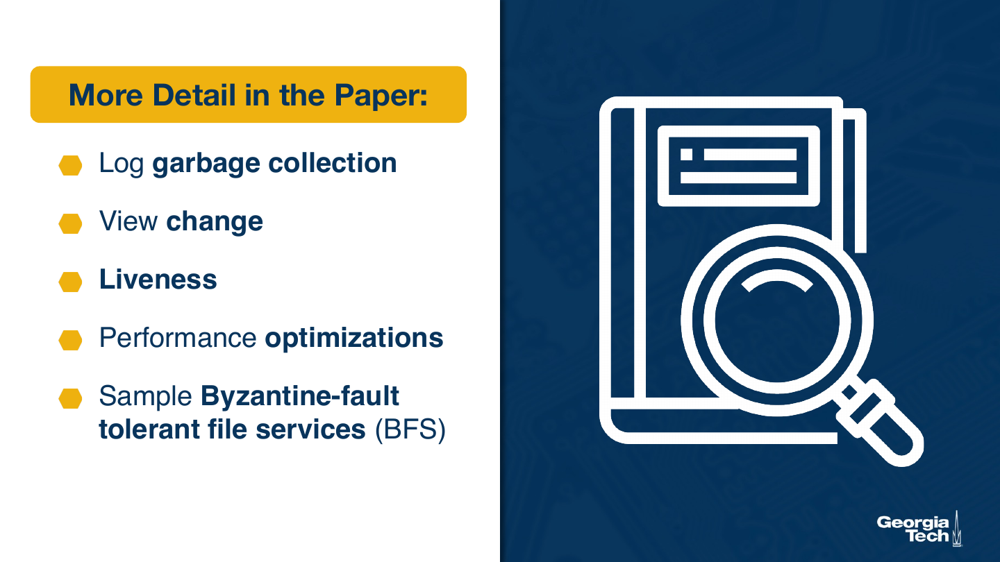

The paper includes additional detail on the behavior of the PBFT algorithm under special cases, such as when the log is full and it needs to be cleaned up, when there are problems with the primary and view changes triggered, or about the use of the timeouts to guarantee liveness. The paper also describes a number of performance optimizations, some of which particularly try to reduce the number of messages and the overlap in the processing of the messages that's impossible in the system. As an illustration, the paper also describes and evaluated a Byzantine fault tolerant distributed file service implemented with PBFT.

## 6. Byzantine Consensus vs. Blockchain?

For those of you familiar with blockchain, some aspects of how we describe the solution to the presenting consensus problem may remind you of that. These days, we've seen a continuous growth in the blockchain space, in terms of the amount of wealth that's accumulated and impacted by these technologies, the diverse applications built on top of blockchain, cryptocurrency, smart contracts, and so forth.

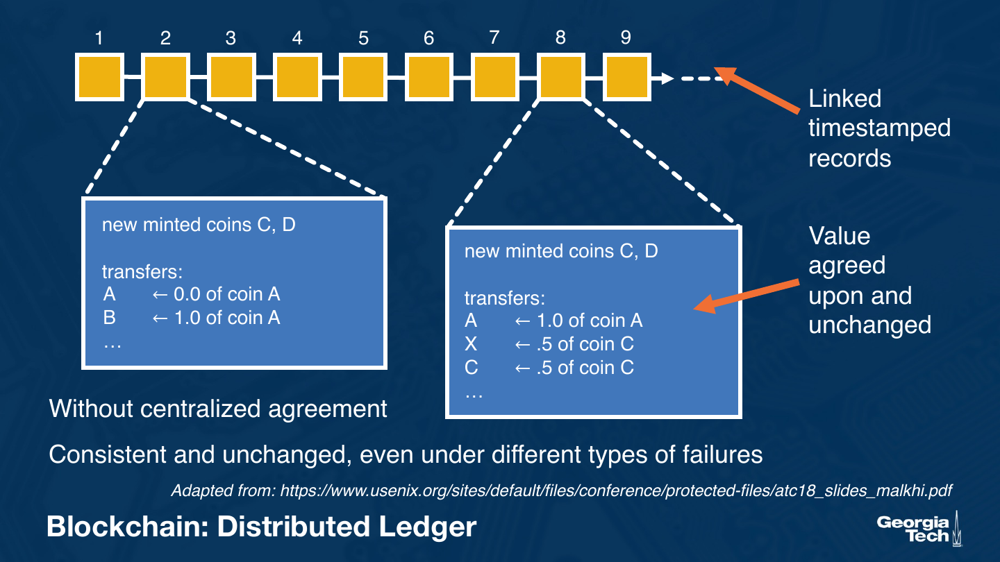

An underlying technology enabling this space is that of a distributed ledger, much like the replicated logs that we needed to keep consistent with Paxos, or rather multipaxus, and PBFT. Distributed ledger is a timestamp sequence of records that is replicated across distributed machines in a consistent, agreed-upon manner. Each node agrees precisely on the order and on the content of the ledger entries, just like with the longs, regardless of failures. In that sense, it encodes the execution of a series of updates or transactions, in their entire history.

Moreover, the ledger must be unique and unchanged, even if some participants in the system try to make changes, or to create an alternative view of the history. And it must achieve that without introducing some centralized clearinghouse for reaching agreements.

### 6.1. Participation, Proof of Work, and Incentives

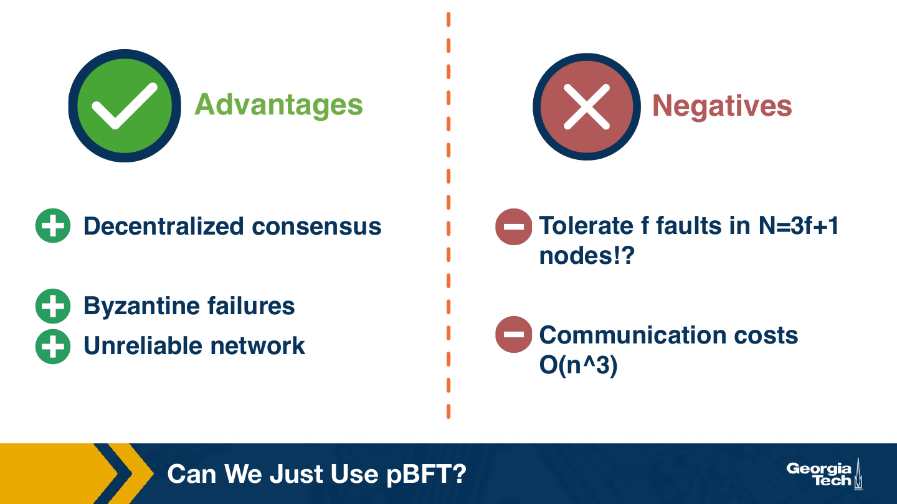

So can we build a blockchain, such as the Bitcoin exchange, using PBFT? PBFT has some nice properties. Above all, it allows us to achieve consensus in a decentralized manner. And unlike Paxos alone, it is able to do it even when dealing with Byzantine failures, and with unreliable networks.

However, one key requirement for PBFT is that there is a relationship between the number of faulty nodes in the system and the number of total nodes in the system. Considering the use of Bitcoin, for instance, these values cannot be known a priori. An attacker can create also many faulty instances of themselves. And even if there were a way to put a bound on f and to determine n, the number of messages exchanged or required for PBFT are cubic with respect to number of participants, and that can be quite costly.

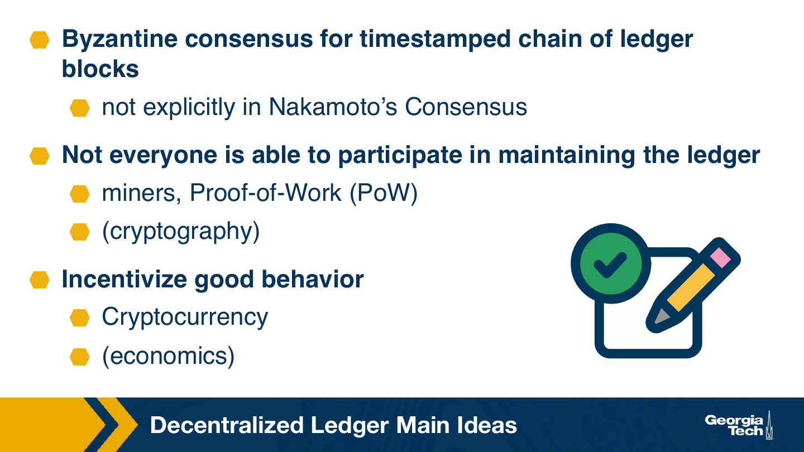

Instead, the technical elements that form the distributed ledger mechanisms combine ideas from Byzantine consensus, as in PBFT, but use few other important ideas.

First, only in principle, everyone can participate in the process. It takes a real effort to do so, in terms of computational power and energy required to add an entry to the chain. This is achieved by having the participants solve cryptographically challenging problems or puzzles, and then to present a proof of work. These are the minors in the blockchain ecosystem. Of course, what makes this difficult is they need to solve these puzzles within the shortest amount of time.

Second, there is an incentive structure that's built into the blockchain design that awards good behavior via cryptocurrencies. What it means is that a participant in the system has more to gain if they're behaving correctly versus what they could gain if they started exhibiting malicious or Byzantine behavior. Miners receive cryptocurrency if they win creating a new block in the system, and they also collect fees from the transactors whose transactions are included in the values of those blocks.

The combination of these factors makes it possible, probabilistically, to establish a much lower requirement for the number of nodes that need to reach an agreement, the number of messages that need to be exchanged, for an update in the chain to be safely performed, and for forward progress to be insured.

Interestingly, the famous Bitcoin white paper by Satoshi Nakamoto, which introduced the Bitcoin concept, explicitly builds on prior work on cryptography, hash chains, incentive structure, proof of work, and other concepts, but not necessarily explicitly on the solutions for Byzantine fault tolerance from distributed systems that we looked at.

## 7. How to Learn More

Well, research and improvements on Byzantine fault tolerant protocols never really stopped. The growing popularity of blockchain has inspired a lot more recent work. By now, there are countless academic papers, thesis, dissertation, and even more white papers and different blockchain designs. As I'm recording this lesson, Google Scholar alone reported close to a quarter million articles related to blockchain.

The details of specific distributed ledger solutions vary with respect to a number of features or design goals, regarding performance, trust assumptions, etc. For instance, very obvious differences exist among permissionless solutions, are meant to be fully decentralized, versus permissioned ones, when there is some subset of trusted parties.

For an interesting perspective on the comparison of blockchain technologies and Byzantine fault tolerance, i recommend an interesting talk that Dahlia Melky gave at the u's next annual technical conference in 2018. The talk also mentions a number of important references in this area that you can find helpful. At the time when she gave this keynote, she was a principal at VMware research, but had subsequently moved on from there to lead the development of the Libra cryptocurrency technology stack, which was backed by Facebook.

And if you're feeling overwhelmed, you're not alone. A hilarious read on the topic of Byzantine fault tolerance is an article in useneg's login, by James Mickens, titled the status moment. In this article, James jokes about the ability of computer scientists outside of the field of theoretical distributed computing to make sense of the nuanced differences among illustrations of Byzantine fault tolerance algorithms such as the ones we saw in this lesson. And he also jokes about the broad applicability of these values of protocols, by suggesting how it would be used when making lunch plans with your colleagues. I do encourage you to read this article. It is really funny.

James, whose career so far includes distributed systems research as part of Microsoft research and a faculty position at Harvard, is known in the community for his outrageously comical talks and writings. In addition to the status moment article that's really related to this lecture, you can also just browse quickly even the abstracts on his web page, the wisdom of James Mickens. In fact, you'll find a number of his talks and writings related to some of the topics that we discuss in this class.

## 8. Summary

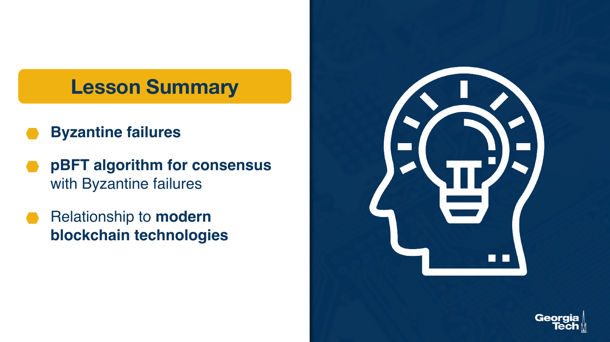

In summary, in this lesson, we talked about solutions that allow distributed systems to deal with Byzantine failures. We described what are Byzantine failures and introduce the Byzantine general problem. We described the PBFD algorithm for practical Byzantine fault tolerance for systems with less than a third faulty nodes. And we briefly made some connections between Byzantine fault tolerant work from the distributed computing academic and research community and the more recent work on distributed ledger technologies and blockchain.
